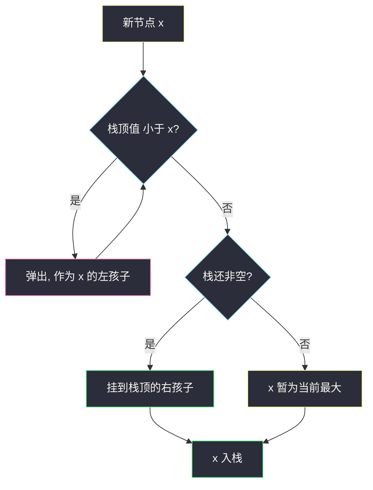
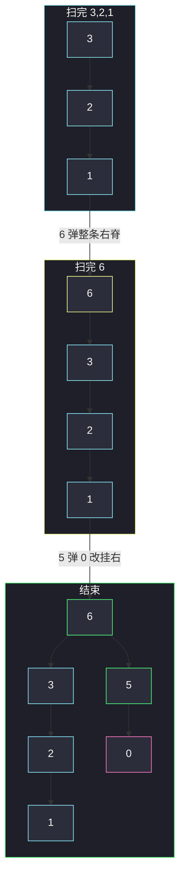

# 最大二叉树（递归分治 · 单调递减栈 O(n)）

## 一、问题描述

给定不含重复元素的数组 `nums`，用它递归地建一棵**最大二叉树**：

1. 根是当前子数组的最大值；
2. 最大值**左边**那段子数组建左子树；
3. 最大值**右边**那段子数组建右子树。

返回根节点。定义唯一，结果树也唯一。

> 🔗 LeetCode 654：https://leetcode.cn/problems/maximum-binary-tree/
>
> 数据范围：`1 <= nums.length <= 1000`，`0 <= nums[i] <= 1000`，元素互不相同。
>
> 📚 灵茶题单：**单调栈 · §1.2 进阶**。递归 `O(n²)` 对本范围足够；进阶用从左到右的单调递减栈做到 `O(n)`。增量插入见同目录 [`maximum-binary-tree-ii.md`](maximum-binary-tree-ii.md)（998）。

**示例 1**

```
输入：nums = [3,2,1,6,0,5]
输出：[6,3,5,null,2,0,null,null,1]

        6
       / \
      3   5
       \  /
        2 0
         \
          1
```

**示例 2**

```
输入：nums = [3,2,1]
输出：[3,null,2,null,1]

    3
     \
      2
       \
        1
```

**直观理解**

数组从左到右就是中序。最大值把数组劈成两半：左边所有数都比它小，只能进左子树；右边同理进右子树。再对每一半重复。也可以换个角度：每个数的父节点，是它左边第一个比它大的、和右边第一个比它大的之中**更近的那个较小者**（没有就当根）——这正是单调栈能一次求出来的。

---

## 二、暴力解法（递归：每次扫一遍找最大）

在区间 `[L, R)` 里线性找最大值下标 `i`，建节点，再递归 `[L, i)` 和 `[i+1, R)`。

```python
class Solution:
    def constructMaximumBinaryTree(self, nums: List[int]) -> Optional[TreeNode]:
        def build(L: int, R: int) -> Optional[TreeNode]:
            if L == R:
                return None
            i = max(range(L, R), key=lambda k: nums[k])
            node = TreeNode(nums[i])
            node.left = build(L, i)
            node.right = build(i + 1, R)
            return node

        return build(0, len(nums))
```

切片写法 `build(nums[:i])` 更短，但每次复制数组，常数更差；面试默写用下标即可。

### 复杂度

- **时间**：最坏递降数组每次最大值在右端，`T(n)=T(n-1)+O(n)`，即 `O(n²)`。`n ≤ 1000` 可通过。
- **空间**：递归栈 `O(n)`，最坏链状。

### 🔴 瓶颈在哪里

每一层都把区间重新扫一遍找 max。其实从左扫到右时，**左边已经建好的、还可能当父节点的候选**可以用单调递减栈维护：新来的数不停把比自己小的弹掉（它们成为自己的左孩子），再挂到新栈顶的右边。每个节点进出栈一次，`O(n)`。

---

## 三、优化探索（核心章节）

> 📚 对齐灵神 **§1.2 进阶（单调栈）**。栈里存的是**节点**（等价于下标），从底到顶值严格递减。

### 3.1 父节点是谁

对任意 `nums[i]`，它的父只能是：

- 左边第一个比它大的 `L`，或
- 右边第一个比它大的 `R`。

两者都没有，它就是整棵树的根（全局最大）。两者都有时，父是**值更小的那个**（更近的「较小高峰」）：较大的那个会把较小的收进自己子树，从而成为祖先而不是父亲。

单调栈从左到右扫，弹栈的瞬间就在连这两类边：被弹的节点左边已经处理完，当前值是它的「右边第一个更大」；弹完后若栈还非空，栈顶就是当前值的「左边第一个更大」。

### 3.2 扫描规则

对每个 `x` 新建节点 `node`：

1. **while 栈非空且栈顶值 < x**：弹出，`node.left = 弹出的节点`。最后一次弹出的是被弹段里最大的，成为左孩子；更早弹出的已经互相串在右链上。
2. **若栈仍非空**：`栈顶.right = node`（当前比栈顶小，只能当栈顶右子树里目前最左的那个空位）。
3. `node` 入栈。

扫完后栈底就是全局最大，也就是根。



### 3.3 为什么左孩子是「最后弹出的那个」

被弹出的是一段连续的、都比 `x` 小的右侧递减链。它们在原数组里都在 `x` 左边，且彼此已经按「右孩子」串好（因为是从左到右建的）。这段里最大的就是最晚还留在栈里、也就是**最后弹出**的那个，它应当作为 `x` 的左子树根。循环里每次 `node.left = pop()` 会覆盖，留下的正好是最后一次。

### 3.4 不变式

扫完 `nums[0..i]` 之后：

- 栈从底到顶严格递减，对应目前还没有右父亲的右脊（从当前根沿右孩子走到底）。
- 已弹出并挂到某节点左右的子树，之后不会再改。
- 栈底是 `nums[0..i]` 的最大值。

998 在这棵树上往**数组末尾**插一个值，新点只走最右路径，正是本不变式的增量版，见 `maximum-binary-tree-ii.md`。

### 3.5 一句话核心

> **从左到右维护单调递减栈：新元素把比自己小的全部弹成左孩子，再挂到新栈顶的右侧。**

---

## 四、代码实现

### Python（主解：递归，默写版）

```python
class Solution:
    def constructMaximumBinaryTree(self, nums: List[int]) -> Optional[TreeNode]:
        def build(L: int, R: int) -> Optional[TreeNode]:
            if L == R:
                return None
            i = max(range(L, R), key=lambda k: nums[k])
            node = TreeNode(nums[i])
            node.left = build(L, i)
            node.right = build(i + 1, R)
            return node

        return build(0, len(nums))
```

### Python（进阶：单调递减栈 `O(n)`）

```python
class Solution:
    def constructMaximumBinaryTree(self, nums: List[int]) -> Optional[TreeNode]:
        stack: List[TreeNode] = []
        for x in nums:
            node = TreeNode(x)
            while stack and stack[-1].val < x:
                node.left = stack.pop()
            if stack:
                stack[-1].right = node
            stack.append(node)
        return stack[0]
```

`n ≤ 1000` 递归即可过；问到 `O(n)` 再写栈。栈版不要把「先挂右、再弹左」写反：必须**先 while 弹左，再挂到栈顶右侧**。

### Java（栈版）

```java
class Solution {
    public TreeNode constructMaximumBinaryTree(int[] nums) {
        Deque<TreeNode> stack = new ArrayDeque<>();
        for (int x : nums) {
            TreeNode node = new TreeNode(x);
            while (!stack.isEmpty() && stack.peek().val < x) {
                node.left = stack.pop();
            }
            if (!stack.isEmpty()) {
                stack.peek().right = node;
            }
            stack.push(node);
        }
        TreeNode root = null;
        while (!stack.isEmpty()) {
            root = stack.pop();
        }
        return root;
    }
}
```

Java 的 `Deque.push` 把新节点放在队头，扫完后栈底（全局最大）在另一端，要一路 `pop` 到最后才是根；或改用 `ArrayList` 当栈，根就是 `get(0)`。

---

## 五、具体例子演示

### 5.1 官方示例 `[3,2,1,6,0,5]` —— 栈一步步连边

栈左为底。写出每步后的栈顶到底，以及刚连上的边。

| 步 | x | 弹栈 | 左孩子 | 挂到谁的右 | 栈（底→顶） |
|----|---|------|--------|------------|-------------|
| 1 | 3 | — | — | — | `[3]` |
| 2 | 2 | — | — | `3.right=2` | `[3, 2]` |
| 3 | 1 | — | — | `2.right=1` | `[3, 2, 1]` |
| 4 | 6 | 弹 1、2、3 | `6.left` 依次覆盖为 1、2、**3** | 栈空，6 当根 | `[6]` |
| 5 | 0 | — | — | `6.right=0` | `[6, 0]` |
| 6 | 5 | 弹 0 | `5.left=0` | `6.right=5` | `[6, 5]` |

`x=6` 时把左边整条递减链收成左子树：3 最大，所以 `6.left=3`，而 3 原先的右链 `3→2→1` 原样保留。`x=5` 时 0 被弹成左孩子，5 改挂到 6 的右边（覆盖原来的 0）。



### 5.2 `[3,2,1]` —— 一直挂右，从不弹

全程新值都比栈顶小，只会 `栈顶.right = node`。树退化成右链。栈：`[3]` → `[3,2]` → `[3,2,1]`。根始终是 3。

### 5.3 `[1,2,3]` —— 一直弹成左孩子

| x | 弹 | 结果 |
|---|----|------|
| 1 | — | 栈 `[1]` |
| 2 | 弹 1，`2.left=1`，栈空 | 栈 `[2]` |
| 3 | 弹 2，`3.left=2`（2 已带左孩子 1） | 栈 `[3]` |

树是左链。和递归一致：最大值在最右，左边整段成为左子树。

### 5.4 递归对照同一例子

`[3,2,1,6,0,5]`：全局 max 在下标 3 的 6。左区间 `[3,2,1]` 的 max 是 3，其右区间 `[2,1]` 的 max 是 2……得到的树与上表逐步连边完全相同。递归看的是「区间最大值」，栈看的是「左右第一个更大」，两种定义等价。

---

## 六、复杂度分析

| 方法 | 时间 | 空间 | 说明 |
|------|------|------|------|
| 递归找 max（主解） | `O(n²)` | `O(n)` | `n ≤ 1000` 可通过 |
| 单调递减栈 | `O(n)` | `O(n)` | 每个节点入栈出栈一次 |

---

## 七、对比总结

| 维度 | 递归分治 | 单调栈 |
|------|----------|--------|
| 找根 | 区间里扫 max | 栈底即当前 max |
| 连边时机 | 递归返回时挂左右 | 弹栈时挂左，入栈前挂右 |
| 代码 | 好默写 | 短，但左右顺序易反 |
| 增量 | 每次重建 | 998 只走右脊 |

**易错点**

1. **先挂右再弹左**：新节点还没把左边较小的收完，就改了栈顶的右指针，树会丢节点。
2. **`node.left` 只赋一次**：while 里每次覆盖，留下的必须是**最后弹出**（最大）的那个。
3. **把栈顶当左孩子**：左孩子来自被弹出的节点；栈顶是父，当前节点当它的右孩子。
4. **元素重复**：本题保证互不相同。若有相等，父子关系不再唯一。
5. **Java 取根**：`push` 在头上，根在另一端，不要 `peek()` 当根。

**模板（构造最大树）**

```python
# 递归：区间找 max → 左区间、右区间
# 栈：while 栈顶 < x: x.left = pop
#     若栈非空: 栈顶.right = x
#     push x
```

---

## 八、举一反三

| 题目 | 关系 |
|------|------|
| [998. 最大二叉树 II](https://leetcode.cn/problems/maximum-binary-tree-ii/) | 往数组末尾插一个值；只走最右路径。见 `maximum-binary-tree-ii.md` |
| [654 的笛卡尔树](https://leetcode.cn/problems/maximum-binary-tree/) | 本题树就是数组的笛卡尔树（堆序 + 中序是原数组） |
| [84. 柱状图中最大的矩形](https://leetcode.cn/problems/largest-rectangle-in-histogram/) | 同样用左右第一个更小/更大，单调栈存下标 |
| [85. 最大矩形](https://leetcode.cn/problems/maximal-rectangle/) | 直方图单调栈的二维版 |
| [316. 去除重复字母](https://leetcode.cn/problems/remove-duplicate-letters/) | 也是单调栈，但弹的条件多了「后面还有」 |

**思想迁移**

- 见到「区间最大值当根、左右子数组当左右子树」，先写递归；问线性再上递减栈。
- 口诀：**「小的弹成左孩子，自己挂到新栈顶右边。」**
