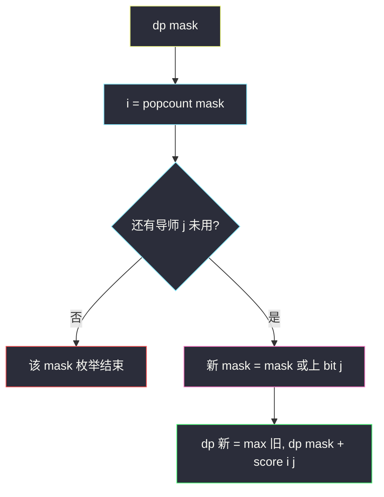
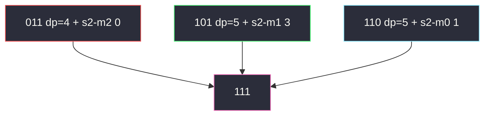

# 最大兼容性评分和（排列型状压 DP）

## 一、问题描述

`m` 名学生、`m` 名导师，每人答了 `n` 道题，答案是 0/1。学生 `i` 和导师 `j` 的**兼容分** = 答案相同的题数。一对一匹配（每个学生一名导师、每名导师一个学生），求兼容分之和的最大值。

> 🔗 LeetCode 1947：https://leetcode.cn/problems/maximum-compatibility-score-sum/
>
> 数据范围：`1 ≤ m, n ≤ 8`。
>
> 📚 灵茶题单：**§9.1 排列型状压 DP ① 相邻无关**。学生按 `0..m-1` 的固定顺序去「领」导师；`mask` 表示已经分出去的导师集合。当前学生下标 = `mask` 里 1 的个数。转移与「上一名导师是谁」无关，只和集合有关。

**示例 1**

```
输入：
students = [[1,1,0],[1,0,1],[0,0,1]]
mentors  = [[1,0,0],[0,0,1],[1,1,0]]
输出：8
解释：学生 0-导师 2（3 分），学生 1-导师 0（2 分），学生 2-导师 1（3 分）。
```

**示例 2**

```
输入：
students = [[0,0],[0,0],[0,0]]
mentors  = [[1,1],[1,1],[1,1]]
输出：0
解释：每一位都反了，怎么配都是 0。
```

**直观理解**

就是带权二分图的最大权完美匹配。`m ≤ 8`，`8! = 40320` 枚举排列能过；状压 `2^8 × 8` 更标准，也是本节模板。

---

## 二、暴力解法

先预处理 `score[i][j]`，再枚举学生 0..m-1 对应的导师排列。

```python
from itertools import permutations

class Solution:
    def maxCompatibilitySum(self, students: list[list[int]], mentors: list[list[int]]) -> int:
        m, n = len(students), len(students[0])
        score = [[0] * m for _ in range(m)]
        for i in range(m):
            for j in range(m):
                score[i][j] = sum(a == b for a, b in zip(students[i], mentors[j]))
        ans = 0
        for perm in permutations(range(m)):
            s = 0
            for i, j in enumerate(perm):
                s += score[i][j]
            ans = max(ans, s)
        return ans
```

官方两例对拍。`m=8` 时 40320 次加法也能过，但排列枚举不好加别的约束；状压是可扩展的写法。

### 🔴 瓶颈在哪里

匹配是「集合 → 最大和」，不是「必须记住排列顺序」。`2^m` 个子集，每个子集试下一个导师即可。

---

## 三、优化探索（核心章节）

> 📚 灵茶 **§9.1 排列型状压 DP**：人按固定顺序入场，状态只记「对面还剩谁」。因为目标是求和、且边权只取决于这一对，**与相邻人选无关**。

### 3.1 状态

`dp[mask]` = 已经把集合 `mask` 里的导师分出去、且前 `popcount(mask)` 名学生都已配对时的最大总分。

当前要配对的是学生 `i = popcount(mask)`（0-based）。枚举还未用的导师 `j`（`(mask >> j) & 1 == 0`）：

`dp[mask | (1 << j)] = max(…, dp[mask] + score[i][j])`

`dp[0] = 0`，答案 `dp[(1<<m) - 1]`。



学生顺序被我们固定成 0,1,2,…，这不会丢最优：完美匹配与给学生编号的次序无关，只是 DP 维度的一种投影。

### 3.2 为什么不用 `m × 2^m` 的「第几个人」维

`i` 已被 `popcount` 钉死，不必再开一维。这就是「排列型」比「子集型还带阶段」更省的地方。

### 3.3 一句话核心

> **score 先打表；dp[已用导师集合]，当前学生 = 1 的个数。**

---

## 四、代码实现

### Python（主解：状压）

```python
class Solution:
    def maxCompatibilitySum(self, students: list[list[int]], mentors: list[list[int]]) -> int:
        m, n = len(students), len(students[0])
        score = [[0] * m for _ in range(m)]
        for i in range(m):
            for j in range(m):
                score[i][j] = sum(a == b for a, b in zip(students[i], mentors[j]))
        N = 1 << m
        # dp[mask]: 已分配导师集合为 mask 时的最大兼容和；下一学生 = bit_count
        dp = [-10**9] * N
        dp[0] = 0
        for mask in range(N):
            i = mask.bit_count()
            if i >= m:
                continue
            for j in range(m):
                if (mask >> j) & 1:
                    continue
                nxt = mask | (1 << j)
                dp[nxt] = max(dp[nxt], dp[mask] + score[i][j])
        return dp[N - 1]
```

### Java（最优解）

```java
class Solution {
    public int maxCompatibilitySum(int[][] students, int[][] mentors) {
        int m = students.length, n = students[0].length;
        int[][] score = new int[m][m];
        for (int i = 0; i < m; i++) {
            for (int j = 0; j < m; j++) {
                int s = 0;
                for (int k = 0; k < n; k++) {
                    if (students[i][k] == mentors[j][k]) {
                        s++;
                    }
                }
                score[i][j] = s;
            }
        }
        int N = 1 << m;
        int[] dp = new int[N];
        java.util.Arrays.fill(dp, Integer.MIN_VALUE / 4);
        dp[0] = 0;
        for (int mask = 0; mask < N; mask++) {
            int i = Integer.bitCount(mask);
            if (i >= m) {
                continue;
            }
            for (int j = 0; j < m; j++) {
                if (((mask >> j) & 1) == 1) {
                    continue;
                }
                int nxt = mask | (1 << j);
                dp[nxt] = Math.max(dp[nxt], dp[mask] + score[i][j]);
            }
        }
        return dp[N - 1];
    }
}
```

---

## 五、具体例子演示

### 5.1 官方例 1：先打 `score`

`s0=[1,1,0], s1=[1,0,1], s2=[0,0,1]`  
`m0=[1,0,0], m1=[0,0,1], m2=[1,1,0]`

|  | m0 | m1 | m2 |
|--|----|----|----|
| s0 | 2 | 0 | 3 |
| s1 | 2 | 2 | 1 |
| s2 | 1 | 3 | 0 |

### 5.2 按 mask 逐步填表

导师 bit0=m0，bit1=m1，bit2=m2。学生按 popcount 依次是 s0,s1,s2。

| mask | 二进制 | 已配学生 | 转移 | dp |
|------|--------|----------|------|----|
| 0 | 000 | 无 | 初值 | 0 |
| 1 | 001 | s0-m0 | 0+2 | 2 |
| 2 | 010 | s0-m1 | 0+0 | 0 |
| 4 | 100 | s0-m2 | 0+3 | 3 |
| 3 | 011 | s0s1 用 m0m1 | `001+s1-m1 → 4`；`010+s1-m0 → 2` | **4** |
| 5 | 101 | m0m2 | `001+s1-m2 → 3`；`100+s1-m0 → 5` | **5** |
| 6 | 110 | m1m2 | `010+s1-m2 → 1`；`100+s1-m1 → 5` | **5** |
| 7 | 111 | 全配 | 见下 | **8** |

到 `111` 的三条边：



1. `011`（m0,m1 已用）只能配 m2：`4 + 0 = 4`。
2. `101`（m0,m2 已用）配 m1：`5 + 3 = 8`。对应匹配 s0-m2、s1-m0、s2-m1。
3. `110` 配 m0：`5 + 1 = 6`。

`max(4,8,6)=8`。对拍官方。

### 5.3 官方例 2

所有 `score[i][j]=0`，整张 `dp` 都是 0。对拍官方。

---

## 六、复杂度分析

| 方法 | 时间 | 空间 | 说明 |
|------|------|------|------|
| 枚举排列 | `O(m! · m · n)` 含打表 | `O(m²)` | `m=8` 勉强 |
| 状压 DP（主解） | `O(m² · 2^m + m² n)` | `O(2^m)` | 模板解 |

打表 `score` 是 `O(m² n)`。`2^8 × 64` 可忽略。

---

## 七、对比总结

| 维度 | 排列枚举 | 排列型状压 |
|------|----------|------------|
| 状态 | 一个 perm | 导师子集 |
| 顺序 | 显式全排 | 学生下标由 popcount 决定 |
| 相邻 | 无 | 无（与 §9.2「相邻有关」不同） |

**易错点**

1. **`i` 用错**：必须是已分配人数 `popcount(mask)`，不是循环变量 `j`。
2. **`dp` 初值 0 却允许从非法 mask 转移**：应用 `-inf`，只让 `dp[0]=0`；本题边权非负，即使用 0 初始化碰巧也对，换「最小花费」就会错。
3. **mask 表示学生而导师当下标**：两种对称，选一种写清即可；混用 bit 会配错人。
4. **兼容分当成 XOR 或差值**：题意是相同位数，不是汉明距离（汉明距离 = `n - score`）。

---

## 八、举一反三

| 题目 | 关系 |
|------|------|
| [1879. 两个数组最小的异或值之和](https://leetcode.cn/problems/minimum-xor-sum-of-two-arrays/) | 同一模板：`dp[mask]` 配 nums2 子集 |
| [2172. 数组的最大与和](https://leetcode.cn/problems/maximum-and-sum-of-array/) | 槽位状压，每槽最多 2 个 |
| [698. 划分为 k 个相等的子集](https://leetcode.cn/problems/partition-to-k-equal-sum-subsets/) | 子集状压 / 回溯；见同目录 `partition-to-k-equal-sum-subsets.md` |
| [464. 我能赢吗](https://leetcode.cn/problems/can-i-win/) | mask 记已用元素；见 `can-i-win.md` |
| [1947. 最大兼容性评分和](https://leetcode.cn/problems/maximum-compatibility-score-sum/) | 本题 |

**思想迁移**

- `m ≤ 16` 的一对一分配：一边固定顺序，另一边用 bitmask。
- 口诀：**「先打分表；mask 是已用导师；学生等于 1 的个数。」**
