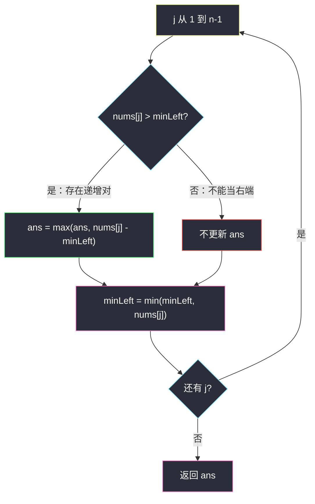
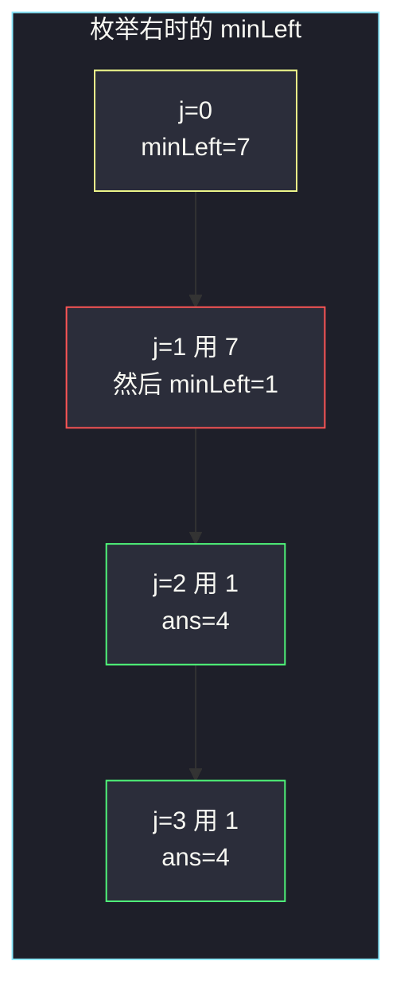

# 增量元素之间的最大差值

## 一、问题描述

给定下标从 0 开始的整数数组 `nums`，求满足 `i < j` 且 `nums[i] < nums[j]` 的最大差值 `nums[j] - nums[i]`。不存在这样的 `i, j` 时返回 `-1`。

> 🔗 LeetCode 2016：https://leetcode.cn/problems/maximum-difference-between-increasing-elements/
>
> 数据范围：`2 <= nums.length <= 1000`，`1 <= nums[i] <= 10^9`。

**示例 1**

```
输入：nums = [7,1,5,4]
输出：4
解释：j 取 2（值为 5），左侧最小且更小的是 1，差 4。
```

**示例 2**

```
输入：nums = [9,4,3,2]
输出：-1
解释：全程非严格递减，不存在 nums[i] < nums[j]。
```

**示例 3**

```
输入：nums = [1,5,2,10]
输出：9
解释：1 和 10，差 9。
```

**直观理解**

固定右边那个较大的数 `nums[j]`，左边要找一个**更小**的 `nums[i]`，差值才大。左侧越小越好——所以一边扫，一边记「到目前为止的最小值」。

---

## 二、暴力解法

枚举所有 `i < j`，合法就更新答案：

```python
class Solution:
    def maximumDifference(self, nums: List[int]) -> int:
        n, ans = len(nums), -1
        for i in range(n):
            for j in range(i + 1, n):
                if nums[i] < nums[j]:
                    ans = max(ans, nums[j] - nums[i])
        return ans
```

### 复杂度

- **时间**：`O(n²)`。
- **空间**：`O(1)`。

### 🔴 瓶颈在哪里

对固定的 `j`，有用的 `i` 只有「`nums[i]` 最小且 `< nums[j]`」那一个。不必每次回头扫左边，用一个变量 `minLeft` 滚过去即可。

---

## 三、优化探索（核心章节）

> 📚 本题在灵茶题单中属于 **枚举右，维护左 · §0.1**。先定右端 `j`，左边只保留对答案有用的信息（这里是最小值）。

### 3.1 枚举右，维护左

`j` 从 1 扫到 `n-1`：

- 若 `nums[j] > minLeft`，可以用这对下标，`ans = max(ans, nums[j] - minLeft)`
- 无论是否更新答案，都执行 `minLeft = min(minLeft, nums[j])`，把当前值交给后面的右端用

`minLeft` 必须在用完 `nums[j]` 当右端之后再更新，否则 `i == j`。初始 `minLeft = nums[0]`，`ans = -1`。



### 3.2 为什么不必维护「最小的合法 i」

题目只要最大差，不要下标。对每个 `j`，最优左端就是当前 `minLeft`（若它严格小于 `nums[j]`）。相等或更大时这对不合法，跳过即可——不能用 0 去更新，必须保持 `ans` 初始为 `-1`。

### 3.3 一句话核心

> **枚举右端 j，左侧只记最小值；仅当 nums[j] 更大时更新差，然后把 j 并入 minLeft。**

---

## 四、代码实现

### Python（主解：枚举右，维护左）

```python
class Solution:
    def maximumDifference(self, nums: List[int]) -> int:
        ans = -1
        min_left = nums[0]
        for j in range(1, len(nums)):
            if nums[j] > min_left:
                ans = max(ans, nums[j] - min_left)
            min_left = min(min_left, nums[j])
        return ans
```

**变量含义**

| 变量 | 含义 |
|------|------|
| `j` | 当前右端 |
| `min_left` | `nums[0 .. j-1]` 的最小值 |
| `ans` | 合法差的最大值，没有则为 `-1` |

这和「买卖股票的最佳时机」同一骨架：把 `nums[j]` 看成卖出价，`minLeft` 看成最低买入价；区别是本题要求**严格**更小，且无交易时返回 `-1` 而不是 0。

---

## 五、具体例子演示

以示例 1：`nums = [7,1,5,4]`。初始 `minLeft = 7`，`ans = -1`。每步记录**当前最小值**。

| j | nums[j] | nums[j] > minLeft? | 更新 ans | 之后 minLeft |
|---|---------|-------------------|----------|--------------|
| 1 | 1 | 1 > 7？否 | 仍 -1 | min(7,1)=**1** |
| 2 | 5 | 5 > 1？是 | max(-1, 4)=**4** | min(1,5)=**1** |
| 3 | 4 | 4 > 1？是 | max(4, 3)=4 | min(1,4)=**1** |

返回 **4**。

示例 2：`[9,4,3,2]` 每一步 `nums[j]` 都不大于 `minLeft`，`ans` 一直是 `-1`。

示例 3：`[1,5,2,10]`

| j | nums[j] | minLeft（用前） | 动作 | 之后 minLeft |
|---|---------|-----------------|------|--------------|
| 1 | 5 | 1 | ans=4 | 1 |
| 2 | 2 | 1 | ans=max(4,1)=4 | 1 |
| 3 | 10 | 1 | ans=max(4,9)=**9** | 1 |



---

## 六、复杂度分析

| 方法 | 时间 | 空间 | 说明 |
|------|------|------|------|
| 二重循环 | `O(n²)` | `O(1)` | 不必当主解 |
| 枚举右维护左（主解） | `O(n)` | `O(1)` | 每个 j 只看一次 minLeft |

---

## 七、对比总结

| 维度 | 暴力双循环 | 枚举右维护左 |
|------|------------|--------------|
| 对每个 j 看左边 | 全部 i | 一个最小值 |
| 无合法对 | 返回 -1 | `ans` 初值就是 -1 |
| 严格小于 | `if nums[i] < nums[j]` | `if nums[j] > minLeft` |

**易错点**

1. **先更新 minLeft 再算差**：会用到 `j` 自己，差恒为 0。
2. **`ans` 初值写成 0**：全程递减应返回 `-1`，不是 0。
3. **允许相等**：`nums[i] < nums[j]` 是严格的，相等不算。
4. **维护最大值当左端**：要的是左小右大，左端应尽量小。

**模板（§0.1 枚举右，维护左）**

```python
min_left = nums[0]
for j in range(1, n):
    if nums[j] > min_left:
        ans = max(ans, nums[j] - min_left)
    min_left = min(min_left, nums[j])
```

---

## 八、举一反三

| 题目 | 关系 |
|------|------|
| [121. 买卖股票的最佳时机](https://leetcode.cn/problems/best-time-to-buy-and-sell-stock/) | 同一骨架，无交易返回 0 |
| [1014. 最佳观光组合](https://leetcode.cn/problems/best-sightseeing-pair/) | 枚举右，左边维护 `values[i]+i` 的最大 |
| [152. 乘积最大子数组](https://leetcode.cn/problems/maximum-product-subarray/) | 枚举右，左边维护最大/最小乘积 |
| [53. 最大子数组和](https://leetcode.cn/problems/maximum-subarray/) | 枚举右，左边维护「以某段结尾的最大和」 |
| [2012. 数组美丽值求和](https://leetcode.cn/problems/sum-of-beauty-in-the-array/) | 同时要左最大、右最小，预处理两侧 |

**思想迁移**

- 见到 `i < j` 且只依赖左边某个最值，不要写双重循环当主解。
- 口诀：**「右端一个个试，左边只记最小；比最小还大才算一笔差。」**
