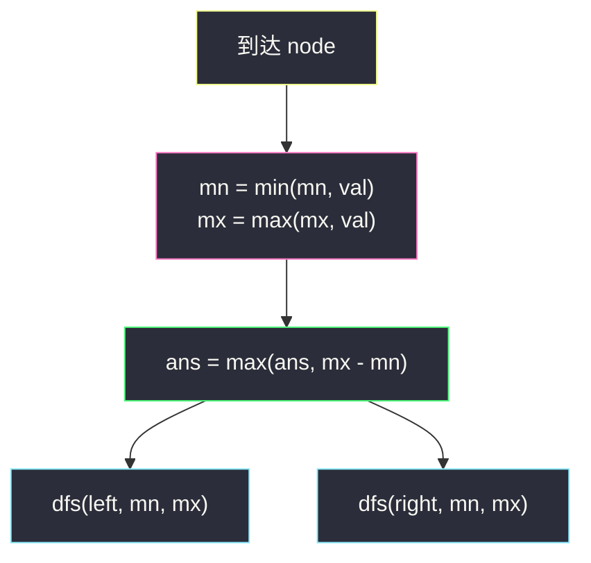
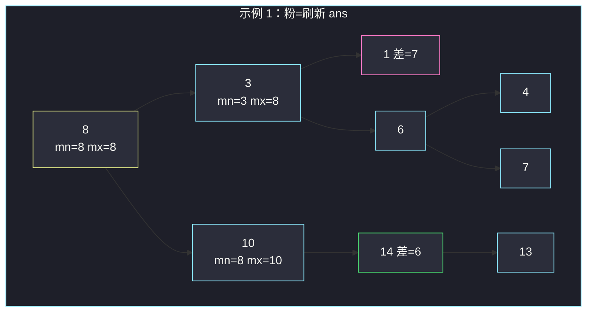

# 节点与其祖先之间的最大差值（自顶向下 · 路径 min/max）

## 一、问题描述

给你一棵二叉树的根 `root`。在所有满足「`A` 是 `B` 的祖先」的节点对里，求 `|A.val - B.val|` 的最大值。`A` 是 `B` 的祖先：`A` 在从根到 `B` 的路径上，且 `A ≠ B`。

> 🔗 LeetCode 1026：https://leetcode.cn/problems/maximum-difference-between-node-and-ancestor/
>
> 数据范围：节点数 `[2, 5000]`，`0 <= Node.val <= 10^5`。
>
> 📚 灵茶题单：**二叉树 · §2.2 自顶向下 DFS（先序遍历）**（1446 分）。

**示例 1**

```
输入：root = [8,3,10,1,6,null,14,null,null,4,7,13]
输出：7
树形：
        8
       / \
      3   10
     / \    \
    1   6    14
       / \   /
      4   7 13
最大来自 |8 - 1| = 7。
```

**示例 2**

```
输入：root = [1,null,2,null,0,3]
输出：3
树形：
  1
   \
    2
     \
      0
     /
    3
最大来自 |0 - 3| = 3（0 是 3 的祖先）。
```

**直观理解**

任意一对祖先-后代，差值只取决于这条路径上的两个端点值。路径上真正拉得开的，一定是「路径最小值」和「路径最大值」之一与当前点的差。从根往下走时带着路上的 min/max，每到一个点就能更新答案，不必枚举所有祖先对。这就是 §2.2：祖先信息当参数往下传。

---

## 二、暴力解法

对每个节点，把它当作后代，再沿着父指针……没有父指针就反过来：对每个节点 DFS 它的整棵子树，用「当前节点值」和每个后代比：

```python
class Solution:
    def maxAncestorDiff(self, root: Optional[TreeNode]) -> int:
        ans = 0

        def sweep(anc: TreeNode, node: Optional[TreeNode]) -> None:
            nonlocal ans
            if node is None:
                return
            ans = max(ans, abs(anc.val - node.val))
            sweep(anc, node.left)
            sweep(anc, node.right)

        def dfs(node: Optional[TreeNode]) -> None:
            if node is None:
                return
            sweep(node, node.left)
            sweep(node, node.right)
            dfs(node.left)
            dfs(node.right)

        dfs(root)
        return ans
```

每个点当一次祖先，扫一遍它下面的子树。链上复杂度 `O(n²)`。

### 复杂度

- **时间**：每个祖先-后代对都会被扫到，最坏 `O(n²)`。
- **空间**：递归栈 `O(n)`。

`n = 5000` 的链会很慢，而且做了大量重复比较。

### 🔴 瓶颈在哪里

从根到当前点的路径上，对答案有贡献的只有这条路径的最小值和最大值。维护两个标量即可，不必对每个祖先单独扫子树。

---

## 三、优化探索（核心章节）

> 📚 本题在灵茶题单中属于 **二叉树 · §2.2 自顶向下 DFS（先序遍历）**。判断只依赖祖先，先处理自己再下潜；参数带着路上的最小值和最大值。

### 3.1 为什么两个数就够

到达节点 `x` 时，设根到 `x` 的路径（含 `x`）上最小值为 `mn`、最大值为 `mx`。则 `x` 与任意祖先的差值，不会超过 `max(x.val - mn, mx - x.val)`；而这两个量本身就是某对祖先-后代（或自己与更浅的点）能取到的差。全局答案是所有节点处该值的最大者。

空孩子对答案无贡献，直接返回 0——这是递归基，题目保证整棵树至少 2 个节点，不会对空树提问。

### 3.2 先序：先用祖先 min/max，再往下传

进入 `x` 时的 `mn` / `mx` 可以定义为**含当前点**或**只含祖先**，两种都对，只要更新答案的时机一致：

- **含当前点**：`mn, mx = min(mn, x.val), max(mx, x.val)`，然后 `ans = max(ans, mx - mn)`。路径上最大减最小，自然覆盖 `|祖先 - x|`。
- **只含祖先**：先用 `max(x.val - mn, mx - x.val)` 更新，再把 `x.val` 并进 min/max 传给孩子。

下面主解用「含当前点」：更短，且 `mx - mn` 一次算完该路径的极差。



左右互不影响：左子树改不了右子树的祖先链。参数按值传递，回来时自动复原，不必手动撤销。

### 3.3 初值

第一次调用 `dfs(root, root.val, root.val)`。根还没有「不同节点」的祖先对，极差是 0，随后第一层孩子就会把差值拉开。也可以 `dfs(root, inf, -inf)`，进去立刻用根自己更新。

### 3.4 一句话核心

> **带着路上 min/max 往下走：每到一个点先并入自己，再用 `mx - mn` 更新答案，然后把同一对 min/max 传给左右孩子。**

---

## 四、代码实现

### Python（主解：先序 + 路径 min/max）

```python
class Solution:
    def maxAncestorDiff(self, root: Optional[TreeNode]) -> int:
        def dfs(node: Optional[TreeNode], mn: int, mx: int) -> int:
            if node is None:
                return 0
            mn = min(mn, node.val)
            mx = max(mx, node.val)
            left = dfs(node.left, mn, mx)
            right = dfs(node.right, mn, mx)
            return max(mx - mn, left, right)

        return dfs(root, root.val, root.val)
```

**变量含义**

| 变量 | 含义 |
|------|------|
| `mn` / `mx` | 根到当前点这条路径上的最小 / 最大（含当前点） |
| 返回值 | 当前子树里能得到的最大祖先-后代差 |

空树返回 0。函数返回值把左右子树的答案和本路径极差一起取 max，省一个外部 `ans`。

### Java（可选）

```java
class Solution {
    public int maxAncestorDiff(TreeNode root) {
        return dfs(root, root.val, root.val);
    }
    private int dfs(TreeNode node, int mn, int mx) {
        if (node == null) return 0;
        mn = Math.min(mn, node.val);
        mx = Math.max(mx, node.val);
        int left = dfs(node.left, mn, mx);
        int right = dfs(node.right, mn, mx);
        return Math.max(mx - mn, Math.max(left, right));
    }
}
```

---

## 五、具体例子演示

以示例 1 先序跟踪。进入时先把当前值并入 `mn` / `mx`，再算 `mx - mn`。

```
        8
       / \
      3   10
     / \    \
    1   6    14
       / \   /
      4   7 13
```

| 访问顺序 | 节点 | 并入后 mn, mx | 本路径 mx-mn | 全局 ans |
|----------|------|---------------|--------------|----------|
| 1 | 8 | 8, 8 | 0 | 0 |
| 2 | 3 | 3, 8 | 5 | 5 |
| 3 | 1 | 1, 8 | **7** | **7** |
| 4 | 6 | 3, 8 | 5 | 7 |
| 5 | 4 | 3, 8 | 5 | 7 |
| 6 | 7 | 3, 8 | 5 | 7 |
| 7 | 10 | 8, 10 | 2 | 7 |
| 8 | 14 | 8, 14 | 6 | 7 |
| 9 | 13 | 8, 14 | 6 | 7 |

1 号节点处路径是 `8 → 3 → 1`，极差 7，之后再没有更大的。注意 14 与 8 的差是 6，小于 7。

示例 2：

| 访问顺序 | 节点 | 并入后 mn, mx | mx-mn | ans |
|----------|------|---------------|-------|-----|
| 1 | 1 | 1, 1 | 0 | 0 |
| 2 | 2 | 1, 2 | 1 | 1 |
| 3 | 0 | 0, 2 | 2 | 2 |
| 4 | 3 | 0, 3 | **3** | **3** |

3 的路径 `1 → 2 → 0 → 3`，min=0、max=3，极差 3。答案不必来自「根和某叶子」，任意祖先-后代都行。

路径极差一次覆盖该点与**所有**祖先：不必把 3 分别和 0、2、1 各减一次。`mx - mn` 已经是这条链上能拉出的最大 `|A-B|`。若只维护「与根的差」，示例 2 会得到 `|1-0|=1` 或 `|1-3|=2`，漏掉真正的 3。



---

## 六、复杂度分析

| 方法 | 时间 | 空间 | 说明 |
|------|------|------|------|
| 每个祖先扫子树 | `O(n²)` | `O(n)` | 链上每对都比一次 |
| 先序带 min/max（主解） | `O(n)` | `O(h)` 递归栈 | 每点 `O(1)` 更新；最坏链 `h = n` |

---

## 七、对比总结

| 维度 | 枚举祖先-后代 | 自顶向下 min/max |
|------|---------------|------------------|
| 比较次数 | 每对一次 | 每点一次极差 |
| 祖先信息 | 反复从该点下潜 | 两个整数往下传 |
| 适用 | 需要对每对做别的事 | 只需路径上的最值 |

自底向上也可以：子树返回 `(子树 min, 子树 max)`，用当前值与子树最值做差。那是「后代相对我」，和本题「祖先相对我」对偶，答案相同。

灵神本节模板是自顶向下，主解跟先序走。两种写法都是 `O(n)`，选一种默写即可。

**易错点**

1. **只和根比**：答案可能来自路径中段，如示例 2 的 `0` 与 `3`。
2. **忘记把当前值并入再下传**：孩子看不到这个祖先，差值会偏小。
3. **左右共用一份可变对象**：若用列表存路径可以，但要 `pop` 撤销；整数参数无需撤销。
4. **空树基例**：递归遇到 `None` 返回 0，不要对 `None` 取 `val`。
5. 绝对值拆成 `mx - mn` 即可，路径上最大减最小一定 ≥ 任一 `|A-B|`。

---

## 八、举一反三

| 题目 | 关系 |
|------|------|
| [1448. 统计二叉树中好节点的数目](https://leetcode.cn/problems/count-good-nodes-in-binary-tree/) | 同款 §2.2；本目录 `count-good-nodes-in-binary-tree.md` 只传路径 max，本题传 min 和 max |
| [98. 验证二叉搜索树](https://leetcode.cn/problems/validate-binary-search-tree/) | 先序带上下界，也是祖先约束往下传 |
| [129. 求根节点到叶节点数字之和](https://leetcode.cn/problems/sum-root-to-leaf-numbers/) | 先序把路径上的数合成后往下带 |
| [112. 路径总和](https://leetcode.cn/problems/path-sum/) | 往下带剩余目标和 |
| [1376. 通知所有员工所需的时间](https://leetcode.cn/problems/time-needed-to-inform-all-employees/) | 自顶向下累加路径权重 |
| [1161. 最大层内元素和](https://leetcode.cn/problems/maximum-level-sum-of-a-binary-tree/) | 若改成「层内」最值差则换 §2.13 BFS；本目录 `maximum-level-sum-of-a-binary-tree.md` |

**思想迁移**

- 决策只看祖先 → §2.2 自顶向下，参数递下去。
- 口诀：**「路上 min、max 跟着走；到点先并入，再用 mx-mn 更新答案。」**
