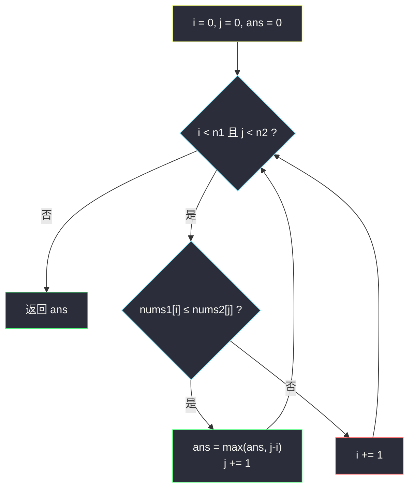
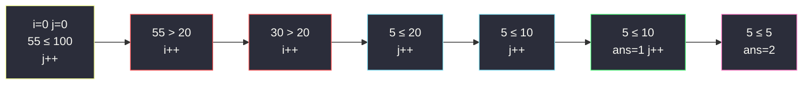

# 下标对中的最大距离（双指针 · 两数组各自前进）

## 一、问题描述

给你两个**非递增**数组 `nums1`、`nums2`（下标从 0 开始）。一对下标 `(i, j)` 称为有效，当且仅当：

- `0 ≤ i < nums1.length`，`0 ≤ j < nums2.length`；
- `i ≤ j`；
- `nums1[i] ≤ nums2[j]`。

距离定义为 `j - i`。返回所有有效对中的**最大距离**；没有有效对则返回 0。

> 🔗 LeetCode 1855：https://leetcode.cn/problems/maximum-distance-between-a-pair-of-values/
>
> 数据范围：两数组长度均在 `[1, 10^5]`，元素在 `[1, 10^5]`，且都已**非递增**。

**示例 1**

```
输入：nums1 = [55,30,5,4,2], nums2 = [100,20,10,10,5]
输出：2
解释：有效对包括 (0,0),(2,2),(2,3),(2,4),(3,3),(3,4),(4,4)。
最大距离 2，来自 (2,4)：nums1[2]=5 ≤ nums2[4]=5。
```

**示例 2**

```
输入：nums1 = [2,2,2], nums2 = [10,10,1]
输出：1
解释：最大来自 (0,1)：2 ≤ 10。
```

**示例 3**

```
输入：nums1 = [30,29,19,5], nums2 = [25,25,25,25,25]
输出：2
解释：最大来自 (2,4)：19 ≤ 25。
```

**直观理解**

`i` 尽量小、`j` 尽量大，同时 `nums1[i]` 还不能比 `nums2[j]` 大。两边都单调非增：`i` 变大则左边更小（更容易满足 `≤`），`j` 变大则右边更小（更难满足）。因此可以用两个指针从左往右扫，谁不满足条件就动谁。本题属于灵神题单 **§4.1 双指针**（两数组各自前进，利用单调性）。

---

## 二、暴力解法

双重循环枚举所有 `i ≤ j`，检查 `nums1[i] ≤ nums2[j]`，记录最大 `j-i`。

```python
class Solution:
    def maxDistance(self, nums1: List[int], nums2: List[int]) -> int:
        ans = 0
        n1, n2 = len(nums1), len(nums2)
        for i in range(n1):
            for j in range(i, n2):            # 保证 i ≤ j
                if nums1[i] <= nums2[j]:
                    ans = max(ans, j - i)
        return ans
```

正确但 `n = 10^5` 时 `O(n^2)` 必超时。

对固定 `i`，因为 `nums2` 非增，满足 `nums2[j] ≥ nums1[i]` 的 `j` 是一段前缀；在 `j ≥ i` 的前提下最右那个 `j` 可用二分（`O(n log n)`）。这已经能过，但单调性还允许把二分再塌成一次双指针。

### 复杂度

- **时间**：枚举 `O(n1 × n2)`；二分优化 `O(n1 log n2)`。
- **空间**：`O(1)`。

### 🔴 瓶颈在哪里

`i` 增大时，`nums1[i]` 不增，对 `nums2[j]` 的要求变松，最优 `j` 只增不减。所以 `j` 不必对每个 `i` 重找，两个下标一起从左扫即可。

---

## 三、优化探索（核心章节）

> 📚 本题在灵茶题单中属于 **§4.1 双指针**：两个数组各自维护一个指针，利用**两边都单调非增**，让 `i`、`j` 都只向右移动。和相向双指针（§3.2）不同——这里是**同向**、跨两个序列。

### 3.1 观察特征

| 特征 | 说明 |
|------|------|
| `nums1` 非增 | `i` 变大 → `nums1[i]` 变小 → 更容易 `≤ nums2[j]` |
| `nums2` 非增 | `j` 变大 → `nums2[j]` 变小 → 更难满足 |
| 距离 `j-i` | `j` 越大越好，`i` 越小越好 |
| `i ≤ j` | `j-i < 0` 时不必更新答案（初值 0） |

### 3.2 谁该前进

从 `(i, j) = (0, 0)` 出发：

- 若 `nums1[i] ≤ nums2[j]`：当前对有效，用 `j-i` 更新答案。想让距离更大，应**增大 `j`**（`i` 增大只会缩小距离，且左边更小仍有效，但不是更优）。
- 若 `nums1[i] > nums2[j]`：当前对无效。再增大 `j` 会让 `nums2` 更小，更没戏，只能**增大 `i`**，换一个更小的 `nums1[i]`。

每个指针最多走 `O(n)` 步。



### 3.3 正确性直觉

最优对 `(i*, j*)` 一定会被扫到：算法中 `j` 会一直增加到越界，期间每一个 `j` 出现时，`i` 是「使 `nums1[i] ≤ nums2[j]` 成立的最小可达下标」（因为只有不满足时才增加 `i`）。对这个 `j*`，当时的 `i` 不会大于 `i*`（否则更早的 `i*` 仍满足，算法不会把 `i` 推过它）。故 `j*-i` ≥ `j*-i*`，答案不会更差；可行性由比较保证。

等价写法：外层枚举 `j`，内层 `while nums1[i] > nums2[j]: i += 1`，再更新 `j-i`——同一对单调指针。

### 3.4 一句话核心

> **两数组都从左往右：左边 ≤ 右边就冲 `j` 拉距离，否则加 `i` 把左边变小。**

---

## 四、代码实现

### Python（主解：两指针同向前进）

```python
class Solution:
    def maxDistance(self, nums1: List[int], nums2: List[int]) -> int:
        i = j = ans = 0
        n1, n2 = len(nums1), len(nums2)
        while i < n1 and j < n2:
            if nums1[i] <= nums2[j]:
                ans = max(ans, j - i)
                j += 1                       # 拉大右端
            else:
                i += 1                       # 左值太大，换更小的
        return ans
```

**变量含义**

| 变量 | 含义 |
|------|------|
| `i` | `nums1` 上的指针 |
| `j` | `nums2` 上的指针 |
| `ans` | 已见有效对的最大 `j-i`（≥ 0） |

**循环不变式**：所有 `j' < j` 的最优搭配已经计入 `ans`；当前 `i` 满足：更小的下标要么已不可行（相对现在的 `j`），要么不必再配对更小的 `j'`。

**外层枚举 j 的等价写法**

```python
class Solution:
    def maxDistance(self, nums1: List[int], nums2: List[int]) -> int:
        i = ans = 0
        n1 = len(nums1)
        for j, y in enumerate(nums2):
            while i < n1 and nums1[i] > y:
                i += 1
            if i < n1:
                ans = max(ans, j - i)        # j-i 可能为负，max 与 0 比较即可
        return ans
```

### Java

```java
class Solution {
    public int maxDistance(int[] nums1, int[] nums2) {
        int i = 0, j = 0, ans = 0;
        int n1 = nums1.length, n2 = nums2.length;
        while (i < n1 && j < n2) {
            if (nums1[i] <= nums2[j]) {
                ans = Math.max(ans, j - i);
                j++;
            } else {
                i++;
            }
        }
        return ans;
    }
}
```

---

## 五、具体例子演示

以示例 1：`nums1 = [55, 30, 5, 4, 2]`，`nums2 = [100, 20, 10, 10, 5]`，逐步看每轮两个下标。

| 轮 | i | j | nums1[i] | nums2[j] | 比较 | 动作 | ans |
|----|---|---|----------|----------|------|------|-----|
| 1 | 0 | 0 | 55 | 100 | ≤ | 有效，距离 0；j→1 | 0 |
| 2 | 0 | 1 | 55 | 20 | > | i→1 | 0 |
| 3 | 1 | 1 | 30 | 20 | > | i→2 | 0 |
| 4 | 2 | 1 | 5 | 20 | ≤ | 距离 1-2=-1，ans 仍 0；j→2 | 0 |
| 5 | 2 | 2 | 5 | 10 | ≤ | 距离 0；j→3 | 0 |
| 6 | 2 | 3 | 5 | 10 | ≤ | 距离 1；j→4 | 1 |
| 7 | 2 | 4 | 5 | 5 | ≤ | 距离 **2**；j→5 结束 | **2** |

对应最优对 `(2, 4)`。`i` 停在 2 没有继续右移：再右移距离只会变小。

**示例 2** `[2,2,2]` 与 `[10,10,1]`：

| 轮 | i | j | 值 | 动作 | ans |
|----|---|---|-----|------|-----|
| 1 | 0 | 0 | 2 ≤ 10 | j→1 | 0 |
| 2 | 0 | 1 | 2 ≤ 10 | 距离 1；j→2 | **1** |
| 3 | 0 | 2 | 2 > 1 | i→1 | 1 |
| 4 | 1 | 2 | 2 > 1 | i→2 | 1 |
| 5 | 2 | 2 | 2 > 1 | i→3 结束 | 1 |

**无有效对**：`nums1 = [10, 9]`，`nums2 = [3, 2, 1]`。一直 `nums1[i] > nums2[j]`，只加 `i`，`ans` 保持 0。



---

## 六、复杂度分析

| 方法 | 时间 | 空间 | 说明 |
|------|------|------|------|
| 双重枚举 | `O(n1 × n2)` | `O(1)` | 超时 |
| 对每个 i 二分 j | `O(n1 log n2)` | `O(1)` | 能过，常数更大 |
| 双指针同向（主解） | `O(n1 + n2)` | `O(1)` | 每个下标最多访问一次 |

---

## 七、对比总结

| 维度 | 本题 §4.1 | §3.2 相向 | 单数组滑动窗口 |
|------|-----------|-----------|----------------|
| 序列条数 | **两条** | 一条的两端 | 一条 |
| 指针方向 | 都向右 | 相向 | 都向右（L 落后于 R） |
| 单调性来源 | 题面保证非增 | 常由高度/数值比较驱动 | 窗口合法性 |
| 更新时机 | `nums1[i] ≤ nums2[j]` 时冲 j | 两端相遇或条件破裂 | 右扩左缩 |

**易错点**

1. **忘记 `i ≤ j`**：双指针写法用 `max(ans, j-i)` 且 `ans` 从 0 起，负数自动丢掉；若手写 `if i<=j` 更稳。
2. **条件写反**：是 `nums1[i] ≤ nums2[j]`，不是反过来。
3. **满足时却增加 i**：会错过更大的 `j-i`。满足就扩 `j`。
4. **不满足时增加 j**：右边更小，永远修不好，必须加 `i`。
5. 数组长度可以不相等：循环条件是两个指针都还在范围内，不是 `i < n1` 单边。
6. 没有有效对返回 **0**，不要返回 `-1`。

**模板（两有序/单调数组，条件决定动哪根针）**

```python
i = j = 0
while i < n1 and j < n2:
    if 条件(nums1[i], nums2[j]):
        更新答案
        j += 1          # 或按题意动能改善答案的那根
    else:
        i += 1
```

---

## 八、举一反三

| 题目 | 关系 |
|------|------|
| [2109. 向字符串添加空格](https://leetcode.cn/problems/adding-spaces-to-a-string/) | 同属 §4.1：空格下标数组与字符串各一根指针 |
| [455. 分发饼干](https://leetcode.cn/problems/assign-cookies/) | 两数组排序后各自前进，贪心配对 |
| [826. 安排工作以达到最大收益](https://leetcode.cn/problems/most-profit-assigning-work/) | 工作难度与工人能力两指针 |
| [2540. 最小公共值](https://leetcode.cn/problems/minimum-common-value/) | 两递增数组找公共元素，谁小谁进 |
| [88. 合并两个有序数组](https://leetcode.cn/problems/merge-sorted-array/) | 两指针从后往前填 |
| [1537. 最大得分](https://leetcode.cn/problems/get-the-maximum-score/) | 两非降数组上双指针走公共值切换 |
| [986. 区间列表的交集](https://leetcode.cn/problems/interval-list-intersections/) | 两区间列表各自前进 |

**思想迁移**

- 两个已经单调的序列要对齐某种不等式，先问：**增大 A 的下标会让条件变松还是变紧**，再决定哪根针动。
- 能二分的「对每个 i 找最远 j」，若最远 j 随 i 单调，就可以换成双指针省掉 log。
- 口诀：**「左小右大就冲右端拉距离；左大右小就右移左边换小数。」**
