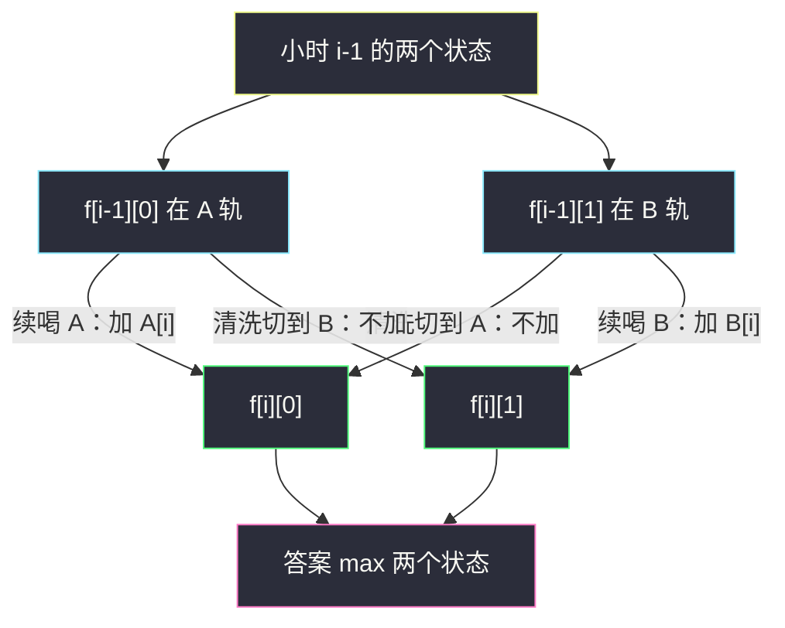
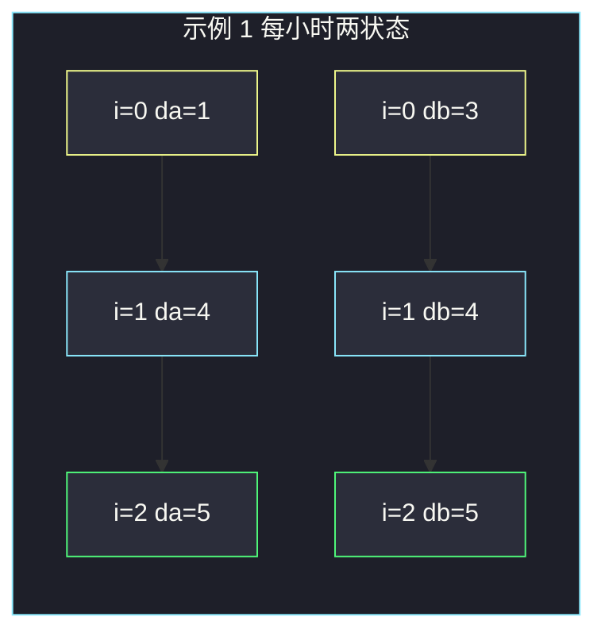

# 超级饮料的最大强化能量（双轨道状态机 DP）

## 一、问题描述

有两杯等长的超级饮料 `energyDrinkA`、`energyDrinkB`，长度均为 `n`。你一共要过 `n` 小时，**每小时喝其中一种**；也可以从任意一种开始。

若要从一种换到另一种，必须空出 **1 小时清洗杯子**，这一小时能量为 0，下一小时才能喝另一种。求 `n` 小时内能得到的最大总能量。

> 🔗 LeetCode 3259：https://leetcode.cn/problems/maximum-energy-boost-from-two-drinks/
>
> 数据范围：`3 ≤ n ≤ 10^5`，`1 ≤ energyDrinkA[i], energyDrinkB[i] ≤ 10^5`。
>
> 📚 灵茶题单：**动态规划 · §6.2 基础**（状态机）。每小时两个状态：处在 A 轨道 / 处在 B 轨道。换轨道的那一小时是「清洗」，能量不加当期饮料——和股票冷冻期是同一类转移。

**示例 1**

```
输入：energyDrinkA = [1,3,1], energyDrinkB = [3,1,1]
输出：5
解释：一直喝 A 得 1+3+1=5；一直喝 B 得 3+1+1=5。中途切换要空一小时，不会更好。
```

**示例 2**

```
输入：energyDrinkA = [4,1,1], energyDrinkB = [1,1,3]
输出：7
解释：第 0 小时喝 A 得 4，第 1 小时清洗得 0，第 2 小时喝 B 得 3，合计 7。
一直喝 A 只有 6，一直喝 B 只有 5。
```

**直观理解**

两条能量序列并排。你可以一直走一条；想跳到另一条，必须牺牲一格。`n` 到 `10^5`，不能枚举「在哪几小时切」。用两个数记住「当前在 A 轨 / 在 B 轨」的最大能量，一小时一小时推。

---

## 二、暴力解法

每个小时三种选择：喝 A、喝 B、清洗。清洗只有在「上一小时喝的和这一小时想喝的不同」时才有意义，还要保证清洗后下一小时真的换过去。可以 DFS：状态 `(小时 i, 上一轨 last)`，`last` 取 A/B。

```python
class Solution:
    def maxEnergyBoost(self, energyDrinkA: list[int], energyDrinkB: list[int]) -> int:
        n = len(energyDrinkA)
        A, B = energyDrinkA, energyDrinkB

        def dfs(i: int, last: int) -> int:
            if i >= n:
                return 0
            # last=0 上一轨是 A；last=1 是 B
            cur = A[i] if last == 0 else B[i]
            stay = cur + dfs(i + 1, last)
            # 本小时清洗，下一小时强制走另一轨
            switch = 0
            if i + 1 < n:
                other = 1 - last
                nxt = A[i + 1] if other == 0 else B[i + 1]
                switch = nxt + dfs(i + 2, other)
            return max(stay, switch)

        return max(dfs(0, 0), dfs(0, 1))
```

指数级分支。`n=10^5` 直接超时。加记忆化后状态数是 `O(n)`，已经接近正解，但「清洗」写在递归里容易漏 `i+2` 越界，不如线性 DP 干净。

### 🔴 瓶颈在哪里

决策只依赖「现在在哪条轨道」，不依赖更早的切法细节。把每个小时压成两个数即可 `O(n)` 扫完。

---

## 三、优化探索（核心章节）

> 📚 本题在灵茶题单中属于 **§6.2 基础**。模板是两状态滚动：`f0` / `f1` 分别表示「当前落在 A 轨 / B 轨」的最大收益。换轨不把当期饮料加进去。

### 3.1 状态：轨道，不一定是「这一小时喝了」

`f[i][0]`：前 `i+1` 小时结束时，**处在 A 轨道** 的最大能量。

处在 A 轨道有两种来历：

1. 上一小时就在 A，本小时继续喝 A，加上 `A[i]`。
2. 上一小时在 B，本小时清洗切到 A，**不加** `A[i]`。清洗完人已经站在 A 轨上，下一小时才能喝 A。

`f[i][1]` 对称。

初始：第 0 小时没有「上一轨」，直接喝，`f[0][0] = A[0]`，`f[0][1] = B[0]`。

### 3.2 转移（对照灵神公式）

```
f[i][0] = max(f[i-1][0] + A[i], f[i-1][1])
f[i][1] = max(f[i-1][1] + B[i], f[i-1][0])
```

右边第二项是「从另一轨切过来」：本小时能量贡献是 0，值原样等于 `f[i-1][另一轨]`。下一轮若继续留在本轨，才会 `+ A[i+1]` 或 `+ B[i+1]`。

**千万不要**写成 `max(f[i-1][0], f[i-1][1]) + A[i]`：那会在清洗小时把 `A[i]` 也喝掉，示例 2 会得到非法的 `4+1+3=8`。



等价写法（状态改成「第 i 小时确实喝了」）：`g[i][0] = A[i] + max(g[i-1][0], g[i-2][1])`（`i=1` 时没有 `i-2`）。答案相同。正文用题目清单里的轨道写法，滚动更顺。

### 3.3 滚动成两个变量

`f[i]` 只靠 `f[i-1]`，留 `da, db` 即可。同时更新时先算两个新值再赋值，避免用到半新半旧。

答案 `max(f[n-1][0], f[n-1][1])`。最后一小时若是清洗，这个状态的值等于「上一小时另一轨」，不会比「上一小时真喝了」更大，所以不用特判。

### 3.4 一句话核心

> **每小时两个轨道状态；续喝加当期，切轨本小时为 0，下一小时才喝过去。**

---

## 四、代码实现

### Python（主解：两变量滚动）

```python
class Solution:
    def maxEnergyBoost(self, energyDrinkA: list[int], energyDrinkB: list[int]) -> int:
        da, db = energyDrinkA[0], energyDrinkB[0]
        for i in range(1, len(energyDrinkA)):
            nda = max(da + energyDrinkA[i], db)
            ndb = max(db + energyDrinkB[i], da)
            da, db = nda, ndb
        return max(da, db)
```

Python 里 `da, db = max(da + A[i], db), max(db + B[i], da)` 右侧用的全是旧值，也可以一行写。上面拆开更不易看错。

**变量含义**

| 写法 | 含义 |
|------|------|
| `da` | 当前小时结束时在 A 轨的最大能量 |
| `db` | 当前小时结束时在 B 轨的最大能量 |
| `nda = max(da + A[i], db)` | 续喝 A，或从 B 清洗过来 |
| `ndb = max(db + B[i], da)` | 对称 |

### Java（能量会超 `int`，用 `long`）

`n · 10^5 ≤ 10^10`，累加必须 `long`。

```java
class Solution {
    public long maxEnergyBoost(int[] energyDrinkA, int[] energyDrinkB) {
        long da = energyDrinkA[0], db = energyDrinkB[0];
        for (int i = 1; i < energyDrinkA.length; i++) {
            long nda = Math.max(da + energyDrinkA[i], db);
            long ndb = Math.max(db + energyDrinkB[i], da);
            da = nda;
            db = ndb;
        }
        return Math.max(da, db);
    }
}
```

---

## 五、具体例子演示

每小时都列出两个状态，对拍官方两例。

### 5.1 示例 1：`A=[1,3,1]`，`B=[3,1,1]`

| 小时 i | A[i] | B[i] | da = max(续A, 从B洗) | db = max(续B, 从A洗) |
|--------|------|------|----------------------|----------------------|
| 0 | 1 | 3 | 1 | 3 |
| 1 | 3 | 1 | max(1+3, 3)=4 | max(3+1, 1)=4 |
| 2 | 1 | 1 | max(4+1, 4)=5 | max(4+1, 4)=5 |

答案 `max(5,5)=5`。一直 A、一直 B 都是 5。若第 0 小时喝 B、第 1 小时清洗、第 2 小时喝 A：能量 `3+0+1=4`，对应 `i=1` 时 `da` 取「从 B 洗过来」的 3，再在 `i=2` 续 A 得 4，确实更差。对拍官方。



### 5.2 示例 2：`A=[4,1,1]`，`B=[1,1,3]`（最优要清洗）

| 小时 i | A[i] | B[i] | da | db | 本小时关键来历 |
|--------|------|------|----|----|----------------|
| 0 | 4 | 1 | 4 | 1 | 开局喝 A 更赚 |
| 1 | 1 | 1 | max(4+1, 1)=5 | max(1+1, 4)=4 | db=4 是「从 A 清洗」，本小时能量 0 |
| 2 | 1 | 3 | max(5+1, 4)=6 | max(4+3, 5)=7 | db 续喝：清洗后的 4 再加 B[2]=3 |

答案 7。路径还原：`i=2` 的 `db=7` 来自续 B；`i=1` 的 `db=4` 来自从 A 清洗；`i=0` 的 `da=4`。即 **A → 清洗 → B**，与官方解释一致。

若误把切轨写成「清洗小时也加饮料」，`i=2` 会得到 `5+3=8`，这是非法的 `A,A,B`。

### 5.3 边界

`n≥3`，不用考虑空数组。全相等时最优就是一直喝，切轨至少白丢一小时。Java 别用 `int` 累加。

---

## 六、复杂度分析

| 方法 | 时间 | 空间 | 说明 |
|------|------|------|------|
| DFS 枚举切点 | 指数 | `O(n)` 栈 | 超时 |
| DFS + 记忆化 | `O(n)` | `O(n)` | 能过，转移不如线性清晰 |
| 两行 DP | `O(n)` | `O(n)` | `f[i][0/1]` |
| 两变量滚动（主解） | `O(n)` | `O(1)` | 只要上一小时 |

`n=10^5`，线性一遍。

---

## 七、对比总结

| 维度 | 错误转移「切轨也加 A[i]」 | 轨道 DP（主解） |
|------|--------------------------|-----------------|
| 清洗小时 | 偷喝了当期 | 能量为 0 |
| 示例 2 | 得到 8，错 | 得到 7 |
| 空间 | — | 两个变量 |

**易错点**

1. **切轨写成 `+ A[i]`**：清洗小时没有饮料。
2. **用半新半旧变量**：先改 `da` 再用它算 `db`。必须先算出 `nda, ndb`。
3. **Java 用 `int`**：总和最大 `10^10`，溢出成负数。
4. **第 0 小时也清洗**：开局没有「上一杯」，直接喝。
5. **状态理解成必须喝**：`f[i][0] = f[i-1][1]` 表示人已经站到 A 轨、杯子还没装满。下一小时续 A 才会加 `A[i+1]`。

---

## 八、举一反三

| 题目 | 关系 |
|------|------|
| [309. 买卖股票的最佳时机含冷冻期](https://leetcode.cn/problems/best-time-to-buy-and-sell-stock-with-cooldown/) | 卖出后空一天，和「切轨清洗」同一类冻结 |
| [714. 买卖股票的最佳时机含手续费](https://leetcode.cn/problems/best-time-to-buy-and-sell-stock-with-transaction-fee/) | 两状态；切轨代价从「空一小时」换成扣费 |
| [122. 买卖股票的最佳时机 II](https://leetcode.cn/problems/best-time-to-buy-and-sell-stock-ii/) | 无冷冻的两状态，切轨立刻生效 |
| [198. 打家劫舍](https://leetcode.cn/problems/house-robber/) | 相邻互斥，也是两状态滚动 |
| [376. 摆动序列](https://leetcode.cn/problems/wiggle-subsequence/) | 同属 §6.2：峰/谷两个状态 |
| [2708. 一个小组的最大实力值](https://leetcode.cn/problems/maximum-strength-of-a-group/) | 同节：正负乘积两个极值状态 |

**思想迁移**

- 决策只依赖「现在处于哪一种姿态」，就开与姿态数量相同的 DP 维，不要把历史切点存下来。
- 口诀：**「两轨滚动；续喝加当期，换轨本小时零，下一小时再喝。」**
