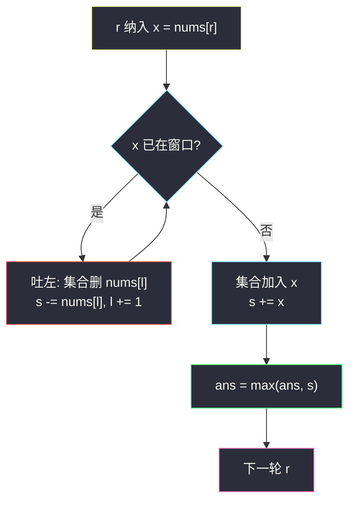
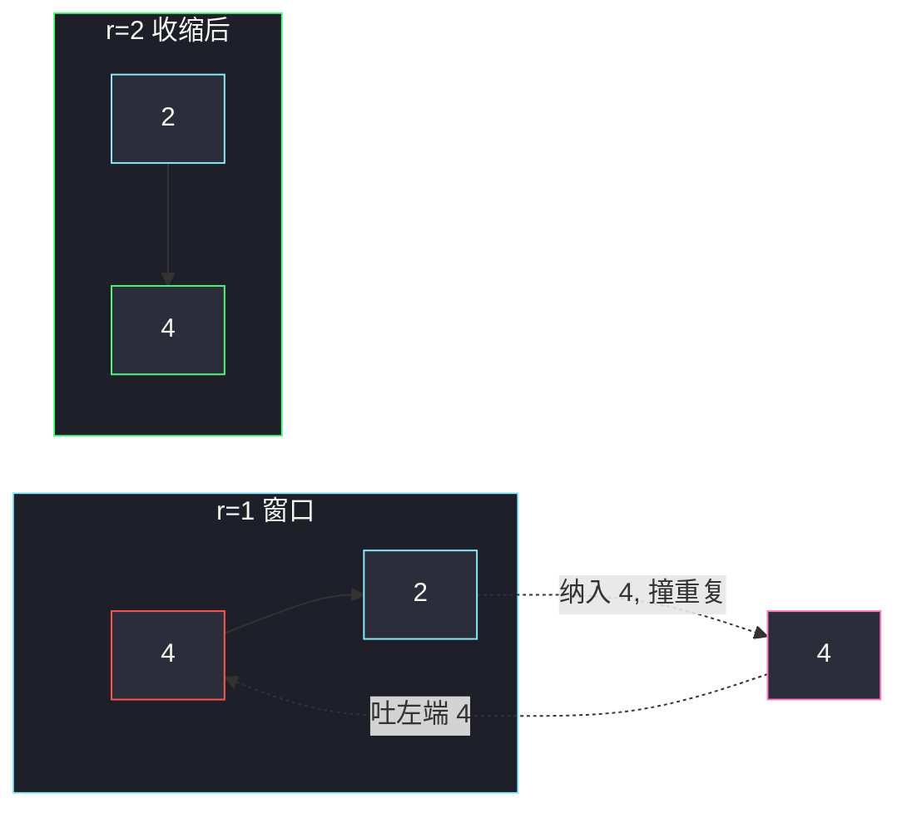

# 删除子数组的最大得分（变长滑窗 · 越短越合法）

## 一、问题描述

给你一个正整数数组 `nums`，从中选出一段**元素互不相同**的连续子数组，这段子数组的得分等于其中元素之和。返回能得到的**最大得分**。

> 🔗 LeetCode 1695：https://leetcode.cn/problems/maximum-erasure-value/
>
> 数据范围：`1 <= nums.length <= 10^5`，`1 <= nums[i] <= 10^4`。

**示例 1**

```
输入：nums = [4,2,4,5,6]
输出：17
解释：互不相同的子数组 [2,4,5,6] 得分 17，是最大的。
```

**示例 2**

```
输入：nums = [5,2,1,2,5,2,1,2,5]
输出：8
解释：[5,2,1]、[1,2,5] 等得分都是 8。
```

**直观理解**

「互不相同」= 窗口里没有重复。右端纳入一个已出现过的数，窗口立刻非法；往左扔掉若干个，直到那个重复被挤出去，窗口又合法。所有 `nums[i] ≥ 1`，对固定右端，**越长的无重复窗口和越大**，所以维护「当前无重复窗口的和」，全程取 max 即可。这是灵神 **§2.1 越短越合法 / 求最长 / 最大**。

---

## 二、暴力解法

枚举所有子数组 `[i, j]`，用集合判重，合法则更新答案：

```python
class Solution:
    def maximumUniqueSubarray(self, nums: List[int]) -> int:
        n, ans = len(nums), 0
        for i in range(n):
            seen = set()
            s = 0
            for j in range(i, n):
                if nums[j] in seen:
                    break
                seen.add(nums[j])
                s += nums[j]
                ans = max(ans, s)
        return ans
```

固定左端 `i` 后，右端一旦撞到重复就可以 `break`：再往右只会继续重复。内层仍可能扫到 `O(n)`，整体平方。

### 复杂度

- **时间**：`O(n²)`。`n = 10^5` 超时。
- **空间**：`O(n)`，集合最坏装下整段。

### 🔴 瓶颈在哪里

相邻左端共享绝大部分「已扫描」信息。`i` 右移一格只是丢掉 `nums[i]`，右边已经确认无重复的那段不必重扫。改成**一个窗口**右扩、左缩，每个下标进出各一次。

---

## 三、优化探索（核心章节）

> 📚 本题在灵茶题单中属于 **02-滑动窗口 · §2.1 越短越合法 / 求最长 / 最大**（1529 分）。骨架：**右扩纳入 → 窗口非法则左缩直到合法 → 用当前窗口更新答案。** 非法条件是「出现重复」；更新对象是窗口和，不是长度。

### 3.1 越短越合法，凭什么更新「和」

设当前窗口 `[l, r]` 内元素互不相同。

- 再缩短（`l` 右移）一定仍无重复，所以「无重复」对长度单调：越短越合法。
- 题目要的是**最大和**。因为 `nums[i] ≥ 1`，对固定的 `r`，所有以 `r` 结尾的无重复子数组里，**最长那条**（即当前窗口）的和最大——丢掉左边正数只会变小。
- 因此每个 `r` 只需保留「以 `r` 结尾的最长无重复窗口」，取其和，再对 `r` 取 max。

若数组含 0 或负数，这条「最长 ⇒ 最大和」会断，必须另议；本题约束保证成立。

### 3.2 用集合维护「窗口里有谁」

右端纳入 `x = nums[r]`：

1. 若 `x` 已在集合中，反复吐出 `nums[l]` 并 `l += 1`，直到 `x` 不在集合里（原来那个 `x` 被吐掉）。
2. 把 `x` 放进集合，窗口和加上 `x`。
3. 用窗口和更新 `ans`。

也可用「上次出现下标」一次跳到 `last[x] + 1`，但跳的同时要把中间那些数从和里减掉、从集合里删掉，代码更绕。`while` 左缩每个元素仍只出一次，渐近相同，更好写。

`nums[i]` 落在 `[1, 10^4]`，集合可以换成 `vis = [False] * 10001`：纳入 `vis[x] = True`，吐左 `vis[nums[l]] = False`。常数更好，骨架不变。通用写法仍用哈希集合，下面主解按集合来。



### 3.3 和「求最长无重复」的差别

[3. 无重复字符的最长子串](https://leetcode.cn/problems/longest-substring-without-repeating-characters/) 与本题同一骨架，只是更新从 `ans = max(ans, r-l+1)` 换成 `ans = max(ans, s)`。同目录姊妹篇 [最多 K 个重复元素的最长子数组](https://leetcode.cn/problems/length-of-longest-subarray-with-at-most-k-frequency/)（`length-of-longest-subarray-with-at-most-k-frequency.md`）把「出现次数 ≤ 1」放宽成「≤ k」，更新的是长度。

### 3.4 一句话核心

> **右扩；碰到重复就左缩到窗口再次互异；正数保证当前窗口和就是以 r 结尾的最优，取 max。**

---

## 四、代码实现

### Python（主解：变长滑窗 + 集合）

```python
class Solution:
    def maximumUniqueSubarray(self, nums: List[int]) -> int:
        seen = set()
        l = s = ans = 0
        for r, x in enumerate(nums):
            while x in seen:                    # 非法：x 重复
                seen.remove(nums[l])
                s -= nums[l]
                l += 1
            seen.add(x)                         # 纳入
            s += x
            ans = max(ans, s)                   # 合法窗口，更新最大和
        return ans
```

**变量含义**

| 变量 | 含义 |
|------|------|
| `l`, `r` | 窗口左 / 右端 |
| `seen` | 当前窗口内的值集合，保证 `|seen| = r-l+1` |
| `s` | 窗口和 |
| `ans` | 历史最大窗口和 |

**循环不变式**：每次 `while` 结束后、更新 `ans` 时，`[l, r]` 内元素互不相同，且 `l` 已经不能再左（再左会把某个与 `nums[r]` 相同的值包含进来，或 `l = 0`）。

### Java（最优解同款）

```java
class Solution {
    public int maximumUniqueSubarray(int[] nums) {
        Set<Integer> seen = new HashSet<>();
        int l = 0, s = 0, ans = 0;
        for (int r = 0; r < nums.length; r++) {
            int x = nums[r];
            while (seen.contains(x)) {
                seen.remove(nums[l]);
                s -= nums[l++];
            }
            seen.add(x);
            s += x;
            ans = Math.max(ans, s);
        }
        return ans;
    }
}
```

和最大 `10^5 * 10^4 = 10^9`，Java `int` 够用。

若坚持「一次跳到上次出现的右侧」而不用 `while`，维护 `last` 下标的同时仍要减掉被跳过的那段和，并把那些值移出集合，代码更长、易漏。每个元素进出仍是一次，没有渐近收益，不推荐。

### 与定长互异窗口的差别

[2461. 长度为 K 子数组中的最大和](https://leetcode.cn/problems/maximum-sum-of-distinct-subarrays-with-length-k/) 也是「互异 + 最大和」，但窗口长度**钉死**为 k：多一个「长度不够不更新、过长先吐左」的定长步骤。本题长度不固定，非法只由重复触发。

---

## 五、具体例子演示

以示例 1 `nums = [4,2,4,5,6]`，逐步跟踪每轮 `l / r`、窗口、是否收缩：

| r | 纳入 | 收缩？ | l | 窗口 | seen | s | ans |
|---|------|--------|---|------|------|---|-----|
| 0 | 4 | 否 | 0 | `[4]` | {4} | 4 | 4 |
| 1 | 2 | 否 | 0 | `[4,2]` | {4,2} | 6 | 6 |
| 2 | 4 | **是**：4 已在。吐 `nums[0]=4`，`l=1` | 1 | `[2,4]` | {2,4} | 6 | 6 |
| 3 | 5 | 否 | 1 | `[2,4,5]` | {2,4,5} | 11 | 11 |
| 4 | 6 | 否 | 1 | `[2,4,5,6]` | {2,4,5,6} | 17 | **17** |

`r = 2` 是关键帧：窗口曾是 `[4,2]`，新 4 与左端撞车，必须把旧 4 吐掉。中间的 2 不用动。最终答案 17 ✓。

示例 2 `nums = [5,2,1,2,5,2,1,2,5]` 前几步：

| r | 纳入 | 收缩？ | l | 窗口 | s | ans |
|---|------|--------|---|------|---|-----|
| 0 | 5 | 否 | 0 | `[5]` | 5 | 5 |
| 1 | 2 | 否 | 0 | `[5,2]` | 7 | 7 |
| 2 | 1 | 否 | 0 | `[5,2,1]` | 8 | **8** |
| 3 | 2 | **是**：吐 5 后 2 仍在，再吐 2，`l=2` | 2 | `[1,2]` | 3 | 8 |
| 4 | 5 | 否 | 2 | `[1,2,5]` | 8 | 8 |

后面窗口在长度 3 的「1,2,5 轮换」里平移，和始终是 8，答案不再增大。

再看三条边界，确认骨架不用特判：

| 输入 | 过程要点 | 答案 |
|------|----------|------|
| `[1]` | 单元素，从不收缩 | 1 |
| `[1,2,3]` | 全程无重复，窗口扩到整段 | 6 |
| `[7,7,7]` | 每次纳入都立刻把旧 7 吐掉，窗口永远长度 1 | 7 |

`n = 10^5` 且几乎全互异时，集合装到 `O(n)`，和达到约 `10^9`，Python int 与 Java `int` 都够。



---

## 六、复杂度分析

| 方法 | 时间 | 空间 | 说明 |
|------|------|------|------|
| 枚举左端 + 内层 break | `O(n²)` | `O(n)` | `n = 10^5` 超时 |
| 变长滑窗 + 集合（主解） | `O(n)` | `O(n)` | 每个元素进、出集合一次 |

最坏空间发生在整段无重复：集合装下 `n` 个键。平均情况下窗口远小于 `n`，但面试按最坏报 `O(n)`。时间上 `l` 只增不减，均摊每个下标进出一次。

---

## 七、对比总结

| 维度 | 本题 | #3 最长无重复子串 | #2958 最多 k 次 |
|------|------|-------------------|-----------------|
| 合法 | 出现次数 ≤ 1 | 同左 | 出现次数 ≤ k |
| 更新 | 窗口**和** | 窗口**长度** | 窗口**长度** |
| 正数假设 | 需要（否则最长≠最大和） | 不需要 | 不需要 |

**易错点**

1. **先缩后加**：必须 `while x in seen` 再 `seen.add(x)`，否则刚加进去的 `x` 会被自己误伤。
2. **缩的时候同步改和**：只动 `l` 忘了 `s -= nums[l]`，答案会偏大。
3. **集合与窗口必须一致**：吐左时 `seen.remove(nums[l])`，不能只减和下标。
4. **不要更新长度当答案**：本题要的是和；最长无重复子数组在示例 1 长度 4 碰巧等于最优，示例 2 长度 3 也碰巧，但写长度会在别的数据错（例如 `[9,1,2]` 最长 3 和 12，但若改成求「长度」就不是这题了）。
5. Java 用 `HashSet<Integer>`，不要用布尔数组——`nums[i]` 到 `10^4` 其实可以 `boolean[10001]`，更省常数，集合更通用。
6. **窗口和溢出**：本题 Java `int` 够；若值更大，和要用 `long`。不要在缩窗时写成 `s -= nums[l++]` 却忘了先 `seen.remove`——先删集合再用旧 `l` 取值，顺序反了会删错键。

**模板（§2.1 越短越合法，求最大和）**

```python
seen, l, s, ans = set(), 0, 0, 0
for r, x in enumerate(nums):
    while x in seen:
        seen.remove(nums[l]); s -= nums[l]; l += 1
    seen.add(x); s += x
    ans = max(ans, s)
```

---

## 八、举一反三

| 题目 | 关系 |
|------|------|
| [2958. 最多 K 个重复元素的最长子数组](https://leetcode.cn/problems/length-of-longest-subarray-with-at-most-k-frequency/) | 同批姊妹篇（`length-of-longest-subarray-with-at-most-k-frequency.md`）：合法从「次数 ≤ 1」放宽到 ≤ k，更新长度 |
| [3. 无重复字符的最长子串](https://leetcode.cn/problems/longest-substring-without-repeating-characters/) | 同一非法条件，更新长度而非和 |
| [2461. 长度为 K 子数组中的最大和](https://leetcode.cn/problems/maximum-sum-of-distinct-subarrays-with-length-k/) | 定长 + 元素互异，和的最大化 |
| [904. 水果成篮](https://leetcode.cn/problems/fruit-into-baskets/) | 越短越合法：窗口内**不同种类** ≤ 2 |
| [1695 的「和」换成计数](https://leetcode.cn/problems/longest-substring-without-repeating-characters/) | 骨架不动，维护对象从 `s` 换成 `r-l+1` |

**思想迁移**

- 先确认单调性：缩短能否修复非法。能，就 §2.1 右扩左缩。
- 再确认「对固定右端，当前最长合法窗口是否就是要优化的那个量」——正数和、长度都是；若是乘积、若有负数，不一定。
- 口诀：**「重复就吐左，正数窗口和即最优，扫一遍取 max。」**
