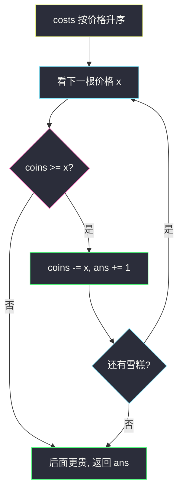
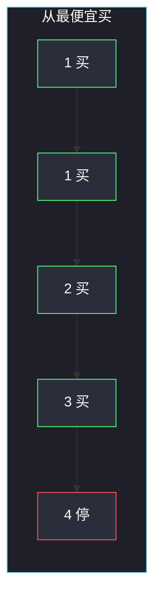

# 雪糕的最大数量（从最便宜的开始买）

## 一、问题描述

商店里有 `n` 根雪糕，第 `i` 根售价 `costs[i]`。你有 `coins` 枚硬币，每根雪糕最多买一次。问在硬币足够的前提下，**最多能买多少根**。

> 🔗 LeetCode 1833：https://leetcode.cn/problems/maximum-ice-cream-bars/
>
> 数据范围：`1 ≤ costs.length ≤ 10^5`，`1 ≤ costs[i] ≤ 10^8`，`1 ≤ coins ≤ 10^8`。
>
> 📚 灵茶题单：**§1.1 从最小/最大开始贪心**（1253 分）。和「装满石头的背包」同一句话：物品价值全是 1，预算固定，从代价最小的开始取。

**示例 1**

```
输入：costs = [1,3,2,4,1], coins = 7
输出：4
解释：买两根 1、一根 2、一根 3，共 7 枚，4 根。剩一根 4 买不起。
```

**示例 2**

```
输入：costs = [10,6,8,7,7,8], coins = 5
输出：0
解释：最便宜的也要 6，一根都买不起。
```

**示例 3**

```
输入：costs = [1,6,3,1,2,5], coins = 20
输出：6
解释：全买只要 18 ≤ 20。
```

**直观理解**

每根雪糕对答案的贡献都是 +1，差别只在价格。要根数最多，就该让硬币覆盖尽可能多的价格——当然是**先买最便宜的**。贵的先买会挤掉多根便宜的。

---

## 二、暴力解法

枚举购买子集，总价 ≤ `coins` 的方案里取元素个数最大者。

```python
class Solution:
    def maxIceCream(self, costs: list[int], coins: int) -> int:
        n = len(costs)
        ans = 0
        for mask in range(1 << n):
            pay = cnt = 0
            for i in range(n):
                if mask >> i & 1:
                    pay += costs[i]
                    cnt += 1
            if pay <= coins:
                ans = max(ans, cnt)
        return ans
```

`n ≤ 10^5`，指数级不可用。0-1 背包 DP 的容量是 `coins ≤ 1e8`，同样放不下。

### 🔴 瓶颈在哪里

价值恒为 1 时，最优子集就是最便宜的若干根，直到刚好买不起下一根。排序后线性扫一遍即可，不必搜索、不必 DP。

---

## 三、优化探索（核心章节）

> 📚 本题在灵茶题单中属于 **§1.1 从最小/最大开始贪心**。与 2279 对照：那边 `need[i]` 是「再花多少能 +1」，这边 `costs[i]` 本身就是代价。都是从最小开始。

### 3.1 局部决策

把 `costs` 升序。从左往右买：

- 若 `coins >= costs[i]`：买下，`coins -= costs[i]`，答案 +1。
- 否则：后面更贵，全部买不起，停止。

### 3.2 为什么从最便宜开始是全局最优

交换论证。设最优买了集合 `O`，贪心买了价格最小的 `|G|` 根（直到买不起下一根）。若某次最优里有一根价格 `x`、却没买某根更便宜的 `y`（`y < x`），把 `x` 换成 `y`：根数不变，省下 `x-y` 枚硬币，用省下的钱只可能买得更多或持平。因此存在最优解「从不放弃更便宜的雪糕」。贪心正好拿走全局最便宜且买得起的一长段前缀。

**反例（从贵的开始）**：`costs = [1,1,1,3]`，`coins = 3`。

- 从便宜开始：三根 1，答案 3。
- 先买 3：答案 1。

所以必须从最小开始，不是从最大开始。从最大开始是另一类题（最少物品覆盖总量）。



### 3.3 计数排序？

`costs[i] ≤ 1e8`，`n ≤ 1e5`，值域远大于 `n`，不适合按价格桶排。普通 `O(n log n)` 排序即可。若数据改成价格 ≤ `n`，才值得线性桶排。

### 3.4 溢出

Python 不用担心。Java 里 `coins` 是 `int`，循环是「比较再减」不是「先把所有价格加起来」，中间结果不会超过 `1e8`，用 `int` 安全。若写成前缀和 `sum += costs[i]` 再与 `coins` 比较：最坏 `1e5 * 1e8 = 1e13`，必须用 `long`。主解用「减硬币」，两种语言都稳。

### 3.5 一句话核心

> **价格升序，能买就买；买不起当前这根就停。不要先买贵的。**

---

## 四、代码实现

### Python（主解：排序后扫）

```python
class Solution:
    def maxIceCream(self, costs: list[int], coins: int) -> int:
        costs.sort()
        ans = 0
        for x in costs:
            if coins < x:
                break
            coins -= x
            ans += 1
        return ans
```

**变量含义**

| 写法 | 含义 |
|------|------|
| `costs.sort()` | 排序关键字 = 价格，升序 |
| `coins` | 还剩多少枚硬币 |
| `x` | 当前这根（剩余里最便宜的） |
| `break` | 当前买不起，后面更贵 |

原地排序后原数组被改掉。LeetCode 不测这一点；若在别处复用 `costs`，先 `sorted(costs)`。

### Java（可选：减的方式用 int 即可）

```java
class Solution {
    public int maxIceCream(int[] costs, int coins) {
        Arrays.sort(costs);
        int ans = 0;
        for (int x : costs) {
            if (coins < x) {
                break;
            }
            coins -= x;
            ans++;
        }
        return ans;
    }
}
```

若改成前缀和：

```java
long sum = 0;
for (int x : costs) {
    sum += x;
    if (sum > coins) break;
    ans++;
}
```

这里 `sum` 必须是 `long`。

---

## 五、具体例子演示

**示例 1**：`costs = [1,3,2,4,1]`，`coins = 7`。

排序关键字：价格 → `[1, 1, 2, 3, 4]`。

| 步 | 选谁（价格） | 剩余硬币 | 够不够 | ans |
|----|--------------|----------|--------|-----|
| 1 | 1 | 7-1=6 | 够 | 1 |
| 2 | 1 | 6-1=5 | 够 | 2 |
| 3 | 2 | 5-2=3 | 够 | 3 |
| 4 | 3 | 3-3=0 | 够 | 4 |
| 5 | 4 | 0 < 4 | **停** | 4 |

答案 4。官方解释「买两根 1、一根 2、一根 3」与表一致。



**示例 2**：`costs = [10,6,8,7,7,8]`，`coins = 5`。

排序后第一根就是 6，`5 < 6`，一步都走不了，ans=0。对拍官方。

**示例 3**：`[1,6,3,1,2,5]` 排序 `[1,1,2,3,5,6]`，前缀和 1,2,4,7,12,18，全部 ≤ 20，ans=6。

**边界**

- `coins` 刚好等于最便宜一根：答案 1。
- 全是 1、`coins = n`：答案 `n`。
- 一根很便宜后面全是天价：只买第一根。
- `costs = [2,2,2]`，`coins = 5`：买两根剩 1，第三根 2 买不起，答案 2。不要求花光。

和 2279 对拍同一骨架：把 `costs` 换成「背包缺口」就是那题。本题官方例 1 排完是 `1,1,2,3,4` 花 7；若有人按降序买 `4+3` 只得 2 根，立刻暴露「从最大开始」用错了方向。

也可以先排序再累加前缀，二分最大的 `k` 使前 `k` 根总价 ≤ `coins`。示例 1 前缀 `[1,2,4,7,11]`，`coins=7` 对应 `k=4`。Python 里 `bisect` 一行能写完，但面试现场从左减硬币更不容易写错溢出。

---

## 六、复杂度分析

| 方法 | 时间 | 空间 | 说明 |
|------|------|------|------|
| 枚举子集 | `O(2^n · n)` | `O(1)` | 不可用 |
| 0-1 背包 DP | `O(n · coins)` | 同左 | `coins=1e8` 不可用 |
| 价格升序贪心（主解） | `O(n log n)` | `O(1)` 额外（原地排序） | 扫描 `O(n)` |

---

## 七、对比总结

| 维度 | 本题 | 2279 装满背包 | 455 分饼干 |
|------|------|---------------|------------|
| 价值 | 每根 +1 | 每个满包 +1 | 每个孩子 +1 |
| 代价 | 价格 | 缺口 | 饼干尺寸 ≥ 胃口 |
| 排序 | 价格升序 | 缺口升序 | 两边都升序后双指针 |
| 从最小开始 | 是 | 是 | 是（小饼干喂小胃口） |

三题都是 §1.1「价值相同 → 从最小代价开始」。2279 只是先把代价从「容量−已有」算出来。

**易错点**

1. **从贵的买**：根数会变少，见 3.2。
2. **Java 前缀和用 `int`**：`1e5 * 1e8` 溢出，答案变小甚至变负。用「减 `coins`」或 `long`。
3. **没买完却继续扫**：买不起当前之后不必 `continue` 看后面——后面只更贵。写 `break` 更干净（写 `continue` 结果也对，但浪费时间）。
4. **修改 `coins` 后拿去当答案**：答案是**根数** `ans`，不是剩余硬币。
5. **以为要恰好花完**：题目不要求花光，花不完也行（示例 3 剩 2）。

---

## 八、举一反三

| 题目 | 关系 |
|------|------|
| [2279. 装满石头的背包的最大数量](https://leetcode.cn/problems/maximum-bags-with-full-capacity-of-rocks/)（`maximum-bags-with-full-capacity-of-rocks.md`） | 先算缺口，其余代码几乎逐行相同 |
| [455. 分发饼干](https://leetcode.cn/problems/assign-cookies/) | 从小到大配对，多了一条「胃口」约束 |
| [1710. 卡车上的最大单元数](https://leetcode.cn/problems/maximum-units-on-a-truck/) | 价值不再相同，改按单元密度/每箱单元降序 |
| [2144. 打折购买糖果的最小开销](https://leetcode.cn/problems/minimum-cost-of-buying-candies-with-discount/)（`minimum-cost-of-buying-candies-with-discount.md`） | 排序后贪心，目标变成最小花费 |
| [860. 柠檬水找零](https://leetcode.cn/problems/lemonade-change/) | 也是钱的贪心，但按面额从大到小找零 |

**思想迁移**

- 「最多买几件、每件分数相同」→ 永远先买最便宜的。
- 口诀：**「价格排升序，硬币够就买，不够立刻停。」**
