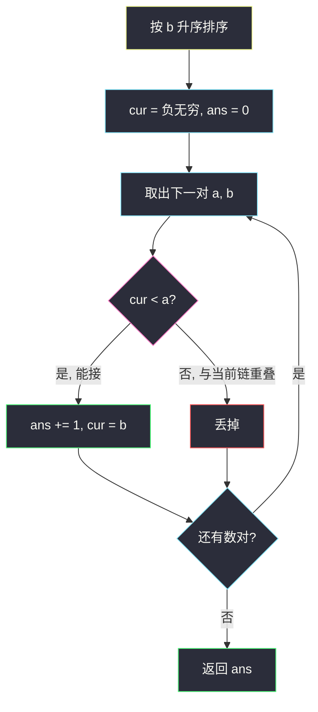
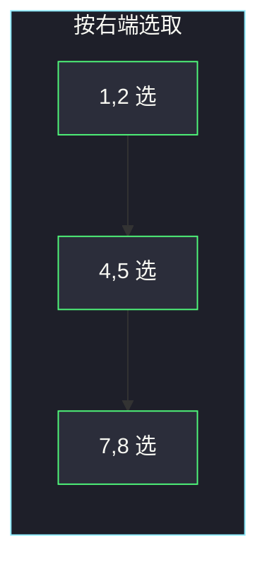
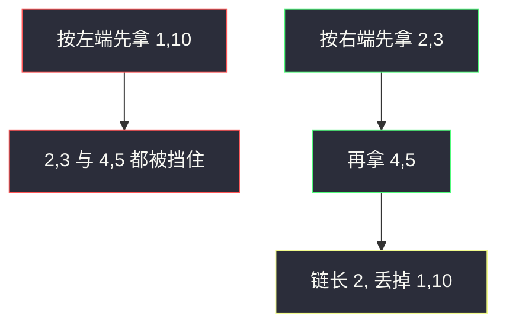

# 最长数对链（不相交区间 · 按右端贪心）

## 一、问题描述

给你 `n` 个数对 `pairs[i] = [a_i, b_i]`，其中 `a_i < b_i`。数对 `(a, b)` 可以接在 `(c, d)` 前面，当且仅当 `b < c`（**严格小于**）。每个数对最多用一次，使用顺序可以任意重排。求能组成的**最长数对链**的长度。

> 🔗 LeetCode 646：https://leetcode.cn/problems/maximum-length-of-pair-chain/
>
> 数据范围：`1 ≤ pairs.length ≤ 1000`，`-1000 ≤ a_i < b_i ≤ 1000`。
>
> 📚 灵茶题单：**§2.1 不相交区间**（435 分）。这就是活动选择：把每个数对看成开区间 `(a, b)`，链 = 一串严格不相交且按端点顺序排列的区间，求最多选几个。

**示例 1**

```
输入：pairs = [[1,2],[2,3],[3,4]]
输出：2
解释：[1,2] → [3,4]。[2,3] 与两端都「贴边」：2 < 2 不成立，2 < 3 虽对但 3 < 3 不成立。
```

**示例 2**

```
输入：pairs = [[1,2],[7,8],[4,5]]
输出：3
解释：[1,2] → [4,5] → [7,8]，三个都能接上。
```

**直观理解**

链越长越好，每个数对只贡献「占住一段右端」。右端越靠左，后面越好接。所以：**按右端 `b` 升序，能接就接**。这和「最多不重叠活动 / 射气球」是同一套交换论证。

---

## 二、暴力解法

把数对当成序列上的 LIS：先按左端（或任意）排好，再 `O(n²)` DP——`dp[i]` = 以 `i` 结尾的最长链。

```python
class Solution:
    def findLongestChain(self, pairs: list[list[int]]) -> int:
        pairs.sort()  # 按左端，保证转移方向
        n = len(pairs)
        dp = [1] * n
        for i in range(n):
            for j in range(i):
                if pairs[j][1] < pairs[i][0]:
                    dp[i] = max(dp[i], dp[j] + 1)
        return max(dp)
```

`n ≤ 1000` 时 `O(n²)` 能过，但不是本题的最优讲法：它没利用「链的代价只有右端」这一维信息。

还可以 DFS 枚举子集再检验，那是指数级，直接放弃。

### 🔴 瓶颈在哪里

LIS 把「偏序最长链」当一般 DP 做。本题的偏序特别简单：只看「上一个的 `b` < 下一个的 `a`」。经典结论：按结束时间贪心，局部「选结束最早的」就能得到全局最长链。不必维护 `dp` 数组。

---

## 三、优化探索（核心章节）

> 📚 本题在灵茶题单中属于 **§2.1 不相交区间**。模板：按右端点排序，维护上一个选中的右端 `cur`，下一个左端只要严格大于 `cur` 就选。

### 3.1 为什么按右端、不按左端

**反例**（按左端会错）：`[[1,10],[2,3],[4,5]]`。

- 按左端：先看到 `[1,10]`，若贪心收了它，后面两个都接不上，链长 1。即使你改成「左端排序 + 能接再接」，第一个左端最小的往往右端很长，把后面全挡死。
- 按右端：顺序是 `[2,3]`、`[4,5]`、`[1,10]`。先收 `[2,3]`（`cur=3`），再收 `[4,5]`（`cur=5`），`[1,10]` 的 1 不大于 5，丢掉。链长 2，最优。

右端最小 = 结束得最早 = 给后面留的空档最大。这就是活动选择里「最早结束时间」策略。

### 3.2 交换论证：局部最优即全局

设所有数对已按 `b` 升序。贪心选中的集合为 `G = g1, g2, …`（下标按选取顺序）。任取一条最优链 `O = o1, o2, …`。

`g1` 是全局右端最小者之一。`o1` 的右端 ≥ `g1` 的右端。把 `o1` 换成 `g1`，后面的 `o2, o3, …` 仍然接得上（因为它们本来就能接在更靠右的 `o1` 后面）。于是存在一条最优链以 `g1` 开头。删掉与 `g1` 冲突的数对，对后缀归纳。

所以：**每次在剩余数对里选右端最小且能接上的那个**——排序后从左扫，「能接就接」就是在执行这件事。

### 3.3 严格小于，不是 ≤

题目是 `b < c`，不是 `b ≤ c`。示例 1 的 `[1,2]` 和 `[2,3]`：`2 < 2` 为假，不能接。写代码时用 `<`，不要写成 `<=`。若把数对想成闭区间 `[a,b]`，它们连端点相接都不允许，比 435 题「闭区间不重叠」更严一点（435 里端点相等算重叠，去掉一个即可；本题端点相等直接不能进链）。



### 3.4 和 LIS 的关系

若把每个数对映射到「权值 = 右端、约束 = 左端 > 上一右端」，这是二维偏序上的最长链。`n = 1000` 时 `O(n²)` DP 能过；`n` 再大就回到本节贪心 `O(n log n)`（排序）。**讲题优先贪心**，DP 只作对照。

### 3.5 一句话核心

> **按右端升序扫；维护已选链的右端 `cur`，下一个左端只要严格大于 `cur` 就接上并更新 `cur`。**

---

## 四、代码实现

### Python（主解：按右端贪心）

```python
class Solution:
    def findLongestChain(self, pairs: list[list[int]]) -> int:
        pairs.sort(key=lambda p: p[1])
        ans = 0
        cur = -(10**9)  # 小于任何 a
        for a, b in pairs:
            if cur < a:
                ans += 1
                cur = b
        return ans
```

**变量含义**

| 写法 | 含义 |
|------|------|
| `key=lambda p: p[1]` | 排序关键字 = 右端 `b` |
| `cur` | 当前链最后一个数对的右端 |
| `cur < a` | 严格可接（题目条件 `b < c`） |
| `ans` | 已选数对个数 = 链长 |

`cur` 初始化成很小的数，保证第一对一定能选。不要初始化成 0：题目有负数端点。

### Java（可选）

```java
class Solution {
    public int findLongestChain(int[][] pairs) {
        Arrays.sort(pairs, (p, q) -> Integer.compare(p[1], q[1]));
        int ans = 0, cur = Integer.MIN_VALUE / 2;
        for (int[] p : pairs) {
            if (cur < p[0]) {
                ans++;
                cur = p[1];
            }
        }
        return ans;
    }
}
```

比较器用右端 `p[1]`，不要写成 `p[0]`。`cur` 用 `MIN_VALUE / 2` 避免极端情况下再减溢出的心理负担，本题 `a_i ≥ -1000`，写成 `-1001` 也行。

---

## 五、具体例子演示

**示例 1**：`[[1,2],[2,3],[3,4]]`。

排序关键字已经是右端，顺序不变：

| 步 | 看哪一对 | cur | cur < a ? | 决策 | 新 cur | ans |
|----|----------|-----|-----------|------|--------|-----|
| 0 | （开始） | -1e9 | | | | 0 |
| 1 | `[1,2]` | -1e9 | 是 | **选** | 2 | 1 |
| 2 | `[2,3]` | 2 | `2 < 2` 否 | 丢 | 2 | 1 |
| 3 | `[3,4]` | 2 | `2 < 3` 是 | **选** | 4 | 2 |

答案 2，对应 `[1,2] → [3,4]`。

**示例 2**：`[[1,2],[7,8],[4,5]]`。

按右端排序后：`[1,2], [4,5], [7,8]`。

| 步 | 看哪一对 | cur | 决策 | ans |
|----|----------|-----|------|-----|
| 1 | `[1,2]` | 选，cur=2 | 选 | 1 |
| 2 | `[4,5]` | `2 < 4` | 选，cur=5 | 2 |
| 3 | `[7,8]` | `5 < 7` | 选，cur=8 | 3 |



**按左端会错的反例**：`[[1,10],[2,3],[4,5]]`。

按右端：`[2,3] → [4,5]`，丢掉 `[1,10]`，ans=2。若有人按左端贪心先拿 `[1,10]`，只得 1，对拍失败。

**贴边**：`[[1,2],[2,3]]` → 只能选 1 个。把 `<` 误写成 `<=` 会得到 2，这是本题最常见的 WA。

**负数端点**：`[[-10,-8],[-6,-4],[-3,1]]`。按右端已有序，`cur` 从极小值走：`-8 < -6` 接上，`-4 < -3` 再接，链长 3。若 `cur` 从 0 起步，第一对 `-10 < 0` 会被当成「接不上」。

**全重叠**：`[[1,5],[2,6],[3,7]]` 按右端选完第一对 `[1,5]` 后，`5 < 2`、`5 < 3` 都不成立，ans=1。DP 也会得到 1，贪心没有漏。

`n=1` 时答案恒为 1。数据保证 `a_i < b_i`，不用处理「左端 ≥ 右端」的废对。

按左端贪心的反例可以画成：



---

## 六、复杂度分析

| 方法 | 时间 | 空间 | 说明 |
|------|------|------|------|
| 子集搜索 | 指数级 | `O(n)` | 不可用 |
| 排序 + LIS DP | `O(n²)` | `O(n)` | `n=1000` 能过，非主讲 |
| 按右端贪心（主解） | `O(n log n)` | `O(1)` 额外（不含排序） | 排序可原地 |

---

## 七、对比总结

| 维度 | 本题 | 435 无重叠区间 | 452 射气球 |
|------|------|----------------|------------|
| 模型 | 最长严格不相交链 | 最少删除使不重叠 | 最少点覆盖区间 |
| 排序键 | 右端升序 | 右端升序 | 右端升序 |
| 能接条件 | `cur < a` | `cur ≤ a`（闭区间不相交） | 箭射在右端，下一左端 > 箭 |
| 更新 | `cur = b` | `cur = b` | 箭不够才新射一支 |
| 答案 | 选中个数 | `n - 选中个数` | 箭数 |

三题排序键相同，差别只在「端点相等算不算冲突」以及「统计选中还是统计扔掉」。

**易错点**

1. **按左端或按长度排序**：见 3.1 反例。
2. **`<=` 写成可接**：官方例 1 会从 2 变成 3。
3. **`cur` 初始化成 0**：负数 `a` 会让第一对被误判接不上。
4. **以为顺序固定不能重排**：题目允许任意顺序使用，所以先排序合法。
5. **DP 写对就停**：能过，但面试应能讲清「为什么最早结束」。

---

## 八、举一反三

| 题目 | 关系 |
|------|------|
| [435. 无重叠区间](https://leetcode.cn/problems/non-overlapping-intervals/) | 同一贪心，答案改成「扔掉多少」 |
| [452. 用最少数量的箭引爆气球](https://leetcode.cn/problems/minimum-number-of-arrows-to-burst-balloons/) | 右端排序；端点相等**可以**共用一箭 |
| [300. 最长递增子序列](https://leetcode.cn/problems/longest-increasing-subsequence/) | 不重排时的 LIS；本题允许重排所以退化为贪心 |
| [1235. 规划兼职工作](https://leetcode.cn/problems/maximum-profit-in-job-scheduling/) | 不相交区间 + 权值，贪心不够，要 DP |
| [763. 划分字母区间](https://leetcode.cn/problems/partition-labels/)（`partition-labels.md`） | 同属区间题，那边是合并相交，这边是挑选不相交 |

**思想迁移**

- 要最多段互不重叠区间：按**结束时间**排序，能选就选。
- 口诀：**「右端升序，严格小于才接，接上就更新右端。」**
