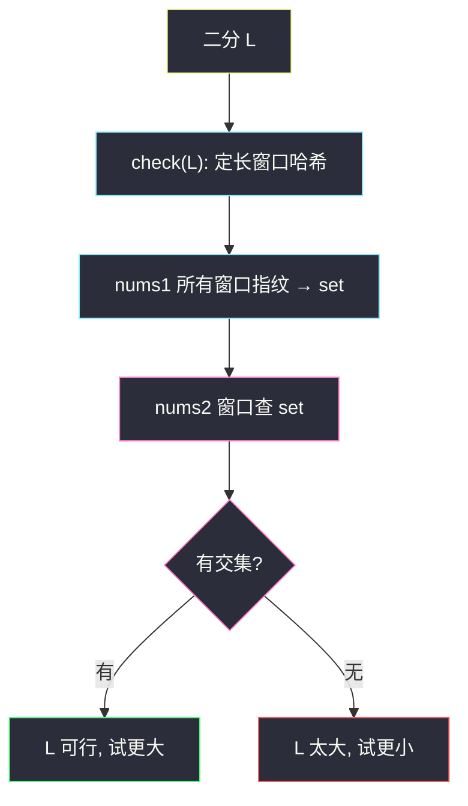
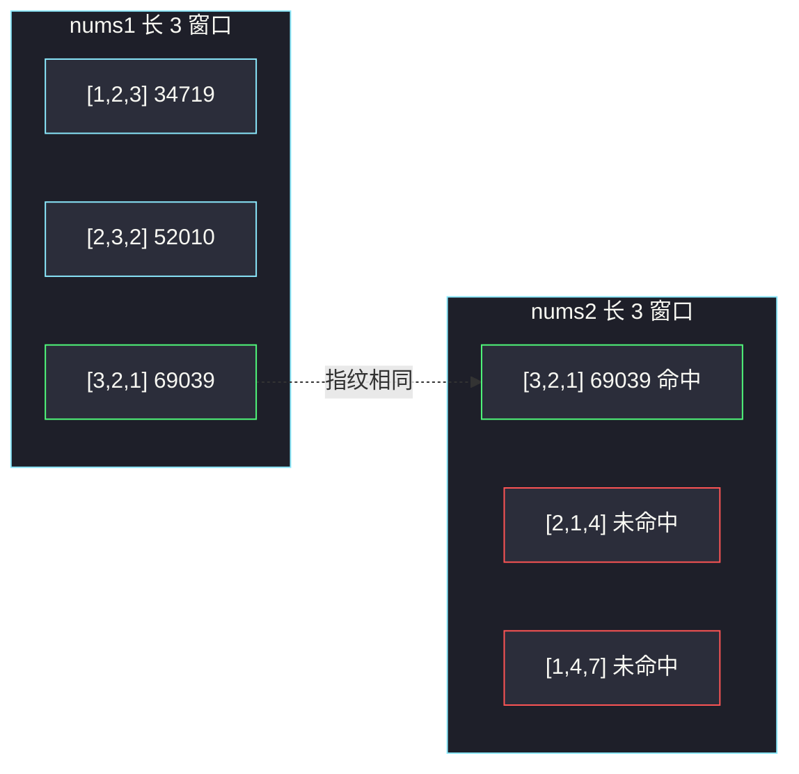

# 最长重复子数组（二分长度 + 滚动哈希）

## 一、问题描述

给两个整数数组 `nums1`、`nums2`，求它们的**公共连续子数组**的最大长度。子数组必须下标连续；不连续的公共子序列不算。

> 🔗 LeetCode 718：https://leetcode.cn/problems/maximum-length-of-repeated-subarray/
>
> 数据范围：`1 ≤ nums1.length, nums2.length ≤ 1000`，`0 ≤ nums[i] ≤ 100`。元素可以是 **0**。
>
> 📚 灵茶题单：**四、字符串哈希**。把数组看成字母表大小 101 的字符串。判定「是否存在长为 L 的公共子数组」可用滚动哈希：一边所有窗口哈希放进集合，另一边查交。长度具有单调性，对 L 二分。DP `dp[i][j]`（以 `i-1`、`j-1` 结尾的最长公共后缀）作为暴力/对照，优化探索要把哈希二分讲清楚。

**示例 1**

```
输入：nums1 = [1,2,3,2,1], nums2 = [3,2,1,4,7]
输出：3
解释：最长公共子数组是 [3,2,1]。
```

**示例 2**

```
输入：nums1 = [0,0,0,0,0], nums2 = [0,0,0,0,0]
输出：5
解释：整段都相同。元素全是 0，哈希时必须能区分「长度」——二分里窗口长度固定，全 0 窗口彼此相等是对的。
```

**直观理解**

公共子数组 = 两串里各切一段，切出来完全一样。最长多长？从大到小试长度不划算；「存在长度 ≥ L」随 L 增大从真变假，可以二分 L，每次用哈希在 `O(n+m)` 里判定。

---

## 二、暴力解法

DP。`dp[i][j]` = 以 `nums1[i-1]`、`nums2[j-1]` **结尾**的最长公共后缀长度：

```
若 nums1[i-1] == nums2[j-1]：dp[i][j] = dp[i-1][j-1] + 1
否则：dp[i][j] = 0
```

答案是所有 `dp[i][j]` 的最大值。这是「连续」版 LCS，不相等必须清零，不能取 `max(dp[i-1][j], dp[i][j-1])`。

```python
class Solution:
    def findLength(self, nums1: list[int], nums2: list[int]) -> int:
        n, m = len(nums1), len(nums2)
        dp = [[0] * (m + 1) for _ in range(n + 1)]
        ans = 0
        for i in range(1, n + 1):
            for j in range(1, m + 1):
                if nums1[i - 1] == nums2[j - 1]:
                    dp[i][j] = dp[i - 1][j - 1] + 1
                    ans = max(ans, dp[i][j])
        return ans
```

`n,m ≤ 1000` 时 `O(nm)` 能过，官方示例 1 的 DP 表见第五节。本题课表在哈希，DP 当对照。

### 🔴 瓶颈在哪里

DP 已经是 `O(nm)` 最优比较次数之一，但没有用到「长度可二分」。哈希把「两段是否相等」变成整数比较，再配合二分，时间 `O((n+m) log min(n,m))`，也是这节要练的模板（更长串、如 1923 题，DP 会爆，哈希还能用）。

---

## 三、优化探索（核心章节）

> 📚 本题在灵茶题单中属于 **四、字符串哈希**。滚动哈希把定长窗口映射成整数；二分长度把「最长」变成多次「是否存在」。

### 3.1 单调性

若存在公共子数组长度 `L`，则一定存在长度 `L-1`（把它截短）。于是：

- `check(L) = true` ⇒ 对所有 `L' ≤ L` 也为 true；
- 答案是使 `check` 为真的最大 L。

二分：`lo=0, hi=min(n,m)`，取 `mid`，能则 `lo=mid`，不能则 `hi=mid-1`。

### 3.2 多项式滚动哈希

把子数组 `a[l..r]` 看成 `base` 进制数（每位先加 1，见下）：

```
H = v[l]*base^(r-l) + v[l+1]*base^(r-l-1) + … + v[r]
```

窗口右移一格：

```
H ← (H - v[l] * base^(L-1)) * base + v[l+L]
```

全部对模数取模。`base` 取 **大于字母表** 的数，这里 `nums[i]≤100`，用 `131`。模数 `10^9+7` 单哈希在 `n=1000` 下偶发碰撞；主解用双哈希 `(10^9+7, 10^9+9)`，把一对哈希当窗口指纹。

**0 的处理**：`nums[i]` 可为 0。若直接用 0 当数位，定长全 0 窗口哈希都是 0，长度相同时这正是「内容相同」，不冲突。不同长度的全 0 哈希也是 0，但二分每次 L 固定，不会拿长度 1 去跟长度 3 比。仍建议 **`v = nums[i]+1`**，把值域映到 `1..101`，避开 0 因子，习惯更好。

### 3.3 check(L)

1. 扫 `nums1` 所有长 L 窗口，指纹放进 `set`；
2. 扫 `nums2` 每个长 L 窗口，若指纹在集合里则存在公共段。



### 3.4 一句话核心

> **公共长度可二分；每次用滚动哈希看两边定长窗口指纹有没有交集。**

---

## 四、代码实现

### Python（主解：二分 + 双哈希）

```python
class Solution:
    def findLength(self, nums1: list[int], nums2: list[int]) -> int:
        MOD1, MOD2, BASE = 10**9 + 7, 10**9 + 9, 131

        def has_common(L: int) -> bool:
            if L == 0:
                return True

            def fingerprints(arr: list[int]) -> set[tuple[int, int]]:
                n = len(arr)
                seen: set[tuple[int, int]] = set()
                if n < L:
                    return seen
                pw1 = pow(BASE, L - 1, MOD1)
                pw2 = pow(BASE, L - 1, MOD2)
                h1 = h2 = 0
                for i in range(L):
                    v = arr[i] + 1
                    h1 = (h1 * BASE + v) % MOD1
                    h2 = (h2 * BASE + v) % MOD2
                seen.add((h1, h2))
                for i in range(L, n):
                    out = arr[i - L] + 1
                    inn = arr[i] + 1
                    h1 = (h1 - out * pw1) % MOD1
                    h1 = (h1 * BASE + inn) % MOD1
                    h2 = (h2 - out * pw2) % MOD2
                    h2 = (h2 * BASE + inn) % MOD2
                    seen.add((h1, h2))
                return seen

            s = fingerprints(nums1)
            n2 = len(nums2)
            if n2 < L:
                return False
            pw1 = pow(BASE, L - 1, MOD1)
            pw2 = pow(BASE, L - 1, MOD2)
            h1 = h2 = 0
            for i in range(L):
                v = nums2[i] + 1
                h1 = (h1 * BASE + v) % MOD1
                h2 = (h2 * BASE + v) % MOD2
            if (h1, h2) in s:
                return True
            for i in range(L, n2):
                out = nums2[i - L] + 1
                inn = nums2[i] + 1
                h1 = (h1 - out * pw1) % MOD1
                h1 = (h1 * BASE + inn) % MOD1
                h2 = (h2 - out * pw2) % MOD2
                h2 = (h2 * BASE + inn) % MOD2
                if (h1, h2) in s:
                    return True
            return False

        lo, hi = 0, min(len(nums1), len(nums2))
        while lo < hi:
            mid = (lo + hi + 1) // 2
            if has_common(mid):
                lo = mid
            else:
                hi = mid - 1
        return lo
```

Python 的 `%` 对负数会归到 `[0, MOD)`，减出负值也安全。

**变量含义**

| 写法 | 含义 |
|------|------|
| `L` | 当前检查的窗口长度 |
| `pw1/pw2` | `base^(L-1) mod`，用于减掉左端 |
| `h1,h2` | 双模指纹 |
| `arr[i]+1` | 避开数值 0 |
| `lo + hi + 1 // 2` | 上取整中点，配合 `lo=mid` 防死循环 |

---

## 五、具体例子演示

**示例 1**：`nums1=[1,2,3,2,1]`，`nums2=[3,2,1,4,7]`。`hi=5`。

为了把窗口哈希逐步算清楚，下面只用单模 `10^9+7`、`base=131`、`v=x+1` 演示（主解是双模，算法相同）。`131^2 = 17161`。

### 5.1 先看 DP 对照（暴力表）

行是 `nums1` 的 `1,2,3,2,1`，列是 `nums2` 的 `3,2,1,4,7`（表中是 `dp[i][j]`）：

|  | 3 | 2 | 1 | 4 | 7 |
|--|---|---|---|---|---|
| 1 | 0 | 0 | 1 | 0 | 0 |
| 2 | 0 | 1 | 0 | 0 | 0 |
| 3 | 1 | 0 | 0 | 0 | 0 |
| 2 | 0 | 2 | 0 | 0 | 0 |
| 1 | 0 | 0 | 3 | 0 | 0 |

右下角那条 `1→2→3` 对应 `[3,2,1]`，答案 3。对拍官方。

### 5.2 哈希窗口：L=3（可行）

`nums1` 三个窗口：

| 窗口 | 映射 v | 计算 | H |
|------|--------|------|---|
| `[1,2,3]` | 2,3,4 | `2*17161 + 3*131 + 4` | 34719 |
| `[2,3,2]` | 3,4,3 | 从 34719 滚：减 `2*17161`，×131，加 3 | 52010 |
| `[3,2,1]` | 4,3,2 | 再滚：减 `3*17161`，×131，加 2 | 69039 |

逐步滚第二格（钉死公式）：

```
H = 34719
H - 2*17161 = 34719 - 34322 = 397
H = 397 * 131 + 3 = 52007 + 3 = 52010
```

第三格：

```
H - 3*17161 = 52010 - 51483 = 527
H = 527 * 131 + 2 = 69037 + 2 = 69039
```

集合 `{34719, 52010, 69039}`。

`nums2` 窗口：

| 窗口 | 映射 | 计算 | H | 命中？ |
|------|------|------|---|--------|
| `[3,2,1]` | 4,3,2 | 与 nums1 第三窗相同 | 69039 | 是 |
| `[2,1,4]` | 3,2,5 | `69039 - 4*17161 = 395`，`395*131+5` | 51750 | 否 |
| `[1,4,7]` | 2,5,8 | `51750 - 3*17161 = 267`，`267*131+8` | 34985 | 否 |

第一窗就命中，`check(3)=true`。

### 5.3 L=4（不可行）

`nums1`：`[1,2,3,2]`、`[2,3,2,1]`。`nums2`：`[3,2,1,4]`、`[2,1,4,7]`。四段互不相等，哈希集合无交，`check(4)=false`。

二分过程：

| lo | hi | mid | check | 下一步 |
|----|----|-----|-------|--------|
| 0 | 5 | 3 | 真 | lo=3 |
| 3 | 5 | 4 | 假 | hi=3 |
| 3 | 3 | — | 结束 | 答案 3 |

对拍官方。



**边界**：两数组长度 1 且相等答案 1，不等 0；全 0 且等长答案为该长度（L 固定时全 0 指纹相同）。

---

## 六、复杂度分析

| 方法 | 时间 | 空间 | 说明 |
|------|------|------|------|
| DP | `O(nm)` | `O(nm)` 或 `O(min(n,m))` 滚动 | 能过，非本课重点 |
| 二分 + 滚动哈希（主解） | `O((n+m) log min(n,m))` | `O(n)` | 每次 check 线性扫窗口 |

哈希期望正确；双模碰撞概率约 `1/(10^18)` 量级，本题可忽略。最坏仍应意识到哈希是蒙特卡洛，竞赛里双模足够。

---

## 七、对比总结

| 维度 | DP 公共后缀 | 二分 + 哈希 | 1143 LCS |
|------|-------------|-------------|----------|
| 连续？ | 是，不等清零 | 是，窗口必须连续 | 否，可跳过 |
| 复杂度 | `O(nm)` | `O((n+m) log)` | `O(nm)` |
| 灵神课 | 对照 | 本节模板 | 另一题 |
| 更长数组 | n=10^5 会爆 | 仍可用 | 会爆 |

**易错点**

1. **写成 LCS**：`dp` 不相等时取 max 而不是 0，求的是子序列。
2. **base ≤ 100**：可能和进位混淆；用 131。
3. **忘记 `+1` 又拿不同长度比**：本题二分定长，全 0 仍正确；养成 `+1` 更稳。
4. **减左端未取模**：中间结果为负。Python `%` 安全，其他语言要 `((h%MOD)+MOD)%MOD`。
5. **二分写成 `mid=(lo+hi)//2` 且 `lo=mid`**：会在 `lo+1=hi` 时死循环，上取整或改 `lo=mid+1` 骨架。
6. **单哈希在对抗数据下碰撞**：教学可单模，提交用双模。

---

## 八、举一反三

| 题目 | 关系 |
|------|------|
| [1143. 最长公共子序列](https://leetcode.cn/problems/longest-common-subsequence/) | 不要求连续；DP 不等时取 max |
| [1035. 不相交的线](https://leetcode.cn/problems/uncrossed-lines/) | 本质 LCS |
| [1923. 最长公共子路径](https://leetcode.cn/problems/longest-common-subpath/) | 多串版：二分 + 哈希，n 更大必须哈希 |
| [1044. 最长重复子串](https://leetcode.cn/problems/longest-duplicate-substring/) | 单串内部：二分 + 哈希找重复 |
| [187. 重复的 DNA 序列](https://leetcode.cn/problems/repeated-dna-sequences/) | 定长窗口哈希 |
| [28. 找出字符串中第一个匹配项的下标](https://leetcode.cn/problems/find-the-index-of-the-first-occurrence-in-a-string/) | 同批字符串：KMP 匹配一段，本题比的是最长公共段 |

**思想迁移**

- 「是否存在长度为 L 的某某串」常常可哈希；再问最长，就对 L 二分。
- 口诀：**「连续公共段，二分长度；窗口滚动哈希，集合求交。」**
