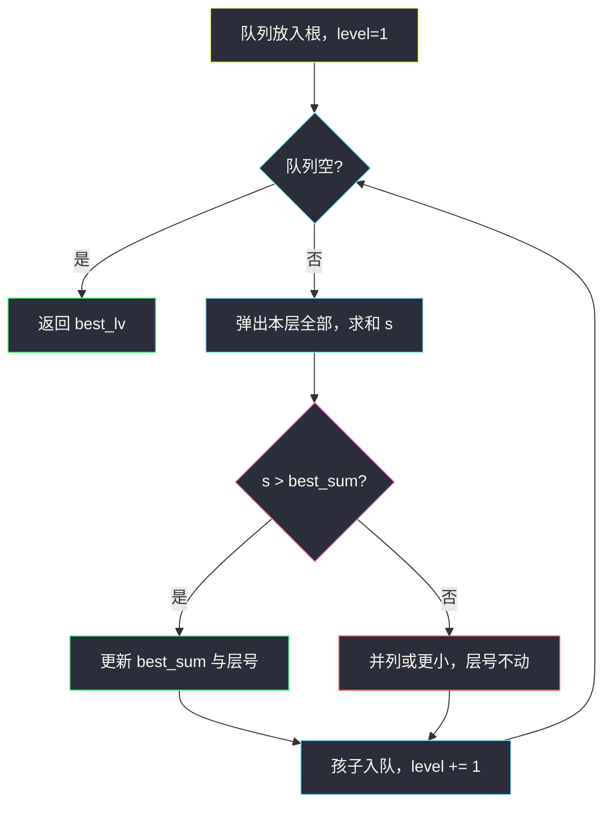
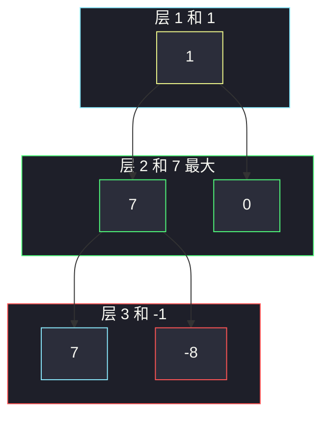

# 最大层内元素和（按层求和取最小层号）

## 一、问题描述

给定二叉树根结点，请返回**层内元素和最大**的那一层的层号。层号从 **1** 开始（根为第 1 层）。若有多层并列最大，返回其中**最小**的层号。

> 🔗 LeetCode 1161：https://leetcode.cn/problems/maximum-level-sum-of-a-binary-tree/
>
> 📚 灵神题单：**二叉树 · §2.13 二叉树 BFS**
>
> 数据范围：结点数 `n ∈ [1, 10⁴]`，结点值 `−10⁵ ≤ Node.val ≤ 10⁵`（**可为负**）。

**示例 1**

```
输入：root = [1,7,0,7,-8,null,null]
输出：2
解释：
第 1 层和 = 1
第 2 层和 = 7 + 0 = 7
第 3 层和 = 7 + (−8) = −1
最大是 7，在第 2 层。
```

```
      1        ← 层 1，和 1
     / \
    7   0      ← 层 2，和 7
   / \
  7  -8        ← 层 3，和 −1
```

**示例 2**

```
输入：root = [989,null,10250,98693,-89388,null,null,null,-32127]
输出：2
解释：层和依次为 989、10250、9305、−32127，最大在第 2 层。
```

**直观理解**

同一层的点在 BFS 队列里刚好排成一段。每层弹出这一段、把值加起来，同时记下目前最好的 `(和, 层号)`。和相等时不更新，层号就自动取最小。

---

## 二、暴力解法

先 DFS 得到每个点的层号，塞进哈希表再扫一遍；或者对可能的每一层重新遍历整棵树只加该层。后者 `O(n · h)`。

```python
class Solution:
    def maxLevelSum(self, root: Optional[TreeNode]) -> int:
        sums = {}
        def dfs(node, lv):
            if not node:
                return
            sums[lv] = sums.get(lv, 0) + node.val
            dfs(node.left, lv + 1)
            dfs(node.right, lv + 1)
        dfs(root, 1)
        return max(sums, key=lambda lv: (sums[lv], -lv))  # 和最大，层号最小
```

正确，但层的概念被拆成「深度参数 + 事后聚合」，不如 BFS 直观。`n = 10⁴` 两种都能过。

### 复杂度

- **时间**：`O(n)`（DFS 聚合）或 `O(n · h)`（逐层重扫）。
- **空间**：哈希 `O(h)`；重扫只需 `O(h)` 栈。

### 🔴 瓶颈在哪里

没有算法量级上的瓶颈，有的是**写法**：§2.13 的标准件就是「外层 while 队列非空，内层 `for _ in range(len(q))` 消化一整层」。层和、层号都在内层循环里自然出现。另外结点值可负，不能「后面层结点更少就提前停」。

---

## 三、优化探索（核心章节）

> 📚 对齐灵神 **§2.13 二叉树 BFS**：层序遍历的每一层对应一个和。本题只多两件事——求和、比较时用严格大于以保留更小层号。

### 3.1 按层模板

```
q ← [root]
level ← 1
best_sum ← 负无穷，best_lv ← 1
while q:
    弹出本层全部结点，累加 s
    若 s > best_sum：更新 best
    把下一层孩子入队
    level += 1
```

`best_sum` 必须从负无穷起：整棵树可以全是负数，此时「最大层和」仍是某个负数，不能用 0 当初始。

比较用 `>` 而不是 `≥`：先扫到的层号更小，并列时不必更新。



### 3.2 负数层

示例 1 第 3 层是 −1，比第 2 层的 7 小，不更新。若根是 −5、孩子是 −1，最大层和在第 2 层（−1 > −5）。**层越深和不一定更小**，因为可负可正、结点数也不单调到能推出和的趋势。必须扫完全树。

### 3.3 一句话核心

> **BFS 按层求和；用严格大于更新答案，并列时自然留下更小的层号；初值用负无穷。**

---

## 四、代码实现

### Python（主解：按层 BFS）

```python
from collections import deque

class Solution:
    def maxLevelSum(self, root: Optional[TreeNode]) -> int:
        q = deque([root])
        best_sum = float("-inf")
        best_lv = 1
        lv = 1
        while q:
            s = 0
            for _ in range(len(q)):
                node = q.popleft()
                s += node.val
                if node.left:
                    q.append(node.left)
                if node.right:
                    q.append(node.right)
            if s > best_sum:
                best_sum = s
                best_lv = lv
            lv += 1
        return best_lv
```

**变量含义**

| 变量 | 含义 |
|------|------|
| `q` | 当前层结点 |
| `s` | 本层元素和 |
| `best_sum` / `best_lv` | 目前最大和、对应最小层号 |
| `lv` | 当前层号，从 1 计 |

根保证非空（`n ≥ 1`），不必判断 `if not root`。`float("-inf")` 也可用 `−10⁵ * n` 的下界代替。

---

## 五、具体例子演示

**示例 1** 逐步队列。

| 层 | 弹出前队列 | 本层和 `s` | 比较 | best |
|----|------------|------------|------|------|
| 1 | `[1]` | 1 | 1 > −∞ | 和=1，层=1 |
| 2 | `[7, 0]` | 7 | 7 > 1 | 和=7，层=**2** |
| 3 | `[7, -8]` | −1 | −1 > 7？否 | 仍是层 2 |

返回 2。

**示例 2** 树形：

```
         989           层 1 和 = 989
           \
         10250         层 2 和 = 10250
         /     \
     98693   -89388    层 3 和 = 9305
                 \
               -32127  层 4 和 = −32127
```

| 层 | 队列 | 和 | 是否更新 |
|----|------|----|----------|
| 1 | `[989]` | 989 | 是 |
| 2 | `[10250]` | 10250 | 是（10250 > 989） |
| 3 | `[98693, -89388]` | 9305 | 否 |
| 4 | `[-32127]` | −32127 | 否 |

最大在第 2 层。对拍：9305 < 10250，没有「层 3 结点数更多所以和更大」这回事。



---

## 六、复杂度分析

| 方法 | 时间 | 空间 | 说明 |
|------|------|------|------|
| 逐层重扫 | `O(n · h)` | `O(h)` | 不必要 |
| DFS 记层和 | `O(n)` | `O(h)` | 正确，非 §2.13 主模板 |
| 按层 BFS（主解） | `O(n)` | `O(w)` | `w` 为最大一层的宽度 |

每个结点入队、出队各一次。空间是队列里一层的结点，最坏 `O(n)`（满二叉树最底层）。

---

## 七、对比总结

| 维度 | DFS 记深度 | BFS 按层 |
|------|------------|----------|
| 层和 | 哈希/数组事后比 | 内层循环当场比 |
| 层号从 1 | 参数从 1 传 | `lv` 自增 |
| 教学位置 | §2.2 先序 | **§2.13** |

**易错点**

1. **层号从 0 起**：题面根是第 1 层，初始化 `lv = 1`。
2. **`best_sum = 0`**：全负树会错。用负无穷。
3. **用 `≥` 更新**：并列时会改成更深的层，违反「最小层号」。
4. **值可负就提前 break**：后面层可能突然很大（或没那么负），必须走完。
5. **忘了按层弹出**：没有 `for _ in range(len(q))` 会把不同层混在一次求和里。

**模板（§2.13 按层 BFS）**

```python
while q:
    s = 0
    for _ in range(len(q)):
        node = q.popleft()
        s += node.val
        ...
    # 用 s 更新答案
```

---

## 八、举一反三

| 题目 | 关系 |
|------|------|
| [102. 二叉树的层序遍历](https://leetcode.cn/problems/binary-tree-level-order-traversal/) | 同一套按层模板，收集的是结点而不是和 |
| [637. 二叉树的层平均值](https://leetcode.cn/problems/average-of-levels-in-binary-tree/) | 层和再除以本层个数 |
| [515. 在每个树行中找最大值](https://leetcode.cn/problems/find-largest-value-in-each-tree-row/) | 内层循环改成求 max |
| [2583. 二叉树中的第 K 大层和](https://leetcode.cn/problems/kth-largest-sum-in-a-binary-tree/) | 先收集所有层和再选第 k 大；站点 slug `kth-largest-sum-in-a-binary-tree` |
| [1302. 层数最深叶子节点的和](https://leetcode.cn/problems/deepest-leaves-sum/) | 只要最后一层的和，BFS 扫到末层即可 |

**思想迁移**

- 「和层有关」的统计，优先按层 BFS：一层进出队列的那一截，就是这一层的全部结点。
- 口诀：**「一层一和；严格大于才换层号；负数也要走完全树。」**
