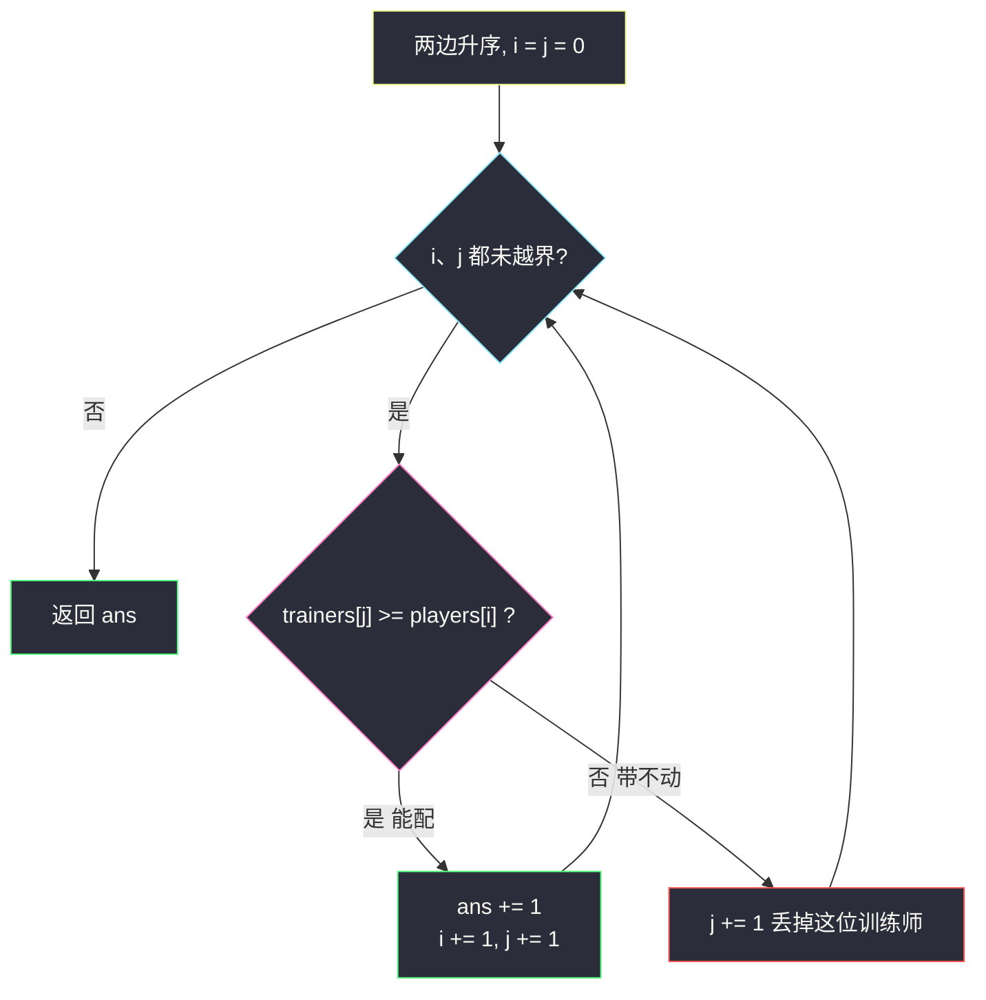
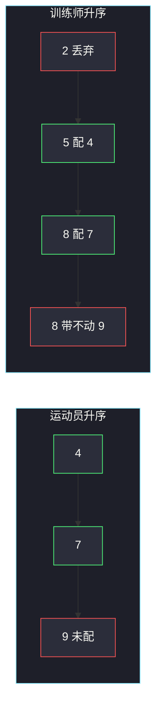

# 运动员和训练师的最大匹配数（双序列配对 · 弱者优先）

## 一、问题描述

给你两个数组 `players`、`trainers`。`players[i]` 是第 `i` 名运动员的能力，`trainers[j]` 是第 `j` 名训练师的训练能力。当且仅当 `players[i] ≤ trainers[j]` 时可以配成一对。每名运动员、每位训练师**最多一对**。求最大配对数。

> 🔗 LeetCode 2410：https://leetcode.cn/problems/maximum-matching-of-players-with-trainers/
>
> 数据范围：`1 ≤ players.length, trainers.length ≤ 10^5`，能力值在 `[1, 10^9]`。
>
> 📚 灵茶题单：**§1.3 双序列配对**（1381 分）。两数组分别排序，双指针从弱到强扫：当前训练师带得动就配当前最弱未配运动员，否则换下一位训练师。

**示例 1**

```
输入：players = [4,7,9], trainers = [8,2,5,8]
输出：2
解释：4 配 8，7 配另一个 8。9 没人带得动。可以证明 2 是最大匹配。
```

**示例 2**

```
输入：players = [1,1,1], trainers = [10]
输出：1
解释：这位训练师能带三个里的任意一个，但每人/师最多一对，答案是 1。
```

**直观理解**

这是二分图匹配的特例：边条件是「能力 ≤ 训练能力」，而且是完全的阈值结构。不必上网络流。把两边都按能力排好，弱运动员优先用「刚好带得动自己的」弱训练师，把强的留给更强的运动员。和「分发饼干」是同一套配对。

---

## 二、暴力解法

对每个运动员，在尚未占用的训练师里找一个能力 ≥ 自己的。为了多配，可以每次给当前运动员找**最小的**还能带他的训练师（多路查找 / 有序表）。朴素写法是：运动员排序后，每个运动员扫一遍训练师数组。

```python
class Solution:
    def matchPlayersAndTrainers(self, players: list[int], trainers: list[int]) -> int:
        players.sort()
        used = [False] * len(trainers)
        ans = 0
        for p in players:
            best = -1
            for j, t in enumerate(trainers):
                if not used[j] and t >= p:
                    if best < 0 or trainers[j] < trainers[best]:
                        best = j
            if best >= 0:
                used[best] = True
                ans += 1
        return ans
```

每个运动员扫全部训练师，`O(n m)`。`n, m ≤ 10^5` 超时。正确性倒是有的：弱运动员先挑「刚好够」的训练师，不会抢强者真正需要的人。

### 🔴 瓶颈在哪里

「每次找最小的可行训练师」在两边都已排序时，可以用**两个指针各走一遍**完成：训练师从弱到强试，带不动当前运动员就换下一个训练师（更弱的以后也带不动，直接丢掉）；带得动就配上，运动员指针右移。不必反复扫描。

---

## 三、优化探索（核心章节）

> 📚 本题在灵茶题单中属于 **§1.3 双序列配对**。标准骨架：两个序列各自排序，`i、j` 从左往右；能配就配、配完双指针都加；不能配就只动「资源」那一侧。

### 3.1 为什么弱运动员优先

假设某个方案里，能力小的运动员 A 没配、能力大的 B 配了训练师 T，且 `A ≤ T`（T 其实也带得动 A）。把 T 改配给 A，B 变成未配。配对数不变。若还有更强的训练师能接 B，配对数甚至变多。所以存在最优解，使得配上的运动员是**最弱的那一批**——能配 k 对，就一定能让最弱的 k 名运动员都配上。

于是：运动员升序，从弱到强依次安排；每个人用当前剩余里**最弱还能带他的**训练师。

### 3.2 双指针怎么走

`players`、`trainers` 都升序。`i` 指向当前最弱未配运动员，`j` 指向当前最弱未用训练师。

- `trainers[j] < players[i]`：这位训练师谁也带不动（后面运动员更强），`j += 1` 丢掉。
- `trainers[j] ≥ players[i]`：配成一对，`ans += 1`，`i += 1`，`j += 1`。
- 某一侧耗尽，结束。



### 3.3 交换论证：不要用强训练师喂弱运动员过头

更精确地说：当前最弱运动员应该拿**刚好够**的最弱可行训练师，而不是留着弱训练师、先用强的。

若最优解里运动员 `p` 配了较强的 `T2`，而更弱的 `T1`（`p ≤ T1 ≤ T2`）配给了更强的 `p'` 或空闲：把 `p` 和 `T1` 配对不会破坏 `p'` 的可行性（`p' ≥ p` 所以 `T2 ≥ T1` 仍可能带 `p'`，或者 `T1` 本来就空闲）。反复交换后，每个运动员都拿到剩余里最弱可行训练师——正是双指针的选择。

反着配会亏：例 1 若 4 去配两个 8 里的一个、7 也要 8，还行；若 9 先抢走 8，4 和 7 只剩 2 和 5，只能再配 1 对，总数从 2 掉到 1。所以**从弱到强**扫运动员是必要的。

### 3.4 一句话核心

> **两边升序；训练师能带当前最弱运动员就配，带不动就换下一个训练师。**

---

## 四、代码实现

### Python（主解：排序 + 双指针）

```python
class Solution:
    def matchPlayersAndTrainers(self, players: list[int], trainers: list[int]) -> int:
        players.sort()
        trainers.sort()
        i = ans = 0
        n = len(players)
        for t in trainers:
            if i < n and t >= players[i]:
                ans += 1
                i += 1
        return ans
```

训练师侧写成 `for t in trainers` 更短：每个训练师最多被看一次，能配就让运动员指针前进。等价的双下标写法：

```python
class Solution:
    def matchPlayersAndTrainers(self, players: list[int], trainers: list[int]) -> int:
        players.sort()
        trainers.sort()
        i = j = ans = 0
        n, m = len(players), len(trainers)
        while i < n and j < m:
            if trainers[j] >= players[i]:
                ans += 1
                i += 1
            j += 1
        return ans
```

第二种无论配不配都 `j += 1`（带不动要丢，带得动也用掉），和第一种完全一致。

第一种把训练师当外层循环，运动员下标只在成功时前进，漏写 `i < n` 会在运动员先耗尽时越界。第二种 `while i < n and j < m` 把两侧耗尽都挡在条件里，面试时更不容易踩空。

**变量含义**

| 写法 | 含义 |
|------|------|
| `i` | 当前最弱还没配的运动员下标 |
| `t` / `trainers[j]` | 当前最弱还没用的训练师 |
| `t >= players[i]` | 阈值条件，能配 |
| `ans` | 已配对数；也等于成功前进的 `i` 次数 |

排序是瓶颈。`n, m ≤ 10^5`，`O(n log n + m log m)` 可通过。

---

## 五、具体例子演示

**示例 1**：`players = [4,7,9]`，`trainers = [8,2,5,8]`。

升序后：`players = [4, 7, 9]`，`trainers = [2, 5, 8, 8]`。`i` 从 0 开始。

| 训练师 t | 当前运动员 players[i] | t ≥ p ? | 动作 | i | ans |
|----------|----------------------|---------|------|---|-----|
| 2 | 4 | 否 | 丢掉训练师 2（连最弱的 4 都带不动） | 0 | 0 |
| 5 | 4 | **是** | 4 配 5 | 1 | 1 |
| 8 | 7 | **是** | 7 配 8 | 2 | 2 |
| 8 | 9 | 否 | 8 < 9，配不上；运动员耗尽前训练师用完 | 2 | 2 |

答案 2，与官方一致。9 确实没人能带：剩下的训练师已经用完，两个 8 都给了更弱的 4 和 7。若把某个 8 留给 9，4 仍可用 5，7 就没人了，仍是 2 对，不会更多。

示意配对过程：



**示例 2**：`players = [1,1,1]`，`trainers = [10]`。

升序不变。`t = 10 ≥ 1`，配 1 对，`i` 变成 1；训练师用完。答案 1。三个相同运动员谁配都一样，上限被训练师个数卡住。

**边界**

- 所有训练师都弱于最弱运动员：`j` 一路加到头，`ans = 0`。
- 所有训练师都强于最强运动员：配对数 = `min(n, m)`，指针会连续成功 `min(n, m)` 次。
- 一边长度为 1：退化为「有没有一个对端能接住这个人」。
- 能力相等：`≤` 包含相等，`t == p` 可以配，不要写成严格 `<`。

对拍官方两例都是 2 和 1。再手算 `[4,7,9]` 配 `[8,2,5,8]`：最大匹配也可以看成「从小到大，每个运动员找第一位还没用且 `≥` 自己的训练师」，与双指针逐步结果相同。

**补一例：训练师刚好卡住中间档。** `players = [1, 3, 5]`，`trainers = [2, 4]`。

| 训练师 t | 当前 p | 能配? | 动作 | ans |
|----------|--------|-------|------|-----|
| 2 | 1 | 是 | 1 配 2 | 1 |
| 4 | 3 | 是 | 3 配 4 | 2 |

5 没人带，答案 2。若 1 去抢 4，3 只剩 2 带不动，只配 1 对——这就是「弱者不用刚好够的人、去用强的」会亏的具体数字。

不变式：扫完若干训练师后，`i` 等于「这些训练师能喂饱的最弱运动员个数」。每个训练师要么丢掉（连当前最弱都带不动），要么让 `i` 加一。所以 `ans` 始终是当前已用训练师集合的最大匹配。

再对拍一组交叉数据：`players = [4, 7]`，`trainers = [5, 3, 8]`。升序后运动员 `[4,7]`、训练师 `[3,5,8]`。3 丢；5 配 4；8 配 7。答案 2。若 7 先拿 8、4 拿 5，对数一样——弱者优先不会更差，差的是「强者先拿、弱者被饿死」那种。

---

## 六、复杂度分析

| 方法 | 时间 | 空间 | 说明 |
|------|------|------|------|
| 每个运动员扫训练师 | `O(n m)` | `O(m)` 占用标记 | `10^5 × 10^5` 不可行 |
| 排序 + 有序集合每次取 lower_bound | `O((n+m) log m)` | `O(m)` | 能过，常数和代码都更重 |
| 排序 + 双指针（主解） | `O(n log n + m log m)` | `O(1)` 额外（不计排序） | 每个元素只看一次 |

若语言的 `sort` 不是原地的，空间按实现算 `O(n + m)`。排序是唯一超线性步骤；指针阶段严格 `O(n + m)`。

---

## 七、对比总结

| 维度 | 本题 | 分发饼干 455 | 救生艇 881 |
|------|------|-------------|------------|
| 两侧 | 运动员 / 训练师 | 小孩 / 饼干 | 两人一船（同一数组） |
| 条件 | `p ≤ t` | `g ≤ s` | 两人重量和 ≤ 限额 |
| 指针 | 能配就双进，不能只进训练师 | 完全同构 | 最重+最轻，两端向中间 |
| 目标 | 最大配对数 | 最大满足小孩数 | 最少船数 |

**易错点**

1. **没排序就双指针**：原数组无序，指针没有「更弱 / 更强」含义。
2. **两边都从强到弱**：强运动员先拿，可能把唯一能带弱者的训练师抢走，例 1 会少配。必须弱者优先（或等价地：训练师从弱到强去「捡」当前最弱运动员）。
3. **写成严格小于**：题目是 `≤`，相等能配。
4. **训练师带不动时却移动运动员**：带不动说明训练师太弱，应换训练师；运动员再弱也是当前最弱，不能跳过他去配后面更强的人（会破坏「最弱 k 个可配」）。
5. **忘记一侧越界**：`i < n` 要写在用 `players[i]` 之前。
6. **只排序一边**：只排运动员、训练师仍乱序，指针「从弱到强」就失效了。

---

## 八、举一反三

| 题目 | 关系 |
|------|------|
| [455. 分发饼干](https://leetcode.cn/problems/assign-cookies/) | §1.3 模板题，代码几乎逐行对应 |
| [881. 救生艇](https://leetcode.cn/problems/boats-to-save-people/) | 同一数组两端配对：最重尽量带最轻 |
| [870. 优势洗牌](https://leetcode.cn/problems/advantage-shuffle/) | 田忌赛马：用刚好更大的牌打对方 |
| [826. 安排工作以达到最大收益](https://leetcode.cn/problems/most-profit-assigning-work/) | 工作难度 / 工人能力双序列，排序后双指针 |
| [2895. 最小处理时间](https://leetcode.cn/problems/minimum-processing-time/)（`minimum-processing-time.md`） | 双数组排序后贪心配对（早空闲配大任务） |

**思想迁移**

- 阈值匹配、两边人数都有上限时：排序 + 双指针往往就是最大匹配，不必写匈牙利。
- 口诀：**「两边排升序；师能带就配当前最弱运动员，带不动就换下一位师。」**

和 [455. 分发饼干](https://leetcode.cn/problems/assign-cookies/) 对照：小孩 = 运动员，饼干 = 训练师，`g ≤ s` 就是 `p ≤ t`。把 455 的代码两处变量名换掉即可提交本题。

官方两例对拍为 2 和 1。未发现任务书推导错误。
