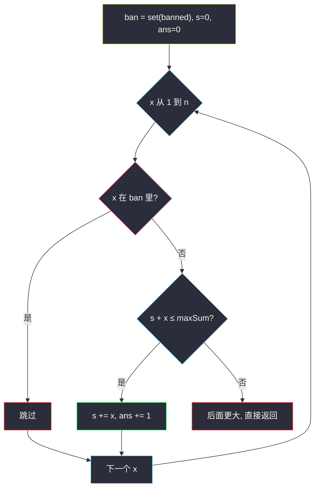
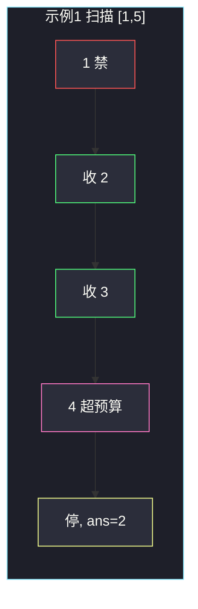

# 从一个范围内选择最多整数 I（从最小开始贪心）

## 一、问题描述

给你整数数组 `banned`、整数 `n` 和整数 `maxSum`。请从区间 `[1, n]` 里选若干**互不相同**的整数，满足：

- 选中的数都不在 `banned` 中；
- 它们的和 ≤ `maxSum`；
- 在此前提下，选的**个数尽量多**。

返回最多能选几个。选不出就返回 0。

> 🔗 LeetCode 2554：https://leetcode.cn/problems/maximum-number-of-integers-to-choose-from-a-range-i/
>
> 数据范围：`1 ≤ banned.length ≤ 10^4`，`1 ≤ banned[i], n ≤ 10^4`，`1 ≤ maxSum ≤ 10^9`。`banned` 可能有重复，也可能出现 `> n` 的数（直接忽略）。
>
> 📚 灵茶题单：**§1.1 从最小/最大开始贪心**（1333 分）。

**示例 1**

```
输入：banned = [1,6,5], n = 5, maxSum = 6
输出：2
解释：[1, n] = [1,2,3,4,5]，去掉 banned 后可用 2,3,4。
选 2 和 3，和为 5 ≤ 6；再加 4 就变成 9 > 6。不能选更多。
```

**示例 2**

```
输入：banned = [1,2,3,4,5,6,7], n = 8, maxSum = 1
输出：0
解释：1 被禁；下一个可用是 8，但 8 > 1，一个都选不成。
```

**示例 3**

```
输入：banned = [11], n = 7, maxSum = 50
输出：7
解释：1+2+…+7 = 28 ≤ 50，11 又不在 [1,7] 里，七个数全选。
```

**直观理解**

个数要最多、总和有上限 → 同样的预算，当然先买便宜的。从 1 往 n 扫，遇见没被禁的就贪心收下，直到再收一个会超 `maxSum`。后面的数更大，更不可能塞进去。

---

## 二、暴力解法

`[1, n]` 去掉 banned 后还剩若干候选。枚举所有子集，找「和 ≤ maxSum」里规模最大的。

```python
class Solution:
    def maxCount(self, banned: list[int], n: int, maxSum: int) -> int:
        ban = set(banned)
        cand = [x for x in range(1, n + 1) if x not in ban]
        m = len(cand)
        best = 0

        def dfs(i: int, s: int, cnt: int) -> None:
            nonlocal best
            if s > maxSum:
                return
            best = max(best, cnt)
            if i == m:
                return
            dfs(i + 1, s + cand[i], cnt + 1)
            dfs(i + 1, s, cnt)

        dfs(0, 0, 0)
        return best
```

子集 `2^m`，`m` 最大约 `10^4`，指数级爆炸。

### 🔴 瓶颈在哪里

「个数最多 + 总和上限」是经典背包外形，但候选已经按 1, 2, 3, … 排好。最优子集一定是**一段从最小可用数开始的前缀**（可能跳过 banned）。不必组合搜索，从左往右收即可。

---

## 三、优化探索（核心章节）

> 📚 本题在灵茶题单中属于 **§1.1 从最小/最大开始贪心**：目标是**个数**而不是和本身，所以从**最小**的合法整数开始拿。

### 3.1 为什么从小的拿最优

设最优集合为 `S`。若 `S` 里有较大的 `y`，却漏掉了某个更小的、没被禁、也没被选的 `x < y`：

- 用 `x` 换掉 `y`：个数不变，和变小，仍合法——这只说明「同样个数可以更省预算」。
- 既然更省，省下的额度有机会再塞一个数，个数可能变多。

所以最优解不会「跳过小的去拿大的」。应按 1, 2, 3, … 的顺序，每个可用数能拿就拿。

反过来说：若当前最小可用数 `x` 都加不进去（`sum + x > maxSum`），那么任何 `z > x` 更加不进去，后面全部放弃。



### 3.2 banned 用哈希集合

每次问「`x` 禁没禁」若线性扫 `banned` 是 `O(n · |banned|)`，最坏 `10^8` 勉强、不干净。先丢进 `set`，询问 `O(1)`。重复的 banned 值集合会自动去重；`> n` 的值留在集合里也无妨，扫 `[1, n]` 时碰不到。

### 3.3 提前停

`maxSum` 最大 `10^9`，而 `1+…+n` 在 `n=10^4` 时只有约 `5×10^7`。预算很宽时会一路拿到 `n`；预算紧时，一旦 `s + x > maxSum` 立刻返回，不必把后面的禁名单再扫一遍。

II 期同题 `n` 到 `10^9`，线性扫 `[1, n]` 会超时，要改成「二分个数 / 数学求前若干可用数的和」。本期 I 的 `n ≤ 10^4`，扫过去就行。

### 3.4 一句话核心

> **banned 进哈希表，从 1 扫到 n，能加且不超预算就加；超了立刻停。**

---

## 四、代码实现

### Python（主解）

```python
class Solution:
    def maxCount(self, banned: list[int], n: int, maxSum: int) -> int:
        ban = set(banned)
        s = 0
        ans = 0
        for x in range(1, n + 1):
            if x in ban:
                continue
            if s + x > maxSum:
                break
            s += x
            ans += 1
        return ans
```

**变量含义**

| 写法 | 含义 |
|------|------|
| `ban` | 禁止选的数，`O(1)` 查询 |
| `s` | 已经选中的数之和 |
| `ans` | 已经选中的个数 |
| `s + x > maxSum` | 当前这个最小可用数都塞不下，结束 |

和不会超过 `maxSum ≤ 10^9`，Python 整数无上限；即便不 `break`，`1+…+n` 也远小于溢出担忧。

### Java（可选）

```java
class Solution {
    public int maxCount(int[] banned, int n, int maxSum) {
        Set<Integer> ban = new HashSet<>();
        for (int x : banned) {
            ban.add(x);
        }
        long s = 0;
        int ans = 0;
        for (int x = 1; x <= n; x++) {
            if (ban.contains(x)) {
                continue;
            }
            if (s + x > maxSum) {
                break;
            }
            s += x;
            ans++;
        }
        return ans;
    }
}
```

累加器用 `long` 更稳妥（`s + x` 与 `maxSum` 比较时避免意外）。本题和有上限，`int` 其实也够。

---

## 五、具体例子演示

**示例 1**：`banned = [1,6,5]`，`n = 5`，`maxSum = 6`。
可用池：`1` 禁、`5` 禁、`6` 超出 `[1,5]` 忽略。

| `x` | 在 ban? | 当前 `s` | `s+x` | 动作 | `ans` |
|-----|---------|----------|-------|------|-------|
| 1 | 是 | 0 | — | 跳过 | 0 |
| 2 | 否 | 0 | 2 ≤ 6 | 收下，`s=2` | 1 |
| 3 | 否 | 2 | 5 ≤ 6 | 收下，`s=5` | 2 |
| 4 | 否 | 5 | 9 > 6 | **停** | 2 |
| 5 | （不必看） | | | | 2 |

选中 `{2,3}`，和 5。若改拿 `{2,4}` 和也是 6、仍是 2 个；拿 `{4}` 只有 1 个。贪心从小到大得到最大个数 2。



**示例 2**：`banned = [1,2,3,4,5,6,7]`，`n = 8`，`maxSum = 1`。

| `x` | 动作 |
|-----|------|
| 1…7 | 全在 ban，跳过 |
| 8 | `0+8 > 1`，停，`ans = 0` |

**示例 3**：`banned = [11]`，`n = 7`，`maxSum = 50`。
11 不在范围内。`1+2+…+7 = 28 ≤ 50`，七步全收，`ans = 7`。

**再走一轮「预算卡在中间」**：`banned = []`，`n = 10`，`maxSum = 10`。
收 1,2,3（和 6），下一个 4 → 10，收下，`ans = 4`；下一个 5 → 15 > 10，停。`1+2+3+4=10` 正好用满。

---

## 六、复杂度分析

| 方法 | 时间 | 空间 | 说明 |
|------|------|------|------|
| 枚举子集 | `O(2^n)` | `O(n)` | 不可用 |
| 哈希 + 从 1 扫到 n（主解） | `O(n + \|banned\|)` | `O(\|banned\|)` | `n、\|banned\| ≤ 10^4` |

---

## 七、对比总结

| 维度 | 本题（个数最多） | [3075. 幸福值最大化](https://leetcode.cn/problems/maximize-happiness-of-selected-children/) |
|------|------------------|------------------------------------------------------------------|
| 目标 | 个数 | 加权和 |
| 贪心方向 | 从**最小**合法数开始 | 从**最大**幸福值开始 |
| 停的信号 | 再加就超 `maxSum` | 贡献减到 ≤ 0，或选满 k 个 |

**易错点**

1. **banned 里的数大于 n**：不要据此提前结束扫描，只忽略即可。
2. **没去重 / 每次线性查 banned**：重复值和 `O(n·m)` 查询都是坑，用 `set`。
3. **先把大的拿了再凑**：个数会变少。例如示例 1 若先拿 4，预算只剩 2，还能拿 2，仍是 2 个；若先拿更大的可能直接只剩 1 个。
4. **超了还不 `break`**：正确性还在（后面加会继续超，只要你 `continue` 而不 `add`），但属于浪费；更糟的是写成「超了就跳过当前、继续看后面更小的」——后面没有更小的。
5. **和 II 期搞混**：I 期 `n ≤ 10^4` 线性扫；II 期 `n` 到 `10^9` 必须数学 / 二分。

---

## 八、举一反三

| 题目 | 关系 |
|------|------|
| [2557. 从一个范围内选择最多整数 II](https://leetcode.cn/problems/maximum-number-of-integers-to-choose-from-a-range-ii/) | 同题升级：`n` 巨大，贪心思想不变，实现改成二分 |
| [2126. 摧毁小行星](https://leetcode.cn/problems/destroying-asteroids/) | 同节 §1.1：也是从小的开始处理 |
| [3075. 幸福值最大化的选择方案](https://leetcode.cn/problems/maximize-happiness-of-selected-children/) | 同节反面：从最大开始 |
| [2834. 找出美丽数组的最小和](https://leetcode.cn/problems/find-the-minimum-possible-sum-of-a-beautiful-array/) | 也是从 1 起贪心填数，避开一类禁配对 |
| [2829. k-avoiding 数组的最小和](https://leetcode.cn/problems/determine-the-minimum-sum-of-a-k-avoiding-array/) | 同样「从小填、跳过冲突」 |

**思想迁移**

- 约束是「个数 + 总和上限」→ 从小到大；约束是「和最大 + 个数固定」→ 从大到小。
- 口诀：**「禁表一哈希，从 1 往上加，加爆就收工。」**
