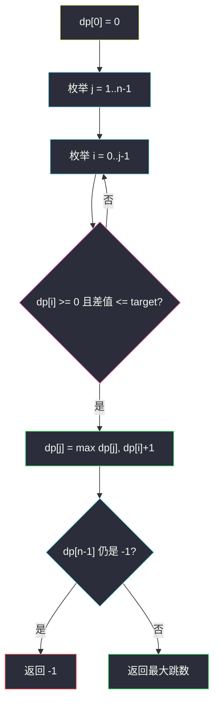
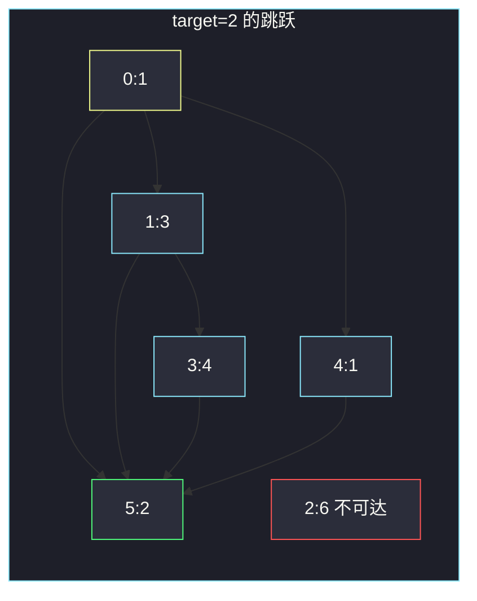

# 达到末尾下标所需的最大跳跃次数（`O(n²)` 最长路）

## 一、问题描述

下标从 0 开始的数组 `nums`，从下标 0 出发，目标是下标 `n-1`。从 `i` 跳到 `j`（必须 `j > i`）当且仅当 `|nums[i] - nums[j]| ≤ target`。一次跳跃算 1 次。求到达末尾的**最大跳跃次数**；到不了返回 `-1`。

> 🔗 LeetCode 2770：https://leetcode.cn/problems/maximum-number-of-jumps-to-reach-the-last-index/
>
> 数据范围：`2 ≤ n ≤ 1000`，`-10^9 ≤ nums[i] ≤ 10^9`，`0 ≤ target ≤ 2·10^9`。
>
> 📚 灵茶题单：**§11.4 树状数组 / 线段树优化 DP**。本质是 DAG 上求 0 到 n-1 的最长路。`n=1000`，主解写双重循环 `dp[j] = max(dp[i]) + 1` 即可。值域上用线段树查 `[nums[j]-target, nums[j]+target]` 的历史最大 `dp`，是同一转移的 `O(n log U)` 加速，本节进阶提一下即可。

**示例 1**

```
输入：nums = [1,3,6,4,1,2], target = 2
输出：3
解释：0 → 1 → 3 → 5，三跳。
```

**示例 2**

```
输入：nums = [1,3,6,4,1,2], target = 3
输出：5
解释：沿下标 0,1,2,3,4,5 连跳，五跳。
```

**示例 3**

```
输入：nums = [1,3,6,4,1,2], target = 0
输出：-1
解释：只有相等才能跳。0 能到下标 4（两个 1），但从 4 到 5 差 1，到不了末尾。
```

**直观理解**

边的方向只能向右，图是 DAG，不会有环。要求的是**跳得尽量多次**，不是最少跳。到不了必须返回 `-1`，不要把「停在起点 0 跳」当成答案。

---

## 二、暴力解法

从 0 做 DFS / BFS，枚举所有向右且差值合法的跳，记录到达 `n-1` 的最大边数。

```python
class Solution:
    def maximumJumps(self, nums: list[int], target: int) -> int:
        n = len(nums)
        ans = -1

        def dfs(i: int, steps: int) -> None:
            nonlocal ans
            if i == n - 1:
                ans = max(ans, steps)
                return
            for j in range(i + 1, n):
                if abs(nums[i] - nums[j]) <= target:
                    dfs(j, steps + 1)

        dfs(0, 0)
        return ans
```

官方三例都能过。同一 `i` 会被不同路径反复搜到，最坏接近指数。`n=1000` 不可用。

### 🔴 瓶颈在哪里

到达 `i` 的最大跳数与「怎么来的」无关，只保留 `dp[i]` 即可。每个有序对 `(i,j)` 检查一次边，`O(n²)` 对 `n=1000` 足够。

---

## 三、优化探索（核心章节）

> 📚 本题挂在灵茶 **§11.4 树状数组 / 线段树优化 DP**，是因为转移长成「在之前所有值落在区间里的 `dp` 里取 max」。`n=1000` 不必上树：两重循环枚举 `i < j` 就是在扫这个区间。

### 3.1 状态

`dp[j]` = 从 0 跳到 `j` 的最大跳跃次数；到不了则为 `-1`。

- `dp[0] = 0`（还没跳，人已经在 0）。
- 对其余 `j`：`dp[j] = max { dp[i] + 1 | i < j, dp[i] ≥ 0, |nums[i]-nums[j]| ≤ target }`；没有这样的 `i` 则保持 `-1`。

答案 `dp[n-1]`。

`dp[0] = 0` 只描述起点，**不是**「到不了时返回 0」。`n ≥ 2`，必须真的跳到末尾。



### 3.2 和「最少跳跃」的差别

[45. 跳跃游戏 II](https://leetcode.cn/problems/jump-game-ii/) 要最少次。本题边权都是 1，但目标是最长路，转移用 `max` 不是 `min`，不可达用 `-1` 而不是一个大数。

### 3.3 线段树进阶（不必写进主解）

从左到右处理 `j`。把 `nums` 离散化后，线段树下标是值，存该值上历史最大 `dp`。查询值域 `[nums[j]-target, nums[j]+target]` 的 max，再把 `dp[j]` 点更新进去。时间 `O(n log n)`。`n=1000` 属于杀鸡用牛刀；值域到 `10^9` 时才值得上树。

### 3.4 一句话核心

> **向右 DAG 求最长路；不可达保持 -1；n=1000 双重循环即可。**

---

## 四、代码实现

### Python（主解：`O(n²)` DP）

```python
class Solution:
    def maximumJumps(self, nums: list[int], target: int) -> int:
        n = len(nums)
        # dp[j] = 到达 j 的最大跳跃次数；-1 表示到不了
        dp = [-1] * n
        dp[0] = 0
        for j in range(1, n):
            for i in range(j):
                if dp[i] >= 0 and abs(nums[i] - nums[j]) <= target:
                    dp[j] = max(dp[j], dp[i] + 1)
        return dp[-1]
```

**变量含义**

| 写法 | 含义 |
|------|------|
| `dp[0] = 0` | 起点，零次跳跃 |
| `dp[i] >= 0` | `i` 可达，才能作为跳板 |
| `dp[i] + 1` | 多跳一步到 `j` |

### Java（最优解）

```java
class Solution {
    public int maximumJumps(int[] nums, int target) {
        int n = nums.length;
        int[] dp = new int[n];
        java.util.Arrays.fill(dp, -1);
        dp[0] = 0;
        for (int j = 1; j < n; j++) {
            for (int i = 0; i < j; i++) {
                if (dp[i] >= 0 && Math.abs((long) nums[i] - nums[j]) <= target) {
                    dp[j] = Math.max(dp[j], dp[i] + 1);
                }
            }
        }
        return dp[n - 1];
    }
}
```

`nums[i]` 与 `target` 都可能到 `10^9` 量级，差值用 `long` 更稳（本题绝对值 ≤ `2·10^9`，`int` 的 `Math.abs` 在 `Integer.MIN_VALUE` 才有坑，这里 `nums` 下界是 `-10^9`，一般没问题）。

---

## 五、具体例子演示

### 5.1 官方示例 1：`target=2` → 3

`nums = [1,3,6,4,1,2]`，下标 `0..5`。

合法边（差值 ≤ 2）：

| 从 i | 可到的 j |
|------|----------|
| 0 (1) | 1, 4, 5 |
| 1 (3) | 3, 5 |
| 2 (6) | 3 |
| 3 (4) | 5 |
| 4 (1) | 5 |

逐步填 `dp`（不可达保持 -1）：

| j | 能从哪些 i 来 | dp[j] |
|---|----------------|-------|
| 0 | — | 0 |
| 1 | 0 | 1 |
| 2 | 无人（\|1-6\|、\|3-6\| 都 > 2） | **-1** |
| 3 | 1（dp=1） | 2 |
| 4 | 0（dp=0） | 1 |
| 5 | 0→1；1→2；3→3；4→2 | **3** |

下标 2 整段废掉，不影响。最长路 `0→1→3→5`，3 跳。对拍官方。



### 5.2 官方示例 2：`target=3` → 5

相邻下标差值分别为 2,3,2,3,1，全部 ≤ 3，可以 `0→1→2→3→4→5`，恰好 `n-1=5` 跳。对拍官方。

### 5.3 官方示例 3：`target=0` → -1

只能跳到值相等的格子。`1` 出现在 0 和 4，`dp[4]=1`，其余非 1 的格子从 0 出发都到不了。`dp[5]`：`|1-2|=1>0`，仍是 `-1`。对拍官方。这里若误把 `dp[0]=0` 当答案，会错成 0。

---

## 六、复杂度分析

| 方法 | 时间 | 空间 | 说明 |
|------|------|------|------|
| DFS 不记忆化 | 指数 | `O(n)` 栈 | 超时 |
| 双重循环 DP（主解） | `O(n²)` | `O(n)` | `n ≤ 1000` |
| 线段树优化 | `O(n log n)` | `O(n)` | 值域离散化后查询区间 max |

---

## 七、对比总结

| 维度 | 最少跳跃（45） | 本题 |
|------|----------------|------|
| 目标 | 最短路 | 最长路 |
| 转移 | min | max |
| 不可达 | 题目保证可达或另说 | 必须返回 `-1` |
| 边条件 | 步长限制 | 数值差 ≤ target |

**易错点**

1. **到不了返回 0**：起点的 0 不是答案。
2. **`dp` 初值全 0**：会把不可达的 `i` 当成跳板，凭空多跳。
3. **允许 `j < i`**：只能向右。
4. **把下标 2 不可达当成整题无解**：后面的格子仍可能从更早的 `i` 直接跳过来。
5. **求最少跳**：读题是 maximum number of jumps。

---

## 八、举一反三

| 题目 | 关系 |
|------|------|
| [45. 跳跃游戏 II](https://leetcode.cn/problems/jump-game-ii/) | 最少跳；贪心 / BFS |
| [1340. 跳跃游戏 V](https://leetcode.cn/problems/jump-game-v/) | 带高度限制的最长跳，记忆化 DFS |
| [2407. 最长递增子序列 II](https://leetcode.cn/problems/longest-increasing-subsequence-ii/) | 区间 max 的线段树优化 DP，正是 §11.4 的典型 |
| [1696. 跳跃游戏 VI](https://leetcode.cn/problems/jump-game-vi/) | 窗口内 max，单调队列 |
| [975. 奇偶跳](https://leetcode.cn/problems/odd-even-jump/) | 向右跳但规则按奇偶轮换 |

**思想迁移**

- 向右、无环 → 按下标 DP；转移是「历史一段的 max」→ `n` 小双重循环，`n` 大上树 / 单调队列。
- 口诀：**「dp[0]=0 只是起点；不可达钉死 -1；向右取 max+1。」**
