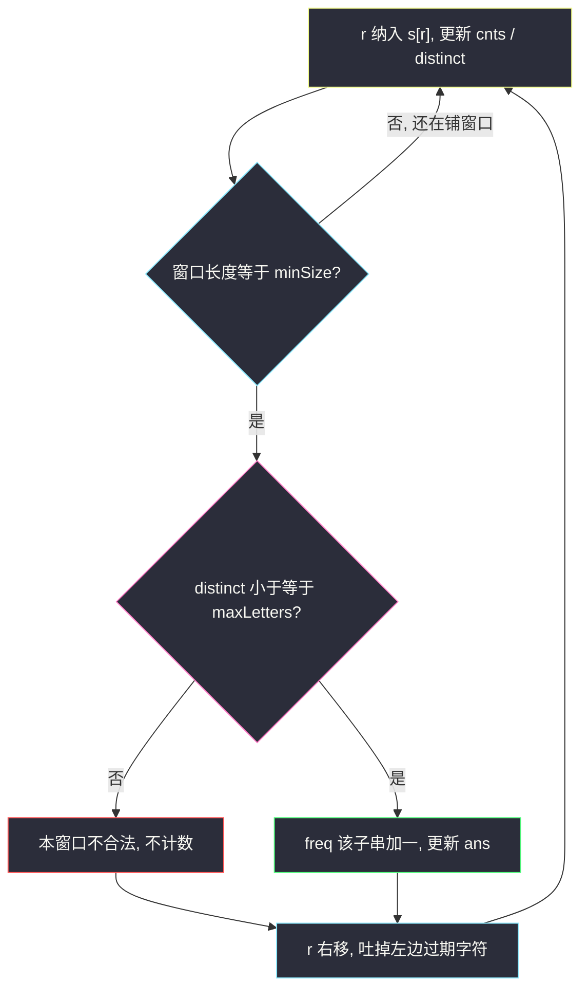
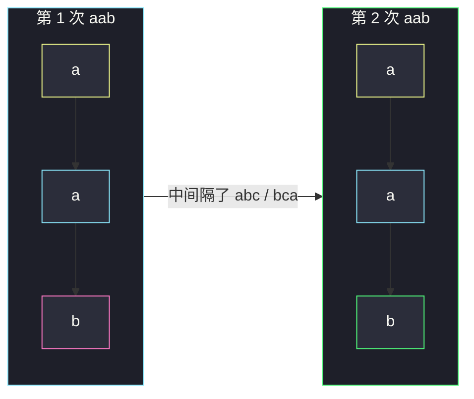

# 子串的最大出现次数（只需枚举 minSize）

## 一、问题描述

给字符串 `s` 和三个整数 `maxLetters`、`minSize`、`maxSize`。统计所有满足下面两条的子串，返回其中**出现次数的最大值**（可重叠；没有任何合法子串则返回 0）：

1. 子串里不同字母个数 ≤ `maxLetters`
2. 长度在 `[minSize, maxSize]` 内

> 🔗 LeetCode 1297：https://leetcode.cn/problems/maximum-number-of-occurrences-of-a-substring/
>
> 数据范围：`1 ≤ s.length ≤ 10^5`，`1 ≤ maxLetters ≤ 26`，`1 ≤ minSize ≤ maxSize ≤ min(26, n)`，`s` 只含小写字母。
>
> 📚 灵茶题单：**§4 字符串哈希**。定长窗口计数；真正的切入点是「更长子串的出现次数不会超过它内部长为 minSize 的子串」，因此 **maxSize 可以忽略**。

**示例 1**

```
输入：s = "aababcaab", maxLetters = 2, minSize = 3, maxSize = 4
输出：2
解释："aab" 长度为 3、两种字母，在 s 中出现 2 次（可重叠规则下的两次起点）。
```

**示例 2**

```
输入：s = "aaaa", maxLetters = 1, minSize = 3, maxSize = 3
输出：2
解释："aaa" 出现 2 次（起点 0 和 1），允许重叠。
```

**直观理解**

合法子串很多：长度可以从 `minSize` 到 `maxSize`，还要卡不同字母数。但问的是「某一个具体子串出现了多少次」的最大值，不是「有多少个合法子串」。短的更容易重复；把所有合法长度都枚举一遍，短的那一档已经把最大值拿走了。

---

## 二、暴力解法

枚举所有 `minSize ≤ 长度 ≤ maxSize` 的子串，不同字母数合法就丢进 Counter，最后取最大频次。

```python
from collections import Counter

class Solution:
    def maxFreq(self, s: str, maxLetters: int, minSize: int, maxSize: int) -> int:
        n = len(s)
        freq = Counter()
        for i in range(n):
            for L in range(minSize, maxSize + 1):
                if i + L > n:
                    break
                sub = s[i : i + L]
                if len(set(sub)) <= maxLetters:
                    freq[sub] += 1
        return max(freq.values()) if freq else 0
```

本题 `maxSize ≤ 26`，这一档暴力大约 `O(n × 26 × 26)`，评测机能过。但它完全没碰到题眼：`maxSize` 是干扰参数。

### 🔴 瓶颈在哪里

`n = 10^5` 时若 `maxSize` 没被卡到 26，双重枚举会炸。即使能过，也该问：答案会不会出现在某个更长的串上？——不会。证明见下一章，证明完主循环只剩一层：长度恰好 `minSize`。

---

## 三、优化探索（核心章节）

> 📚 本题在灵茶题单中属于 **§4 字符串哈希**。窗口指纹可以用字符串当 key，也可以滚动哈希；先把「只枚举 minSize」想清楚，哈希只是计数工具。

### 3.1 为什么更长的不会更勤

设 `T` 是一段长度 `L > minSize` 的合法子串，出现了 `k` 次（`k` 个起点）。那么 `T` 内部任意一段长为 `minSize` 的连续子串 `T'`：

- 在这 `k` 个起点处，`T'` 同样出现一次，所以 `T'` 的出现次数 ≥ `k`
- `T'` 的不同字母集合是 `T` 的子集，所以也满足 `maxLetters`

因此：任何合法长串的频次，都被它内部某个长为 `minSize` 的合法短串「盖住」。全局最大值一定可以在**长度恰好为 minSize** 的窗口上取到。`maxSize` 只出现在函数签名里，算法不用它。

对拍确认：示例 1 长度 4 的串（`aaba`、`abab`、…）各出现 1 次，短串 `"aab"` 出现 2 次，最大值在 minSize 上。示例 2 的 `maxSize = minSize`，无争议。额外用全长度暴力对拍 `"aabcabcab"`（官方旧第三例，答案 3）以及 `"abcde"`（答案 0），与只枚举 minSize 一致。

### 3.2 定长窗口 + 26 桶

左程云定长骨架：右端 `r` 纳入，窗口超过 `minSize` 就吐左，再更新。

- `cnts[26]`：窗口内各字母次数
- `distinct`：次数从 0→1 加一，从 1→0 减一
- `freq`：只对 `distinct ≤ maxLetters` 的窗口字符串 +1，维护 `ans`



字符串当 key 足够：`minSize ≤ 26`，切片便宜。若要对齐 §4 的滚动哈希，用 `base = 26` 维护窗口整数，`freq` 改成以哈希为键——本题没有强制。

### 3.3 一句话核心

> **合法长串的出现次数 ≤ 它内部 minSize 子串的出现次数，所以只滑长度为 minSize 的窗口。**

---

## 四、代码实现

### Python（主解：定长 minSize + Counter）

```python
from collections import Counter

class Solution:
    def maxFreq(self, s: str, maxLetters: int, minSize: int, maxSize: int) -> int:
        n = len(s)
        cnts = [0] * 26
        distinct = 0
        freq = Counter()
        ans = 0
        for r in range(n):
            x = ord(s[r]) - 97
            cnts[x] += 1
            if cnts[x] == 1:
                distinct += 1
            l = r - minSize + 1
            if l > 0:
                y = ord(s[l - 1]) - 97
                cnts[y] -= 1
                if cnts[y] == 0:
                    distinct -= 1
            if l >= 0 and distinct <= maxLetters:
                sub = s[l : r + 1]
                freq[sub] += 1
                if freq[sub] > ans:
                    ans = freq[sub]
        return ans
```

`maxSize` 故意不使用，避免被签名带着去枚举第二维。`l` 是窗口左端：`r` 走到 `minSize - 1` 时第一次满窗。

**变量含义**

| 写法 | 含义 |
|------|------|
| `cnts[x]` | 窗口内字母 `x` 的出现次数 |
| `distinct` | 窗口内不同字母个数 |
| `l, r` | 当前定长窗口两端 |
| `freq` | 合法 minSize 子串 → 出现次数 |
| `maxSize` | 干扰项，不参与计算 |

---

## 五、具体例子演示

**示例 1**：`s = "aababcaab"`，`maxLetters = 2`，`minSize = 3`，`maxSize = 4`。只看长度 3 的窗口，逐步跟踪 `l / r / 窗口 / distinct / freq`：

| r | 纳入 | 吐出 | 窗口 | distinct | 合法？ | 该串频次 | ans |
|---|------|------|------|----------|--------|----------|-----|
| 0 | a | — | （未满） | 1 | — | — | 0 |
| 1 | a | — | （未满） | 1 | — | — | 0 |
| 2 | b | — | `aab` `[0,2]` | 2 | 是 | aab=1 | 1 |
| 3 | a | a | `aba` `[1,3]` | 2 | 是 | aba=1 | 1 |
| 4 | b | a | `bab` `[2,4]` | 2 | 是 | bab=1 | 1 |
| 5 | c | b | `abc` `[3,5]` | 3 | **否** | — | 1 |
| 6 | a | a | `bca` `[4,6]` | 3 | **否** | — | 1 |
| 7 | a | b | `caa` `[5,7]` | 2 | 是 | caa=1 | 1 |
| 8 | b | c | `aab` `[6,8]` | 2 | 是 | **aab=2** | **2** |

`"aab"` 出现在起点 0 与 6。长度 4 的 `"aaba"` 等各自最多 1 次，盖不过 2。对拍官方输出 2。



粉/绿节点是窗口末尾的 `b`：两次相同 3-mer 把 ans 推到 2。中间 `abc`、`bca` 因 3 种字母被红叉掉（上表）。

**示例 2**：`s = "aaaa"`，`maxLetters = 1`，`minSize = 3`。

| 窗口 | 串 | distinct | freq |
|------|-----|----------|------|
| `[0,2]` | aaa | 1 | 1 |
| `[1,3]` | aaa | 1 | 2 |

重叠允许，答案 2。对拍官方。

**边界**：`s = "abcde"`，`maxLetters = 2`，`minSize = 3` → 每个长度 3 的窗口都是 3 种字母，`freq` 为空，返回 0。没有任何合法子串时不要对空 Counter 取 max。

---

## 六、复杂度分析

| 方法 | 时间 | 空间 | 说明 |
|------|------|------|------|
| 枚举全部合法长度 | `O(n · maxSize · minSize)` | `O(n · maxSize)` | 范围卡了 26，能过但没洞察 |
| 只滑 minSize（主解） | `O(n · minSize)` | `O(n · minSize)` | 切片/哈希 key 的代价；26 桶维护 distinct 是 `O(1)` 额外 |

`minSize ≤ 26`，主解实际就是线性乘一个很小的常数。空间来自 Counter 里最多 `n` 个不同窗口串。

---

## 七、对比总结

| 维度 | 枚举所有长度 | 只枚举 minSize |
|------|--------------|----------------|
| 正确性 | 对 | 对（长串频次被短串支配） |
| `maxSize` | 用到 | 不用 |
| 与 187 的关系 | 都是定长计数 | 187 长度锁死为 10；本题长度「看起来」是区间 |

**易错点**

1. **真去枚举 `[minSize, maxSize]`**：能过，但面试要讲清为什么可以丢掉 maxSize。
2. **不同字母用 `set(切片)` 却忘了窗口滚动**：每次 `O(minSize)` 建 set 能过；26 桶可以 `O(1)` 维护。
3. **不允许重叠**：题目允许，`"aaaa"` 里 `"aaa"` 是 2 次不是 1 次。
4. **空答案返回 None / 抛异常**：没有合法窗口时是 0。
5. **把「合法子串个数」当成答案**：问的是某一个子串的最大频次。

---

## 八、举一反三

| 题目 | 关系 |
|------|------|
| [187. 重复的 DNA 序列](https://leetcode.cn/problems/repeated-dna-sequences/) | 同属 §4：定长窗口，第二次出现即记录；本题要最大频次 |
| [3. 无重复字符的最长子串](https://leetcode.cn/problems/longest-substring-without-repeating-characters/) | 同样用 `cnts` + distinct，但是变长求最长 |
| [904. 水果成篮](https://leetcode.cn/problems/fruit-into-baskets/) | 窗口内不同种类 ≤ 2，求最长而不是频次 |
| [2461. 长度为 K 子数组中的最大和](https://leetcode.cn/problems/maximum-sum-of-distinct-subarrays-with-length-k/) | 定长 + 窗口内元素互不相同 |
| [992. K 个不同整数的子数组](https://leetcode.cn/problems/subarrays-with-k-different-integers/) | 同样盯窗口内不同个数，问的是子数组个数 |

**思想迁移**

- 出现次数随长度增加单调不增（就「某个具体串 vs 它的子串」而言）；求最大频次往最短合法长度靠。
- 口诀：**「maxSize 是诱饵；只滑 minSize，26 桶盯不同字母。」**
