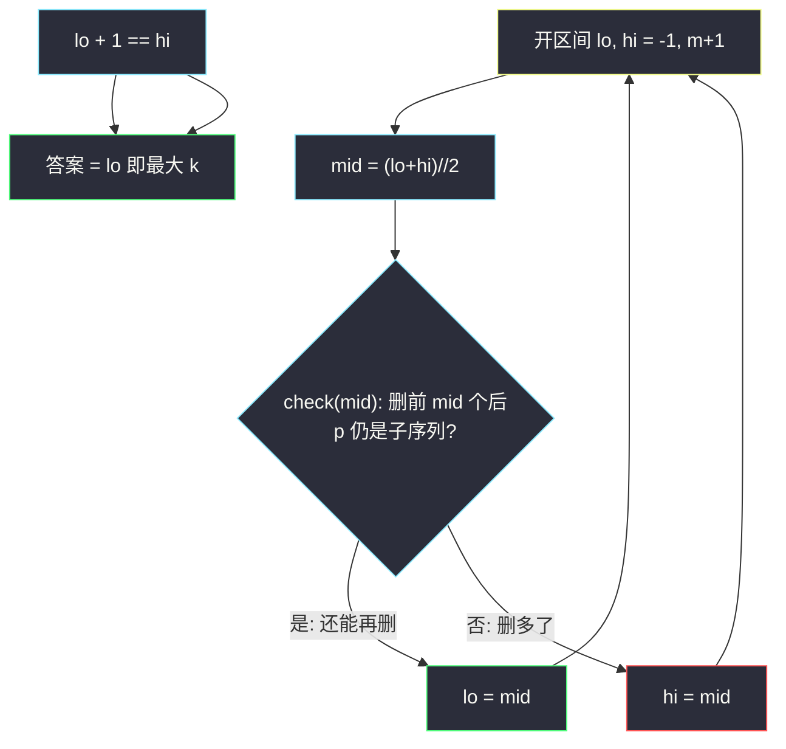
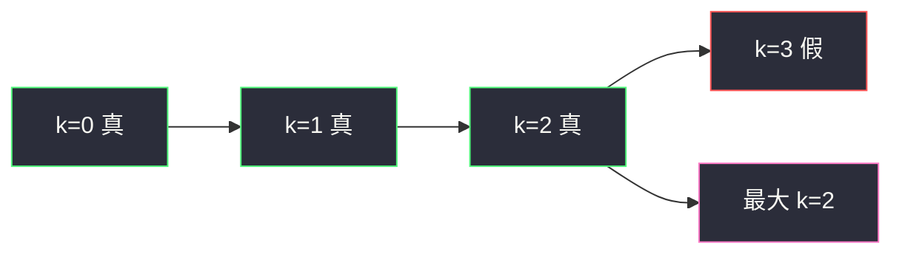

# 可移除字符的最大数目（二分最大 k + 子序列 check）

## 一、问题描述

给你字符串 `s`、`p`（`p` 是 `s` 的**子序列**），以及整数数组 `removable`：其中下标互不相同，表示可以从 `s` 里删掉的位置。

按顺序操作：先删 `s[removable[0]]`，再删 `s[removable[1]]`……求最大的 `k`，使得删掉 **前 k 个** 下标之后，`p` **仍然是**剩下字符串的子序列。`k` 可以为 0（一个都不删）。

> 🔗 LeetCode 1898：https://leetcode.cn/problems/maximum-number-of-removable-characters/
>
> 数据范围：`1 <= p.length <= s.length <= 10^5`，`1 <= removable.length <= s.length`，`removable` 下标互不相同且合法。`s`、`p` 只含小写字母。

**示例 1**

```
输入：s = "abcacb", p = "ab", removable = [3,1,0]
输出：2
解释：删 removable[0]=3 → "abc_cb"，ab 仍是子序列；
      再删 1 → "a_c_cb"，ab 仍在；
      再删 0 → "_c_cb"，没有 a。最大 k=2。
```

**示例 2**

```
输入：s = "abcbddddd", p = "abcd", removable = [3,2,1,4,5,6]
输出：1
解释：只删下标 3 后 "abcddddd" 仍含 abcd；再删下标 2 后缺 c。
```

**示例 3**

```
输入：s = "abcab", p = "abc", removable = [0,1,2,3,4]
输出：0
解释：删掉第一个下标 0 后 "bcab" 无法匹配 abc。
```

**直观理解**

`removable` 是一条「必须按前缀删」的名单：能删前 5 个，就一定能删前 4 个（少删只会使 `s` 更长、子序列更容易保留）。所以「前 k 个删完后 p 仍是子序列」对 k 是**单调的**：真值长成 `true, true, …, true, false, false`。要最大的那个 true，标准「二分答案 + check」。

---

## 二、暴力解法

从大到小试 k，或从 0 加到 m，每次真的构造删除后的字符串，再双指针判断子序列。

```python
class Solution:
    def maximumRemovals(self, s: str, p: str, removable: List[int]) -> int:
        def still_subseq(k: int) -> bool:
            dead = set(removable[:k])
            i = 0
            for j, ch in enumerate(s):
                if j in dead:
                    continue
                if i < len(p) and ch == p[i]:
                    i += 1
            return i == len(p)

        ans = 0
        for k in range(len(removable) + 1):
            if still_subseq(k):
                ans = k
            else:
                break
        return ans
```

### 复杂度

- **时间**：最坏 `O(m · n)`，每次 check 扫 `s`，最多 m+1 次。`n, m ≤ 10^5` 时约 `10¹⁰`，超时。
- **空间**：`O(k)` 的 set（可改成布尔数组 `O(n)`）。

### 🔴 瓶颈在哪里

相邻的 k 与 k+1 只差一个删除位置，但单调性已经保证：不必从 0 扫到 m。在 `[0, m]` 上二分 k，check 次数从 `m` 降到 `log m`。每次 check 仍要 `O(n)` 扫 `s`（外加标记 `O(k)`），总体 `O(n log m)`。

---

## 三、优化探索（核心章节）

> 📚 本题在灵茶题单中属于 **04-二分查找 · §2.2 求最大**。与同批峰值题一样，二分**全程开区间**。

### 3.1 check 单调性（必须写清）

令 `check(k)` = 「删除 `removable[0..k-1]` 后，p 仍是 s 的子序列」。

- `k` 越大，删得越多，剩下的字符越少，子序列只可能从「能」变成「不能」，不会反过来。
- 因此存在分界：`0 .. k*` 为 true，`k*+1 .. m` 为 false（或全程 true）。
- 要求的最大 k 就是最后一个 true。这是 §2.2 的标准形态，**不是**「最小的满足某条件的 k」。

`k = 0`：题目保证 p 原本就是子序列，`check(0)` 恒真，答案至少 0。

### 3.2 开区间怎么收「最后一个 true」

k 的取值是 `0, 1, …, m`（m 个下标全删完）。开区间 `(lo, hi)` 取 `lo, hi = -1, m+1`：

- `check(mid)` 为真：mid 还能更大，`lo = mid`；
- 为假：`hi = mid`。

结束时 `lo + 1 == hi`，`lo` 是最后一个 true，`hi` 是第一个 false（或 `m+1` 表示全真）。返回 `lo`。

不要和「求最小」搞反：求最小时 check 为真应收 `hi`。本题求最大，真应收 `lo`。



### 3.3 check 怎么写：标记 + 双指针

不要每次真去拼接新字符串（`O(n)` 构造 + 额外内存）。用长度为 `n` 的布尔数组 `removed`：把 `removable[0..k-1]` 标成 True，然后在 `s` 上扫：

```
i = 0  # 正在匹配 p[i]
对 s[j]：若未删除且 s[j]==p[i]，则 i += 1
return i == len(p)
```

这就是判断「p 是否为子序列」的双指针，遇到删除位直接跳过。`removed` 每次 check 重建，或先全 False 再标 k 个、check 完不必清（下轮重新分配即可）。

### 3.4 为什么不能贪心「尽量删」而不二分

`removable` 的顺序是题目给定的，不能挑选「删哪个对 p 伤害小」——必须删**前缀**。所以决策空间就是一条链上的 k，没有更优的组合搜索。二分正好卡在这条链的分界上。

### 3.5 一句话核心

> **k 越大越难保留子序列，check 单调。开区间二分最大 k；check 里标记前 k 个下标，再双指针扫 s 匹配 p。**

---

## 四、代码实现

### Python（主解：二分最大 k）

```python
class Solution:
    def maximumRemovals(self, s: str, p: str, removable: List[int]) -> int:
        n, m = len(s), len(removable)

        def check(k: int) -> bool:
            removed = [False] * n
            for idx in removable[:k]:
                removed[idx] = True
            i = 0
            for j, ch in enumerate(s):
                if removed[j]:
                    continue
                if i < len(p) and ch == p[i]:
                    i += 1
            return i == len(p)

        lo, hi = -1, m + 1                 # 开区间，k ∈ [0, m]
        while lo + 1 < hi:
            mid = (lo + hi) // 2
            if check(mid):
                lo = mid                   # 求最大：真则往右
            else:
                hi = mid
        return lo
```

**变量含义**

| 变量 | 含义 |
|------|------|
| `lo`, `hi` | 开区间两端；结束时 `lo` 为最大可行 k |
| `mid` | 尝试删除前 `mid` 个 `removable` |
| `removed[j]` | 本轮 check 中 `s[j]` 是否被删 |
| `i` | 已匹配的 p 前缀长度 |

**循环不变量**：`(lo, hi)` 里 `lo` 侧（含 `lo`）均可行，`hi` 侧（含 `hi`）均不可行；`check(lo)` 为真（`lo=-1` 时不调用，语义上「删 -1 个」不出现）。

### Java（最优解同款）

```java
class Solution {
    public int maximumRemovals(String s, String p, int[] removable) {
        int n = s.length(), m = removable.length;
        int lo = -1, hi = m + 1;
        while (lo + 1 < hi) {
            int mid = lo + (hi - lo) / 2;
            if (check(s, p, removable, mid)) lo = mid;
            else hi = mid;
        }
        return lo;
    }

    private boolean check(String s, String p, int[] removable, int k) {
        int n = s.length();
        boolean[] removed = new boolean[n];
        for (int i = 0; i < k; i++) removed[removable[i]] = true;
        int i = 0;
        for (int j = 0; j < n && i < p.length(); j++) {
            if (removed[j]) continue;
            if (s.charAt(j) == p.charAt(i)) i++;
        }
        return i == p.length();
    }
}
```

---

## 五、具体例子演示

以示例 1：`s = "abcacb"`，`p = "ab"`，`removable = [3,1,0]`，`m = 3`。开区间 `(-1, 4)`。

先单独看每个 k 的 check（标记删除后的 s，`.` 表示已删）：

| k | 删除下标 | 剩下 | 匹配 ab？ |
|---|----------|------|-----------|
| 0 | 无 | abcacb | 是（a,b 用前两个） |
| 1 | 3 | abc.cb | 是 |
| 2 | 3,1 | a.c.cb | 是（a 在 0，b 在 5） |
| 3 | 3,1,0 | ..c.cb | 否（没有 a） |

二分跟踪：

| 轮 | lo | hi | mid | check(mid) | 新区间 |
|----|----|----|-----|------------|--------|
| 1 | -1 | 4 | 1 | 删 [3]，ab 仍在 → 真 | `(1, 4)` |
| 2 | 1 | 4 | 2 | 删 [3,1]，ab 仍在 → 真 | `(2, 4)` |
| 3 | 2 | 4 | 3 | 删 [3,1,0]，无 a → 假 | `(2, 3)` |
| 结束 | 2 | 3 | — | `lo+1==hi` | 答案 lo=2 |

与示例输出一致 ✓。

**示例 3**：`check(0)=真`，`check(1)=假`。`(-1, 6)`，`mid=2` 假 → `hi=2`；`mid=0` 真 → `lo=0`；`mid=1` 假 → `hi=1`；`lo=0` ✓。



---

## 六、复杂度分析

| 方法 | 时间 | 空间 | 说明 |
|------|------|------|------|
| 从小到大逐个 k | `O(m · n)` | `O(n)` | 超时 |
| 二分 k + 标记双指针（主解） | `O(n log m)` | `O(n)` 标记数组 | `log(m)` 次 check，每次扫 s |
| 拼接新串再匹配 | 同上阶但常数更大 | `O(n)` 新串 | 不必真删字符 |

`p.length ≤ n`，匹配循环是 `O(n)` 不是 `O(n+m)` 之外的额外主导项。`removable[:k]` 标记 `O(k) ≤ O(n)`。

---

## 七、对比总结

| 维度 | 线性试 k | 二分最大 k |
|------|---------|------------|
| check 次数 | 最多 m+1 次，总时 `O(m n)` | 约 `log m` 次，总时 `O(n log m)` |
| 单调性 | 用了（遇假就停） | 用了，且跳过中间 |
| 求最大 vs 最小 | 从左扫也能求最大 | 开区间：真→`lo=mid` |

**易错点**

1. **求最大却写成求最小**：check 为真时设 `hi = mid`，会得到「第一个 false」或偏小的 k。求最大：真则 `lo = mid`。
2. **`hi` 初值 `m` 而不是 `m+1`**：开区间右开端要能包含「全删」这个候选，`( -1, m)` 永远测不到 `k=m`。必须 `hi = m+1`。
3. **`k` 表示下标而不是个数**：`check(mid)` 删的是前 mid 个，即 `removable[0..mid-1]`，不是 `removable[mid]` 这一个。
4. **用 set 查删除**：`O(k)` 构建后每次 `in` 均摊 O(1)，通常能过；布尔数组下标 O(1) 更稳。不要每次 `j in removable[:k]` 列表扫描。
5. **子序列写成子串**：p 不必连续，双指针只前进 p，s 上可跳。
6. **修改原串**：多次 check 会互相污染。每轮用标记，不要 `s` 原地改。

**模板（开区间 · 求最大 k）**

```python
lo, hi = -1, m + 1
while lo + 1 < hi:
    mid = (lo + hi) // 2
    if check(mid):
        lo = mid
    else:
        hi = mid
return lo
```

---

## 八、举一反三

| 题目 | 关系 |
|------|------|
| [875. 爱吃香蕉的珂珂](https://leetcode.cn/problems/koko-eating-bananas/) | §2.2 求最小速度，check 单调方向相反（真收 hi） |
| [1011. 在 D 天内送达包裹的能力](https://leetcode.cn/problems/capacity-to-ship-packages-within-d-days/) | 二分最小运载能力，同一套开区间 |
| [1482. 制作 m 束花所需的最少天数](https://leetcode.cn/problems/minimum-number-of-days-to-make-m-bouquets/) | 二分天数 + 贪心 check |
| [392. 判断子序列](https://leetcode.cn/problems/is-subsequence/) | 本题 check 的内核 |
| [792. 匹配子序列的单词数](https://leetcode.cn/problems/number-of-matching-subsequences/) | 多模式子序列，预处理下一出现位置 |
| [410. 分割数组的最大值](https://leetcode.cn/problems/split-array-largest-sum/) | §2.2 / 二分答案另一经典 check |

**思想迁移**

- 「按顺序做前 k 次操作，问最大 k 仍合法」→ 先证 **k 越大越不合法**，再开区间二分，check 模拟前 k 次。
- 子序列 check 永远是双指针；和「能否删除 / 保留哪些下标」组合时，用布尔标记，不要真切片。
- 口诀：**「求最大：真则 lo=mid；标记前 k 个，双指针扫子序列。」**
