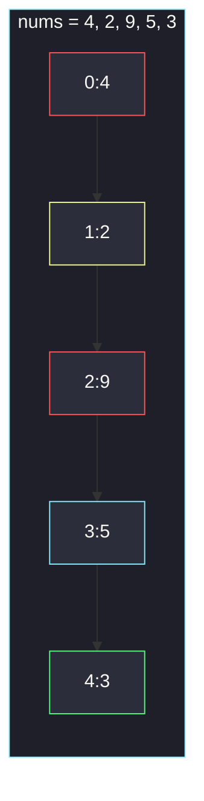
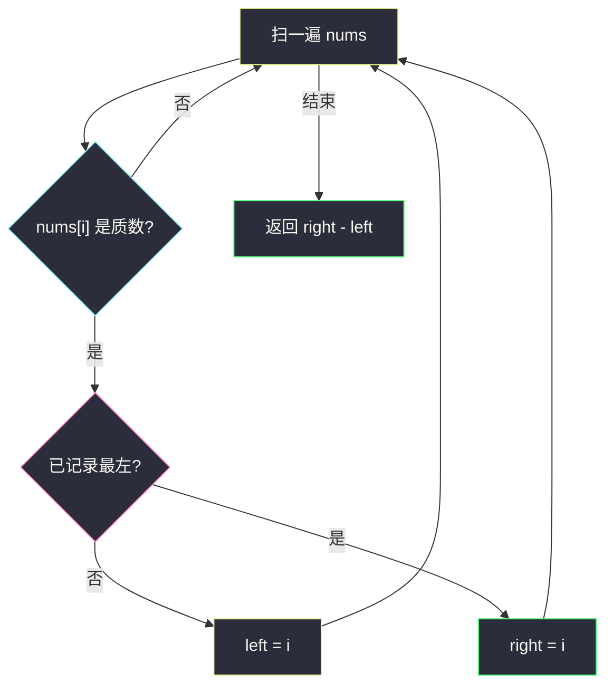

# 质数的最大距离（最左与最右）

## 一、问题描述

给你整数数组 `nums`，返回两个（**不一定不同的**）质数在 `nums` 中**下标**的最大距离。保证至少有一个质数。

> 🔗 LeetCode 3115：https://leetcode.cn/problems/maximum-prime-difference/
>
> 数据范围：`1 ≤ nums.length ≤ 3×10^5`，`1 ≤ nums[i] ≤ 100`。
>
> 📚 灵茶题单：**§1.1 判断质数**（1294 分）。1 不是质数；`nums[i] ≤ 100`，试除或筛到 100 都行。答案只取决于最左、最右两个质数下标。

**示例 1**

```
输入：nums = [4, 2, 9, 5, 3]
输出：3
解释：质数在下标 1、3、4（值 2、5、3）。最大距离 |4 - 1| = 3。
```

**示例 2**

```
输入：nums = [4, 8, 2, 8]
输出：0
解释：只有 nums[2] = 2 是质数，自己到自己距离 0。
```

**直观理解**

任意两个质数下标 `i < j` 的距离是 `j - i`。要让这个差最大，只能把 `i` 尽量左、`j` 尽量右——也就是**第一个质数**和**最后一个质数**。中间那些质数帮不上忙。只有一个质数时，题目允许「不一定不同」，距离为 0。

---

## 二、暴力解法

枚举所有下标对，两边都是质数就更新最大距离。

```python
class Solution:
    def maximumPrimeDifference(self, nums: list[int]) -> int:
        def is_prime(x: int) -> bool:
            if x < 2:
                return False
            d = 2
            while d * d <= x:
                if x % d == 0:
                    return False
                d += 1
            return True

        n = len(nums)
        ans = 0
        for i in range(n):
            if not is_prime(nums[i]):
                continue
            for j in range(i, n):
                if is_prime(nums[j]):
                    ans = max(ans, j - i)
        return ans
```

### 🔴 瓶颈在哪里

`n` 到 `3×10^5`，双重循环是 `O(n²)`，直接超时。质数对再多，最大距离也只由两端决定，不必枚举所有对。

---

## 三、优化探索（核心章节）

> 📚 本题在灵茶题单中属于 **§1.1 判断质数**。试除：从 2 到 `⌊√x⌋`，有整除则合数；`x < 2` 一律不是质数。

### 3.1 为什么只看两端

设质数下标为 `p0 < p1 < … < pm`。任意 `|pi - pj|` 的最大值就是 `pm - p0`。证明：对任意 `i ≤ j`，`pj - pi ≤ pm - p0`。所以扫一遍记下最左、最右即可。



黄是最左质数（下标 1），绿是最右质数（下标 4），青是中间质数（不影响答案），红是合数。距离 `4 - 1 = 3`。

### 3.2 素性判定：值域只有 100

每个 `nums[i] ≤ 100`，试除最多到 10，单次 `O(1)`。也可以一次性筛出 `[0, 100]` 的质数表，之后 `O(1)` 查询。`n` 很大、值域很小，两种都是 `O(n)`；筛表在「多次查询」时更划算，本题一次遍历试除足够。

不要漏：**1 不是质数**。`nums` 全是 1 和合数？题目保证至少有一个质数，不用处理空答案。



实现上可以 `left = -1`，第一次碰到质数时 `left = right = i`，之后只更新 `right`。

### 3.3 一句话核心

> **最大距离 = 最右质数下标 − 最左质数下标；一个质数时为 0。**

---

## 四、代码实现

### Python（主解：一次遍历 + 试除）

```python
class Solution:
    def maximumPrimeDifference(self, nums: list[int]) -> int:
        def is_prime(x: int) -> bool:
            if x < 2:
                return False
            d = 2
            while d * d <= x:
                if x % d == 0:
                    return False
                d += 1
            return True

        left = right = -1
        for i, x in enumerate(nums):
            if is_prime(x):
                if left < 0:
                    left = i
                right = i
        return right - left
```

题目保证存在质数，`left` 最终一定被赋值。`nums[i] ≤ 100` 时 `d * d <= x` 最多循环到 `d = 10`。

**变量含义**

| 写法 | 含义 |
|------|------|
| `left` | 最左质数下标，初值 -1 表示还没遇到 |
| `right` | 最右质数下标，每次遇到质数都更新 |
| `x < 2` | 挡住 1（以及理论上的 0，本题最小是 1） |

### 预筛到 100（同复杂度，查询更快）

```python
class Solution:
    def maximumPrimeDifference(self, nums: list[int]) -> int:
        mx = 100
        prime = [False, False] + [True] * (mx - 1)
        p = 2
        while p * p <= mx:
            if prime[p]:
                for q in range(p * p, mx + 1, p):
                    prime[q] = False
            p += 1
        left = right = -1
        for i, x in enumerate(nums):
            if prime[x]:
                if left < 0:
                    left = i
                right = i
        return right - left
```

这是 §1.1 埃氏筛模板的缩小版。值域再大时优先筛；本题 100 两种写法都可以默写。

---

## 五、具体例子演示

**示例 1**：`nums = [4, 2, 9, 5, 3]`。

| 下标 i | nums[i] | 试除 | 质数? | left | right |
|--------|---------|------|-------|------|-------|
| 0 | 4 | 4%2==0 | 否 | -1 | -1 |
| 1 | 2 | `d*d=4 > 2`，不进循环 | 是 | 1 | 1 |
| 2 | 9 | 9%3==0 | 否 | 1 | 1 |
| 3 | 5 | d=2，4≤5，5%2≠0；d=3，9>5 | 是 | 1 | 3 |
| 4 | 3 | d=2，4>3 | 是 | 1 | 4 |

返回 `4 - 1 = 3`。对拍官方。中间的 5 只把 `right` 推到 3，随后 3 再推到 4，不影响 `left`。

**示例 2**：`nums = [4, 8, 2, 8]`。

| 下标 | 值 | 质数? | left | right |
|------|-----|-------|------|-------|
| 0 | 4 | 否 | -1 | -1 |
| 1 | 8 | 否 | -1 | -1 |
| 2 | 2 | 是 | 2 | 2 |
| 3 | 8 | 否 | 2 | 2 |

返回 `2 - 2 = 0`。对拍官方。

**再看 1 与两端**：`[1, 4, 6, 8]` 里若没有质数，题目保证不会出现。`[2, 4, 4, 2]`：`left=0, right=3`，答案 3，两端都是 2。`[1, 2, 1]`：1 两次被挡，答案 `1 - 1 = 0`。

**素性小表**（≤ 100 里容易误判的）：

| x | 结论 | 原因 |
|---|------|------|
| 1 | 不是 | 定义 |
| 2 | 是 | 唯一偶数质数 |
| 4、8、9、25、49 | 不是 | 平方合数 |
| 91 | 不是 | 7×13，100 以内最大「长得像质数」的坑 |
| 97 | 是 | ≤ 100 最大质数 |

---

## 六、复杂度分析

| 方法 | 时间 | 空间 | 说明 |
|------|------|------|------|
| 枚举所有质数对 | `O(n²)` | `O(1)` | `n=3e5` 超时 |
| 一次遍历 + 试除（主解） | `O(n)` | `O(1)` | 每个值试除 `O(√100)=O(1)` |
| 埃氏筛到 100 再遍历 | `O(n)` | `O(1)` | 筛表长度 101，常数 |

不要对每次 `nums[i]` 做「筛到 x」——那是批量计数质数的模板，单次判断用试除。

---

## 七、对比总结

| 维度 | 枚举所有对 | 只看两端 |
|------|------------|----------|
| 正确性 | 对 | 对，且充分 |
| 与「不一定不同」 | 对角 i=i 得 0 | 自然覆盖单质数 |
| n=3e5 | 超时 | 线性 |

**易错点**

1. **把 1 当质数**：`[1, 2, 1]` 会把两端判成 1，答案错成 2。
2. **枚举所有质数对**：思路对、复杂度错。
3. **返回值而不是下标差**：题目要的是下标距离，不是 `|nums[r]-nums[l]|`。
4. **忘记单质数**：返回 -1 或漏初始化。`left` 第一次赋值时同步 `right`。
5. **试除从 1 起**：`x % 1 == 0` 恒真，应从 2 起，并先挡 `x < 2`。

---

## 八、举一反三

| 题目 | 关系 |
|------|------|
| [204. 计数质数](https://leetcode.cn/problems/count-primes/) | §1.1 埃氏筛批量判定 |
| [1952. 三除数](https://leetcode.cn/problems/three-divisors/) | 同目录 `three-divisors.md`：根是否质数 |
| [2523. 范围内最接近的两个质数](https://leetcode.cn/problems/closest-prime-numbers-in-range/) | 筛完再扫相邻质数，不是两端 |
| [762. 二进制表示中质数个计算置位](https://leetcode.cn/problems/prime-number-of-set-bits-in-binary-representation/) | 小值域素性表 |
| [1492. n 的第 k 个因子](https://leetcode.cn/problems/the-kth-factor-of-n/) | 同批 `the-kth-factor-of-n.md`：质数恰好两个因子 |

**思想迁移**

- 「最大距离 / 最宽窗口」先问：极值是否只由两端决定。
- 口诀：**「质数看两端，1 不是质数，别枚举所有对。」**
