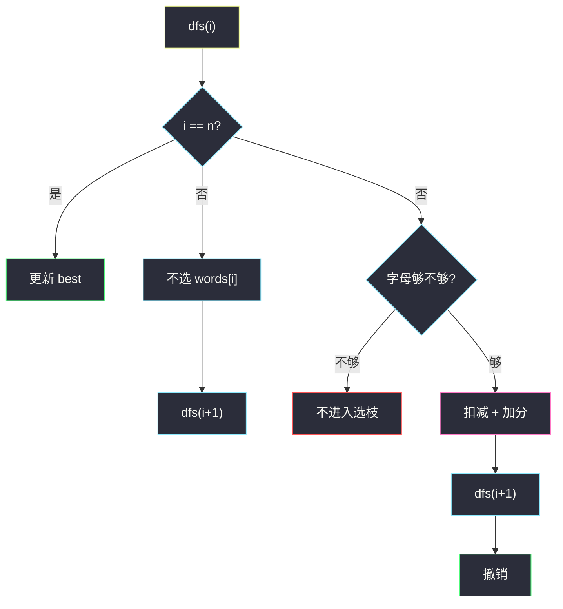
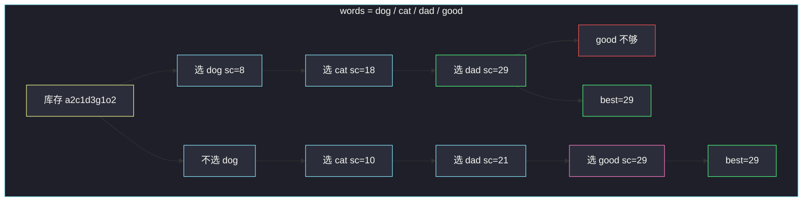

# 得分最高的单词集合（子集型回溯 · 选或不选）

## 一、问题描述

给你一组单词 `words`、一堆字母 `letters`（每个字母有份数，用完即没），以及数组 `score[0..25]` 表示 `'a'..'z'` 的得分。

请选出 `words` 的一个**子集**（每个单词最多用一次），使得：

- 子集里所有单词用到的各字母个数，都不超过 `letters` 提供的个数；
- 把子集里出现的每一个字母按 `score` 加起来，总和尽量大。

返回这个最大得分。空子集得分 0。

注意：得分按**实际用掉的字母**计，不是按单词个数。同一个字母在不同单词里各算一次。字母不够则这个单词根本选不了。

> 🔗 LeetCode 1255：https://leetcode.cn/problems/maximum-score-words-formed-by-letters/
>
> 数据范围：`1 ≤ words.length ≤ 14`，`words[i].length ≤ 15`，`letters.length ≤ 100`，`score.length == 26`，`0 ≤ score[i] ≤ 10`。单词与字母只含小写。
>
> 📚 灵茶题单：**回溯 · §4.2 子集型回溯**。每个单词「选 / 不选」两岔，`n ≤ 14` 故 `2^n ≤ 16384`。选之前检查计数够不够，够则扣减、加分、递归、撤销。

**示例 1（官方，下文端到端跟踪）**

```
输入：
words = ["dog","cat","dad","good"]
letters = ["a","a","c","d","d","d","g","o","o"]
score = [1,0,9,5,0,0,3,0,0,0,0,0,0,0,0,0,0,0,0,0,0,0,0,0,0,0]

输出：29
字母得分：a=1, c=9, d=5, g=3，其余 0。
各词得分：dog=8，cat=10，dad=11，good=8。
letters 计数：a:2, c:1, d:3, g:1, o:2。

最优之一：dog + cat + dad = 29（用掉 a2 c1 d3 g1 o1；g 只有 1 个，不能再加 good）。
另一最优：cat + dad + good = 29。
四个全选需要 2 个 g，只有 1 个，不行。
```

**示例 2**

```
输入：words = ["xxxz","ax","bx","cx"]，letters = ["z","a","b","c","x","x","x"]
score = [4,4,4,0,0,0,0,0,0,0,0,0,0,0,0,0,0,0,0,0,0,0,0,5,0,10]
输出：27
解释：选 "ax"+"bx"+"cx"，三个 x 和 a,b,c 刚好用完，z 的 10 分词 "xxxz" 要 3 个 x 还要 z，和三条短词抢 x，算下来短词更优。
```

**直观理解**

背包味道：每个单词一件物品，体积是 26 维字母向量，价值是字母得分之和。`n=14` 不用 DP，直接子集树：走到单词 `i`，要么跳过，要么在计数够的前提下扣掉字母、加上分、处理 `i+1`，回来再把字母加回去。

同类「列出全部拆法」可对照站内 [140. 单词拆分 II](https://leetcode.cn/problems/word-break-ii/)（`word-break-ii.md`）：140 是在字符串下标上切；本题是在单词列表上选子集，约束换成字母库存。

---

## 二、暴力解法

枚举 `0 .. 2^n - 1` 每个掩码，把选中的单词字母加总，任一字母超用则丢弃，否则用 `score` 算分更新答案。

```python
class Solution:
    def maxScoreWords(
        self, words: List[str], letters: List[str], score: List[int]
    ) -> int:
        n = len(words)
        base = [0] * 26
        for ch in letters:
            base[ord(ch) - 97] += 1
        best = 0
        for mask in range(1 << n):
            cnt = base[:]
            sc = 0
            ok = True
            for i in range(n):
                if mask >> i & 1:
                    for ch in words[i]:
                        j = ord(ch) - 97
                        cnt[j] -= 1
                        if cnt[j] < 0:
                            ok = False
                            break
                        sc += score[j]
                    if not ok:
                        break
            if ok:
                best = max(best, sc)
        return best
```

`14 × 2^14 × 15` 约 300 万次字母操作，能过。缺点：很多掩码的前缀已经超用，仍把后续位扫完；回溯可以在超用时立刻停，并在「选」失败时根本不进那一枝。

### 复杂度

- **时间**：`O(2^n · L)`，`L` 为单词总长上限 `14×15`。
- **空间**：`O(26)` 计数拷贝；若每掩码都 `base[:]` 则额外 `O(26)`。

### 🔴 瓶颈在哪里

位枚举没有「失败早停」：`dog` 已经把 `g` 用光，含 `good` 的那一半掩码仍会继续算。子集回溯在 `i=0` 选了 dog 之后，检查 good 时直接失败，整枝只走一次检查。还可以加「剩余单词满分上界 < 当前最优则剪」。

---

## 三、优化探索（核心章节）

> 📚 本题在灵茶题单中属于 **回溯 · §4.2 子集型回溯**。每个元素独立地选或不选（不像组合型还要配额恰好 k 个）；约束是共享的字母库存。

### 3.1 决策树

对 `words[0], words[1], …` 依次：

```
dfs(i, cnt, sc):
    若 i == n: 用 sc 更新答案；返回
    # 不选 words[i]
    dfs(i+1, cnt, sc)
    # 选 words[i]：先检查 cnt 是否盖得住该词每个字母
    若够:
        扣减 cnt，sc += 该词得分
        dfs(i+1, ...)
        撤销扣减与得分   # 恢复现场
```

「不选」永远合法。「选」只在库存足够时展开。每个单词最多一次：下标 `i` 只处理一次，不会在同一路径里再用 `words[i]`。

### 3.2 为什么检查必须在扣减前做完

若边扣边发现不够，必须把已扣的加回去再 return，容易漏恢复。更干净：先扫一遍 `need[26]`（或直接对词里每个字母看 `cnt`），不够则整词不选；够则再扣、递归、加回。

同一字母在一词中出现多次（如 `dad` 两个 `d`）：计数要按词内频次一次性比，不能只看「字母是否出现过」。

### 3.3 剪枝

**剪枝 A：库存不够则不进入「选」枝**  
正确性：字母不能超用，这条枝没有任何补救（后面的词只会再用字母，不会还字母）。

**剪枝 B（可选）：剩余满分上界**  
预处理每个单词的得分 `wscore[i]`（按 `score` 加字母，不管当前库存）。若 `sc + sum(wscore[i..n-1]) ≤ best`，怎么选都超不过，剪。这是乐观上界——实际还可能因缺字母拿不满，但上界仍合法，不会剪掉更优解。

**剪枝 C（可选）：单词本身就组不成**  
若某词对全局 `letters` 都不够（如只要 1 个 `z` 而 `letters` 没有），该词永远不能选，决策树里「选」枝恒失败。可预处理标记，或让检查自然失败。

**不必剪的**：得分为 0 的单词（如全是 `o` 且 `score['o']=0`）。选它不涨分但占字母，可能挤掉后面的高分词，所以「选」仍可能是错的——靠搜索比较，不要因为得分为 0 就强制不选或强制选。

### 3.4 正确性

- 搜索树包含全部 `2^n` 个子集（不够的「选」被剪掉，等于该子集非法）。
- 每个合法子集的得分就是其字母得分之和，取 max 即题目所求。
- 撤销保证 `cnt` 回到进入本层前的状态，兄弟节点互不影响。这是子集回溯的现场恢复不变量。

位枚举与回溯枚举的合法集合相同；回溯只是把非法前缀的后代折叠掉。



### 3.5 一句话核心

> **每个单词选或不选；选之前看字母库存，够就扣减加分并递归，回来必须撤销。**

---

## 四、代码实现

先把每个单词压成 26 维计数和预得分，回溯里只做数组加减，避免反复扫字符串。

### Python（主解：子集选 / 不选）

```python
class Solution:
    def maxScoreWords(
        self, words: List[str], letters: List[str], score: List[int]
    ) -> int:
        n = len(words)
        cnt = [0] * 26
        for ch in letters:
            cnt[ord(ch) - 97] += 1

        need = []
        wscore = []
        for w in words:
            f = [0] * 26
            s = 0
            for ch in w:
                j = ord(ch) - 97
                f[j] += 1
                s += score[j]
            need.append(f)
            wscore.append(s)

        best = 0

        def can_take(i: int) -> bool:
            f = need[i]
            for j in range(26):
                if f[j] > cnt[j]:
                    return False
            return True

        def dfs(i: int, sc: int) -> None:
            nonlocal best
            if i == n:
                best = max(best, sc)
                return
            dfs(i + 1, sc)
            if can_take(i):
                f = need[i]
                for j in range(26):
                    cnt[j] -= f[j]
                dfs(i + 1, sc + wscore[i])
                for j in range(26):
                    cnt[j] += f[j]

        dfs(0, 0)
        return best
```

**变量含义**

| 名字 | 含义 |
|------|------|
| `cnt[26]` | 当前还剩的字母，全局一份，靠加减撤销 |
| `need[i]` | 单词 `i` 的字母向量 |
| `wscore[i]` | 该词满分配额（字母都用上时的分） |
| 先 `dfs(i+1)` 再尝试选 | 标准子集树：不选枝、选枝 |

### Python（可选：剩余上界剪枝）

在 `dfs` 开头：

```python
rest = sum(wscore[k] for k in range(i, n))
if sc + rest <= best:
    return
```

`n=14` 可写可不写；词很多 0 分时有点用。

### Java（最优解：同样的子集回溯）

```java
class Solution {
    private int best;
    private int[] cnt;
    private int[][] need;
    private int[] wscore;
    private int n;

    public int maxScoreWords(String[] words, char[] letters, int[] score) {
        n = words.length;
        cnt = new int[26];
        for (char ch : letters) {
            cnt[ch - 'a']++;
        }
        need = new int[n][26];
        wscore = new int[n];
        for (int i = 0; i < n; i++) {
            int s = 0;
            for (char ch : words[i].toCharArray()) {
                need[i][ch - 'a']++;
                s += score[ch - 'a'];
            }
            wscore[i] = s;
        }
        best = 0;
        dfs(0, 0);
        return best;
    }

    private boolean canTake(int i) {
        for (int j = 0; j < 26; j++) {
            if (need[i][j] > cnt[j]) {
                return false;
            }
        }
        return true;
    }

    private void dfs(int i, int sc) {
        if (i == n) {
            best = Math.max(best, sc);
            return;
        }
        dfs(i + 1, sc);
        if (canTake(i)) {
            for (int j = 0; j < 26; j++) {
                cnt[j] -= need[i][j];
            }
            dfs(i + 1, sc + wscore[i]);
            for (int j = 0; j < 26; j++) {
                cnt[j] += need[i][j];
            }
        }
    }
}
```

---

## 五、具体例子演示

**官方例 1** 端到端。单词编号：`0 dog`，`1 cat`，`2 dad`，`3 good`。

库存初值：`a2 c1 d3 g1 o2`（其余 0）。词分：`8, 10, 11, 8`。

只画「选」成功或因库存失败的节点；不选枝若后面还能选，仍往下走。

| 路径（1=选） | 选中集合 | 库存关键变化 | 得分 | 备注 |
|-------------|----------|--------------|------|------|
| 1110 | dog,cat,dad | g 用光，d 用光 | 29 | good 要 g、d，失败 |
| 1101 | dog,cat,good | 选 dog 后 g=0，good 失败 | 18 | 实际走不到 1101 |
| 1010 | dog,dad | 无 cat | 19 | good 仍差 g |
| 0111 | cat,dad,good | 不选 dog，g 留给 good | 29 | 另一最优 |
| 0011 | dad,good | | 19 | |
| 0101 | cat,good | | 18 | |

最优 **29** 来自两条路径：`{dog, cat, dad}` 与 `{cat, dad, good}`。

逐步跟最优枝 `1110`：

1. `i=0` 选 dog：扣 `d1 o1 g1` → `a2 c1 d2 g0 o1`，sc=8。
2. `i=1` 选 cat：扣 `c1 a1` → `a1 c0 d2 g0 o1`，sc=18。
3. `i=2` 选 dad：扣 `d2 a1` → `a0 c0 d0 g0 o1`，sc=29。
4. `i=3` 选 good：要 `g1 o2 d1`，`g=0` 且 `o=1<2`、`d=0`，**不进入选枝**；不选则 `i=4` 更新 `best=29`。
5. 撤销 dad、cat、dog，回到根。

另一最优枝：根处**不选** dog，库存仍是满的 `g1 o2 d3`。

1. 选 cat：`a1 c0 d3 g1 o2`，sc=10。
2. 选 dad：`a0 c0 d1 g1 o2`，sc=21。
3. 选 good：`g1 o2 d1` 全够 → `a0 c0 d0 g0 o0`，sc=29。同样 29。



红节点：dog 已经用掉唯一的 g，good 被剪。粉节点是另一条满分路径——**不选** dog 把 g 留给 good。这就是子集回溯里「不选」不是废话：让资源给后面的词。

**撤销检查**：从 29 回来后必须把 `dad` 的两个 `d` 和一个 `a` 加回，否则兄弟枝「不选 dad、尝试 good」会看到错误库存。主解里 `for j in range(26): cnt[j] += f[j]` 就是这件事。

---

## 六、复杂度分析

| 方法 | 时间 | 空间 | 说明 |
|------|------|------|------|
| 位枚举全部掩码 | `O(2^n · L)` | `O(26)` | `n ≤ 14` 可过 |
| 子集回溯 + 库存剪枝（主解） | 仍 `O(2^n · Σ)`，常数更好 | `O(n + 26)` 递归与计数 | 超用前缀不再展开 |
| 再加剩余上界 | 最坏同阶 | 同上 | 高分词在前时剪得多 |

`L` / `Σ` 指检查一个单词的 26 维或词长。递归深度 `n`。

---

## 七、对比总结

| 维度 | 组合型 #301 | 本题子集型 |
|------|-------------|------------|
| 决策 | 每个括号删或留，但有配额 | 每个单词选或不选，无个数配额 |
| 约束 | 前缀平衡 + 恰好删完 | 字母库存不超用 |
| 恢复现场 | path pop | `cnt` 加回 |

**易错点**

1. **同一单词用两次**：下标只走一次就不会；若改成「单词可重复」就变成完全背包，题面不允许。
2. **只检查字母种类、不看次数**：`dad` 要两个 `d`。
3. **选了不撤销**：后边的分支看到的是被污染的 `cnt`。
4. **letters 里同一字母多份当成 1**：要用计数数组，不要 `set(letters)`。
5. **得分按单词个数**：题目按字母 `score` 加总；0 分字母仍占库存。
6. 四个词全选看起来分更高（8+10+11+8=37），但 g 只有 1 个，必须放弃一条含 g 的词。

---

## 八、举一反三

| 题目 | 关系 |
|------|------|
| [140. 单词拆分 II](https://leetcode.cn/problems/word-break-ii/) | 同目录 Hard：在串上切词列出全部方案，见 `word-break-ii.md` |
| [79. 单词搜索](https://leetcode.cn/problems/word-search/) | 网格里找一个词，也是选位置 + 撤销 |
| [212. 单词搜索 II](https://leetcode.cn/problems/word-search-ii/) | 多单词共享网格，Trie + 回溯 |
| [473. 火柴拼正方形](https://leetcode.cn/problems/matchsticks-to-square/) | `n` 很小的子集 / 划分回溯，先算可行性再搜 |
| [698. 划分为 k 个相等的子集](https://leetcode.cn/problems/partition-to-k-equal-sum-subsets/) | 子集型 + 剪枝，和「资源够不够」同一类 |

**思想迁移**

- `n ≤ 20` 左右先想子集树或位枚举；共享资源用计数，选时扣、返回时加。
- 口诀：**「每个词选或不选；选前看库存；扣减、递归、加回。」**
