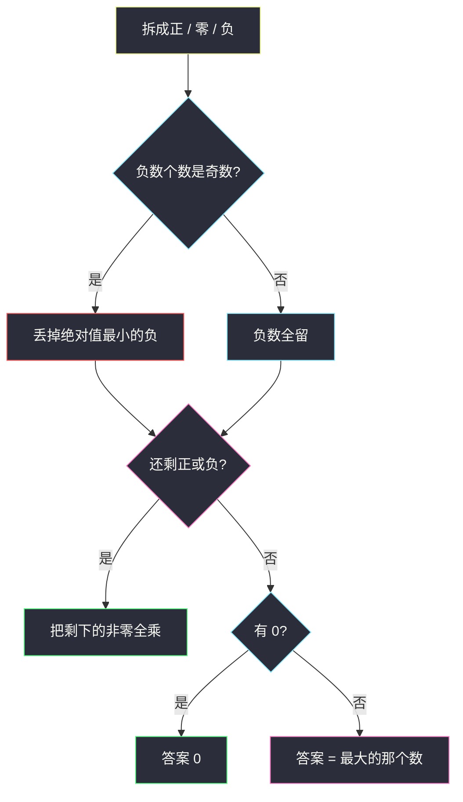
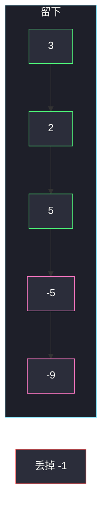

# 一个小组的最大实力值（分类讨论乘积）

## 一、问题描述

从数组 `nums` 里选一个**非空**子集，实力值定义为子集元素的乘积。求能得到的最大实力值。

> 🔗 LeetCode 2708：https://leetcode.cn/problems/maximum-strength-of-a-group/
>
> 数据范围：`1 ≤ nums.length ≤ 13`，`-9 ≤ nums[i] ≤ 9`。
>
> 📚 灵茶题单：**§6.2 基础**。`n ≤ 13` 可以 `2^n` 枚举非空子集对拍。最优做法是分类讨论：正数全乘；0 一律不进最优正积；负数要偶数个才能贡献正号——奇数个时丢掉**绝对值最小**的那个负。必须至少选 1 个：只剩一个负数、旁边没有 0 时，答案就是这个负数。
>
> Python 的积最多 `9^13 ≈ 2.5×10^12`，int 够用；Java 必须用 `long`。

**示例 1**

```
输入：nums = [3,-1,-5,2,5,-9]
输出：1350
解释：选 [3,-5,2,5,-9]，积为 3×(-5)×2×5×(-9)=1350。丢掉绝对值最小的负（-1），负号成对。
```

**示例 2**

```
输入：nums = [-4,-5,-4]
输出：20
解释：三个负数，丢掉一个 -4，剩下 (-5)×(-4)=20。
```

**直观理解**

乘积要大，优先让结果为正且绝对值尽量大：能乘的正数都乘，负数成对相乘。0 会把积清零，只有「凑不出任何正积」时才可能选 0。空集不允许，所以 `[-2]` 的答案是 `-2` 而不是「什么都不选」。

---

## 二、暴力解法

枚举所有非空子集，算积取最大。`n≤13`，`2^13-1=8191`，稳过。

```python
class Solution:
    def maxStrength(self, nums: list[int]) -> int:
        n = len(nums)
        ans = nums[0]
        for mask in range(1, 1 << n):
            p = 1
            for i in range(n):
                if mask >> i & 1:
                    p *= nums[i]
            if p > ans:
                ans = p
        return ans
```

官方两例：`[3,-1,-5,2,5,-9]` → `1350`，`[-4,-5,-4]` → `20`，与枚举对拍一致。单元素 `[-2]` 只有一个子集，答案 `-2`。

### 🔴 瓶颈在哪里

复杂度可过，但没有把「最大积长什么样」说清。正数、0、负数对乘积的贡献完全不同：正数越大越好、0 只当挡箭牌、负数的符号取决于个数奇偶。分类讨论是 `O(n)` 且能讲透。

---

## 三、优化探索（核心章节）

> 📚 本题在灵茶题单中属于 **§6.2 基础**。子集乘积的贪心：能让积变大的因子就留，会让积变小或变号的就丢——但丢完不能变成空集。

### 3.1 三类数分别怎么处理

| 值 | 对最大积 |
|----|----------|
| `> 0` | 全乘。即使是 `1`，乘上不亏，且能避免空集 |
| `= 0` | 正积里不要 0。只有凑不出正积时，0 优于负数 |
| `< 0` | 偶数个：全乘（整体为正）。奇数个：丢掉 **\|x\| 最小** 的那个，剩下偶数个 |

「丢掉绝对值最小的负」：丢掉之后其余负数的绝对值乘积最大，且符号为正。

### 3.2 丢掉之后空了怎么办

奇数个负数被丢掉一个之后，若既没有正数、也没有剩下的负数：

- 还有 0 → 答案 `0`（例如 `[-1,0]`：选 0 比选 `-1` 大）
- 没有 0 → 只能交出这个负数本身（例如 `[-2]`）



红节点是「扔掉一个负」；粉是「子集可能空，要回退到 0 或单负」。

### 3.3 不要乘进 0 去「保非空」

`[1,0]`：正数 `1` 已经非空，积是 `1`，再乘 0 变成 0，更差。`[0,-2,-3]`：偶数个负，非零积是 `6`，不要 0。

### 3.4 一句话核心

> **正数全乘；负数留偶数个（奇数就丢掉绝对值最小的）；0 只在凑不出正积时出场；禁止空集。**

---

## 四、代码实现

### Python（主解：分类讨论）

```python
class Solution:
    def maxStrength(self, nums: list[int]) -> int:
        pos = [x for x in nums if x > 0]
        neg = [x for x in nums if x < 0]
        zeros = sum(1 for x in nums if x == 0)
        neg.sort()  # 最负在前，绝对值最小的在末尾
        if len(neg) % 2 == 1:
            neg.pop()
        if not pos and not neg:
            return 0 if zeros else max(nums)
        p = 1
        for x in pos:
            p *= x
        for x in neg:
            p *= x
        return p
```

### Java（最优解，必须 long）

与 Python 同构。`9^13` 超过 32 位 int，积用 `long`。

```java
class Solution {
    public long maxStrength(int[] nums) {
        java.util.List<Integer> pos = new java.util.ArrayList<>();
        java.util.List<Integer> neg = new java.util.ArrayList<>();
        int zeros = 0;
        for (int x : nums) {
            if (x > 0) {
                pos.add(x);
            } else if (x < 0) {
                neg.add(x);
            } else {
                zeros++;
            }
        }
        java.util.Collections.sort(neg);
        if (neg.size() % 2 == 1) {
            neg.remove(neg.size() - 1);
        }
        if (pos.isEmpty() && neg.isEmpty()) {
            if (zeros > 0) {
                return 0;
            }
            int m = nums[0];
            for (int x : nums) {
                if (x > m) {
                    m = x;
                }
            }
            return m;
        }
        long p = 1;
        for (int x : pos) {
            p *= x;
        }
        for (int x : neg) {
            p *= x;
        }
        return p;
    }
}
```

**变量含义**

| 写法 | 含义 |
|------|------|
| `pos` / `neg` | 正数、负数列表 |
| `neg.sort()` 后 `pop` | 丢掉最接近 0 的负 |
| `not pos and not neg` | 丢完后没有非零可乘 |
| `0 if zeros else max(nums)` | 空非零子集时：有 0 选 0，否则最接近 0 的负（也是数组最大值） |

---

## 五、具体例子演示

### 5.1 官方示例 1：`[3,-1,-5,2,5,-9]` → 1350

| 类别 | 数 |
|------|-----|
| 正 | 3, 2, 5 |
| 负 | -1, -5, -9（3 个，奇数） |
| 零 | 无 |

丢掉绝对值最小的 `-1`。剩下非零：`3,2,5,-5,-9`。

逐步乘（前缀积）：

| 乘上 | 当前积 |
|------|--------|
| 3 | 3 |
| 2 | 6 |
| 5 | 30 |
| -5 | -150 |
| -9 | **1350** |

对拍官方。若把 `-9` 丢掉（绝对值最大），积只有 `3×2×5×(-1)×(-5)=150`，更小——所以必须丢绝对值**最小**的负。



### 5.2 官方示例 2：`[-4,-5,-4]` → 20

三个负，排序 `[-5,-4,-4]`，`pop` 掉末尾 `-4`。前缀积：`-5` → `-5`，再乘 `-4` → **20**。对拍官方。全乘三个会得到 `-80`，比 20 小。

### 5.3 单元素与 0（任务书强调）

| 输入 | 分类 | 答案 |
|------|------|------|
| `[-2]` | 奇数负，丢掉后空、无 0 | `max= -2` |
| `[0]` | 无正无剩负、有 0 | `0` |
| `[-1,0]` | 丢掉 -1 后空、有 0 | `0` |
| `[0,-2,-3]` | 偶数负，非零积 6 | `6` |
| `[1,0]` | 正数 1 | `1` |

`[-2]` 已与「不能选空」对拍。这些边界也与 `2^n` 枚举一致。

---

## 六、复杂度分析

| 方法 | 时间 | 空间 | 说明 |
|------|------|------|------|
| 枚举子集 | `O(n·2^n)` | `O(1)` | n≤13 可过，用来对拍 |
| 分类讨论（主解） | `O(n log n)` | `O(n)` | 排序负数；线性扫也行 |

积的数量级 `9^13 ≈ 2.5×10^12`，Python 无所谓，Java 用 `long`。

---

## 七、对比总结

| 维度 | 枚举 | 分类 |
|------|------|------|
| 正确性 | 全集搜索 | 要处理「丢完变空」 |
| 可讲性 | 无结构 | 正 / 负奇偶 / 0 |
| 空集 | mask 从 1 起 | 显式回退 0 或单负 |

**易错点**

1. **丢掉绝对值最大的负**：积的绝对值变小。应丢最接近 0 的负。
2. **允许空集**：`[-2]` 会答 1 或 0。必须至少选一个。
3. **奇数个负时把 0 乘进去当「正数」**：`[-2,-3,-1,0]` 丢掉 -1 后积是 6，乘 0 变 0。
4. **Java 用 int**：`9^13` 溢出。
5. **全是 1 和正数却丢掉 1**：乘 1 不亏，还能避免空。
6. **`[-1,-1,-1]` 丢掉后积是 1**：这是对的，两个 `-1` 相乘。

---

## 八、举一反三

| 题目 | 关系 |
|------|------|
| [152. 乘积最大子数组](https://leetcode.cn/problems/maximum-product-subarray/) | 子数组连续，维护最大/最小积 |
| [628. 三个数的最大乘积](https://leetcode.cn/problems/maximum-product-of-three-numbers/) | 同样讨论「两个负 + 一个正」 |
| [1822. 数组元素积的符号](https://leetcode.cn/problems/sign-of-the-product-of-an-array/) | 只关心负号个数奇偶和 0 |
| [1464. 数组中两元素的最大乘积](https://leetcode.cn/problems/maximum-product-of-two-elements-in-an-array/) | 固定选 2 个的退化 |
| [238. 除自身以外数组的乘积](https://leetcode.cn/problems/product-of-array-except-self/)（`product-of-array-except-self.md`） | 前后缀积；本题是选子集不是固定去掉一个 |

**思想迁移**

- 最大积：正数照单全收，负数成双，0 当保底。
- 口诀：**「偶负全留，奇负丢最弱；空了看有没有 0。」**
