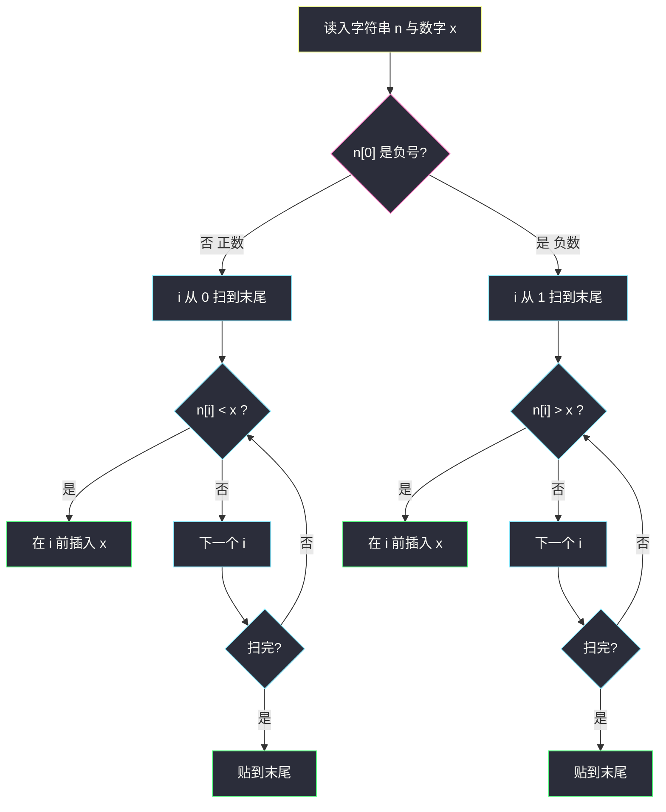

# 插入后的最大值（字典序贪心 · 正插小位 / 负插大位）

## 一、问题描述

给你一个用字符串表示的整数 `n`，以及一个数字 `x`（`1` 到 `9`）。要在 `n` 的十进制表示里**插入恰好一位** `x`，使得得到的数值**尽可能大**。不能插到负号左边。

> 🔗 LeetCode 1881：https://leetcode.cn/problems/maximum-value-after-insertion/
>
> 数据范围：`1 ≤ n.length ≤ 10^5`，`1 ≤ x ≤ 9`，`n` 的每一位也在 `[1, 9]` 中（**没有 0**，不必处理前导零）。`n` 是合法整数，负数以 `'-'` 开头。
>
> 📚 灵茶题单：**§3.1 字典序最小/最大**（1381 分）。同长数字串比大小 = 从左往右找第一处不同；正数要字典序最大，负数要负号后字典序最小。

**示例 1**

```
输入：n = "99", x = 9
输出："999"
解释：插在开头、中间、末尾，结果都是 999。
```

**示例 2**

```
输入：n = "-13", x = 2
输出："-123"
解释：三种插法得到 -213、-123、-132，最大的是 -123。
```

题目描述里还有两个小例子：`n = "73", x = 6` → `"763"`；`n = "-55", x = 2` → `"-255"`。

**直观理解**

插入后长度固定，比数值就是比「从左到右第一处不同的那一位」。正数希望高位尽量大：碰到第一个**比 x 小**的数字，把 x 塞到它前面，高位立刻变大。负数相反：数值更大 = 绝对值更小，碰到第一个**比 x 大**的数字，把 x 塞到它前面，把那个大数字往右挤。找不到这样的位置，就只能贴在末尾。

---

## 二、暴力解法

枚举每一个合法插入下标（正数从 0 到 `len(n)`，负数从 1 到 `len(n)`），拼出候选串，取数值最大的那个。

```python
class Solution:
    def maxValue(self, n: str, x: int) -> str:
        x = str(x)
        start = 1 if n[0] == "-" else 0
        best = None
        for i in range(start, len(n) + 1):
            cand = n[:i] + x + n[i:]
            if best is None or int(cand) > int(best):
                best = cand
        return best
```

小例子对得上：`"-13"` 三种候选 `-213 / -123 / -132`，`int` 比较后留下 `-123`。

### 🔴 瓶颈在哪里

`n.length` 到 `10^5`，每次 `int(cand)` 要扫一遍长整数，总共 `O(n²)`，必超时。而且 Python 把 10 万位转成 `int` 本身也慢。

其实所有候选**等长**，比大小不必真的转整数：正数直接比字符串字典序，负数比的是「负号后面那串」的字典序（越小绝对值越小，数值越大）。再进一步：第一处不同就决定胜负，所以最优插入位置可以从左到右**一次扫描**定下来，根本不用枚举。

---

## 三、优化探索（核心章节）

> 📚 本题在灵茶题单中属于 **§3.1 字典序最小/最大**。模板：从左往右，在「第一处能让字典序变好」的位置动手。正数要最大，负数要最小（绝对值），比较方向反过来。

### 3.1 等长只看第一处不同

插入一位后，所有合法结果长度相同。两个等长数字串 `a`、`b`：

- 正数：`a > b` 当且仅当第一处 `a[i] ≠ b[i]` 时 `a[i] > b[i]`（字典序更大）。
- 负数：负号相同，数值更大 ⟺ 后面那串字典序**更小**（`-123 > -132`，因为 `123 < 132`）。

所以问题变成：往数字串里插入字符 `x`，正数让整串字典序最大，负数让「去掉负号后」字典序最小。

### 3.2 正数：在第一个 `< x` 的位前插入

从左扫描数字位。设当前位是 `d`：

- 若 `d < x`：把 `x` 插在 `d` 前面。左边都 ≥ `x` 且保持原样，这一位从 `d` 变成 `x`，严格变大。再往右插只会让这一位仍是较小的 `d`，更差。
- 若 `d > x`：不能插在这里——否则这一位从大数字变成 `x`，整串变小。
- 若 `d == x`：插不插这一位都一样，继续往右找「能严格变好」的位置（后面可能出现更小的位）。

全部 ≥ `x` 时，插在任何中间位置都不会让某一位变大，只能贴到**末尾**（官方例 1：`"99"` 插 `9`）。

题目里的 `73` 插 `6`：`7 ≥ 6`，跳过；`3 < 6`，插在 `3` 前得到 `763`。`673` 第一位就小了，`736` 第二位 `3 < 6` 也小了。

### 3.3 负数：在第一个 `> x` 的位前插入

负号钉死在下标 0，扫描从下标 1 开始。现在要让后面那串字典序**最小**：

- 若 `d > x`：把 `x` 插在 `d` 前面，这一位从大数字变成较小的 `x`，绝对值变小，数值变大。官方 `-55` 插 `2` → `-255`，正是第一个 `5 > 2`。
- 若 `d < x`：不能插——否则这一位变大，绝对值变大，负数更小。
- 若 `d == x`：同样往后走。

全部 ≤ `x` 时贴到末尾。

例 2 `n = "-13", x = 2`：第一位数字 `1 < 2`，不能插（否则 `-213`，绝对值最大、数值最小）；第二位 `3 > 2`，插入得到 `-123`。



### 3.4 为什么「第一处」就是最优

这是字典序的标准交换论证。以正数为例：设最优插在位置 `j`，贪心插在第一处 `i`（`n[i] < x`）。若 `j < i`，则位置 `j` 的原数字 ≥ `x`，插进去会把这一位改小，字典序变差，不可能更优。若 `j > i`，两串在 `i` 处分叉：贪心这一位是 `x`，另一种仍是较小的 `n[i]`，贪心严格更大。负数把「更大 / 更小」对调，论证对称。

### 3.5 一句话核心

> **正数：在第一个小于 x 的数字前面插入；负数：在第一个大于 x 的数字前面插入；找不到就贴末尾。负号永远不动。**

---

## 四、代码实现

### Python（主解：一次扫描）

```python
class Solution:
    def maxValue(self, n: str, x: int) -> str:
        x = str(x)
        if n[0] != "-":
            for i, ch in enumerate(n):
                if ch < x:
                    return n[:i] + x + n[i:]
            return n + x
        for i in range(1, len(n)):
            if n[i] > x:
                return n[:i] + x + n[i:]
        return n + x
```

**变量含义**

| 写法 | 含义 |
|------|------|
| `x = str(x)` | 转成字符，和 `n[i]` 直接比（`'1'`…`'9'` 的字符序与数值序一致） |
| `ch < x` | 正数：当前位比要插入的数字小，插在这里能抬高这一位 |
| `n[i] > x` | 负数：当前位比要插入的数字大，插在这里能压低绝对值 |
| `n[:i] + x + n[i:]` | 插在下标 `i` 前面；`i == len(n)` 时等价于末尾追加 |

切片是 `O(n)` 的，但只做一次，总时间仍是线性。比较用字符即可，不要写成 `int(ch) < x`——功能一样，多一次转换。

扫描时比较的是**字符** `'1'`…`'9'`。ASCII / Unicode 里它们按数值排好了，`'3' < '6'` 成立。不要写成 `ord(ch) - 48` 再比，徒增噪音。负数分支用 `range(1, len(n))`，不会访问到 `n[0] == '-'`，也就不会拿 `'-'` 和数字比。

官方约束里没有数字 `0`，所以正数不会出现「插到开头变成前导零」这种麻烦。若以后变体允许 `0`，正数插 `0` 时不能插在开头，需要额外判断。

---

## 五、具体例子演示

**示例 1**：`n = "99", x = 9`（正数）。

| i | n[i] | n[i] < '9'? | 动作 |
|---|------|-------------|------|
| 0 | 9 | 否 | 继续 |
| 1 | 9 | 否 | 继续 |
| 扫完 | | | 贴末尾 → `"999"` |

三种插法碰巧相同，答案 `"999"`，与官方一致。

**示例 2**：`n = "-13", x = 2`（负数）。扫描从下标 1 开始。

| i | n[i] | n[i] > '2'? | 动作 |
|---|------|-------------|------|
| 1 | 1 | 否（1 < 2） | 继续。若插在这里得到 `-213`，绝对值最大，数值最小 |
| 2 | 3 | **是** | 在 `3` 前插入 → `"-123"` |

三种候选对照：

| 插入位置 | 结果 | 绝对值 | 数值 |
|----------|------|--------|------|
| 下标 1 前（1 的左边） | -213 | 213 | 最小 |
| 下标 2 前（3 的左边） | **-123** | 123 | **最大** |
| 末尾 | -132 | 132 | 中间 |

贪心在第一处 `d > x` 下手，正好是 `-123`。

**题目描述小例**：`n = "73", x = 6`。

| i | n[i] | n[i] < '6'? | 动作 |
|---|------|-------------|------|
| 0 | 7 | 否 | 继续（插在开头会变成 673，第一位 6 < 7，更小） |
| 1 | 3 | **是** | 插入 → `"763"` |

`763 > 736 > 673`，第一处不同就分出胜负。

**再看负数小例**：`n = "-55", x = 2`。下标 1 的 `5 > 2`，立刻插入 → `"-255"`。另外两种是 `-525`、`-552`，都比 `-255` 小。

**边界**

- 单正数 `"1"` 插 `9`：`'1' < '9'`，插开头 `"91"`。
- 单正数 `"9"` 插 `1`：没有更小的位，贴末尾 `"91"`。
- 单负数 `"-5"` 插 `9`：`5 > 9` 不成立，贴末尾 `"-59"`（`-95` 更小，不能选）。
- 全相同且等于 x：只能贴末尾，如 `"555"` 插 `5` → `"5555"`。

字符比较与数值比较在 `'1'`…`'9'` 上一致；不要和 `'9'` 去比整数 `10` 这种越界情况——`x` 保证是一位数。

---

## 六、复杂度分析

| 方法 | 时间 | 空间 | 说明 |
|------|------|------|------|
| 枚举插入位置 + `int` 比较 | `O(n²)` | `O(n)` | 每个候选扫一遍；`n = 10^5` 超时 |
| 枚举 + 字符串字典序比较 | `O(n²)` | `O(n)` | 仍要生成每个候选 |
| 一次扫描插入（主解） | `O(n)` | `O(n)` | 扫描 `O(n)`，最后切片拼一次 `O(n)` |

输出必须是新字符串，`O(n)` 空间不可避免。若只返回插入下标，额外空间可到 `O(1)`，但本题要整串。切片 `n[:i] + x + n[i:]` 会新开一段，不要在循环里反复拼接。

---

## 七、对比总结

| 维度 | 正数 | 负数 |
|------|------|------|
| 目标 | 字典序最大 | 负号后字典序最小（绝对值最小） |
| 下手条件 | 第一个 `d < x` | 第一个 `d > x` |
| 找不到时 | 贴末尾 | 贴末尾 |
| 负号 | 无 | 下标 0 锁定，扫描从 1 起 |

**易错点**

1. **正负用同一套比较**：负数若也找 `d < x`，`-13` 插 `2` 会得到 `-213`，这是**最小**不是最大。
2. **插到负号左边**：`2-13` 不是合法整数。循环必须从 `1` 起，或先把符号拆开。
3. **相等时立刻插入**：`d == x` 应继续往后。后面若有更「划算」的位，早插只是把机会推迟；虽然有时结果碰巧一样，写成「严格不等」更干净，也和「第一处不同」的证明一致。
4. **用 `int(n)` 算数值**：长度 `10^5`，语言相关地会溢出或极慢。全程当字符串处理。
5. **任务书写「0–9」**：以官方为准，各位是 `[1, 9]`，没有 0。不必处理前导零；参数名官方是 `n` 不是 `num`。
6. **负数用 `ch < x`**：符号位一旦参与比较就会乱；必须先拆符号，只扫描数字。

---

## 八、举一反三

| 题目 | 关系 |
|------|------|
| [2165. 重排数字的最小值](https://leetcode.cn/problems/smallest-value-of-the-rearranged-number/)（`smallest-value-of-the-rearranged-number.md`） | 同样正负分类：正数要小、负数要绝对值大 |
| [402. 移掉 K 位数字](https://leetcode.cn/problems/remove-k-digits/)（`lingcha-1/remove-k-digits.md`） | §3.1 删位版：单调栈删高位的「大数字」，字典序最小 |
| [670. 最大交换](https://leetcode.cn/problems/maximum-swap/) | 只换一次：把左边较小位和右边最大位对调 |
| [321. 拼接最大数](https://leetcode.cn/problems/create-maximum-number/)（`create-maximum-number.md`） | 两个数组里挑子序列拼出字典序最大 |
| [1673. 找出最具竞争力的子序列](https://leetcode.cn/problems/find-the-most-competitive-subsequence/) | 单调栈维护字典序最小的定长子序列 |

同族还可以看 [738. 单调递增的数字](https://leetcode.cn/problems/monotone-increasing-digits/)：从左找第一处下降，往前回退再把后面改成 9，同样是「第一处不同决定字典序」。

**思想迁移**

- 「数值最大 / 最小」在等长十进制串上就是字典序；第一处不同决定一切，贪心只在那一处动手。
- 口诀：**「正数遇小就插入，负数遇大就插入；插不到就贴尾巴，负号永远别动。」**

官方两例对拍为 `"999"`、`"-123"`；题目描述里的 `73` 插 `6`、`-55` 插 `2` 也对得上。任务书把各位写成 0–9、参数名写成 `num`，以官方 `[1,9]` 与参数 `n` 为准。
