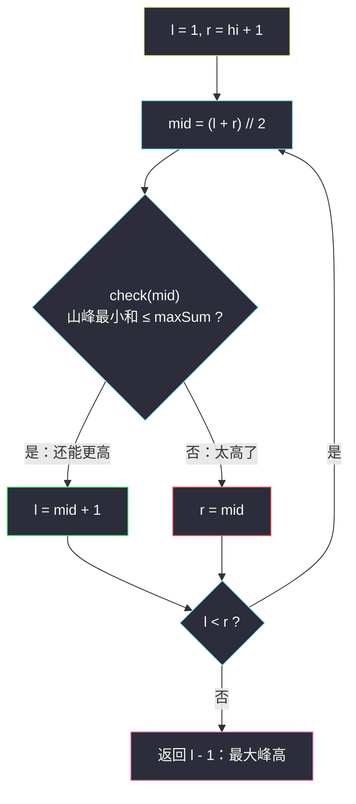
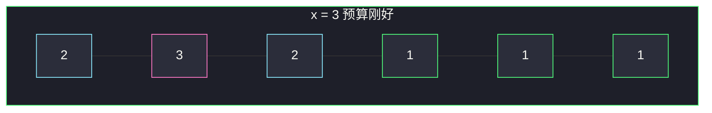

# 有界数组中指定下标处的最大值（二分山峰值 + 两侧等差和）

## 一、问题描述

要构造一个长度为 `n` 的数组 `nums`，满足：

1. 每个元素都是 **≥ 1** 的正整数；
2. 相邻差的绝对值 **≤ 1**（只能原地踏步、+1 或 -1）；
3. 所有元素之和 **≤ maxSum**。

请让 `nums[index]` 尽量大，返回这个最大值。

> 🔗 LeetCode 1802：https://leetcode.cn/problems/maximum-value-at-a-given-index-in-a-bounded-array/
>
> 数据范围：`1 <= n <= 10^5`，`0 <= index < n`，`n <= maxSum <= 10^9`。
>
> 📚 灵茶题单：**二分算法 · §2.2 求最大**。

**示例 1**

```
输入：n = 4, index = 2, maxSum = 6
输出：2
解释：一种构造 [1,1,2,1] 或 [1,2,2,1]，下标 2 处是 2，总和 ≤ 6。
再大会把山峰撑到 3，两侧至少 2、1，总和 8 超预算。
```

**示例 2**

```
输入：n = 6, index = 1, maxSum = 10
输出：3
解释：[2,3,2,1,1,1]，峰在下标 1，和为 10。
```

**直观理解**

`nums[index] = x` 时，两侧必须像山坡一样一格一格往下走，走到 1 就贴地（后面全是 1）。`x` 越大，这座山消耗的预算越多。问的是预算够用的**最大峰高**——§2.2 求最大。

---

## 二、暴力解法

`x` 从大往小试。最大可能是「其余位置全为 1」时的 `maxSum - (n - 1)`。每个 `x` 算两侧山坡的最小消耗：

```python
class Solution:
    def maxValue(self, n: int, index: int, maxSum: int) -> int:
        def side(peak: int, length: int) -> int:
            if length <= 0:
                return 0
            s, val = 0, peak - 1
            for _ in range(length):
                s += max(val, 1)
                val -= 1
            return s

        for x in range(maxSum - (n - 1), 0, -1):
            if x + side(x, index) + side(x, n - index - 1) <= maxSum:
                return x
        return 1
```

### 复杂度

- **时间**：`O(n · MAX)`。`MAX` 达 `10^9`，`n` 达 `10^5`，超时。
- **空间**：`O(1)`。

### 🔴 瓶颈在哪里

「峰高 x 的最小总消耗 ≤ maxSum」随 x 增大从真变假。线性从大到小扫，没吃单调性。二分 x，每轮用 **O(1)** 等差公式算消耗。

---

## 三、优化探索（核心章节）

> 📚 本题在灵茶题单中属于 **二分算法 · §2.2 求最大**。与 [可移除字符的最大数目](https://leetcode.cn/problems/maximum-number-of-removable-characters/)（`maximum-number-of-removable-characters.md`）同属「真值前缀、求最后一个真」。全文左闭右开，找**第一个不可行的 x**，答案是它减一。

### 3.1 两侧「山峰」求和公式

峰在 `index`，高度 `x`。左边有 `index` 格，右边有 `n - index - 1` 格。相邻差 ≤ 1 且元素 ≥ 1，**最小消耗**是：从峰顶向这一侧每次 -1，减到 1 后全填 1。

一侧长度为 `length`、峰高 `peak` 时：

- `length == 0`：0。
- `peak > length`：还没碰到 1，是等差数列 `(peak-1) + (peak-2) + … + (peak-length)`。
  项数 `length`，首尾和 `2*peak - length - 1`，和 = `length * (2*peak - length - 1) / 2`。
- `peak ≤ length`：先走完 `(peak-1) + … + 1`，这是 `1 .. (peak-1)` 的和 `peak*(peak-1)/2`，剩下 `length - (peak-1)` 个 1。

```
side(peak, length) =
    0                                          若 length = 0
    length * (2*peak - length - 1) / 2         若 peak > length
    peak*(peak-1)/2 + (length - peak + 1)      否则
```

`check(x)`：`x + side(x, 左长) + side(x, 右长) ≤ maxSum`。


### 3.2 check 关于 x 的单调性

`x` 增大，峰本身 +1，两侧山坡整体垫高（或更晚贴到 1），总消耗严格变大。所以 `check(x)` **左真右假**：峰太矮一定能放下，峰太高预算不够。要的答案 = **最大的真 x**。

`x` 至少是 1；至多是 `maxSum - (n - 1)`（其余位置不能低于 1）。


### 3.3 左闭右开求最大 x（一套走到底）

在 `[1, hi]` 上找**第一个不可行**的值，区间 `[l, r)` 表示「第一个假 x ∈ `[l, r)`」：

```
l, r = 1, hi + 1          # hi 可行则最终 l = hi+1
while l < r:
    mid = (l + r) // 2
    if check(mid): l = mid + 1   # 真：丢掉 [l, mid]，去右边找分界
    else:          r = mid       # 假：分界就在左边（含 mid）
return l - 1                     # 第一个假的左边就是最后一个真
```

和 §2.1 求最小**不要搞反**：求最小是真就收 `r = mid`；求最大是真就丢左边 `l = mid + 1`。单篇只用这一套左闭右开，不要中途改成 `r = mid - 1`。



### 3.4 为什么这就是最小消耗

相邻差 ≤ 1，从峰顶每一格最多下降 1。想让总和尽量小（峰才能尽量高），每一步都下降、能贴 1 就贴 1。中间凹下去再起来只会把别的位置抬高，总和更大。

### 3.5 一句话核心

> **峰越高越费预算（左真右假）→ 左闭右开找第一个假 x，答案 l-1；check 用两侧等差公式 O(1) 求和。**

---

## 四、代码实现

### Python（主解：二分峰高 + 等差和）

```python
class Solution:
    def maxValue(self, n: int, index: int, maxSum: int) -> int:
        def side(peak: int, length: int) -> int:
            if length <= 0:
                return 0
            if peak > length:                   # 还没贴到 1
                return length * (2 * peak - length - 1) // 2
            # 1..(peak-1) 再加剩下的 1
            return peak * (peak - 1) // 2 + (length - peak + 1)

        def check(x: int) -> bool:
            return x + side(x, index) + side(x, n - index - 1) <= maxSum

        hi = maxSum - (n - 1)                   # 其余位置至少为 1
        l, r = 1, hi + 1                        # 第一个不可行 x ∈ [l, r)
        while l < r:
            mid = (l + r) // 2
            if check(mid):
                l = mid + 1
            else:
                r = mid
        return l - 1
```

**变量含义**

| 变量 | 含义 |
|------|------|
| `x` / `mid` | 猜测的 `nums[index]` |
| `side(peak, length)` | 这一侧 `length` 格的最小和 |
| `hi` | 峰的理论上界 `maxSum - n + 1` |
| `l - 1` | 二分结束时第一个假的左边 = 最大真 |

`n = 1` 时两侧长度都是 0，`check(x) ⇔ x ≤ maxSum`，`hi = maxSum`，答案就是 `maxSum`。

### Java（最优解同款，和用 long）

```java
class Solution {
    public int maxValue(int n, int index, int maxSum) {
        int hi = maxSum - (n - 1);
        int l = 1, r = hi + 1;
        while (l < r) {
            int mid = l + (r - l) / 2;
            if (check(n, index, maxSum, mid)) l = mid + 1;
            else r = mid;
        }
        return l - 1;
    }

    private boolean check(int n, int index, int maxSum, int x) {
        long need = x + side(x, index) + side(x, n - index - 1);
        return need <= maxSum;
    }

    private long side(int peak, int length) {
        if (length <= 0) return 0;
        if (peak > length) {
            return (long) length * (2L * peak - length - 1) / 2;
        }
        return (long) peak * (peak - 1) / 2 + (length - peak + 1);
    }
}
```

峰高可达 `10^9`，等差和是平方量级，Java 必须 `long`。
---

## 五、具体例子演示

以示例 2：`n = 6`，`index = 1`，`maxSum = 10`。`hi = 10 - 5 = 5`，初始 `l = 1`，`r = 6`。

左侧 1 格、右侧 4 格。`x = 3`：左是 2；右是 2,1,1,1；总和 `3+2+5 = 10`，刚好。`x = 4`：左 3；右 3,2,1,1；总和 14 > 10。故 `check(x) ⇔ x ≤ 3`。

| 轮次 | l | r | mid | 左和 | 右和 | 总和 | check | 动作 |
|------|---|---|-----|------|------|------|-------|------|
| 1 | 1 | 6 | 3 | 2 | 5 | 10 | 真 | `l = 4` |
| 2 | 4 | 6 | 5 | 4 | 10 | 19 | 假 | `r = 5` |
| 3 | 4 | 5 | 4 | 3 | 7 | 14 | 假 | `r = 4` |

`l == r == 4`，返回 `4 - 1 = **3**` ✓。

示例 1 `n = 4, index = 2, maxSum = 6`：`hi = 3`。`x = 2` 总和 5 ≤ 6；`x = 3` 总和 8 > 6。同样锁到 2。



---

## 六、复杂度分析

| 方法 | 时间 | 空间 | 说明 |
|------|------|------|------|
| x 从大到小 + 线性山坡 | `O(n · MAX)` | `O(1)` | MAX 达 `10^9` |
| 二分 x + 等差公式（主解） | `O(log MAX)` | `O(1)` | 每轮 O(1)；MAX ≤ `10^9` |

---

## 七、对比总结

| 维度 | 暴力降 x | 二分答案 |
|------|----------|----------|
| 单调性 | 没用 | 左真右假，求最大真 |
| 单次消耗 | `O(n)` 模拟山坡 | `O(1)` 等差 |
| 和 §2.1 的差别 | — | 真时移动的是 `l` 不是 `r` |

**易错点**

1. **套成求最小模板**：真却写 `r = mid`，得到的是最小合法峰（永远是 1）。
2. **忘了贴地的 1**：`peak ≤ length` 时剩下的格子不是 0，是 1。
3. **公式用错首项**：一侧从 `peak-1` 起，不要把峰本身算进 `side`。
4. **返回 `l` 而不是 `l - 1`**：结束时 `l` 是第一个假。
5. **Java `int` 求和**：`peak * peak` 会溢出。

**模板（§2.2 求最大，左闭右开找第一个假）**

```python
l, r = 1, hi + 1
while l < r:
    mid = (l + r) // 2
    if check(mid): l = mid + 1
    else:          r = mid
return l - 1
```

---

## 八、举一反三

| 题目 | 关系 |
|------|------|
| [1898. 可移除字符的最大数目](https://leetcode.cn/problems/maximum-number-of-removable-characters/) | 同节 §2.2，见 `maximum-number-of-removable-characters.md` |
| [275. H 指数 II](https://leetcode.cn/problems/h-index-ii/) | 求最大 h，可转成求最小合法下标 |
| [475. 供暖器](https://leetcode.cn/problems/heaters/) | 反向：左假右真求最小，见 `heaters.md` |
| [1648. 销售价值减少的颜色球](https://leetcode.cn/problems/sell-diminishing-valued-colored-balls/) | 二分「每个颜色最多卖到多高」+ 等差求和 |

**思想迁移**

- 「最大化某个位置 / 某参数，约束是总和、相邻差」→ 先把**最小代价**写成 `x` 的公式，确认左真右假。
- 相邻差 ≤ 1 的单峰数组，两侧一定是「递减到 1 再贴地」，消耗用等差，不要模拟。
- 口诀：**「峰高左真右假，找第一个假再减一；两侧用等差，碰到 1 就铺平。」**
