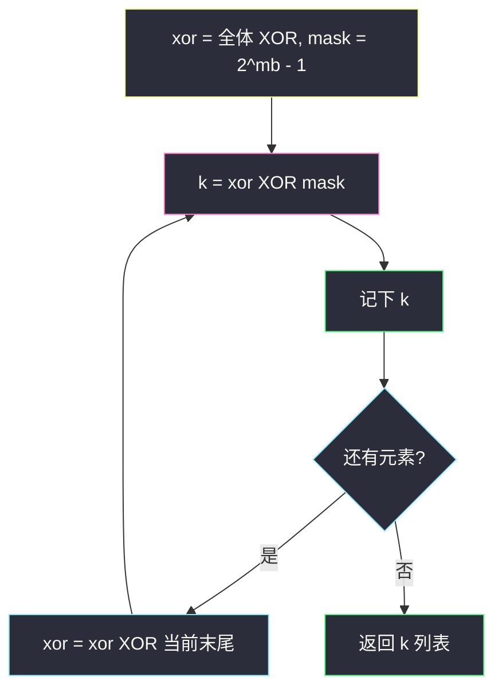
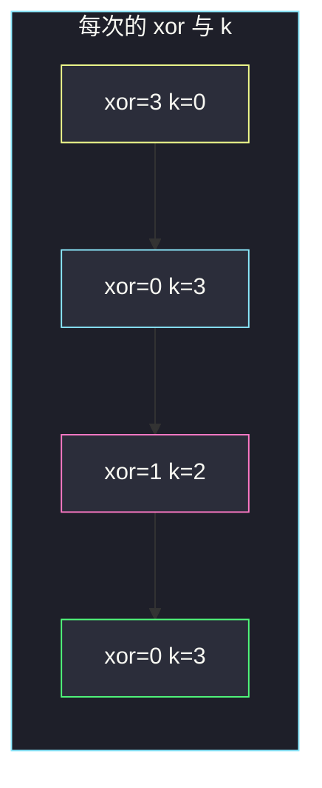

# 每个查询的最大异或值（前缀 XOR · 按位取反当 k）

## 一、问题描述

给你非负数组 `nums`（下标从 0 开始）和整数 `maximumBit`。对 `nums` 做 `n` 次查询，第 `i` 次（从 0 计）：

1. 令 `xor` 为**当前数组所有元素**的 XOR；
2. 找 `k`（`0 ≤ k < 2^maximumBit`）使 `xor XOR k` **最大**，记下这个 `k`；
3. 删掉 `nums` 的**最后一个**元素。

返回长度为 `n` 的数组 `answer`，`answer[i]` 是第 `i` 次查询找到的 `k`。注意：要的是 **k 本身**，不是 `xor XOR k` 那个最大值。

> 🔗 LeetCode 1829：https://leetcode.cn/problems/maximum-xor-for-each-query/
>
> 数据范围：`1 ≤ n ≤ 10^5`，`1 ≤ maximumBit ≤ 20`，`0 ≤ nums[i] < 2^maximumBit`。
>
> 📚 灵茶题单：**二、异或（XOR）的性质**（1523 分）。最大化 `xor ^ k` 就是在 `maximumBit` 位内把 `xor` **按位取反**；删尾等价于 `xor ^= 被删元素`。

**示例 1**

```
输入：nums = [0,1,1,3], maximumBit = 2
输出：[0,3,2,3]
解释：全过程见第五节逐步表。第一次全体 XOR=3，k=0；
     之后依次删 3、1、1，k 为 3、2、3。
```

**示例 2**

```
输入：nums = [2,3,4,7], maximumBit = 3
输出：[5,2,6,5]
```

**示例 3**

```
输入：nums = [0,1,2,2,5,7], maximumBit = 3
输出：[4,3,6,4,6,7]
```

**直观理解**

`k` 的取值范围是 `maximumBit` 位能表示的全部数，也就是 0 到 `mask = 2^maximumBit - 1`。`xor ^ k` 要尽可能大，最优就是把 `xor` 在这 `maximumBit` 位上全部翻成 1，得到 `mask`。因此 `k = xor XOR mask`，即 `xor` 在这几位上的按位取反。每次删尾不要重算全体 XOR：XOR 自己是逆运算，`xor ^= nums[末尾]` 就去掉了它。

---

## 二、暴力解法

每次查询：先 `O(n)` 扫当前数组求 XOR，再枚举 `k = 0 .. mask` 找使 `xor^k` 最大的 `k`。

```python
class Solution:
    def getMaximumXor(self, nums: list[int], maximumBit: int) -> list[int]:
        n = len(nums)
        mask = (1 << maximumBit) - 1
        ans = []
        for q in range(n):
            x = 0
            for v in nums:
                x ^= v
            best_k, best_val = 0, -1
            for k in range(mask + 1):
                val = x ^ k
                if val > best_val:
                    best_val, best_k = val, k
            ans.append(best_k)
            nums.pop()
        return ans
```

查询 `n` 次、每次扫数组 `O(n)`、再枚举 `k` 最多 `2^20`，彻底超时。即便枚举 `k` 改成按位取反，反复重算 XOR 仍是 `O(n²)`。

### 🔴 瓶颈在哪里

两处都能砍：

1. **k 不必枚举**：要 `xor ^ k = mask`（所有位都是 1），直接 `k = xor ^ mask`。
2. **XOR 不必重扫**：记下全数组 XOR，每次删 `v` 就 `xor ^= v`。

---

## 三、优化探索（核心章节）

> 📚 本题在灵茶题单中属于 **二、异或（XOR）的性质**。最大化 XOR：对方已经定了的位，你就填相反的位。约束 `k < 2^maximumBit` 且 `nums[i]` 也在这个范围内，所以只关心低 `maximumBit` 位。

### 3.1 最优 k 是按位取反

`xor` 本身也落在 `[0, mask]`（一堆小于 `2^maximumBit` 的数 XOR，结果仍小于 `2^maximumBit`）。

`xor ^ k` 的第 `i` 位为 1 当且仅当 `k` 的第 `i` 位与 `xor` 相反。`k` 的每一位都可以自由选，最优是**每一位都相反**，于是 `xor ^ k = mask`，`k = xor ^ mask`。

`k` 自动满足 `0 ≤ k ≤ mask`。

不要返回 `mask`（那是最大异或**值**），题目要的是 **k**。

### 3.2 删尾 = XOR 掉末元素

设当前 `xor = a0 ^ a1 ^ ... ^ a_{m-1}`。删掉 `a_{m-1}` 后新 XOR 为 `a0 ^ ... ^ a_{m-2}`。因为 `x ^ x = 0`：

`xor_new = xor ^ a_{m-1}`

从右往左删，查询顺序正好是：全数组 → 去掉末尾 → 再去掉新末尾 → … → 只剩 `nums[0]`。

### 3.3 也可以倒着填答案

先算全数组 XOR，`ans[0] = xor ^ mask`，然后 `xor ^= nums[n-1]`，`ans[1] = xor ^ mask`，…… 正着填即可。不必真的 `pop`。



### 3.4 一句话核心

> **`k` 取 `xor` 在 `maximumBit` 位内的按位取反；删尾用 `xor ^= 末尾`，不要重扫。**

---

## 四、代码实现

### Python（主解）

```python
class Solution:
    def getMaximumXor(self, nums: list[int], maximumBit: int) -> list[int]:
        mask = (1 << maximumBit) - 1
        x = 0
        for v in nums:
            x ^= v
        n = len(nums)
        ans = [0] * n
        for i in range(n):
            ans[i] = x ^ mask
            x ^= nums[n - 1 - i]
        return ans
```

**变量含义**

| 写法 | 含义 |
|------|------|
| `mask` | `2^maximumBit - 1`，低 `maximumBit` 位全 1 |
| `x` | 当前数组全体 XOR |
| `x ^ mask` | 当前最优 k |
| `nums[n-1-i]` | 第 `i` 次查询之后要删的末尾 |

循环里先记 `k` 再删，最后一次 `x ^= nums[0]` 没有后续查询，写不写都行。

---

## 五、具体例子演示

**示例 1**：`nums = [0, 1, 1, 3]`，`maximumBit = 2`，`mask = 3`（二进制 `11`）。

先建前缀 XOR 表（`pref[i] = nums[0] ^ ... ^ nums[i-1]`），当前长度为 `m` 的全体 XOR 就是 `pref[m]`：

| 下标 | nums | 前缀 XOR pref[i+1] |
|------|------|-------------------|
|  | （空） | 0 |
| 0 | 0 | 0 |
| 1 | 1 | 1 |
| 2 | 1 | 0 |
| 3 | 3 | 3 |

查询用的是「当前整个数组」，即从左到右的前缀，长度从 4 减到 1：全体 XOR 依次是 `pref[4], pref[3], pref[2], pref[1]` = `3, 0, 1, 0`。



逐步跟踪（二进制 2 位）：

| 查询 i | 当前数组 | xor | xor 二进制 | k = xor ^ 11 | xor^k | 之后删掉 |
|--------|----------|-----|------------|--------------|-------|----------|
| 0 | [0,1,1,3] | 3 | 11 | 00 = **0** | 11=3 | 3 |
| 1 | [0,1,1] | 0 | 00 | 11 = **3** | 11=3 | 1 |
| 2 | [0,1] | 1 | 01 | 10 = **2** | 11=3 | 1 |
| 3 | [0] | 0 | 00 | 11 = **3** | 11=3 | （结束） |

答案 `[0, 3, 2, 3]`，与官方一致。每次 `xor^k` 都顶到 `mask=3`，这就是能取到的最大。

**示例 2**：`nums = [2, 3, 4, 7]`，`maximumBit = 3`，`mask = 7`。

全体 XOR：`2^3^4^7 = 2`。

| i | xor | k = xor^7 | 删 |
|---|-----|-----------|----|
| 0 | 2 | 5 | 7 |
| 1 | 2^7=5 | 2 | 4 |
| 2 | 5^4=1 | 6 | 3 |
| 3 | 1^3=2 | 5 | |

`[5, 2, 6, 5]`，与官方一致。

**示例 3**：`nums = [0,1,2,2,5,7]`，`mask = 7`。

全体：`0^1^2^2^5^7 = 3`。

| i | xor | k=xor^7 | 删 |
|---|-----|---------|----|
| 0 | 3 | 4 | 7 |
| 1 | 3^7=4 | 3 | 5 |
| 2 | 4^5=1 | 6 | 2 |
| 3 | 1^2=3 | 4 | 2 |
| 4 | 3^2=1 | 6 | 1 |
| 5 | 1^1=0 | 7 | |

`[4, 3, 6, 4, 6, 7]`，与官方一致。

**边界**：`nums = [0]`，`maximumBit = 1` → `mask=1`，`k=0^1=1`，答案 `[1]`。`maximumBit=20` 时 `mask=1048575`，仍 `O(n)`。

---

## 六、复杂度分析

| 方法 | 时间 | 空间 | 说明 |
|------|------|------|------|
| 每次重扫 + 枚举 k | `O(n² + n·2^B)` | `O(n)` | 超时 |
| 每次重扫 + 取反 | `O(n²)` | `O(n)` | `n=10^5` 仍超时 |
| 维护全体 XOR + 取反（主解） | `O(n)` | `O(n)` 存答案 | `B ≤ 20` 只影响 mask |

---

## 七、对比总结

| 维度 | 本题 | 421 数组中两个数最大 XOR | 1310 子数组 XOR 查询 |
|------|------|--------------------------|----------------------|
| 最大化对象 | 一个变动的全体 XOR 对上自由 k | 两个数组元素 | 不最大化，只求值 |
| k 的范围 | `[0, 2^B)` 任意 | 必须是数组里的数 | 无 k |
| 结构 | 字典树 / 取反即可 | 二进制字典树 | 前缀 XOR |
| 删除 | 删尾，XOR 可逆 | 无 | 无 |

**易错点**

1. **返回 `xor ^ k`（即 mask）而不是 k**：示例 1 会得到 `[3,3,3,3]`，全错。
2. **从左边删**：题目明确删末尾。
3. **每次重新 `for` 一遍求 XOR**：正确但超时。
4. **`k` 写成 `mask - xor`**：减法不是按位取反，只有在「无借位」时碰巧相等；必须用 XOR。
5. **`mask` 用 `1 << maximumBit` 忘了减 1**：k 会越界。

---

## 八、举一反三

| 题目 | 关系 |
|------|------|
| [1310. 子数组异或查询](https://leetcode.cn/problems/xor-queries-of-a-subarray/) | 前缀 XOR：`pref[r+1] ^ pref[l]` |
| [421. 数组中两个数的最大异或值](https://leetcode.cn/problems/maximum-xor-of-two-numbers-in-an-array/) | k 必须来自数组，要用字典树贪心取反 |
| [1707. 与数组中元素的最大异或值](https://leetcode.cn/problems/maximum-xor-with-an-element-from-array/) | 带上限的最大 XOR，字典树 + 离线 |
| [1720. 解码异或后的数组](https://leetcode.cn/problems/decode-xored-array/) | XOR 可逆：`a ^ b ^ b = a` |
| [2683. 相邻值的按位异或](https://leetcode.cn/problems/neighboring-bitwise-xor/) | 同节：全体 XOR 抵消 |

**思想迁移**

- 最大化 `x ^ k` 且 `k` 不受限（只限位数）：**按位取反**。
- 删一个再 XOR：直接 `x ^= 被删的数`，不必重算。
- 口诀：**「`k = xor XOR mask`；删尾再 XOR 一次。」**
