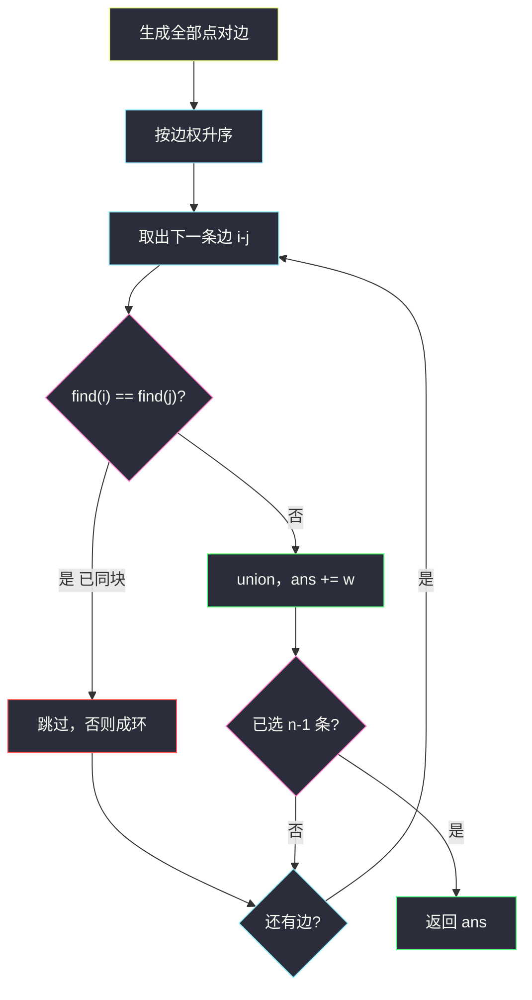
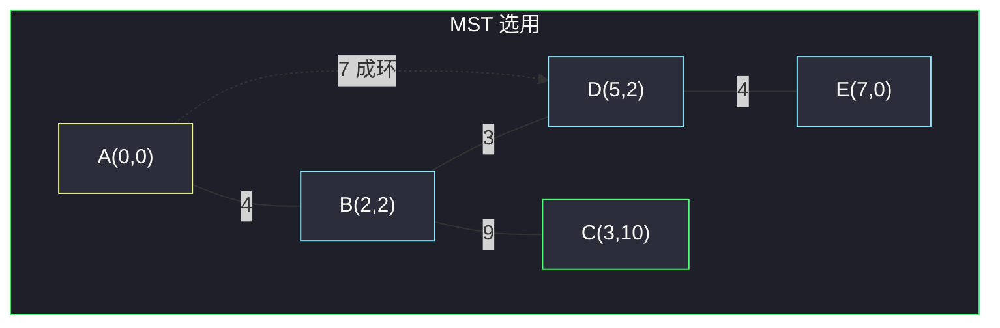

# 连接所有点的最小费用（Kruskal · 不成环就连）

## 一、问题描述

平面上 `n` 个互异点 `points[i] = [xi, yi]`。连接 `i` 与 `j` 的费用是曼哈顿距离 `|xi-xj| + |yi-yj|`。任选一些连线，使所有点连通，求费用之和的最小值。

> 🔗 LeetCode 1584：https://leetcode.cn/problems/min-cost-to-connect-all-points/
>
> 数据范围：`1 <= n <= 1000`，坐标绝对值 ≤ `10^6`，点互不相同。
>
> 📚 灵茶题单：**四、最小生成树**（1858 分）。

**示例 1**

```
输入：points = [[0,0],[2,2],[3,10],[5,2],[7,0]]
输出：20
一种最优连法：
(0,0)-(2,2) 费用 4
(2,2)-(5,2) 费用 3
(5,2)-(7,0) 费用 4
(2,2)-(3,10) 费用 9
和为 20。
```

**示例 2**

```
输入：points = [[3,12],[-2,5],[-4,1]]
输出：18
(-2,5)-(3,12) = 12，(-2,5)-(-4,1) = 6，和 18。
不连 (3,12)-(-4,1)=18 那条更贵的边。
```

**直观理解**

把每个点当图顶点，每对点之间都有一条边，权等于曼哈顿距离。要连通且总权最小，就是**最小生成树（MST）**。完全图有 `n(n-1)/2` 条边，`n=1000` 时约 `5·10^5` 条，排序后跑 Kruskal 能过。

---

## 二、暴力解法

枚举全部生成树再取最小权和。`n` 个点的树有 `n^{n-2}` 棵（Cayley），`n=10` 已经天文数字：

```python
# 伪代码：对点集的每个生成树求和 —— 不可实现
# 即便改成「枚举 n-1 条边且判连通」，组合数 C(m, n-1) 在 m=n² 时同样爆炸
```

带权完全图上没有「只看局部最近邻就结束」的更朴素正确法：贪心连最近的点可能提前成环，必须配合「不成环」检验，那已经是 Kruskal。

### 复杂度

- **时间**：枚举生成树超指数。
- **空间**：存全部点对已是 `O(n²)`。

### 🔴 瓶颈在哪里

MST 有成熟贪心：边按权从小到大，**两端还不在同一连通块就连**（Kruskal）；或从一点长树，每次接「离树最近」的点（Prim）。`n ≤ 1000` 两者都可，主解讲 Kruskal。

---

## 三、优化探索（核心章节）

> 📚 本题在灵茶题单中属于 **四、最小生成树**。平面点 → 完全图，边权曼哈顿距离；Kruskal：排序 + 并查集，不成环就连。

### 3.1 建边

双重循环 `i < j`，边权 `abs(xi-xj)+abs(yi-yj)`。不必真的存邻接表矩阵，列表里放 `(w, i, j)` 即可。

### 3.2 Kruskal：小边优先，不成环就连

并查集维护「已经连在一起的点」。

1. 所有边按 `w` 升序。
2. 依次看边 `(i, j)`：若 `find(i) != find(j)`，这条边不会成环，`union`，费用加上 `w`，选用边数 `+1`。
3. 已经选了 `n-1` 条边，树完成，结束。

正确性直觉：比当前边更短的边能用的都用过了；若 `i、j` 仍不连通，这条边是连接这两块的最短桥梁之一，MST 必须有一条跨块边，选它不会更差（切分定理）。



### 3.3 Prim 备选

稠密图用 Prim 数组实现 `O(n²)`：`dist[j]` = 点 `j` 到当前树的最小曼哈顿距离，每次把 `dist` 最小且未入树的点接入。完全图边数到 `n²` 量级时常数往往更好。主解仍用 Kruskal，和「按边权从小到大」的课设叙述一致。

`n=1` 没有边，答案 0。

### 3.4 一句话核心

> **所有点对当边，按曼哈顿距离排序；并查集两端不同块就连，连满 `n-1` 条，权和即 MST。**

---

## 四、代码实现

### Python（主解：Kruskal）

```python
class Solution:
    def minCostConnectPoints(self, points: list[list[int]]) -> int:
        n = len(points)
        edges = []
        for i in range(n):
            xi, yi = points[i]
            for j in range(i + 1, n):
                xj, yj = points[j]
                w = abs(xi - xj) + abs(yi - yj)
                edges.append((w, i, j))
        edges.sort()

        parent = list(range(n))

        def find(x: int) -> int:
            while parent[x] != x:
                parent[x] = parent[parent[x]]
                x = parent[x]
            return x

        ans = 0
        used = 0
        for w, i, j in edges:
            a, b = find(i), find(j)
            if a == b:
                continue
            parent[a] = b
            ans += w
            used += 1
            if used == n - 1:
                break
        return ans
```

**变量含义**

| 变量 | 含义 |
|------|------|
| `edges` | `(距离, 点i, 点j)` |
| `parent` | 并查集，路径压缩 |
| `used` | 已选入 MST 的边数 |
| `ans` | 已选边权和 |

`find` 用迭代 + 隔代压缩，避免链上递归。按秩合并可再写，`n=1000` 可省。

### Java（可选）

```java
class Solution {
    public int minCostConnectPoints(int[][] points) {
        int n = points.length;
        int[][] edges = new int[n * (n - 1) / 2][3];
        int p = 0;
        for (int i = 0; i < n; i++) {
            for (int j = i + 1; j < n; j++) {
                int w = Math.abs(points[i][0] - points[j][0])
                      + Math.abs(points[i][1] - points[j][1]);
                edges[p++] = new int[]{w, i, j};
            }
        }
        Arrays.sort(edges, (a, b) -> a[0] - b[0]);
        int[] fa = new int[n];
        for (int i = 0; i < n; i++) fa[i] = i;
        int ans = 0, used = 0;
        for (int[] e : edges) {
            int a = find(fa, e[1]), b = find(fa, e[2]);
            if (a == b) continue;
            fa[a] = b;
            ans += e[0];
            if (++used == n - 1) break;
        }
        return ans;
    }
    int find(int[] fa, int x) {
        while (fa[x] != x) { fa[x] = fa[fa[x]]; x = fa[x]; }
        return x;
    }
}
```

---

## 五、具体例子演示

示例 1 五点：`A(0,0) B(2,2) C(3,10) D(5,2) E(7,0)`。全部点对距离：

| 边 | 距离 |
|----|------|
| B-D | 3 |
| A-B、D-E | 4 |
| A-D、A-E、B-E | 7 |
| B-C | 9 |
| C-D | 10 |
| A-C | 13 |
| C-E | 14 |

Kruskal 按序处理（并查集代表用「较小编号」仅便于读，实现里谁挂谁都行）：

| 步 | 边 | 距离 | find 两端 | 动作 | used | ans | 块 |
|----|----|------|-----------|------|------|-----|-----|
| 1 | B-D | 3 | B, D 不同 | 合并 | 1 | 3 | {B,D} 其余单点 |
| 2 | A-B | 4 | A, B 不同 | 合并 | 2 | 7 | {A,B,D} |
| 3 | D-E | 4 | D, E 不同 | 合并 | 3 | 11 | {A,B,D,E} |
| 4 | A-D | 7 | 同块 | **跳过**（四边形上的弦） | 3 | 11 | 不变 |
| 5 | A-E | 7 | 同块 | 跳过 | 3 | 11 | |
| 6 | B-E | 7 | 同块 | 跳过 | 3 | 11 | |
| 7 | B-C | 9 | B 与 C 不同 | 合并 | 4 | 20 | 全部连通 |

`used == 4 == n-1`，停止。总费用 20。被跳过的 7 都是已经连通的点对，连上会成环。



示例 2 三边 12、6、18，先连 6 再连 12，跳过 18，和为 18。

---

## 六、复杂度分析

| 方法 | 时间 | 空间 | 说明 |
|------|------|------|------|
| 枚举生成树 | 超指数 | — | 不可用 |
| Kruskal（主解） | `O(n² log n)` | `O(n²)` 存边 | 排序主导；并查集近线性 |
| Prim 数组 | `O(n²)` | `O(n)` | 稠密图更优，不必存全部边 |

`m = n(n-1)/2`，`sort` 为 `O(m log m) = O(n² log n)`。`n=1000` 约千万级运算，可通过。

---

## 七、对比总结

| 维度 | Kruskal | Prim `O(n²)` |
|------|---------|--------------|
| 扫描对象 | 边，从小到大 | 点，每次接最近 |
| 成环判定 | 并查集 | 点已在树内就不接 |
| 适合 | 边少或边已给出 | 稠密 / 完全图 |

本题完全图两种都过；按课设「边排序 + 不成环就连」默写 Kruskal 即可。

**易错点**

1. **用欧氏距离**：题目是曼哈顿，没有平方根。
2. **只生成 `i` 的一部分邻居**：必须 `i < j` 枚举全部点对，否则图不完备，MST 会错。
3. **同块仍加边**：会成环，权和偏大。
4. **`used` 不计满就返回**：漏点。连满 `n-1` 条即可 break。
5. `n=1` 应返回 0，不要去取 `edges[0]`。
6. 并查集 `find` 忘记压缩，最坏链上每次 `O(n)`，`n=1000` 通常仍能过，但应写压缩。

---

## 八、举一反三

| 题目 | 关系 |
|------|------|
| [1135. 最低成本连通所有城市](https://leetcode.cn/problems/connecting-cities-with-minimum-cost/) | 同样 MST；边已给出且可能不连通，失败返回 `-1` |
| [1168. 水资源分配优化](https://leetcode.cn/problems/optimize-water-distribution-in-a-village/) | 虚拟源点 + 打井费用当边，再 Kruskal |
| [1489. 找到最小生成树里的关键边和伪关键边](https://leetcode.cn/problems/find-critical-and-pseudo-critical-edges-in-minimum-spanning-tree/) | 在 Kruskal 过程上判断边是否必须 / 可选 |
| [1631. 最小体力消耗路径](https://leetcode.cn/problems/path-with-minimum-effort/) | 瓶颈路 = 排序加边直到起点终点连通，思想近 Kruskal |
| [1584. 连接所有点的最小费用](https://leetcode.cn/problems/min-cost-to-connect-all-points/) | 本题 |

**思想迁移**

- 连通 + 总权最小 → MST；连通 + 最大边最小 → 瓶颈生成树 / 排序加边。
- 口诀：**「点对全连上，边按权排序；并查集不同块才连，连满 n-1 条停。」**
