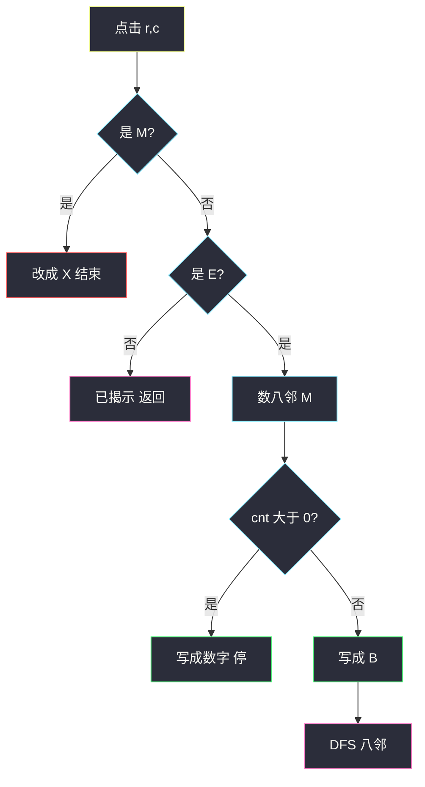
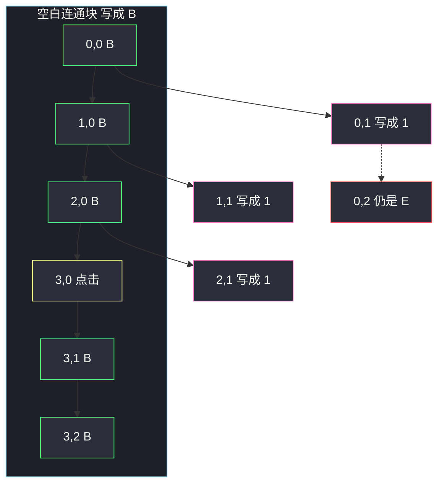

# 扫雷游戏（网格 DFS · 八邻展开）

## 一、问题描述

`m × n` 字符盘面。`'M'` 未挖地雷，`'E'` 未挖空格，`'B'` 已挖且八邻无雷，数字 `'1'`–`'8'` 表示八邻地雷数，`'X'` 已挖出的雷。

给定一次点击 `click = [r, c]`（保证点在 `'M'` 或 `'E'` 上），按扫雷规则更新盘面并返回：

1. 点到 `'M'`：改成 `'X'`，游戏结束。
2. 点到 `'E'`：数八邻（含对角）有几个 `'M'`。若 `> 0`，写成对应数字，停止。
3. 若八邻雷数为 `0`：写成 `'B'`，并对所有未挖的八邻**递归揭露**（同一套规则）。

> 🔗 LeetCode 529：https://leetcode.cn/problems/minesweeper/
>
> 数据范围：`1 ≤ m, n ≤ 50`。
>
> 📚 灵茶题单：**一、网格图 DFS**。

**示例 1**

```
输入：board =
[["E","E","E","E","E"],
 ["E","E","M","E","E"],
 ["E","E","E","E","E"],
 ["E","E","E","E","E"]]
click = [3,0]
输出：
[["B","1","E","1","B"],
 ["B","1","M","1","B"],
 ["B","1","1","1","B"],
 ["B","B","B","B","B"]]
```

点左下空白，空白区连成一片 `'B'`，贴着雷的格子写成数字，雷本身和雷背后的 `'E'` 不揭。

**示例 2**

```
输入：在示例 1 的结果上 click = [1,2]
输出：对应位置 'M' 变成 'X'，其余不变。
```

**直观理解**

和真扫雷一样：点到雷就炸；点到「旁边有雷」只翻开自己；点到「周围全空」则连锁翻开整片空白，直到碰到数字边。数字格是墙，墙后面的格子这次不会被点到。

---

## 二、暴力解法

没有更「笨」且仍正确的多项式算法——规则本身就是搜索。若每次展开都重新扫全图、不标记已揭示格子，会在 `'B'` 区域里反复进出，最坏指数级。

错误写法示意：点开一个 `'B'` 后，对八邻无条件再搜，**不判断当前是不是已经 `'B'` / 数字**。同一格会被递归成千上万次。

```python
# 反例：已揭示仍继续搜，'B' 区域互相调用
def dfs(i, j):
    mines = count_mines(i, j)
    if mines:
        board[i][j] = str(mines)
        return
    board[i][j] = 'B'
    for ni, nj in neighbors8(i, j):
        dfs(ni, nj)  # 没有 "只搜 E"，直接爆栈 / TLE
```

### 🔴 瓶颈在哪里

状态要锁死：**只有 `'E'` 才处理**。写成数字或 `'B'` 之后，这格再被邻居点到，直接返回。八方向含对角，漏一个对角雷就会把本该是 `'1'` 的格子写成 `'B'` 并错误蔓延。

---

## 三、优化探索（核心章节）

> 📚 本题在灵茶题单中属于 **一、网格图 DFS**。空白连锁是连通块搜索；BFS 同样能展开，题单主解用 DFS。

### 3.1 点击入口

- `board[r][c] == 'M'`：改 `'X'`，返回。
- 否则对 `(r, c)` 做 DFS / BFS。

### 3.2 一格怎么翻

进入 `(i, j)` 时若不是 `'E'`（出界、已是 `'B'` / 数字 / `'M'`），立刻返回。

数八邻 `'M'` 的个数 `cnt`：

- `cnt > 0`：`board[i][j] = str(cnt)`，**不要**再走邻居。
- `cnt == 0`：`board[i][j] = 'B'`，再对八邻递归。

`'M'` 未点到时保持原样，只被邻居「计数」，自己不会被 DFS 走进去（走进去的前提是 `'E'`）。



### 3.3 一句话核心

> **点雷改 X；否则数八邻雷，有雷写数字，没雷写 B 并向八邻连锁；已揭示格子不再搜。**

---

## 四、代码实现

### Python（主解：DFS）

```python
from typing import List

class Solution:
    def updateBoard(self, board: List[List[str]], click: List[int]) -> List[List[str]]:
        m, n = len(board), len(board[0])
        DIRS8 = (
            (-1, -1), (-1, 0), (-1, 1),
            (0, -1),           (0, 1),
            (1, -1),  (1, 0),  (1, 1),
        )
        r, c = click
        if board[r][c] == 'M':
            board[r][c] = 'X'
            return board

        def count_mines(i: int, j: int) -> int:
            cnt = 0
            for di, dj in DIRS8:
                ni, nj = i + di, j + dj
                if 0 <= ni < m and 0 <= nj < n and board[ni][nj] == 'M':
                    cnt += 1
            return cnt

        def dfs(i: int, j: int) -> None:
            if not (0 <= i < m and 0 <= j < n) or board[i][j] != 'E':
                return
            cnt = count_mines(i, j)
            if cnt > 0:
                board[i][j] = str(cnt)
                return
            board[i][j] = 'B'
            for di, dj in DIRS8:
                dfs(i + di, j + dj)

        dfs(r, c)
        return board
```

空白区用 BFS 完全等价：`'B'` 入队，弹出后再把八邻 `'E'` 按同一规则处理。网格不大，DFS 默写更短。四连通不够——对角的雷也算相邻。

**变量含义**

| 写法 | 含义 |
|------|------|
| `DIRS8` | 八邻，含对角 |
| `board != 'E'` | 已揭示或出界，剪枝 |
| `cnt > 0` | 数字边，连锁在此停止 |
| `'B'` 再 DFS | 空白连通块 |

### Java（可选）

```java
class Solution {
    private static final int[][] D8 = {
        {-1, -1}, {-1, 0}, {-1, 1}, {0, -1}, {0, 1}, {1, -1}, {1, 0}, {1, 1}
    };

    public char[][] updateBoard(char[][] board, int[] click) {
        if (board[click[0]][click[1]] == 'M') {
            board[click[0]][click[1]] = 'X';
            return board;
        }
        dfs(board, click[0], click[1]);
        return board;
    }

    private void dfs(char[][] board, int i, int j) {
        int m = board.length, n = board[0].length;
        if (i < 0 || i >= m || j < 0 || j >= n || board[i][j] != 'E') return;
        int cnt = 0;
        for (int[] d : D8) {
            int ni = i + d[0], nj = j + d[1];
            if (ni >= 0 && ni < m && nj >= 0 && nj < n && board[ni][nj] == 'M') cnt++;
        }
        if (cnt > 0) {
            board[i][j] = (char) ('0' + cnt);
            return;
        }
        board[i][j] = 'B';
        for (int[] d : D8) dfs(board, i + d[0], j + d[1]);
    }
}
```

---

## 五、具体例子演示

示例 1。雷在 `(1,2)`，点击 `(3,0)`。

`(3,0)` 八邻全是 `'E'` 或出界，`cnt = 0` → 写成 `'B'`，向八邻展开。空白从左下角往上、往右蔓延。

贴着雷的格子，例如 `(2,1)`：八邻含 `(1,2)='M'`，`cnt = 1`，写成 `'1'` **后停止**。它不会再去点 `(1,2)` 的雷，也不会翻开雷北侧的 `(0,2)`。

**连锁停在数字墙上**

```
点击 (3,0) 之后：

B  1  E  1  B
B  1  M  1  B
B  1  1  1  B
B  B  B  B  B
     ↑
   (0,2) 仍是 E：邻居全是数字或雷，没有 B 会走进去
```

逐步（只记关键格）：

| 当前 | cnt | 动作 | 队列/栈接下来 |
|------|------|------|----------------|
| (3,0) | 0 | 写 B | 八邻里的 E |
| (3,1) | 0 | 写 B | 继续空白 |
| (2,0) | 0 | 写 B | 继续空白 |
| (2,1) | 1 | 写 1 | **不扩展** |
| (1,0) | 0 | 写 B | … |
| (1,1) | 1 | 写 1 | 不扩展 |
| (0,0) | 0 | 写 B | … |
| (0,1) | 1 | 写 1 | 不扩展 → 到不了 (0,2) |



示例 2 在已揭盘面上点 `(1,2)` 的 `'M'`，只改 `'X'`，DFS 根本不会启动。

---

## 六、复杂度分析

| 方法 | 时间 | 空间 | 说明 |
|------|------|------|------|
| 已揭示仍递归 | 指数 | `O(mn)` 栈 | TLE / 爆栈 |
| DFS / BFS（主解） | `O(mn)` | `O(mn)` 栈或队列 | 每格最多处理一次；每格数八邻是常数 |

---

## 七、对比总结

| 维度 | 点到数字 | 点到空白 | 点到雷 |
|------|----------|----------|--------|
| 盘面 | 写 `'1'`–`'8'` | 写 `'B'` 并连锁 | 写 `'X'` |
| 是否走邻居 | 否 | 八邻里仍是 `'E'` 的 | 否 |

**易错点**

1. **只用四连通**：对角也是「相邻」，漏了会少计雷、空白会穿过雷角。
2. **数字格继续 DFS**：会翻开不该翻的格子（包括隔墙的 `'E'`，甚至走到 `'M'` 误判）。
3. **已是 `'B'` 还进**：空白互相引用，递归不终止。
4. **把 `'M'` 改成数字**：没点到的雷必须保持 `'M'`，只参与计数。
5. **`str(cnt)` 写成 `cnt`**：盘面是字符。

---

## 八、举一反三

| 题目 | 关系 |
|------|------|
| [733. 图像渲染](https://leetcode.cn/problems/flood-fill/) | 四连通 flood fill，见 `flood-fill.md` |
| [200. 岛屿数量](https://leetcode.cn/problems/number-of-islands/) | 四连通块 DFS，碰到 1 就染掉 |
| [130. 被围绕的区域](https://leetcode.cn/problems/surrounded-regions/) | 从边界反向 DFS；见 `surrounded-regions.md` |
| [417. 太平洋大西洋水流问题](https://leetcode.cn/problems/pacific-atlantic-water-flow/) | 多源反向 DFS；见 `pacific-atlantic-water-flow.md` |
| [695. 岛屿的最大面积](https://leetcode.cn/problems/max-area-of-island/) | 连通块计数；见 `max-area-of-island.md` |

**思想迁移**

- 「点一下翻开一整片」→ 对空白做 flood fill；遇到「边界条件」（本题是邻雷数 `> 0`）就停止蔓延。
- 口诀：**「雷改 X；有雷写数字；没雷写 B 并向八邻走；非 E 不进。」**
