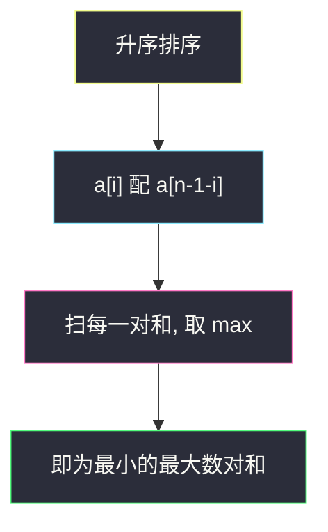
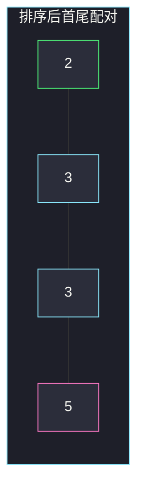
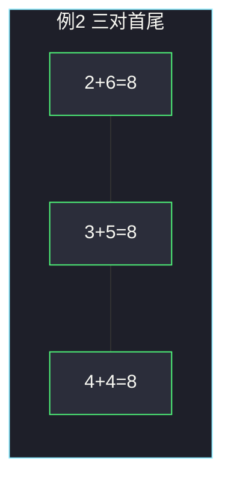

# 数组中最大数对和的最小值（单序列配对）

## 一、问题描述

给你一个**偶数长度**的整数数组 `nums`。把元素两两配成 `n/2` 对数，每对有一个和。希望所有数对和里的**最大值尽量小**。返回这个最小可能的「最大数对和」。

> 🔗 LeetCode 1877：https://leetcode.cn/problems/minimize-maximum-pair-sum-in-array/
>
> 数据范围：`2 ≤ nums.length ≤ 10^5`，`nums.length` 为偶数，`1 ≤ nums[i] ≤ 10^5`。
>
> 📚 灵茶题单：**§1.2 单序列配对**（1301 分）。

**示例 1**

```
输入：nums = [3,5,2,3]
输出：7
解释：配 (3,3) 与 (5,2)，和为 6 和 7，最大是 7。
若配 (3,5) 与 (2,3)，和为 8 和 5，最大是 8，更差。
```

**示例 2**

```
输入：nums = [3,5,4,2,4,6]
输出：8
解释：配 (2,6)、(3,5)、(4,4)，三个和都是 8。
```

**直观理解**

最大值被「两个大数配在一起」拉爆。要压低这个最大值，最大的数必须配一个尽量小的数来中和。整段排好序后，这就是**最小配最大、次小配次大**。

---

## 二、暴力解法

枚举所有完美匹配：把 `n` 个数两两配对，方案数是双阶乘 `(n-1)!! = (n-1)(n-3)···1`，对数对和取 max，再对所有方案取 min。

```python
class Solution:
    def minPairSum(self, nums: list[int]) -> int:
        n = len(nums)
        used = [False] * n
        best = 10**18

        def dfs(paired: int, cur_max: int) -> None:
            nonlocal best
            if paired == n // 2:
                best = min(best, cur_max)
                return
            i = next(p for p in range(n) if not used[p])
            used[i] = True
            for j in range(i + 1, n):
                if not used[j]:
                    used[j] = True
                    dfs(paired + 1, max(cur_max, nums[i] + nums[j]))
                    used[j] = False
            used[i] = False

        dfs(0, 0)
        return best
```

`n ≤ 10^5` 时连 `n = 20` 都吃力，必须放弃搜索。

### 🔴 瓶颈在哪里

配对方案指数级，但最优结构极其死板：排序后只能是「两端往中间夹」。一旦承认这个结构，答案就是 `max(nums[i] + nums[n-1-i])`，一遍扫描。

---

## 三、优化探索（核心章节）

> 📚 本题在灵茶题单中属于 **§1.2 单序列配对**。模板动作：排序 → 左端配右端。同类还有「救生艇」「数组拆分 I」：都是排序后首尾相配，差别只在配对的约束（和的上限 / 每对取较小值之和）。

### 3.1 局部决策

把数组升序排成 `a[0] ≤ a[1] ≤ … ≤ a[n-1]`。令配对为：

`(a[0], a[n-1])`、`(a[1], a[n-2])`、…、`(a[i], a[n-1-i])`。

答案 = 这些和里的最大值。

直觉：最大的 `a[n-1]` 无论配谁，和都偏大，只能配最小的 `a[0]` 来压它；次大的同理配次小的。

### 3.2 交换论证：两个大的不能配在一起

设最优配对里，最大值 `a[n-1]` 配的不是最小值 `a[0]`，而是某个 `a[i]`（`i ≥ 1`），同时 `a[0]` 配了某个 `a[j]`。`a[n-1]` 是全局最大，故 `a[j] ≤ a[n-1]`，且 `a[0] ≤ a[i]`。

比较两套配对：

- 原方案含和 `a[0]+a[j]`、`a[i]+a[n-1]`，其中 `a[i]+a[n-1]` 一定不小。
- 交换成 `a[0]+a[n-1]` 与 `a[i]+a[j]`：
  - `a[0] + a[n-1] ≤ a[i] + a[n-1]`
  - `a[i] + a[j] ≤ a[i] + a[n-1]`

所以交换后这两对的最大和 **≤** 原来那对「大+较大」。全局最大数对和不会变差。反复交换，总能把最优方案调整成「最小配最大」，而不增大答案。

反过来说：若两个大数配在一起，这一对的和几乎就是「最大 + 次大」，一定 ≥ 任何「最大 + 最小」。最大数对和只会被抬高。



### 3.3 相邻配对为什么更差

排序后若改成相邻配对 `(a[0],a[1])`、`(a[2],a[3])`、…，最大和会落在最右那一对 `a[n-2]+a[n-1]`，几乎是「次大 + 最大」。示例 1 里就是 `(3,5)=8`，比首尾配对的 7 差。561「数组拆分」才用相邻配对，因为它要的是每对**较小值**之和最大，结构完全不同。

### 3.4 不必二分答案

也可以「二分最大和上限 `mid`，再检查能否让每对和 ≤ `mid`」。检查时仍然是排序后首尾配：因为最大的必须配足够小的，贪心检查和直接构造是同一套配对。直接取所有首尾和的 max，已经是那个最小可行 `mid`，二分多一个 `log`，没有新信息。

### 3.5 一句话核心

> **排序后最小配最大。答案就是所有首尾和里的最大值。两个大数配在一起只会把最大值抬得更高。**

目标函数是 min-max，不是 min-sum：所有对数和对在固定数组上是常数，变的只是「最大的那一对」。所以优化对象只有峰值。

---

## 四、代码实现

### Python（主解：排序 + 首尾配对）

```python
class Solution:
    def minPairSum(self, nums: list[int]) -> int:
        nums.sort()
        n = len(nums)
        ans = 0
        for i in range(n // 2):
            ans = max(ans, nums[i] + nums[n - 1 - i])
        return ans
```

**变量含义**

| 写法 | 含义 |
|------|------|
| `nums.sort()` | 单序列配对的第一步，关键字就是数值本身 |
| `nums[i] + nums[n-1-i]` | 第 `i` 小配第 `i` 大 |
| `ans` | 目前见到的最大数对和，最终就是要最小化的那个量 |

双指针写法等价：`l, r = 0, n-1`，每次 `ans = max(ans, nums[l]+nums[r])`，然后 `l += 1`、`r -= 1`。

### Java（最优解可选）

```java
class Solution {
    public int minPairSum(int[] nums) {
        Arrays.sort(nums);
        int n = nums.length, ans = 0;
        for (int i = 0; i < n / 2; i++) {
            ans = Math.max(ans, nums[i] + nums[n - 1 - i]);
        }
        return ans;
    }
}
```

---

## 五、具体例子演示

**示例 1**：`nums = [3,5,2,3]`。

排序关键字：数值升序。

| 下标 | 0 | 1 | 2 | 3 |
|------|---|---|---|---|
| 排序前 | 3 | 5 | 2 | 3 |
| 排序后 | 2 | 3 | 3 | 5 |

首尾配对：

| 步 | 左 i | 右 n-1-i | 这一对 | 和 | 当前 ans |
|----|------|----------|--------|----|----------|
| 1 | 0 | 3 | (2, 5) | 7 | 7 |
| 2 | 1 | 2 | (3, 3) | 6 | 7 |

最大和 7。若错误地让两个 3 以外的大和大配：`(3,5)=8`、`(2,3)=5`，最大变成 8。



绿最小配粉最大，和 7；中间两个 3 配在一起，和 6。

**示例 2**：`nums = [3,5,4,2,4,6]`。

| 下标 | 0 | 1 | 2 | 3 | 4 | 5 |
|------|---|---|---|---|---|---|
| 排序后 | 2 | 3 | 4 | 4 | 5 | 6 |

| 步 | 配对 | 和 | 当前 ans |
|----|------|----|----------|
| 1 | (2, 6) | 8 | 8 |
| 2 | (3, 5) | 8 | 8 |
| 3 | (4, 4) | 8 | 8 |

三对和全是 8。若把 6 配 5：`(6,5)=11`，最大值立刻炸到 11。



峰值卡在 8。把 6 配给 4、5 配给 3、剩下 `(2,4)`：和为 10、8、6，峰值 10，比 8 差——这就是「两个较大的配在一起」。

**边界**：只有两个数时答案就是它们的和；全部相等时每一对和都一样，怎么配都相同。

**对拍**：官方例 1 输出 7、例 2 输出 8，与上表一致。任务书里「(3,5)+(2,3) 最大和是 8」那一档是**反例配法**，不是最优。

---

## 六、复杂度分析

| 方法 | 时间 | 空间 | 说明 |
|------|------|------|------|
| 枚举所有匹配 | 超指数 | `O(n)` 递归 | `(n-1)!!` 种配对 |
| 二分 + 贪心检查 | `O(n log n + n log U)` | `O(1)` 或 `O(n)` | `U` 为和的值域，多此一举 |
| 排序首尾配对（主解） | `O(n log n)` | `O(1)` 不计排序额外空间 | 排序主导 |

`n ≤ 10^5`，排序一遍即可。

---

## 七、对比总结

| 维度 | 本题（最小化最大和） | 561 数组拆分（最大化和的较小值） | 881 救生艇 |
|------|----------------------|----------------------------------|------------|
| 排序后动作 | 最小配最大 | 相邻两个一组（1 与 2、3 与 4…） | 最重配最轻，超载则最重独自走 |
| 目标 | min max(pair sum) | max sum(min of pair) | 船数最少 |
| 证明 | 交换：大不应配大 | 排序后相邻最优 | 最重必须上船，能带则带最轻 |

**易错点**

1. **最小配最小、最大配最大**：这会让最大对和变成「最大 + 次大」，恰恰是最差策略。
2. **配完忘了取 max**：题目要的不是所有和的总和，是最大的那一对。
3. **奇数下标理解成「相邻配对」**：相邻配对对应另一题 561；本题是首尾。
4. **不排序直接按输入顺序配**：输入顺序没有配对含义。

---

## 八、举一反三

| 题目 | 关系 |
|------|------|
| [561. 数组拆分](https://leetcode.cn/problems/array-partition/) | 同节：排序后配对，但每对贡献较小值 |
| [881. 救生艇](https://leetcode.cn/problems/boats-to-save-people/) | 经典首尾配对：最重配最轻 |
| [870. 优势洗牌](https://leetcode.cn/problems/advantage-shuffle/) | 田忌赛马：排序后用最小的能赢者去配 |
| [11. 盛最多水的容器](https://leetcode.cn/problems/container-with-most-water/) | 也是首尾指针，目标不同（面积而非配对） |
| [2740. 找出分区值](https://leetcode.cn/problems/find-the-value-of-the-partition/) | 同批：排序后看相邻，不配对但同属「排完序结构就清楚」 |

**思想迁移**

- 单序列要两两一组，先问目标是压低最大值还是抬高最小值：压低最大值 → 大的配小的。
- 口诀：**「排序夹两端，答案取对和的 max。」**
