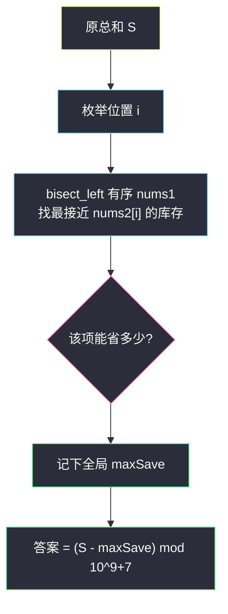
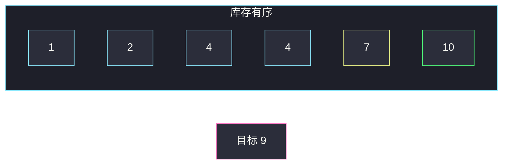

# 绝对差值和（排序 + 二分最近值，枚举每个位置）

## 一、问题描述

给你等长数组 `nums1`、`nums2`。定义绝对差值和为 `sum |nums1[i] - nums2[i]|`。你可以把 `nums1` 里**至多一个**元素改成 `nums1` 中**已经出现过的某个值**（也可以不改）。求修改后绝对差值和的最小值，结果对 `10^9+7` 取模。

> 🔗 LeetCode 1818：https://leetcode.cn/problems/minimum-absolute-sum-difference/
>
> 数据范围：`1 <= n <= 10^5`，`1 <= nums1[i], nums2[i] <= 10^9`。
>
> 📚 灵茶题单：**二分算法 · §1.2 进阶**（有序数组上二分「最接近的数」）。

**示例 1**

```
输入：nums1 = [1,7,5], nums2 = [2,3,5]
输出：3
解释：原和 |1-2|+|7-3|+|5-5| = 5。把 7 改成 1 或 5，第二项变成 2，总和 3。
```

**示例 2**

```
输入：nums1 = [2,4,6,8,10], nums2 = [2,4,6,8,10]
输出：0
解释：已经全对上，改任何一项都不会更小。
```

**示例 3**

```
输入：nums1 = [1,10,4,4,2,7], nums2 = [9,3,5,1,7,4]
输出：20
解释：原和 27。把 nums1[0]=1 改成 10（最接近 9），第一项从 8 降到 1，省 7。
```

**直观理解**

只能改一处，且新值必须来自 `nums1` 的值域。对每个位置 i，若把 `nums1[i]` 换成最接近 `nums2[i]` 的那个「库存值」，这一项的 |·| 能降多少；在所有位置里挑**降得最多**的那一次。其余位置不动。

---

## 二、暴力解法

先算原始总和。`nums1` 去重后的每个值，尝试替换每个位置：

```python
class Solution:
    def minAbsoluteSumDiff(self, nums1: List[int], nums2: List[int]) -> int:
        MOD = 10**9 + 7
        n = len(nums1)
        total = sum(abs(a - b) for a, b in zip(nums1, nums2))
        stock = set(nums1)
        best = total
        for i in range(n):
            old = abs(nums1[i] - nums2[i])
            for x in stock:
                cur = total - old + abs(x - nums2[i])
                if cur < best:
                    best = cur
        return best % MOD
```

### 复杂度

- **时间**：`O(n²)`。n = `10^5` 超时。
- **空间**：`O(n)` 的 set。

### 🔴 瓶颈在哪里

对固定位置 i，要使 `|x - nums2[i]|` 最小，`x` 不必扫全部库存——在**排好序的 nums1** 里，最接近 `nums2[i]` 的值就在插入位置的左右邻居。每个位置一次二分，总体 `O(n log n)`。

---

## 三、优化探索（核心章节）

> 📚 本题在灵茶题单中属于 **二分算法 · §1.2 进阶**：不是二分答案，而是**枚举右端（每个下标 i）**，在有序数组上二分最近值。和「二分答案」那几题（`heaters.md`）共用 `bisect_left` 找邻居的手法。

### 3.1 一次替换的最优选法

改位置 i，新值 x 必须 ∈ 原 `nums1`。该项从 `|nums1[i]-nums2[i]|` 变成 `|x-nums2[i]|`。要使总和最小，就要让 `|x-nums2[i]|` 最小，也就是 x 在库存里**最接近** `nums2[i]`（相等则差为 0，最好）。

把 `nums1` 排序得 `a`。`j = bisect_left(a, nums2[i])` 是第一个 ≥ `nums2[i]` 的位置：

- `a[j]`（若 `j < n`）是右侧候选；
- `a[j-1]`（若 `j > 0`）是左侧候选。

两者取 `|· - nums2[i]|` 更小的即可。不必看更远的元素。

节省量 `save = 原差 - 新差 ≥ 0`（原值自己就在库存里，新差不会比原差更差）。答案 = `原总和 - 最大 save`。

### 3.2 为什么只改一处、取最大节省

总和 = 各项绝对差相加。改 i 只影响第 i 项。能减掉的上限就是「所有位置各自最大节省」里的最大值。两处都改不允许，所以不会出现「两项各减一点」的组合。



### 3.3 取模只放在最后

`n · 10^9` 可达 `10^14`，超过 `MOD`。若先把 S 模掉再减 `maxSave`，可能减出负数，再模会错。正确顺序：

```
S 用普通整数累加（Python 随意；Java 用 long）
答案 (S - maxSave) % MOD
```

S ≥ maxSave，差是非负的，Python 里 `% MOD` 即可；Java 仍建议 `((S - maxSave) % MOD + MOD) % MOD` 防手滑。

### 3.4 左闭右开的插入点（和二分答案共用）

`bisect_left` 本身就是左闭右开求「第一个 ≥ 目标」：

```
l, r = 0, n
while l < r:
    mid = (l + r) // 2
    if a[mid] >= target: r = mid
    else:                l = mid + 1
return l
```

本篇只有这一处二分，不要再套一套闭区间。

### 3.5 一句话核心

> **原总和减去「某一位换成最接近 nums2[i] 的库存值」的最大节省；库存排序后每个 i 二分左右邻居。模运算只作用在最终答案。**

---

## 四、代码实现

### Python（主解）

```python
from bisect import bisect_left

class Solution:
    def minAbsoluteSumDiff(self, nums1: List[int], nums2: List[int]) -> int:
        MOD = 10**9 + 7
        n = len(nums1)
        total = 0
        for a, b in zip(nums1, nums2):
            total += abs(a - b)

        arr = sorted(nums1)
        max_save = 0
        for a, b in zip(nums1, nums2):
            old = abs(a - b)
            j = bisect_left(arr, b)             # 第一个 ≥ b
            new = old
            if j < n:
                new = min(new, abs(arr[j] - b))
            if j > 0:
                new = min(new, abs(arr[j - 1] - b))
            max_save = max(max_save, old - new)
        return (total - max_save) % MOD
```

**变量含义**

| 变量 | 含义 |
|------|------|
| `total` | 未修改的绝对差值和（不取模） |
| `arr` | `nums1` 升序副本，作为可替换库存 |
| `j` | `b = nums2[i]` 的插入点 |
| `old - new` | 改这一位能省下的量 |
| `max_save` | 所有位置里最大的节省 |

### Java（最优解同款）

```java
class Solution {
    public int minAbsoluteSumDiff(int[] nums1, int[] nums2) {
        int MOD = 1_000_000_007, n = nums1.length;
        int[] arr = nums1.clone();
        Arrays.sort(arr);
        long total = 0, maxSave = 0;
        for (int i = 0; i < n; i++) {
            long old = Math.abs((long) nums1[i] - nums2[i]);
            total += old;
            int j = lowerBound(arr, nums2[i]);
            long neu = old;
            if (j < n) neu = Math.min(neu, Math.abs((long) arr[j] - nums2[i]));
            if (j > 0) neu = Math.min(neu, Math.abs((long) arr[j - 1] - nums2[i]));
            maxSave = Math.max(maxSave, old - neu);
        }
        return (int) ((total - maxSave) % MOD);
    }

    private int lowerBound(int[] a, int x) {
        int l = 0, r = a.length;                 // [l, r) 第一个 ≥ x
        while (l < r) {
            int mid = l + (r - l) / 2;
            if (a[mid] >= x) r = mid;
            else l = mid + 1;
        }
        return l;
    }
}
```

---

## 五、具体例子演示

以示例 3：`nums1 = [1,10,4,4,2,7]`，`nums2 = [9,3,5,1,7,4]`。

排序库存 `arr = [1,2,4,4,7,10]`。原差 `8,7,1,3,5,3`，`total = 27`。

| i | nums1[i] | nums2[i] | 原差 | 插入点 j | 左右邻居 | 新差 | 节省 |
|---|----------|----------|------|----------|----------|------|------|
| 0 | 1 | 9 | 8 | 5（10） | 7, 10 | 1 | **7** |
| 1 | 10 | 3 | 7 | 2（4） | 2, 4 | 1 | 6 |
| 2 | 4 | 5 | 1 | 4（7） | 4, 7 | 1 | 0 |
| 3 | 4 | 1 | 3 | 0（1） | 1 | 0 | 3 |
| 4 | 2 | 7 | 5 | 4（7） | 4, 7 | 0 | 5 |
| 5 | 7 | 4 | 3 | 2（4） | 4 | 0 | 3 |

`maxSave = 7`，`(27 - 7) % MOD = **20**` ✓。位置 0 把 1 换成 10，最接近目标 9。

逐步看位置 0 的二分（`target = 9`，`arr = [1,2,4,4,7,10]`，`l, r = 0, 6`）：

| 轮次 | l | r | mid | arr[mid] ≥ 9 ? | 动作 |
|------|---|---|-----|----------------|------|
| 1 | 0 | 6 | 3 | 4 ≥ 9？否 | `l = 4` |
| 2 | 4 | 6 | 5 | 10 ≥ 9？是 | `r = 5` |
| 3 | 4 | 5 | 4 | 7 ≥ 9？否 | `l = 5` |

`j = 5`，邻居 `arr[5]=10`、`arr[4]=7`。对 9 来说 10 更近。



---

## 六、复杂度分析

| 方法 | 时间 | 空间 | 说明 |
|------|------|------|------|
| 每个位置扫全部库存 | `O(n²)` | `O(n)` | n = `10^5` 超时 |
| 排序 + 每位置二分（主解） | `O(n log n)` | `O(n)` | 排序副本；二分 `O(log n)` |

---

## 七、对比总结

| 维度 | 暴力换值 | 排序二分 |
|------|----------|----------|
| 找最近库存 | 线性扫 set | 插入点左右邻居 |
| 和二分答案的关系 | 无 | 共用 `bisect_left`，但这里二分的是数组下标不是答案本身 |

**易错点**

1. **先模再减**：`(S % MOD - maxSave) % MOD` 在 `S % MOD < maxSave` 时变负。必须先减再模。
2. **只看右侧邻居**：`j == n` 时目标比所有库存都大，只能看 `arr[n-1]`；`j == 0` 只能看 `arr[0]`。
3. **改成 nums2[i] 本身**：题目要求新值必须来自 `nums1`，`nums2[i]` 不一定在库存里。
4. **允许改多个位置**：题意至多一个。
5. **用 `bisect_right` 当插入点**：右插后左邻居仍是 `j-1`，右侧要改成 `j`（可能越界语义不同），不如统一 `bisect_left`。

**模板（有序数组找最近）**

```python
j = bisect_left(arr, x)
best = INF
if j < n: best = min(best, abs(arr[j] - x))
if j > 0: best = min(best, abs(arr[j - 1] - x))
```

---

## 八、举一反三

| 题目 | 关系 |
|------|------|
| [475. 供暖器](https://leetcode.cn/problems/heaters/) | 每个房子二分最近暖气，见 `heaters.md` |
| [658. 找到 K 个最接近的元素](https://leetcode.cn/problems/find-k-closest-elements/) | 有序数组上找接近段 |
| [34. 在排序数组中查找元素的第一个和最后一个位置](https://leetcode.cn/problems/find-first-and-last-position-of-element-in-sorted-array/) | `bisect_left` / `bisect_right` 原型 |
| [1898. 可移除字符的最大数目](https://leetcode.cn/problems/maximum-number-of-removable-characters/) | 同批二分家族，见 `maximum-number-of-removable-characters.md` |
| [1818 本题](https://leetcode.cn/problems/minimum-absolute-sum-difference/) | 「枚举位置 + 全局最优一次修改」 |

**思想迁移**

- 「至多改一处、新值来自已有集合」→ 原指标 − max(单点改进)；单点改进在有序集合上二分。
- 绝对值最近 = 插入点左右两个候选，不要三分、不要扫全表。
- 口诀：**「先算原总和，每位找最近库存，记下最大节省；模只打在最后。」**
