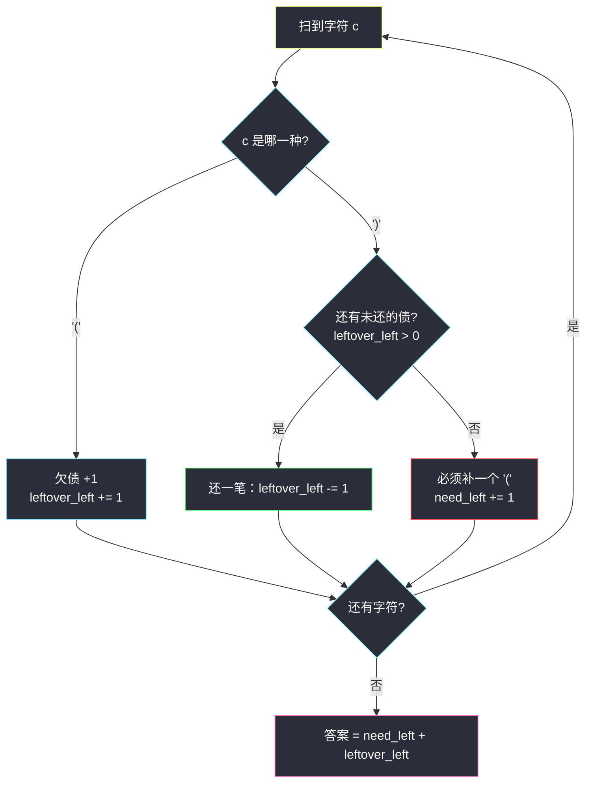
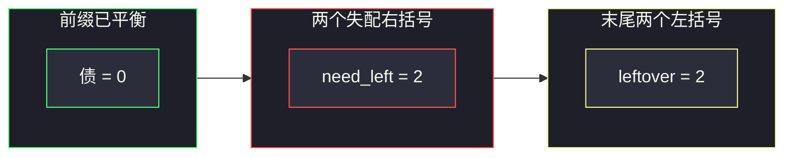

# 使括号有效的最少添加（RBS 欠债：缺左补左，扫完再补右）

## 一、问题描述

给你一个只含 `'('` 和 `')'` 的字符串 `s`。一次操作可以在任意位置插入一个 `'('` 或 `')'`。请返回使 `s` 变成**合法括号串**所需的最少插入次数。

合法括号串（Regular Bracket Sequence，RBS）满足：

- 空串合法；
- 若 `A`、`B` 合法，则 `AB` 合法；
- 若 `A` 合法，则 `(A)` 合法。

等价判定：从左到右扫，任意前缀中 `'('` 个数 ≥ `')'` 个数，且最终两者相等。插入可以发生在任意空隙（含串首串尾），一次插一个括号。

> 🔗 LeetCode 921：https://leetcode.cn/problems/minimum-add-to-make-parentheses-valid/
>
> 数据范围：`1 <= s.length <= 1000`，`s[i]` 是 `'('` 或 `')'`。
>
> 📚 本题出自灵茶题单 **§3.4 合法括号字符串（RBS）**。问的是「最少插入」而不是删除或交换，核心是**欠债计数**。

**示例 1**

```
输入：s = "())"
输出：1
解释：在开头补一个 '('，变成 "(())"。也可以在第一个 ')' 前补。
```

**示例 2**

```
输入：s = "(("
输出：2
解释：末尾补两个 ')'，变成 "(())"。
```

**示例 3**

```
输入：s = "()))(("
输出：4
解释：前半段两个失配 ')' 各要补一个 '('；末尾两个 '(' 各要补一个 ')'。
```

**直观理解**

把 `'('` 看成「欠下一笔右括号债」，`')'` 看成「还债」。还能还就还；没债可还的 `')'` 说明前面缺 `'('`，必须立刻记一笔「要补的左括号」。扫完还没还上的债，就是要补的右括号。两笔加起来就是答案。

RBS 的计数语言：设扫描中 `bal = 已见 '(' 减去 已见 ')'`（插入也算进已见）。全程 `bal ≥ 0` 且结束 `bal = 0` 当且仅当合法。本题要的是：**插入最少的括号，把途中的负值和结尾的正值都抹平。**

---

## 二、暴力解法

在每个空隙插入括号、枚举所有比 `s` 长的候选串，找最短的合法者。空隙有 `n+1` 个，每个位置还可以插多个，搜索空间爆炸。退一步：枚举「在每个位置插不插、插哪种」，深度到 `O(n)` 仍是指数。

用栈模拟「删掉已匹配的对，看剩下多少」倒是能给出一个**上界**（剩下几个就补几个），而且这个上界恰好是最优——但若真用栈，只是把计数器换成了栈长度，没有本质必要。下面用栈写一版暴力味更重的「真匹配」：

```python
class Solution:
    def minAddToMakeValid(self, s: str) -> int:
        st = []
        add = 0
        for c in s:
            if c == "(":
                st.append(c)
            else:
                if st:
                    st.pop()                     # 配对成功
                else:
                    add += 1                     # 这个 ) 前面没有 (，必须补 (
        return add + len(st)                     # 栈里剩的 ( 各补一个 )
```

### 复杂度

- **时间**：`O(n)`。
- **空间**：`O(n)`（栈最坏全是 `'('`）。

### 🔴 瓶颈在哪里

时间已经线性。栈里存的其实只有一种字符 `'('`，信息量等于一个整数「当前未匹配的左括号个数」。把栈压成计数器，空间降到 `O(1)`，这才是 §3.4 的欠债写法。

---

## 三、优化探索（核心章节）

> 📚 灵茶题单 **§3.4 合法括号字符串（RBS）**。判定 RBS 的计数法：`bal` 遇 `(` 加一、遇 `)` 减一，过程中 `bal ≥ 0` 且结束 `bal = 0`。本题不判定，而是**统计把这条规则修到成立要补几笔**。

### 3.1 RBS 的两种缺口

扫描时 `bal` 会在两处违规：

1. **半路 `bal` 要减成 -1**：当前这个 `')'` 没有可配的 `'('`。补救：在它左边插入一个 `'('`，于是 `bal` 回到 0。答案里记 `need_left += 1`，**不要把 `bal` 写成负数**。
2. **结束时 `bal > 0`**：还剩 `bal` 个没配上的 `'('`，末尾插入 `bal` 个 `')'`。

这两种缺口互不替代：前面多出来的 `'('` 救不了更早失配的 `')'`（括号不能交叉、不能「借未来」）。所以最少插入次数 = `need_left + 结束时的 bal`。

把 `bal` 想成**欠下的右括号债**（leftover left / need right），`need_left` 想成**已经确认必须补的左括号**，读起来更顺。

### 3.2 为什么这样补是最少的

- 每个失配 `')'` 至少要配一个 `'('`，否则前缀右括号会更多；
- 每个多余 `'('` 至少要配一个 `')'`，否则总数不相等；
- 上述两类括号彼此配不上（失配 `')'` 出现时左边已经没有空闲 `'('`）。

于是下界 = 两类缺口之和，而按 3.1 插入恰好达到这个下界，最优。



### 3.3 和「最少删除」的对照

[#1249 移除无效的括号](https://leetcode.cn/problems/minimum-remove-to-make-valid-parentheses/) 同样定位失配，但选择**删掉**它们。本题选择**补上配对的那一半**。失配集合一样：半路的孤 `')'` + 结尾的孤 `'('`。删除代价是失配个数，插入代价也是失配个数——数字相同，动作相反。

### 3.4 一句话核心

> **遇 `(` 欠债 +1；遇 `)` 有债就还，没债就记「补一个 `(`」；扫完把剩下的债用 `)` 还清。答案 = 补左 + 补右。**

---

## 四、代码实现

### Python（主解：O(1) 空间欠债计数）

```python
class Solution:
    def minAddToMakeValid(self, s: str) -> int:
        need_left = 0                           # 必须补的 '(' 个数
        leftover_left = 0                       # 尚未匹配的 '(' = 欠下的 ')' 债
        for c in s:
            if c == "(":
                leftover_left += 1
            else:
                if leftover_left:
                    leftover_left -= 1          # 还债
                else:
                    need_left += 1              # 没债可还，补一个 '('
        return need_left + leftover_left        # 再补 leftover_left 个 ')'
```

**变量含义**

| 变量 | 含义 |
|------|------|
| `leftover_left` | 当前前缀里还没配上的 `'('`，即欠着的 `')'` |
| `need_left` | 已经看到的失配 `')'` 个数，每个都要补一个 `'('` |
| 返回值 | 两类缺口之和 |

### Java（最优解同款）

```java
class Solution {
    public int minAddToMakeValid(String s) {
        int needLeft = 0, leftoverLeft = 0;
        for (int i = 0; i < s.length(); i++) {
            if (s.charAt(i) == '(') leftoverLeft++;
            else if (leftoverLeft > 0) leftoverLeft--;
            else needLeft++;
        }
        return needLeft + leftoverLeft;
    }
}
```

---

## 五、具体例子演示

以 `s = "()))(("` 逐步跟踪欠债。

| 步 | 字符 | leftover_left | need_left | 动作 |
|----|------|---------------|-----------|------|
| 0 | （开始） | 0 | 0 | |
| 1 | `(` | 1 | 0 | 欠债 +1 |
| 2 | `)` | 0 | 0 | 还清 |
| 3 | `)` | 0 | 1 | 没债，补左 +1 |
| 4 | `)` | 0 | 2 | 没债，补左 +1 |
| 5 | `(` | 1 | 2 | 欠债 +1 |
| 6 | `(` | 2 | 2 | 欠债 +1 |

答案 `2 + 2 = 4`。一种补法：在两个失配 `')'` 前各插 `'('`，末尾插 `'))'`，得到 `"()(()())"` 或等价合法串。

示例 1 `"())"`：`(` 欠 1 → 第一个 `)` 还清 → 第二个 `)` 补左。结束 leftover=0，答案 1。

示例 2 `"(("`：两次欠债，结束 leftover=2，need_left=0，答案 2。

再看 `")("`：第一个 `)` 没债可还，`need_left=1`；然后 `(` 欠债 1。答案 `1+1=2`，一种补法是变成 `"()()"`。注意左右个数本来就相等，但顺序反了，**只看个数差会得到 0，这是错的**。

`"()"` 全程还得上，答案 0——合法串不用插。

**边界速查**

| 输入 | need_left | leftover_left | 答案 |
|------|-----------|---------------|------|
| `"("` | 0 | 1 | 1 |
| `")"` | 1 | 0 | 1 |
| `"()"` | 0 | 0 | 0 |
| `")("` | 1 | 1 | 2 |
| `"(()"` | 0 | 1 | 1 |



---

## 六、复杂度分析

| 方法 | 时间 | 空间 | 说明 |
|------|------|------|------|
| 栈模拟配对 | `O(n)` | `O(n)` | 栈里只压 `'('` |
| 欠债计数（主解） | `O(n)` | `O(1)` | 两个整数 |

`n ≤ 1000`，两种都能过；面试应写计数版。

---

## 七、对比总结

| 维度 | 栈 | 欠债计数 |
|------|----|----------|
| 未匹配的 `(` | 栈长度 | `leftover_left` |
| 失配的 `)` | 弹空时 +1 | `need_left + 1` |
| 空间 | `O(n)` | `O(1)` |

**易错点**

1. **把 `bal` 减成负数再取绝对值**：`"))("` 若直接 `bal = -2+1` 末尾绝对值 1，会漏掉前面两个失配。必须在 `bal` 要变负时立刻记补左、把 `bal` 钉在 0。
2. **以为左右可以互相抵消跨位置**：`"())("` 需要 2 次插入，不是 0。中间那个失配 `')'` 和最后的 `'('` 配不成对。
3. **只返回 `abs(左总数 - 右总数)`**：那只覆盖了「个数差」，覆盖不了顺序违规。`"())("` 左右个数相等，但仍要补 2。
4. **和 20 题搞混**：20 题是判定（途中变负或结束非 0 就假）；本题是把违规次数累加起来。
5. **插入位置想复杂**：算法只计数，不构造。真要输出一种合法串，失配 `')'` 前插 `'('`、末尾补 `leftover_left` 个 `')'` 即可。

**模板（§3.4 RBS 最少插入）**

```python
need_left = leftover_left = 0
for c in s:
    if c == "(": leftover_left += 1
    elif leftover_left: leftover_left -= 1
    else: need_left += 1
return need_left + leftover_left
```

---

## 八、举一反三

| 题目 | 关系 |
|------|------|
| [20. 有效的括号](https://leetcode.cn/problems/valid-parentheses/) | 同一套计数 / 栈，改成判定 |
| [1249. 移除无效的括号](https://leetcode.cn/problems/minimum-remove-to-make-valid-parentheses/) | 失配集合相同，动作从「补」换成「删」 |
| [1963. 使字符串平衡的最小交换次数](https://leetcode.cn/problems/minimum-number-of-swaps-to-make-the-string-balanced/) | §3.4：个数已平衡，问最少交换，答案与 ⌈失配对数⌉ 相关 |
| [1541. 平衡括号字符串的最少插入次数](https://leetcode.cn/problems/minimum-insertions-to-balance-a-parentheses-string/) | 一个 `'('` 要配两个 `')'`，欠债按 2 进位 |
| [32. 最长有效括号](https://leetcode.cn/problems/longest-valid-parentheses/) | 在 RBS 片段上求最长，栈存下标 |
| [301. 删除无效的括号](https://leetcode.cn/problems/remove-invalid-parentheses/) | 先用本题方法算最少删几个，再搜索所有方案 |

**思想迁移**

- 见到括号串的「最少修改」，先定位两类失配：孤 `')'`（前缀负债）和孤 `'('`（后缀盈余），再决定删、补还是换。
- 计数器能代替只存一种括号的栈；只有需要「定位是哪一个」时才升级到栈存下标。
- 口诀：**「左括号是债，右括号来还；还不起就记一笔补左，扫完把债用右括号还清。」**
