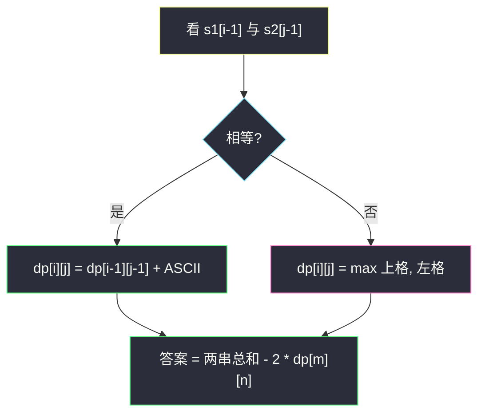
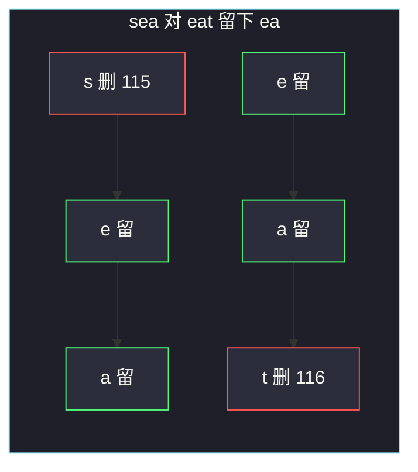

# 两个字符串的最小 ASCII 删除和（LCS 变体 · 最大公共 ASCII）

## 一、问题描述

两个字符串 `s1`、`s2`。可以删掉任意字符（两侧都可以），目标是让剩下的两串**完全相等**，且被删掉的字符的 **ASCII 码之和最小**。返回这个最小删除和。

> 🔗 LeetCode 712：https://leetcode.cn/problems/minimum-ascii-delete-sum-for-two-strings/
>
> 数据范围：`1 ≤ s1.length, s2.length ≤ 1000`，小写字母。
>
> 📚 灵茶题单：**§4.1 最长公共子序列（LCS）**。删完相等 ⇔ 两侧留下的是**同一条公共子序列**。要使删除和最小，就要让留下的那条公共子序列的 ASCII 之和**最大**。

删除和 = 两串 ASCII 总和 − 2 ×（留下的公共子序列 ASCII 和）。系数 2 是因为这条子序列在 `s1` 和 `s2` 里各留一次，没被删。

**示例 1**

```
输入：s1 = "sea", s2 = "eat"
输出：231
解释：删 s1 的 's'(115) 和 s2 的 't'(116)，剩下 "ea"。115 + 116 = 231。
```

**示例 2**

```
输入：s1 = "delete", s2 = "leet"
输出：403
解释：留下公共子序列 "let"（不是 "leet"：delete 里 t 在最后那个 e 前面，组不成 l-e-e-t）。删除和 403。
```

**直观理解**

不是最短公共超序列，也不是单纯 LCS 长度。`'z'` 的 ASCII 比 `'a'` 大，有时留一个 `'z'` 比留两个 `'a'` 更划算。所以把 LCS 里的「+1」改成「+该字符 ASCII」。

---

## 二、暴力解法

枚举 `s1` 的所有子序列，看它是不是 `s2` 的子序列，取 ASCII 和最大的，再套公式。

```python
class Solution:
    def minimumDeleteSum(self, s1: str, s2: str) -> int:
        n = len(s1)
        best = 0

        def is_subseq(t: str) -> bool:
            i = 0
            for ch in s2:
                if i < len(t) and ch == t[i]:
                    i += 1
            return i == len(t)

        for mask in range(1 << n):
            chars = []
            acc = 0
            for i in range(n):
                if mask >> i & 1:
                    chars.append(s1[i])
                    acc += ord(s1[i])
            if is_subseq("".join(chars)):
                best = max(best, acc)
        tot = sum(map(ord, s1)) + sum(map(ord, s2))
        return tot - 2 * best
```

子序列有 `2^len(s1)` 个，`len ≤ 1000` 完全不可用。官方小例子能过（`"sea"` 只有 8 个子序列）。面试不要默写这版，只用来说明指数爆炸。

### 🔴 瓶颈在哪里

公共子序列的最优结构与 LCS 相同：看 `s1[i-1]` 与 `s2[j-1]` 是否相等，相等就接在 `dp[i-1][j-1]` 后面，不等就两边丢一个前缀。把「长度 +1」换成「ASCII 相加」，`O(mn)` 填表。

---

## 三、优化探索（核心章节）

> 📚 本题在灵茶题单中属于 **§4.1 最长公共子序列（LCS）**。模板仍是二维 `dp[i][j]` 表示两个前缀。本题优化目标从「最长」变成「ASCII 和最大」，转移形状不变。

### 3.1 状态（最大公共 ASCII）

`dp[i][j]` = `s1` 的前 `i` 个字符与 `s2` 的前 `j` 个字符之间，**公共子序列的最大 ASCII 之和**。

- `s1[i-1] == s2[j-1]`：这条字符必须可以接上，`dp[i][j] = dp[i-1][j-1] + ord(s1[i-1])`。
- 否则：`dp[i][j] = max(dp[i-1][j], dp[i][j-1])`（丢掉 `s1` 末字符或丢掉 `s2` 末字符）。
- 初值：空串对任何前缀，公共子序列和为 0。

答案：`sum(ord(s1)) + sum(ord(s2)) - 2 * dp[m][n]`。

相等时不必再和「丢掉一侧」取 max：同一字符留下一定不亏（ASCII 为正），这点和 1143 长度 LCS 一样。

### 3.2 等价状态（直接最小删除和）

`f[i][j]` = 让 `s1[:i]` 与 `s2[:j]` 变成相同串所需的最小删除 ASCII 和。

- 相等：`f[i][j] = f[i-1][j-1]`（都留下，不删）。
- 不等：`f[i][j] = min(f[i-1][j] + ord(s1[i-1]), f[i][j-1] + ord(s2[j-1]))`。
- 初值：`f[i][0] = s1 前 i 个之和`（另一侧是空，只能全删）；`f[0][j]` 同理。

两种表差一个线性变换：`f[i][j] = sum(s1[:i]) + sum(s2[:j]) - 2 * dp[i][j]`。对齐灵神 LCS 时主写 `dp`；实现任选一张。



### 3.3 一句话核心

> **最大 ASCII 公共子序列就是加权 LCS；删除和 = 两边总和减两倍这个权。**

---

## 四、代码实现

### Python（主解：LCS 权值和）

```python
class Solution:
    def minimumDeleteSum(self, s1: str, s2: str) -> int:
        m, n = len(s1), len(s2)
        # dp[i][j] = s1 前 i 个与 s2 前 j 个的最大公共子序列 ASCII 和
        dp = [[0] * (n + 1) for _ in range(m + 1)]
        for i in range(1, m + 1):
            for j in range(1, n + 1):
                if s1[i - 1] == s2[j - 1]:
                    dp[i][j] = dp[i - 1][j - 1] + ord(s1[i - 1])
                else:
                    dp[i][j] = max(dp[i - 1][j], dp[i][j - 1])
        tot = sum(map(ord, s1)) + sum(map(ord, s2))
        return tot - 2 * dp[m][n]
```

### Python（直接最小删除和，同一答案）

```python
class Solution:
    def minimumDeleteSum(self, s1: str, s2: str) -> int:
        m, n = len(s1), len(s2)
        # f[i][j] = 使 s1[:i] 与 s2[:j] 相等的最小删除 ASCII 和
        f = [[0] * (n + 1) for _ in range(m + 1)]
        for i in range(1, m + 1):
            f[i][0] = f[i - 1][0] + ord(s1[i - 1])
        for j in range(1, n + 1):
            f[0][j] = f[0][j - 1] + ord(s2[j - 1])
        for i in range(1, m + 1):
            for j in range(1, n + 1):
                if s1[i - 1] == s2[j - 1]:
                    f[i][j] = f[i - 1][j - 1]
                else:
                    f[i][j] = min(
                        f[i - 1][j] + ord(s1[i - 1]),
                        f[i][j - 1] + ord(s2[j - 1]),
                    )
        return f[m][n]
```

滚动一维时注意相等分支要用「左上角旧值」，先备一份 `pre` 再从左到右刷，和 1143 相同。

### Java（最优解：LCS 权值）

```java
class Solution {
    public int minimumDeleteSum(String s1, String s2) {
        int m = s1.length(), n = s2.length();
        int[][] dp = new int[m + 1][n + 1];
        for (int i = 1; i <= m; i++) {
            for (int j = 1; j <= n; j++) {
                if (s1.charAt(i - 1) == s2.charAt(j - 1)) {
                    dp[i][j] = dp[i - 1][j - 1] + s1.charAt(i - 1);
                } else {
                    dp[i][j] = Math.max(dp[i - 1][j], dp[i][j - 1]);
                }
            }
        }
        int tot = 0;
        for (int i = 0; i < m; i++) {
            tot += s1.charAt(i);
        }
        for (int j = 0; j < n; j++) {
            tot += s2.charAt(j);
        }
        return tot - 2 * dp[m][n];
    }
}
```

`char` 在 Java 里就是 ASCII 值。长度 1000，`int` 足够（最大约 `1000×2×122`）。

---

## 五、具体例子演示

ASCII：`s=115, e=101, a=97, t=116, d=100, l=108`。

### 5.1 官方示例 1：填 LCS 权值表

`s1 = "sea"`，`s2 = "eat"`。`dp[i][j]` 是最大公共 ASCII。

|  | `''` | e | a | t |
|--|------|---|---|---|
| `''` | 0 | 0 | 0 | 0 |
| s | 0 | 0 | 0 | 0 |
| e | 0 | **101** | 101 | 101 |
| a | 0 | 101 | **198** | **198** |

逐步：

1. `dp[1][*]`：`'s'` 与 `eat` 都对不上，全 0。
2. `dp[2][1]`：`'e'=='e'`，`0 + 101 = 101`。
3. `dp[2][2]`：`'e'!='a'`，`max(0, 101) = 101`（公共还是 `"e"`）。
4. `dp[3][2]`：`'a'=='a'`，`101 + 97 = 198`（`"ea"`）。
5. `dp[3][3]`：`'a'!='t'`，`max(101, 198) = 198`。

两串总和：`115+101+97 + 101+97+116 = 627`。答案 `627 - 2×198 = 231`。对拍官方。留下 `"ea"`，删 `s` 和 `t`。

删除和那张表 `f` 右下角同样是 231，过程不同：

|  | `''` | e | a | t |
|--|------|---|---|---|
| `''` | 0 | 101 | 198 | 314 |
| s | 115 | 216 | 313 | 429 |
| e | 216 | **115** | 212 | 328 |
| a | 313 | 212 | **115** | **231** |

`f[2][1]`：两个 `'e'` 对齐，只删了前面的 `s`，所以是 115。`f[3][2]`：两个 `'a'` 对齐，前面已经让 `"se"` 对 `"e"` 花了 115，再接 `'a'` 不删，仍是 115。最后一侧多一个 `'t'`，`115+116=231`。



### 5.2 官方示例 2：不是长度 LCS 的陷阱

`s1 = "delete"`，`s2 = "leet"`。

`"leet"` **不是** `delete` 的子序列：`d e l e t e` 里，取了 `l, e, e` 之后 `t` 已经在前面用过，不能再按顺序取 `t`。

长度 LCS 可以是 `"lee"`（长 3）或 `"let"`（长 3）。ASCII：

- `"lee"` = `108+101+101 = 310`
- `"let"` = `108+101+116 = 325` ← 更大

最大公共 ASCII = 325。  
`delete` 总和 627，`leet` 总和 426，合计 1053。  
`1053 - 2×325 = 403`。对拍官方。

若误用「最长」再随便挑一条长 3 的 `"lee"`，会得到 `1053 - 620 = 433`，比 403 差。这就是权值 LCS 和长度 LCS 的差别。

---

## 六、复杂度分析

| 方法 | 时间 | 空间 | 说明 |
|------|------|------|------|
| 枚举 s1 子序列 | `O(2^m · n)` | `O(m)` | `m=1000` 超时 |
| 二维 LCS 权值 / 删除 DP（主解） | `O(mn)` | `O(mn)`，可滚成 `O(n)` | `m,n ≤ 1000` |

---

## 七、对比总结

| 维度 | 1143 LCS 长度 | 583 删除字符 | 本题 |
|------|---------------|--------------|------|
| 目标 | 公共子序列最长 | 删除次数最少 | 删除 ASCII 最小 |
| 相等时 | `+1` | 不删 | `+ASCII` 或删除 DP 的「继承左上」 |
| 答案 | `dp[m][n]` | `m+n-2·LCS` | `总和-2·权值LCS` |

**易错点**

1. **用长度 LCS 套 `m+n-2·LCS`**：那是 583 的次数，不是 ASCII。
2. **相等时还去 `max(上, 左)` 而不加当前字符**：当前字符 ASCII 为正，对齐一定更优。
3. **公式忘了乘 2**：公共部分在两串里各留了一份，只能减两次。
4. **下标 `s1[i]` 对 `dp[i]`**：统一「`dp[i]` 对应前 i 个、字符是 `s1[i-1]`」。
5. **以为 `"leet"` 是 `"delete"` 的子序列**：顺序约束，t 不能用两次位置。

---

## 八、举一反三

| 题目 | 关系 |
|------|------|
| [1143. 最长公共子序列](https://leetcode.cn/problems/longest-common-subsequence/) | 同一张表，`+1` 换成 `+ASCII`；见 `solutions/base/longest-common-subsequence.md` |
| [583. 两个字符串的删除操作](https://leetcode.cn/problems/delete-operation-for-two-strings/) | 最小化删除**次数**，即 `m+n-2·LCS` |
| [72. 编辑距离](https://leetcode.cn/problems/edit-distance/) | 多了替换；删除代价若改成 ASCII 就是本题的超集 |
| [1035. 不相交的线](https://leetcode.cn/problems/uncrossed-lines/) | 本质还是 LCS |

**思想迁移**

- LCS 骨架不变，把「长度」换成题目给的权。
- 口诀：**「公共子序列权值最大；删除和 = 总和减两倍权值。」**
