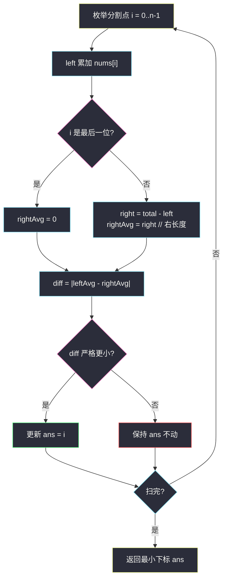
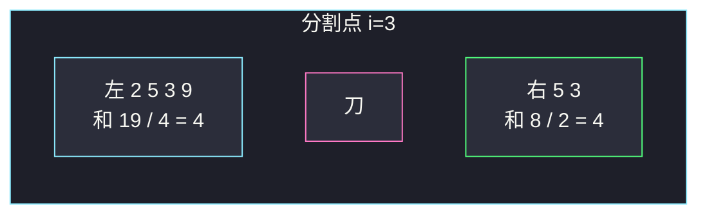

# 最小平均差（前后缀分解）

## 一、问题描述

给你下标从 0 开始、长度为 `n` 的整数数组 `nums`。下标 `i` 处的**平均差**是：

- 左边：`nums[0..i]`（共 `i+1` 个数）的平均值，向下取整；
- 右边：`nums[i+1..n-1]`（共 `n-i-1` 个数）的平均值，向下取整；右边长度为 0 时，平均值视为 **0**（不要除以 0）。

平均差 = `|⌊leftAvg⌋ - ⌊rightAvg⌋|`。返回平均差最小的下标；有多个时返回**最小下标**。

> 🔗 LeetCode 2256：https://leetcode.cn/problems/minimum-average-difference/
>
> 数据范围：`1 ≤ n ≤ 10^5`，`0 ≤ nums[i] ≤ 10^5`。整数除法向下取整。前缀和最大约 `10^10`，用 64 位。
>
> 📚 灵茶题单：**专题：前后缀分解**。枚举分割点 `i`，左边是前缀、右边是后缀；先预处理总和，扫一遍就能算出每一刀的左右和。

**示例 1**

```
输入：nums = [2,5,3,9,5,3]
输出：3
解释：i=3 时左边 ⌊19/4⌋=4，右边 ⌊8/2⌋=4，差为 0，是最小。
```

**示例 2**

```
输入：nums = [0]
输出：0
解释：唯一下标。右边视为 0，|⌊0/1⌋ - 0| = 0。
```

**直观理解**

在每个位置「切一刀」：刀落在 `i` 与 `i+1` 之间，比较左右两段的整数均值。`n=10^5` 时不能每个 `i` 再扫一遍求和，前缀和（或滚动左和）把每次求和压成 `O(1)`。

---

## 二、暴力解法

枚举每个分割点 `i`，再分别扫左边、右边求和。

```python
class Solution:
    def minimumAverageDifference(self, nums: list[int]) -> int:
        n = len(nums)
        best_i, best_d = 0, 10**18
        for i in range(n):
            left = sum(nums[: i + 1])
            right = sum(nums[i + 1 :])
            left_avg = left // (i + 1)
            right_avg = 0 if i == n - 1 else right // (n - i - 1)
            d = abs(left_avg - right_avg)
            if d < best_d:
                best_d, best_i = d, i
        return best_i
```

官方两例都能过。`n=10^5` 时每个 `i` 再 `O(n)` 求和，总时间 `O(n²)`，超时。

### 🔴 瓶颈在哪里

左右和随 `i` 右移只差一个 `nums[i]`：左和增加、右和减少。总和固定时，`right = total - left`。扫一遍即可。

---

## 三、优化探索（核心章节）

> 📚 本题在灵茶题单中属于 **专题：前后缀分解**。模板：枚举分界 `i`，左侧用前缀信息、右侧用「总和 − 前缀」或预计算的后缀信息。

### 3.1 分割点画清楚

下标 `i` 的含义是「左边包含 `nums[i]`」。刀画在 `i` 的**右边**：

```
下标     0    1    2    3  |  4    5
nums     2    5    3    9  |  5    3
         <--- 左 0..i --->     <- 右 ->
```

`i = n-1` 时刀在数组末尾之后，右边是空段，均值规定为 0。



粉节点是两处易错：空右段、以及「相等时不更新」才能保住最小下标。

### 3.2 滚动前缀和

```
total = sum(nums)
left = 0
对 i = 0 .. n-1:
    left += nums[i]
    leftAvg = left // (i+1)
    若 i == n-1: rightAvg = 0
    否则: rightAvg = (total - left) // (n-i-1)
    用 |leftAvg - rightAvg| 更新答案（严格更小才换下标）
```

元素非负，Python `//` 与题意「向下取整」一致；Java 用 `long` 做 `/` 即可。

### 3.3 一句话核心

> **枚举刀口 i，左和滚动累加、右和 = 总和 − 左和；空右边均值当 0，差严格变小才更新下标。**

---

## 四、代码实现

### Python（主解）

```python
class Solution:
    def minimumAverageDifference(self, nums: list[int]) -> int:
        n = len(nums)
        total = sum(nums)
        left = 0
        best_i, best_d = 0, 10**18
        for i, x in enumerate(nums):
            left += x
            left_avg = left // (i + 1)
            if i == n - 1:
                right_avg = 0
            else:
                right_avg = (total - left) // (n - i - 1)
            d = abs(left_avg - right_avg)
            if d < best_d:
                best_d, best_i = d, i
        return best_i
```

**变量含义**

| 写法 | 含义 |
|------|------|
| `total` | 全程总和，只算一次 |
| `left` | `nums[0..i]` 的和 |
| `left // (i+1)` | 左均值，整数除法 |
| `i == n-1` | 右段为空，均值 0 |
| `d < best_d` | 严格小于才更新，并列时留下更小的 `i` |

### Java（最优解，注意 long）

```java
class Solution {
    public int minimumAverageDifference(int[] nums) {
        int n = nums.length;
        long total = 0;
        for (int x : nums) {
            total += x;
        }
        long left = 0;
        int bestI = 0;
        long bestD = Long.MAX_VALUE;
        for (int i = 0; i < n; i++) {
            left += nums[i];
            long leftAvg = left / (i + 1);
            long rightAvg = (i == n - 1) ? 0 : (total - left) / (n - i - 1);
            long d = Math.abs(leftAvg - rightAvg);
            if (d < bestD) {
                bestD = d;
                bestI = i;
            }
        }
        return bestI;
    }
}
```

`n * 10^5` 最大 `10^10`，`int` 会溢出，必须 `long`。

---

## 五、具体例子演示

### 5.1 官方示例 1：画出每一刀

`nums = [2,5,3,9,5,3]`，`total = 27`。逐步滚动 `left`。

| i | 左段 | left | leftAvg | 右段 | right | rightAvg | 差 | 更新 |
|---|------|------|---------|------|-------|----------|----|------|
| 0 | [2] | 2 | 2 | [5,3,9,5,3] | 25 | 5 | 3 | ans=0 |
| 1 | [2,5] | 7 | 3 | [3,9,5,3] | 20 | 5 | 2 | ans=1 |
| 2 | [2,5,3] | 10 | 3 | [9,5,3] | 17 | 5 | 2 | 2 不小于 2，保持 1 |
| 3 | [2,5,3,9] | 19 | 4 | [5,3] | 8 | 4 | 0 | ans=3 |
| 4 | [2,5,3,9,5] | 24 | 4 | [3] | 3 | 3 | 1 | 不更新 |
| 5 | 全程 | 27 | 4 | [] | 0 | 0 | 4 | 不更新 |

`i=2` 与 `i=1` 差都是 2，题目要最小下标，`d < best_d` 不能写成 `<=`。最终差 0 出现在 `i=3`，对拍官方输出 3。



粉刀口两侧均值同为 4，绝对差 0，这就是答案位置。

### 5.2 官方示例 2：n=1

`nums = [0]`。`i=0` 已是末位，`leftAvg = 0 // 1 = 0`，右边强制 0，差 0。不能写 `(total-left)//(n-i-1)`，分母为 0。对拍官方输出 0。

### 5.3 并列最小差

`[1,1,1,1]`：每个 `i` 的差都是 `|⌊(i+1)/ (i+1)⌋ - ⌊(n-i-1 或 0) 的均值⌋|`。`i=0` 已是 0（左 1，右 ⌊3/3⌋=1）。后面即使再出现 0，也不更新。答案 0。

---

## 六、复杂度分析

| 方法 | 时间 | 空间 | 说明 |
|------|------|------|------|
| 每个 i 再求和 | `O(n²)` | `O(1)` | `n=10^5` 超时 |
| 滚动前缀和（主解） | `O(n)` | `O(1)` | 总和一次、左和滚动 |
| 显式前缀数组 | `O(n)` | `O(n)` | 能写，没必要 |

---

## 七、对比总结

| 维度 | 暴力 | 前后缀 |
|------|------|--------|
| 每次左右和 | 再扫一遍 | `O(1)` |
| 空右段 | 容易除零 | 末位特判均值 0 |
| 并列下标 | 从左往右第一次即可 | 严格 `<` 才更新 |

**易错点**

1. **`i=n-1` 除以 0**：右边长度是 0，题面规定均值 0，不要写 `// 0`。
2. **Java 用 `int` 存和**：`10^5 * 10^5 = 10^10`，溢出后均值全错。
3. **差相等时用 `<=` 更新**：会改成更大的下标，与「最小下标」相反。
4. **左段不含 `nums[i]`**：题意左边是前 `i+1` 个，必须把当前元素算进左和再除。
5. **先除再减**：要 `|⌊L⌋ - ⌊R⌋|`，不是 `⌊|L-R|⌋`，更不是先除浮点再取整。

---

## 八、举一反三

| 题目 | 关系 |
|------|------|
| [724. 寻找数组的中心下标](https://leetcode.cn/problems/find-pivot-index/) | 同专题：左和 == 右和，空段当 0 |
| [2270. 分割数组的方案数](https://leetcode.cn/problems/number-of-ways-to-split-array/) | 枚举刀口，比较前缀和与后缀和 |
| [238. 除自身以外数组的乘积](https://leetcode.cn/problems/product-of-array-except-self/) | 左前缀积 × 右后缀积 |
| [2012. 数组美丽值求和](https://leetcode.cn/problems/sum-of-beauty-in-the-array/) | 同批前后缀：左 max、右 min |
| [2483. 商店的最少代价](https://leetcode.cn/problems/minimum-penalty-for-a-shop/) | 枚举关门时刻，左右两种计数 |
| [1525. 字符串的好分割数目](https://leetcode.cn/problems/number-of-good-ways-to-split-a-string/) | 左右不同字符种数是否相等 |

**思想迁移**

- 问「在 i 切开后左右各是什么」，先画刀口，再决定左含不含 `i`。
- 口诀：**「总和减左得右；空段当 0；差更小才换刀口。」**
