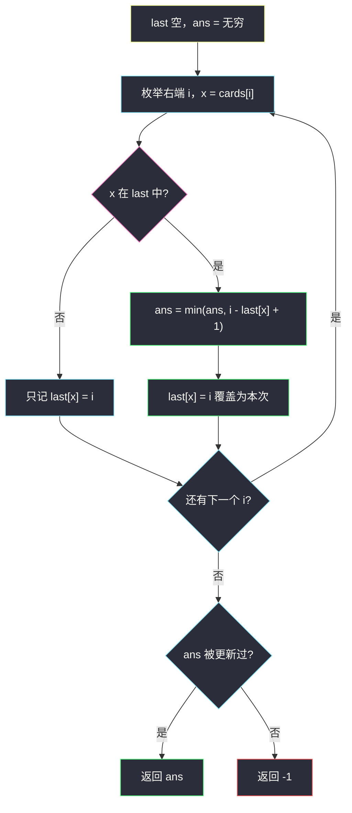
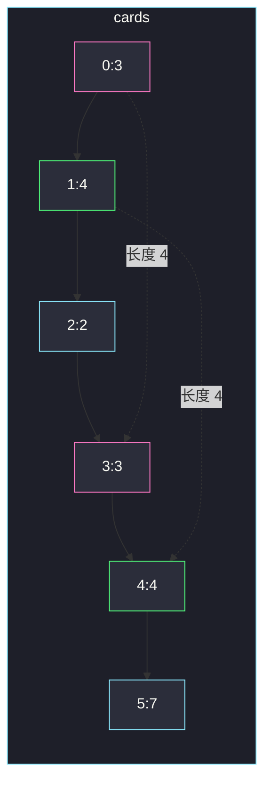

# 必须拿起的最小连续卡牌数（枚举右，维护左）

## 一、问题描述

给你一个整数数组 `cards`，`cards[i]` 是第 `i` 张牌的点数。一对匹配牌 = 点数相同的两张牌。

你必须拿起一段**连续**的卡牌，使得这段里至少有一对匹配牌。返回这段的**最短长度**；若无论如何都凑不出一对，返回 `-1`。

> 🔗 LeetCode 2260：https://leetcode.cn/problems/minimum-consecutive-cards-to-pick-up/
>
> 数据范围：`1 <= cards.length <= 10^5`，`0 <= cards[i] <= 10^6`。

**示例 1**

```
输入：cards = [3,4,2,3,4,7]
输出：4
解释：拿 [3,4,2,3]（两个 3）或 [4,2,3,4]（两个 4），长度都是 4。
```

**示例 2**

```
输入：cards = [1,0,5,3]
输出：-1
解释：所有点数都不同，不存在匹配对。
```

**直观理解**

「连续一段里至少有两张相同」⇔ 这段的左右端点是某点数的两次出现（中间可以夹别的牌）。最短段一定是**某点数两次相邻出现**之间的距离（含两端），不会跳过同点数的中间那次——跳过只会更长。

于是问题变成：对每个点数，看它所有出现下标，求相邻两次下标差 + 1 的最小值。

---

## 二、暴力解法

枚举所有左右端点，用集合判断窗口里有没有重复。

```python
class Solution:
    def minimumCardPickup(self, cards: List[int]) -> int:
        n = len(cards)
        ans = n + 1
        for l in range(n):
            seen = set()
            for r in range(l, n):
                if cards[r] in seen:
                    ans = min(ans, r - l + 1)
                    break
                seen.add(cards[r])
        return -1 if ans == n + 1 else ans
```

内层一出现重复就可以 `break`：再往右只会更长。

### 复杂度

- **时间**：最坏 `O(n²)`。每个左端点向右扩到第一次重复。
- **空间**：`O(n)`。

### 🔴 瓶颈在哪里

`n` 达 `10^5`，平方级超时。真正有用的窗口只是「某值两次出现」夹出来的那一段；用哈希表记下每个值**上一次**出现的下标，枚举右端时 `O(1)` 就能算出这段长度。

---

## 三、优化探索（核心章节）

> 📚 本题在灵茶题单中属于 **滑动窗口 / 双指针 · §0.1 枚举右，维护左**。右端 `i` 扫过去；左边不需要真的维护一个指针，因为对「最短重复段」来说，左边就是这个值上次出现的位置。

### 3.1 最短段只可能是相邻两次出现

同一点数出现在下标 `p0 < p1 < p2`。三段候选长度：

```
p1 - p0 + 1    p2 - p1 + 1    p2 - p0 + 1
```

最后一段严格更长。所以每个点数只需看**相邻出现**，全局再取 min。

### 3.2 一遍扫描：last[x] = 上次下标

枚举右端 `i`，当前牌 `x = cards[i]`：

- 若 `x` 没见过：记下 `last[x] = i`。
- 若见过：这一对相邻出现的长度为 `i - last[x] + 1`，用来更新答案，然后**把 `last[x]` 改成 i**（下次再配对时要用最近的一次）。



### 3.3 为什么覆盖 last 而不是保留最早

§0.1 的常见写法是「枚举右，左端能缩就缩」。这里左端对每个值独立：配对对象必须是**最近一次**同值。如果保留最早下标，算出的是「这个值第一次出现到现在」的长度，会偏大，答案仍然正确（因为后面相邻对还会更新），但没有必要；而且若某值只出现两次且你写错成别的逻辑，更容易乱。标准写法：**用过就覆盖成当前 i**。

### 3.4 一句话核心

> **枚举右端 i；哈希表记每个点数上次下标；再次遇到就用 `i - last[x] + 1` 更新最短长度，再覆盖 last。**

---

## 四、代码实现

### Python（主解）

```python
class Solution:
    def minimumCardPickup(self, cards: List[int]) -> int:
        last = {}
        ans = inf
        for i, x in enumerate(cards):
            if x in last:
                ans = min(ans, i - last[x] + 1)
            last[x] = i
        return -1 if ans is inf else ans
```

**变量含义**

| 变量 | 含义 |
|------|------|
| `last[x]` | 点数 `x` 最近一次出现的下标 |
| `ans` | 目前最短的「含一对相同牌」连续段长度 |

`from math import inf` 在 LeetCode 环境可用；也可用 `ans = n + 1` 当哨兵。

### Java（最优解同款）

```java
class Solution {
    public int minimumCardPickup(int[] cards) {
        Map<Integer, Integer> last = new HashMap<>();
        int ans = cards.length + 1;
        for (int i = 0; i < cards.length; i++) {
            Integer p = last.get(cards[i]);
            if (p != null) {
                ans = Math.min(ans, i - p + 1);
            }
            last.put(cards[i], i);
        }
        return ans == cards.length + 1 ? -1 : ans;
    }
}
```

`cards[i] ≤ 10^6`，也可用 `int[] lastPos = new int[1_000_001]` 填 `-1` 代替哈希表，常数更好。哈希写法与 §0.1 模板一致，点数范围变大时不用改。

---

## 五、具体例子演示

### 5.1 `cards = [3, 4, 2, 3, 4, 7]`

逐步跟踪 **last 表**：

| i | x | last（更新前） | 判定 | last（更新后） | ans |
|---|---|----------------|------|----------------|-----|
| 0 | 3 | `{}` | 未见过 | `{3:0}` | — |
| 1 | 4 | `{3:0}` | 未见过 | `{3:0, 4:1}` | — |
| 2 | 2 | `{3:0, 4:1}` | 未见过 | `{3:0, 4:1, 2:2}` | — |
| 3 | 3 | `{3:0, 4:1, 2:2}` | `3-0+1=4` | `{3:3, 4:1, 2:2}` | 4 |
| 4 | 4 | `{3:3, 4:1, 2:2}` | `4-1+1=4` | `{3:3, 4:4, 2:2}` | 4 |
| 5 | 7 | `{3:3, 4:4, 2:2}` | 未见过 | `{…, 7:5}` | 4 |

两段最优窗口：下标 `[0..3]` 的两个 3，以及 `[1..4]` 的两个 4。



### 5.2 `cards = [1, 0, 5, 3]`

| i | x | last 动作 |
|---|---|-----------|
| 0 | 1 | 记 `1:0` |
| 1 | 0 | 记 `0:1` |
| 2 | 5 | 记 `5:2` |
| 3 | 3 | 记 `3:3` |

从未命中「已在 last 中」，返回 **-1** ✓。

### 5.3 相邻相同：`cards = [1, 2, 1, 1]`

| i | x | 距离 | last 更新后 | ans |
|---|---|------|-------------|-----|
| 0 | 1 | — | `{1:0}` | — |
| 1 | 2 | — | `{1:0, 2:1}` | — |
| 2 | 1 | `2-0+1=3` | `{1:2, 2:1}` | 3 |
| 3 | 1 | `3-2+1=2` | `{1:3, 2:1}` | **2** |

若 i=2 时不覆盖 `last[1]`，i=3 会算成 `3-0+1=4`，丢掉相邻的两个 1。必须覆盖。

---

## 六、复杂度分析

| 方法 | 时间 | 空间 | 说明 |
|------|------|------|------|
| 枚举左右端 | `O(n²)` | `O(n)` | n=1e5 超时 |
| last 哈希（主解） | `O(n)` | `O(n)` | 每种点数至多一条记录 |

一遍扫描。哈希表最多存 `n` 个不同点数；若用数组下标映射，空间是 `O(值域)`。

---

## 七、对比总结

| 维度 | 暴力窗口 | last 哈希 |
|------|----------|-----------|
| 找重复 | 窗口内再开 set | 一次查表 |
| 左端 | 真的枚举 l | 就是该值上次下标 |
| 同一值多次 | 很多窗口 | 只保留最近一次 |

**易错点**

1. **距离漏了 `+1`**：下标差是间隔，长度要含两端。`[3,4,2,3]` 是 4 不是 3。
2. **不覆盖 last**：相邻重复会被更早的那次「拉长」。
3. **无解返回 0 或 `inf`**：没更新过就要 `-1`。
4. **先覆盖再算距离**：必须先用旧的 `last[x]` 再赋值，否则距离恒为 1。
5. **当成「全数组最短重复」却用第一次和最后一次**：那是最**长**跨度，本题要最短。

**模板（§0.1 枚举右，维护左）**

```python
last = {}
ans = inf
for i, x in enumerate(cards):
    if x in last:
        ans = min(ans, i - last[x] + 1)
    last[x] = i
```

左端信息压缩在 `last[x]` 里，不必另开 `l` 指针。

---

## 八、举一反三

| 题目 | 关系 |
|------|------|
| [219. 存在重复元素 II](https://leetcode.cn/problems/contains-duplicate-ii/) | 同样 last 下标，判断 `i - last[x] ≤ k` |
| [3. 无重复字符的最长子串](https://leetcode.cn/problems/longest-substring-without-repeating-characters/) | §0.1：枚举右，左端跳到 `last[x]+1` |
| [1695. 删除子数组的最大得分](https://leetcode.cn/problems/maximum-erasure-value/) | 同目录 `maximum-erasure-value.md`：无重复窗口 + 前缀和 |
| [217. 存在重复元素](https://leetcode.cn/problems/contains-duplicate/) | 只要出现过，不看距离 |
| [2190. 数组中紧跟 key 之后出现最频繁的数](https://leetcode.cn/problems/most-frequent-number-following-key-in-an-array/) | 扫描时看「上一个是不是 key」 |

**思想迁移**

- 「最短 / 最长连续段，段内某种元素出现两次」→ 枚举右，表里留该元素上次位置。
- 口诀：**「右端扫到重复值，长度就是 i 减上次再加一；用完把 last 改成现在。」**
