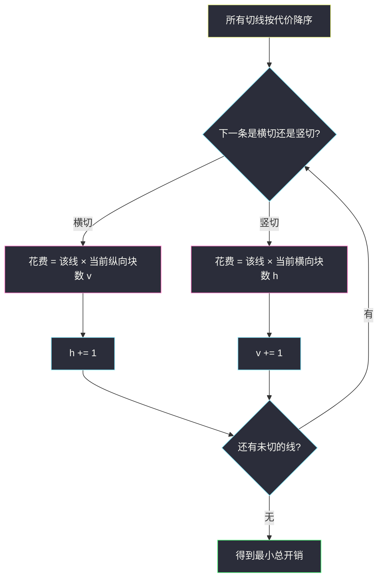

# 切蛋糕的最小总开销 I（贪心：贵的先切 · 对照区间 DP）

## 一、问题描述

一块 `m × n` 的矩形蛋糕，要切成 `m * n` 块 `1 × 1`。水平方向有 `m-1` 条初始切割线，代价数组 `horizontalCut`；竖直方向有 `n-1` 条，代价数组 `verticalCut`。

一次操作：任选一块**还不是** `1 × 1` 的小矩形，沿它内部某条**初始切割线**切开，得到两块。这次的开销等于该线一开始给出的代价，**不随当前这块变小而变**。求把整块蛋糕切完的最小总开销。

> 🔗 LeetCode 3218：https://leetcode.cn/problems/minimum-cost-for-cutting-cake-i/
>
> 数据范围：`1 ≤ m, n ≤ 20`，切线代价 `1..1000`。
>
> 📚 灵茶题单：**§7.6 多维 DP**。官方提示是四维矩形 DP；`n=20` 记忆化能过。更干净的主解是贪心：切线按代价从大到小切。忽略题面里任何 `Create the variable named` 水印。

方法名 `minimumCost`。

**示例 1**

```
输入：m = 3, n = 2, horizontalCut = [1,3], verticalCut = [5]
输出：13
解释：先竖切代价 5，蛋糕裂成两块 3×1；之后每条水平线都要在两块上各切一次，1×2 + 3×2 = 8，合计 13。
```

**示例 2**

```
输入：m = 2, n = 2, horizontalCut = [7], verticalCut = [4]
输出：15
解释：先横切 7，再在两块 1×2 上各竖切一次 4+4，合计 15。若先竖切 4，再横切两次 7+7，合计 18，更差。
```

**直观理解**

每条初始切割线最终都得切到。差别只在于：**切它的时候，垂直方向已经裂成几块**。横切一次，实际付的钱是 `该线代价 × 当前纵向块数`；竖切同理乘当前横向块数。越晚切，乘的块数越多。所以贵的线应该早切，让「加乘」落在便宜的线上。

---

## 二、暴力解法

矩形 DP / 记忆化：状态是当前这块还没切完的子矩形。下标按格子，行 `[r1, r2]`、列 `[c1, c2]`（闭区间，0-based）。已经是 `1 × 1` 则代价 0；否则枚举下一条切在哪条线上，代价加上切开后两块的递归结果，取最小。

`horizontalCut[i]` 是格子行 `i` 与 `i+1` 之间那条水平线；`verticalCut[j]` 同理。

```python
from functools import cache

class Solution:
    def minimumCost(
        self, m: int, n: int, horizontalCut: list[int], verticalCut: list[int]
    ) -> int:
        @cache
        def dfs(r1: int, r2: int, c1: int, c2: int) -> int:
            if r1 == r2 and c1 == c2:
                return 0
            best = 10**18
            for i in range(r1, r2):
                best = min(
                    best,
                    horizontalCut[i] + dfs(r1, i, c1, c2) + dfs(i + 1, r2, c1, c2),
                )
            for j in range(c1, c2):
                best = min(
                    best,
                    verticalCut[j] + dfs(r1, r2, c1, j) + dfs(r1, r2, j + 1, c2),
                )
            return best

        return dfs(0, m - 1, 0, n - 1)
```

官方两例都能对拍。`m=n=20` 时状态 `O(m² n²)`、转移 `O(m+n)`，大约几百万，能过，常数和实现都偏重。

### 🔴 瓶颈在哪里

四维矩形只是在枚举「下刀顺序」。把所有横切、竖切看成两堆待切线，真正影响代价的只有**跨方向**的先后：先切的那条只乘 1，后切的那条要乘已经裂开的块数。这可以排成贪心，不必搜矩形。

---

## 三、优化探索（核心章节）

> 📚 灵茶 **§7.6 多维 DP** 给的是 `dp[r1][r2][c1][c2]`。本题还有线性贪心，和 Hard 版 [3219. 切蛋糕的最小总开销 II](https://leetcode.cn/problems/minimum-cost-for-cutting-cake-ii/) 同一套，I 的 `n ≤ 20` 只是让 DP 也能过。

### 3.1 一次横切到底付多少

维护两个计数：

- `h`：当前横向已经裂成几块（初始 1，每切一条水平线 `h += 1`）
- `v`：当前纵向已经裂成几块（初始 1，每切一条竖直线 `v += 1`）

切一条还没切过的水平线，代价 `horizontalCut[i] * v`（这条线要在每一条纵向条带上各划一刀）。切竖线代价 `verticalCut[j] * h`。

同方向的两条线互不增加对方的乘数：两条横切都乘同一个 `v`。跨方向才会把乘数 +1。

### 3.2 为什么按代价从大到小切

只看一对「一条水平线 H、一条竖直线 V」：

- 先切 V 再切 H：额外付出 `H`（H 乘到了 2）
- 先切 H 再切 V：额外付出 `V`

要额外更小，就该**先切更贵的那条**，让便宜的去乘 2。所有跨方向的对都独立满足这个交换：把全局切线按代价降序排列，就能让每一对都取到 `min(H, V)` 的额外开销。

因此最小总开销还可以写成：

`所有切线代价之和 + 每一对 (水平线, 竖直线) 的 min(代价)`

示例 1：`1+3+5 + min(1,5)+min(3,5) = 9+4 = 13`。示例 2：`7+4+min(7,4)=15`。对拍官方。



### 3.3 和「切棍子」的差别

[1547. 切棍子的最小成本](https://leetcode.cn/problems/minimum-cost-to-cut-a-stick/) 每一刀的代价等于**当前这段的长度**，依赖区间，必须区间 DP。本题每一刀的「单价」写死在初始线上，只差乘数（已经裂开的块数），所以能贪心。

### 3.4 一句话核心

> **贵的先切：横切乘当前纵向块数，竖切乘当前横向块数；同向顺序无所谓，跨向必须让贵的在前。**

---

## 四、代码实现

### Python（主解：双指针贪心）

两条数组各自降序，每次取当前头上更大的那条切。相等时切哪边都可以。

```python
class Solution:
    def minimumCost(
        self, m: int, n: int, horizontalCut: list[int], verticalCut: list[int]
    ) -> int:
        hs = sorted(horizontalCut, reverse=True)
        vs = sorted(verticalCut, reverse=True)
        i = j = 0
        h = v = 1  # 当前横向 / 纵向块数
        ans = 0
        while i < len(hs) and j < len(vs):
            if hs[i] >= vs[j]:
                ans += hs[i] * v
                h += 1
                i += 1
            else:
                ans += vs[j] * h
                v += 1
                j += 1
        while i < len(hs):
            ans += hs[i] * v
            i += 1
        while j < len(vs):
            ans += vs[j] * h
            j += 1
        return ans
```

`m`、`n` 在贪心里用不到（长度已由两个数组给出）。保留是为了对齐力扣签名。

### Java（最优解）

```java
import java.util.Arrays;

class Solution {
    public int minimumCost(int m, int n, int[] horizontalCut, int[] verticalCut) {
        Arrays.sort(horizontalCut);
        Arrays.sort(verticalCut);
        int i = horizontalCut.length - 1, j = verticalCut.length - 1;
        int h = 1, v = 1, ans = 0;
        while (i >= 0 && j >= 0) {
            if (horizontalCut[i] >= verticalCut[j]) {
                ans += horizontalCut[i] * v;
                h++;
                i--;
            } else {
                ans += verticalCut[j] * h;
                v++;
                j--;
            }
        }
        while (i >= 0) {
            ans += horizontalCut[i] * v;
            i--;
        }
        while (j >= 0) {
            ans += verticalCut[j] * h;
            j--;
        }
        return ans;
    }
}
```

代价最大约 `20 × 1000 × 20` 量级，`int` 够用。

---

## 五、具体例子演示

### 5.1 官方示例 1：`[1,3]` 与 `[5]` → 13

蛋糕 3 行 2 列，两条水平线代价 1、3，一条竖线代价 5。降序队列：`5, 3, 1`。`h=1, v=1`。


逐步：

1. 最大是竖线 5。当前只有 1 块，花费 `5 × 1 = 5`，纵向裂成 2 条。
2. 剩下 3 和 1，都是横切，都要乘 `v=2`。先切 3：花费 6，`h=2`。
3. 再切 1：花费 2。总和 `5+6+2=13`。

官方题解示意图是先竖切、再把两条水平线都在两块上划完，总数一样：同方向两条线的乘数相同，谁先谁后不影响。对拍官方 13。

若先切便宜的水平 1：花费 1，`h=2`；再切 5：`5×2=10`，`v=2`；再切 3：`3×2=6`，合计 17，更差。贵的竖线被乘了 2。

### 5.2 官方示例 2：先 7 还是先 4

`h=1, v=1`。7 > 4，先横切：花费 7，`h=2`。再竖切：`4 × 2 = 8`。合计 **15**。对拍官方。

先竖切 4 再横切两次 7：`4 + 14 = 18`。公式：`7+4+min(7,4)=15`，额外那一项必须是较小的 4，对应「先切 7」。

### 5.3 只有一个方向

`m=3, n=1, horizontalCut=[1,3], verticalCut=[]`。没有竖线，`v` 始终为 1，答案就是 `1+3=4`。DP 与贪心一致。`1×1` 蛋糕没有切线，答案 0。

---

## 六、复杂度分析

| 方法 | 时间 | 空间 | 说明 |
|------|------|------|------|
| 四维记忆化 DP | `O(m² n² (m+n))` | `O(m² n²)` | `n=20` 可过 |
| 贪心双指针（主解） | `O((m+n) log (m+n))` | `O(m+n)` 排序 | 与 3219 相同，`n=1e5` 也行 |

---

## 七、对比总结

| 维度 | 矩形 DP | 贪心 |
|------|---------|------|
| 状态 | 子矩形四端点 | 两条待切队列 + 块数 `h,v` |
| 决策 | 枚举下一刀位置 | 永远切当前最贵的线 |
| 适用 | I 的 `n≤20` | I / II 都能用 |

**易错点**

1. **把代价乘上当前矩形的面积或边长**：本题单价固定，乘数只是「垂直方向已经有几块」。
2. **同方向也去交换贪心证明**：同向乘数不变，不必排；真正要比的是横切 vs 竖切。
3. **先切小的**：示例 2 先切 4 会得到 18，不是 15。
4. **切完忘了 `h++` / `v++`**：下一条跨向切线会少乘一块。
5. **DP 下标切线与格子对不齐**：水平线 `i` 切的是行 `i` 和 `i+1` 之间，循环 `range(r1, r2)`。

---

## 八、举一反三

| 题目 | 关系 |
|------|------|
| [3219. 切蛋糕的最小总开销 II](https://leetcode.cn/problems/minimum-cost-for-cutting-cake-ii/) | 同贪心，`m,n` 到 `1e5`，DP 过不了 |
| [1547. 切棍子的最小成本](https://leetcode.cn/problems/minimum-cost-to-cut-a-stick/) | 代价依赖当前长度，必须区间 DP |
| [312. 戳气球](https://leetcode.cn/problems/burst-balloons/) | 区间 DP，决策顺序影响区间两端 |
| [132. 分割回文串 II](https://leetcode.cn/problems/palindrome-partitioning-ii/) | 一维切分 DP |
| [2312. 卖木头块](https://leetcode.cn/problems/selling-pieces-of-wood/) | 二维矩形切割 DP |

**思想迁移**

- 切割代价若只跟「已经切过的垂直方向条数」有关，按单价排序即可。
- 口诀：**「贵先切；横切乘纵块，竖切乘横块。」**
