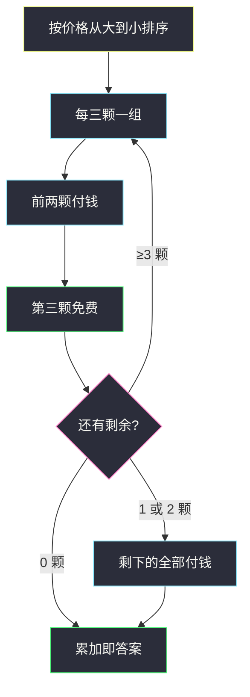
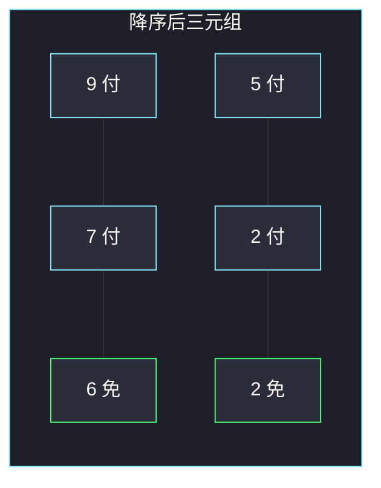

# 打折购买糖果的最小开销（单序列配对 · 每第三件免费）

## 一、问题描述

商店规则：每买两颗糖果，可以免费再拿一颗。免费那颗的价格必须 **≤ 两颗已买里较便宜的那颗**。给定每颗糖的价格 `cost`，必须拿齐所有糖，求最小总花费。

> 🔗 LeetCode 2144：https://leetcode.cn/problems/minimum-cost-of-buying-candies-with-discount/
>
> 数据范围：`1 ≤ cost.length ≤ 100`，`1 ≤ cost[i] ≤ 100`。
>
> 📚 灵茶题单：**§1.2 单序列配对**（1261 分）。

**示例 1**

```
输入：cost = [1,2,3]
输出：5
解释：买 2 和 3，免费拿 1。不能买 1 和 3 去免费拿 2：
因为 min(1,3)=1，2 比 1 贵，不满足免费条件。
```

**示例 2**

```
输入：cost = [6,5,7,9,2,2]
输出：23
解释：买 9 和 7，免费 6；再买 5 和 2，免费另一个 2。
花费 9+7+5+2 = 23。
```

**示例 3**

```
输入：cost = [5,5]
输出：10
解释：只有两颗，没法触发免费，两颗都付钱。
```

**直观理解**

总价固定，最小化花费 = **最大化免费那几颗的价格**。能免 `⌊n/3⌋` 颗。免费糖不能比「给它买单的两颗」里较便宜的那颗更贵，所以要免掉贵的，得先买两颗更贵的来「罩住」它。

---

## 二、暴力解法

总花费 = 全价和 − 被免掉的价格和。枚举哪些糖当免费（至多 `⌊n/3⌋` 颗），再检查剩下的糖能否两两罩住每一颗免费糖。`n ≤ 100` 子集枚举不可行。

短数组还能全排列后按「付、付、免」模拟，取最小：

```python
from itertools import permutations

class Solution:
    def minimumCost(self, cost: list[int]) -> int:
        n = len(cost)
        best = sum(cost)
        for perm in set(permutations(cost)):
            s = 0
            for i, v in enumerate(perm):
                if i % 3 != 2:
                    s += v
            best = min(best, s)
        return best
```

这只在 `n` 很小时能跑，且「任意顺序付付免」并不对应题目约束，只能当错误对照。正确约束必须让免费颗 ≤ 那两颗已付的较小值。

### 🔴 瓶颈在哪里

配对对象一旦按价格排序，最优分组就定了：最贵的两颗去罩住次贵的那颗免费，然后对剩下的重复。不必搜索匹配。

---

## 三、优化探索（核心章节）

> 📚 本题在灵茶题单中属于 **§1.2 单序列配对**：先排序，再按固定步长配对。买二送一在排序后变成「每三颗里免掉第三颗」。

### 3.1 能免几颗

`n` 颗糖最多免 `⌊n/3⌋` 颗（每三颗触发一次），剩下 `n % 3` 颗只能付钱。要花最少，这 `⌊n/3⌋` 个免费名额应留给「在约束下尽可能贵」的糖。

### 3.2 降序后每第三件免费

把 `cost` **从大到小**排序。分组 `(最大, 次大, 第三大)`、`(第四, 第五, 第六)` ……

第三大 ≤ 次大 = `min(最大, 次大)`，免费条件刚好成立。免掉的是当前还能被罩住的最贵的那颗。后面组同理。

下标（0-based）`2, 5, 8, ...` 即 `i % 3 == 2` 的位置免费，其余累加。

### 3.3 等价写法：从贵的往下「付两免一」

升序排好后从右往左：付最贵、再付次贵、跳过第三贵（免），直到没糖。与降序 `i % 3 == 2` 免费是同一批糖。



### 3.4 一句话核心

> **降序排序，每第三件免费（下标 2, 5, 8, …）；要花最少，就让最贵的被更贵的两颗罩住后免掉。**

---

## 四、代码实现

### Python（主解：降序，每第三件免）

```python
from typing import List

class Solution:
    def minimumCost(self, cost: List[int]) -> int:
        cost.sort(reverse=True)
        return sum(v for i, v in enumerate(cost) if i % 3 != 2)
```

**变量含义**

| 写法 | 含义 |
|------|------|
| `sort(reverse=True)` | 贵的在前，方便按三元组切 |
| `i % 3 != 2` | 下标 0,1 付，2 免；3,4 付，5 免 |

从贵到便宜「付两免一」的写法（同一答案）：

```python
class Solution:
    def minimumCost(self, cost: List[int]) -> int:
        a = sorted(cost)
        ans, i = 0, len(a) - 1
        while i >= 0:
            ans += a[i]           # 付最贵
            i -= 1
            if i >= 0:
                ans += a[i]       # 再付一颗
                i -= 1
            if i >= 0:
                i -= 1            # 第三颗免费
        return ans
```

---

## 五、具体例子演示

**示例 2**：`cost = [6,5,7,9,2,2]`。

降序后：`[9, 7, 6, 5, 2, 2]`。

| 下标 i | 价格 | `i % 3` | 付还是免 |
|--------|------|---------|----------|
| 0 | 9 | 0 | 付 |
| 1 | 7 | 1 | 付 |
| 2 | 6 | 2 | **免**（6 ≤ min(9,7)=7） |
| 3 | 5 | 0 | 付 |
| 4 | 2 | 1 | 付 |
| 5 | 2 | 2 | **免**（2 ≤ min(5,2)=2） |

花费 `9+7+5+2 = 23`。全价和 31，免掉 `6+2=8`，`31-8=23`。



绿格免费。若改去免 5：需要两颗 ≥ 5 来买单，但 9、7 已经用来免 6，剩下 2、2 罩不住 5，所以免 6 和 2 才是最大免费额。

**示例 1**：`[1,2,3]` → `[3,2,1]`，付 3+2，免 1，答案 5。

**示例 3**：`[5,5]` 只有两颗，没有下标 2，两颗都付，答案 10。

**一颗**：`[8]` 无法成组，付 8。

---

## 六、复杂度分析

| 方法 | 时间 | 空间 | 说明 |
|------|------|------|------|
| 搜索免费集合 | 指数级 | `O(n)` | 不必走 |
| 排序后每第三件免（主解） | `O(n log n)` | `O(1)` 额外 / 视排序 | `n ≤ 100` |

---

## 七、对比总结

| 维度 | 本题 | #561 数组拆分 | 普通买二送一（不计价格约束） |
|------|------|---------------|------------------------------|
| 排序 | 降序 | 升序后两两取小 | 往往也是免最贵 |
| 配对 | 三元组：两付一免 | 两元组：取每对较小 | 无「免费 ≤ min」 |
| 关键约束 | 免费 ≤ 两颗里较便宜的 | 无 | 无 |

**易错点**

1. **升序后把最便宜的当免费**：`[1,2,3]` 会免 1（碰巧对），`[6,5,7,9,2,2]` 若免两个 2，花费 9+7+6+5=27 > 23。应该免尽可能贵的。
2. **不排序就按输入下标每第三件免**：输入顺序无意义。
3. **忘记 `n < 3`**：没有免费，全额付钱。
4. **免费条件理解反**：不是任意三颗里免最便宜；必须能被两颗都不更便宜的糖罩住。降序每第三件自动满足。

---

## 八、举一反三

| 题目 | 关系 |
|------|------|
| [561. 数组拆分](https://leetcode.cn/problems/array-partition/) | 同属排序后固定配对：升序后每对取较小者求和 |
| [1877. 数组中最大数对和的最小值](https://leetcode.cn/problems/minimize-maximum-pair-sum-in-array/) | 一头一尾配对，也是排序后的贪心配对 |
| [1710. 卡车上的最大单元数](https://leetcode.cn/problems/maximum-units-on-a-truck/) | 单序列：按性价比排序再取 |
| [455. 分发饼干](https://leetcode.cn/problems/assign-cookies/) | 排序后双指针配对，胃口与饼干一一匹配 |

**思想迁移**

- 总和固定时，最小花费 = 最大减免；减免名额有限时留给约束下最贵的。
- 单序列配对：先排序，再按固定步长取。
- 口诀：**「降序排好，付付免，付付免。」**
