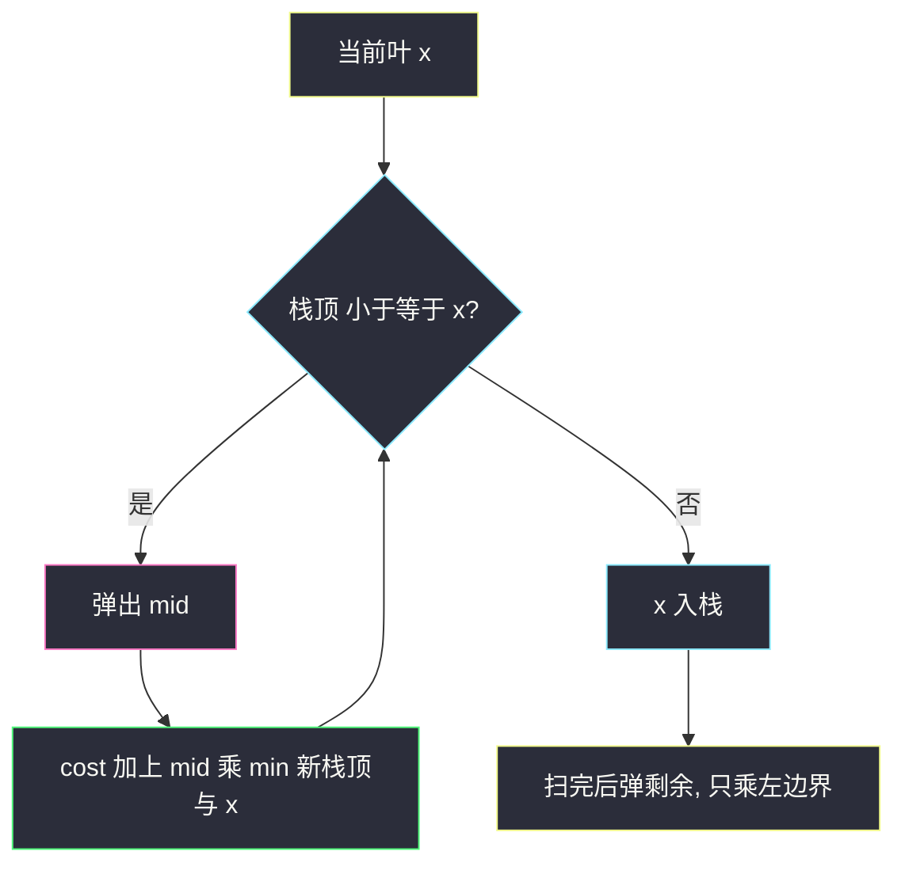
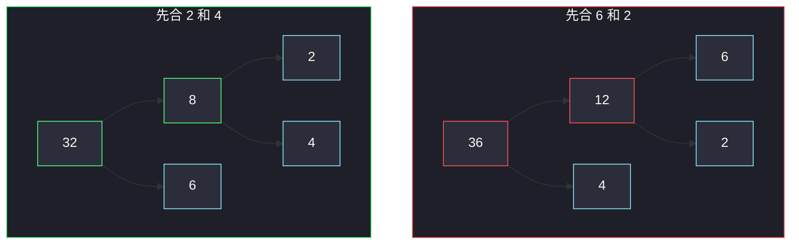

# 叶值的最小代价生成树（区间 DP · 单调递减栈贪心）

## 一、问题描述

给你一个数组 `arr`，表示一棵二叉树**从左到右的叶子值**（顺序固定，不能重排）。请给这些叶子配上内部节点，建成一棵二叉树。每个非叶节点的值规定为：

`该节点左子树的最大叶 × 右子树的最大叶`

整棵树的代价 = 所有非叶节点值之和。求可能的最小代价。

> 🔗 LeetCode 1130：https://leetcode.cn/problems/minimum-cost-tree-from-leaf-values/
>
> 数据范围：`2 <= arr.length <= 40`，`1 <= arr[i] <= 15`。`n` 很小，`O(n³)` 区间 DP 稳过；单调栈能做到 `O(n)`。
>
> 📚 灵茶题单：**单调栈 · §1.2 进阶**。DP 按切分点枚举；贪心把数组当叶，每次消掉「较小的峰」，代价 = 较小者 × min(左右边界)。

**示例 1**

```
输入：arr = [6,2,4]
输出：32
解释：先把 2 和 4 合成内部节点（值 8），再和 6 合成（值 24），和为 32。
若先合 6 和 2（值 12）再合 4（值 24），和为 36，更差。
```

**示例 2**

```
输入：arr = [4,11]
输出：44
解释：只有一种树，非叶值 4×11=44。
```

**直观理解**

叶子顺序锁死，不同的只是「哪两个相邻段先合并」。每次合并两段，代价是「左段最大叶 × 右段最大叶」，并且合并后这段的最大叶变成两者较大者，留给更上层去乘。想让大数少和大数乘，就尽量先用小数把中间层填上——对应单调栈里「小的先被两边的较大边界夹掉」。

---

## 二、暴力解法（区间 DP）

`dp[i][j]` = 用叶子 `arr[i..j]` 建成一棵树的最小代价。
`mx[i][j]` = 这段里的最大叶（预处理或顺手维护）。

枚举根的切分点 `k`（左子树叶子 `i..k`，右子树 `k+1..j`）：

`dp[i][j] = min over k ( dp[i][k] + dp[k+1][j] + mx[i][k] * mx[k+1][j] )`

长度为 1 时没有非叶，`dp[i][i] = 0`。

```python
class Solution:
    def mctFromLeafValues(self, arr: List[int]) -> int:
        n = len(arr)
        mx = [[0] * n for _ in range(n)]
        dp = [[0] * n for _ in range(n)]
        for i in range(n):
            mx[i][i] = arr[i]
            for j in range(i + 1, n):
                mx[i][j] = max(mx[i][j - 1], arr[j])
        for length in range(2, n + 1):
            for i in range(n - length + 1):
                j = i + length - 1
                dp[i][j] = min(
                    dp[i][k] + dp[k + 1][j] + mx[i][k] * mx[k + 1][j]
                    for k in range(i, j)
                )
        return dp[0][n - 1]
```

无记忆化的递归枚举切分是卡特兰数级，`n=40` 不可做；加上记忆化就是上面的 DP，`40³` 完全没问题。

### 复杂度

- **时间**：`O(n³)`。
- **空间**：`O(n²)`。

### 🔴 瓶颈在哪里

`n ≤ 40` 时 DP 已能过，但本题出现在单调栈进阶：每个叶（除全局最大外）迟早要和某一侧的较大邻居相乘被「吃掉」。对每个值，乘的是**左右两边第一个不比它小的边界里较小的那个**。用单调递减栈一次求出，`O(n)`。

---

## 三、优化探索（核心章节）

> 📚 对齐灵神 **§1.2 进阶**。任务书有一句「遇更小则弹」——对拍后应改为：**单调递减栈（底大顶小），遇更大（含相等）则弹**。递增栈、遇更小则弹会对不上官方样例。

### 3.1 代价来自「被吃掉的较小叶」

最终全局最大叶会出现在根附近，不需要再被谁乘掉（没有比它更大的边界）。其余每个 `arr[j]`，总会在某次合并里作为「较小一侧的峰值」被消掉，这次乘的因子是 `min(左边界, 右边界)`：左右边界就是它左边、右边第一个 ≥ 它的元素（没有则视为正无穷，只乘另一侧）。

对 `[6,2,4]`：

- `2` 的左边界 6、右边界 4，`min=4`，贡献 `2×4=8`；
- `4` 的左边界 6、右边没有，贡献 `4×6=24`；
- `6` 是全局最大，不贡献。

和为 32，与 DP 一致。有重复值时，「下一个 ≥」的细节容易写错，直接用递减栈按弹栈结算更稳；随机数组上与 DP 对拍一致。

### 3.2 递减栈怎么结算

栈底放哨兵 `+∞`，从左到右扫 `x`：

1. **while 栈顶 ≤ x**：弹出 `mid`。`mid` 的右边界就是当前 `x`，左边界是弹出后的新栈顶。贡献 `mid * min(新栈顶, x)`。
2. 把 `x` 压栈。

扫完后栈里是递减的（含哨兵）。剩下的元素右边没有更大的，从顶往底弹：每次 `cost += pop() * 新栈顶`，直到只剩哨兵和一个全局最大。



### 3.3 和「合并较小峰」的关系

数组上看局部：若 `a ≥ b ≤ c`，`b` 是谷，先把 `b` 与 `min(a,c)` 合并，代价 `b*min(a,c)`，`b` 从数组消失。递减栈的 while 正是在 `x` 打破递减时，把中间更小的 `mid` 当谷弹掉。相等时 `≤` 也弹，避免两个相同值谁当边界说不清。对拍：`while 栈顶 < x`（严格小于）在含重复的随机数据上同样能对上 DP；两种都行，下面代码用 `≤`。

### 3.4 不变式

扫完 `arr[0..i-1]`、准备处理 `arr[i]` 之前：

- 栈从底到顶严格递减（哨兵除外，相等已被弹掉则非严格也不留相等）；
- 已弹出的叶，其代价已经加进 `cost`，不会再出现；
- 栈里相邻两元素在原数组中，中间更小的叶都已结算。

### 3.5 一句话核心

> **递减栈遇更大则弹：弹出的峰 `mid` 乘 `min(左边界, 当前值)` 累加代价。**

---

## 四、代码实现

### Python（主解：单调递减栈）

```python
class Solution:
    def mctFromLeafValues(self, arr: List[int]) -> int:
        stack = [float("inf")]
        cost = 0
        for x in arr:
            while stack[-1] <= x:
                mid = stack.pop()
                cost += mid * min(stack[-1], x)
            stack.append(x)
        while len(stack) > 2:
            cost += stack.pop() * stack[-1]
        return cost
```

哨兵保证 `min(栈顶, x)` 在栈里只剩 `mid` 时走 `x` 这一侧。最后 `len(stack) > 2` 是哨兵 + 至少一个真实叶；弹出直到留下全局最大。

### Python（区间 DP，对照用）

见第二节。`n=40` 可当主解；本节题目在单调栈，默认交栈版。

### Java（栈版）

```java
class Solution {
    public int mctFromLeafValues(int[] arr) {
        Deque<Integer> stack = new ArrayDeque<>();
        stack.push(Integer.MAX_VALUE);
        int cost = 0;
        for (int x : arr) {
            while (stack.peek() <= x) {
                int mid = stack.pop();
                cost += mid * Math.min(stack.peek(), x);
            }
            stack.push(x);
        }
        while (stack.size() > 2) {
            cost += stack.pop() * stack.peek();
        }
        return cost;
    }
}
```

---

## 五、具体例子演示

### 5.1 官方示例 `[6,2,4]` —— 栈与 DP 对照

**栈（左为底）**

| 步 | x | 动作 | 栈 | 本步代价 | cost |
|----|---|------|----|----------|------|
| 开始 | | 哨兵 | `[∞]` | | 0 |
| 1 | 6 | `∞ ≤ 6`？否，压 6 | `[∞, 6]` | | 0 |
| 2 | 2 | `6 ≤ 2`？否，压 2 | `[∞, 6, 2]` | | 0 |
| 3 | 4 | `2 ≤ 4`，弹 2；`min(6,4)=4` | `[∞, 6]` | `2×4=8` | 8 |
| | | `6 ≤ 4`？否，压 4 | `[∞, 6, 4]` | | 8 |
| 收尾 | | 弹 4，乘栈顶 6 | `[∞, 6]` | `4×6=24` | 32 |

**DP 填表**（`mx` 上三角，`dp` 同形）

`mx`：

| | 0 | 1 | 2 |
|--|---|---|---|
| 0 | 6 | 6 | 6 |
| 1 | | 2 | 4 |
| 2 | | | 4 |

`dp` 长度 2：`dp[0][1]=12`，`dp[1][2]=8`。
长度 3：`k=0` → `0+8+6×4=32`；`k=1` → `12+0+6×4=36`。`dp[0][2]=32`。

两种切分对应两棵树：先合右边（8+24）优于先合左边（12+24）。



### 5.2 `[4,11]` —— 一次乘完

| 步 | x | 栈 | cost |
|----|---|-----|------|
| 4 | 压 | `[∞, 4]` | 0 |
| 11 | 弹 4，`4 * min(∞,11)=44` | `[∞, 11]` | 44 |
| 收尾 | 只剩哨兵+11 | | 44 |

### 5.3 `[1,2,3]` —— 递增：小的当场被右边更大的吃掉

递增时栈顶更小，`栈顶 ≤ x` 成立，**边走边弹**（不是留到收尾）。

| 步 | x | 动作 | cost |
|----|---|------|------|
| 1 | 压 | 0 |
| 2 | 弹 1，`1*min(∞,2)=2`，压 2 | 2 |
| 3 | 弹 2，`2*min(∞,3)=6`，压 3 | 8 |
| 收尾 | 只剩 3 | 8 |

DP：三种切法里最优是 `((1,2),3)`：`1×2 + 2×3 = 8`，或 `(1,(2,3))`：`2×3 + 1×3 = 9`。栈自动走了最优的 8。

### 5.4 `[3,2,1]` —— 递减，全在收尾

| 步 | 栈 | cost |
|----|-----|------|
| 压 3,2,1 | `[∞, 3, 2, 1]` | 0 |
| 弹 1，`1*2=2` | `[∞, 3, 2]` | 2 |
| 弹 2，`2*3=6` | `[∞, 3]` | 8 |

最优树是右链合并，代价 8。与 `[1,2,3]` 对称。

### 5.5 递增栈（遇更小则弹）为什么错

对 `[6,2,4]` 若维护递增栈、`2` 进来把 `6` 弹掉，会先加 `6*2=12`，走上 36 那条劣解。所以本题必须是**递减栈、大的来了把小的弹掉**。已与官方样例及随机 `n≤12` 的 DP 对拍。

---

## 六、复杂度分析

| 方法 | 时间 | 空间 | 说明 |
|------|------|------|------|
| 区间 DP | `O(n³)` | `O(n²)` | `n ≤ 40` 可通过 |
| 单调递减栈（主解） | `O(n)` | `O(n)` | 每个元素进出栈一次 |

---

## 七、对比总结

| 维度 | 区间 DP | 递减栈 |
|------|---------|--------|
| 决策 | 枚举切分 k | 每个非最大叶只乘一次边界 |
| 最优性 | 穷举保证 | 贪心：小峰先被较矮边界吃掉 |
| 重复值 | 自然正确 | 用 `≤` 弹，避免相等边界歧义 |

**易错点**

1. **写成递增栈**：官方 `[6,2,4]` 会得到 36。
2. **漏哨兵**：`mid` 弹出后栈空，`min` 没左边界，要特判或放 `inf`。
3. **收尾忘弹**：递减数组全程不进 while，代价全在最后那段。
4. **DP 漏乘 `mx左 * mx右`**：只加左右 `dp` 得到 0。
5. **把根的值也算进代价**：题目只要非叶之和；根也是非叶，DP 的那次乘法已经包含，不要再额外加一遍 `mx[0][n-1]`。

**模板（叶值代价）**

```python
stack = [inf]
# while 栈顶 <= x: mid=pop; cost += mid * min(栈顶, x)
# 扫完 while 剩多于哨兵+最大值: cost += pop * 栈顶
```

---

## 八、举一反三

| 题目 | 关系 |
|------|------|
| [84. 柱状图中最大的矩形](https://leetcode.cn/problems/largest-rectangle-in-histogram/) | 同样递减/递增栈找左右边界；那边乘的是高度×宽度，这边是叶×边界 |
| [85. 最大矩形](https://leetcode.cn/problems/maximal-rectangle/) | 每层直方图 + 84 |
| [316. 去除重复字母](https://leetcode.cn/problems/remove-duplicate-letters/) | 单调栈弹顶，但多了「后面还有」 |
| [312. 戳气球](https://leetcode.cn/problems/burst-balloons/) | 区间 DP：枚举最后合并/最后戳的位置 |
| [96. 不同的二叉搜索树](https://leetcode.cn/problems/unique-binary-search-trees/) | 同样按切分点做区间 DP，只数方案不求代价 |

**思想迁移**

- 见到「叶子顺序固定、非叶 = 左右最大叶之积」，先写区间 DP；再想每个值只跟左右第一个更大的边界结算。
- 口诀：**「小峰先被较矮的一边吃掉；递减栈，大来弹小。」**
