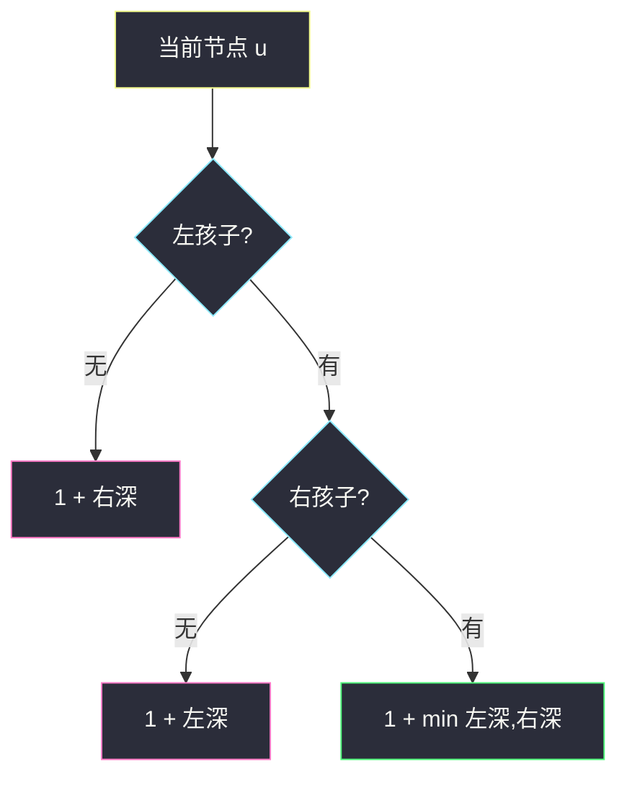
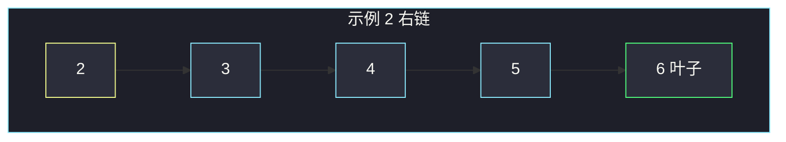

# 二叉树的最小深度（叶子才停 · 单支不能当 0）

## 一、问题描述

给定二叉树根节点 `root`，返回它的**最小深度**：从根走到**最近一片叶子**的路径上的**节点个数**。叶子 = 没有左右孩子。

> 🔗 LeetCode 111：https://leetcode.cn/problems/minimum-depth-of-binary-tree/
>
> 数据范围：节点数 `[0, 10^5]`，`-1000 <= Node.val <= 1000`。
>
> 📚 灵神题单 **§2.2 自顶向下 DFS（先序遍历）**。

**示例 1**

```
输入：root = [3,9,20,null,null,15,7]
输出：2
树形：
      3
     / \
    9   20
       /  \
      15   7
最近叶子是 9，路径 3→9，共 2 个节点。
```

**示例 2（易错：左空右有）**

```
输入：root = [2,null,3,null,4,null,5,null,6]
输出：5
树形：
    2
     \
      3
       \
        4
         \
          5
           \
            6
唯一叶子是 6，必须走完整条右链，深度 5。
```

**直观理解**

最大深度两边取 `max` 再加一就行；最小深度**不能**对称地写成 `1 + min(左, 右)`——空孩子深度是 0，单支树会被当成「这边已经到底了」。最小深度问的是到**叶子**，缺的那一边不算叶子。

---

## 二、暴力解法

枚举所有根到叶路径，取最短。先序带着当前深度往下走，碰到叶子就记一笔：

```python
class Solution:
    def minDepth(self, root: Optional[TreeNode]) -> int:
        if not root:
            return 0
        ans = 10**9

        def dfs(node: TreeNode, depth: int) -> None:
            nonlocal ans
            if not node.left and not node.right:
                ans = min(ans, depth)
                return
            if node.left:
                dfs(node.left, depth + 1)
            if node.right:
                dfs(node.right, depth + 1)

        dfs(root, 1)
        return ans
```

这已经是正确的 **§2.2 自顶向下** 写法，时间 `O(n)`。瓶颈不在对错，而在：最浅叶子如果很靠上，DFS 仍可能把整棵树扫完。

### 🔴 瓶颈在哪里

最短路径一定在最浅的那一层。BFS 一层一层往外扩，**碰到的第一片叶子就是答案**，后面的节点不用看。

---

## 三、优化探索（核心章节）

> 📚 灵神 **§2.2**：自顶向下带着深度走，叶子处更新。面试更常默写下面这套**后序分治**——和 104 最大深度同一框架，只改「空边」的处理。

### 3.1 空边不能当 0

对当前节点：

- 两边都空：自己是叶子，深度 1。
- **缺左**：叶子只可能在右边，`1 + 右深`。
- **缺右**：同理 `1 + 左深`。
- 两边都有：`1 + min(左深, 右深)`。

叶子其实被「缺左」那条吃掉了：`1 + minDepth(None) = 1`。不必单独 `if is_leaf`。



### 3.2 BFS 往往更快

队列存 `(节点, 深度)`。出队时若是叶子，立刻返回。最浅叶子在第 `d` 层时，只处理前 `d` 层，斜树退化成链时和 DFS 一样 `O(n)`，平衡树时常数更好。

### 3.3 一句话核心

> **最小深度是到最近叶子；缺的一边不是叶子，必须走有孩子的那边。**

---

## 四、代码实现

### Python（主解：后序分治，面试默写）

```python
class Solution:
    def minDepth(self, root: Optional[TreeNode]) -> int:
        if not root:
            return 0
        if not root.left:
            return 1 + self.minDepth(root.right)
        if not root.right:
            return 1 + self.minDepth(root.left)
        return 1 + min(self.minDepth(root.left), self.minDepth(root.right))
```

**可选 BFS**（遇到第一个叶子就停）：

```python
from collections import deque

class Solution:
    def minDepth(self, root: Optional[TreeNode]) -> int:
        if not root:
            return 0
        q = deque([(root, 1)])
        while q:
            node, d = q.popleft()
            if not node.left and not node.right:
                return d
            if node.left:
                q.append((node.left, d + 1))
            if node.right:
                q.append((node.right, d + 1))
        return 0
```

空树返回 0；单节点走「缺左」返回 `1 + 0 = 1`。

---

## 五、具体例子演示

以示例 2 的右链强调易错。若写成 `1 + min(左, 右)`：根 2 的左深 = 0、右深 = 4，会得到 **1**，把空左当叶子。

正确递归：

| 节点 | 左 | 右 | 规则 | 返回 |
|------|----|----|------|------|
| 6 | 空 | 空 | 缺左 → `1+0` | **1** |
| 5 | 空 | 6 | 缺左 → `1+1` | 2 |
| 4 | 空 | 5 | 缺左 → `1+2` | 3 |
| 3 | 空 | 4 | 缺左 → `1+3` | 4 |
| 2 | 空 | 3 | 缺左 → `1+4` | **5** |



BFS：第 1 层 2（有右）、第 2 层 3 … 第 5 层 6 是叶子，返回 5。示例 1 则在第 2 层碰到 9，立刻返回，右子树 20/15/7 不用入队后的展开。

---

## 六、复杂度分析

| 方法 | 时间 | 空间 | 说明 |
|------|------|------|------|
| 自顶向下 DFS | `O(n)` | `O(h)` 栈 | 最坏斜树 `O(n)` |
| 后序分治（主解） | `O(n)` | `O(h)` | 每个节点一次 |
| BFS 遇叶即停 | `O(n)` 最坏 | `O(n)` 队列 | 最浅叶靠上时更少 |

---

## 七、对比总结

| | #104 最大深度 | #111 最小深度 |
|--|--------------|--------------|
| 两边都有 | `1+max` | `1+min` |
| 只有一边 | 仍 `1+max`（空当 0 无害） | **必须走有孩子的那边** |
| 叶子 | 1 | 1 |

**易错点**

1. `1 + min(左, 右)` 照搬 104：单支树答案变成 1。
2. 空树是 0，单节点是 1（它自己就是叶子）。
3. 深度按**节点数**计，不是边数。
4. BFS 必须确认「左右都空」才返回，有孩子就继续扩。

---

## 八、举一反三

| 题目 | 关系 |
|------|------|
| [104. 二叉树的最大深度](https://leetcode.cn/problems/maximum-depth-of-binary-tree/) | 同一后序框架，空边当 0 是安全的 |
| [112. 路径总和](https://leetcode.cn/problems/path-sum/) | 自顶向下带着剩余和，叶子处判定 |
| [257. 二叉树的所有路径](https://leetcode.cn/problems/binary-tree-paths/) | 同批：根到**每一片**叶子，见 `binary-tree-paths.md` |
| [559. N 叉树的最大深度](https://leetcode.cn/problems/maximum-depth-of-n-ary-tree/) | 多孩子取 max，最小深度同理要排除空列表 |
| [222. 完全二叉树的节点个数](https://leetcode.cn/problems/count-complete-tree-nodes/) | 完全二叉树最左链长度 = 最小深度 |

**思想迁移**

- 口诀：**「空边不是叶，单支走有孩；两边都在才取 min。」**
