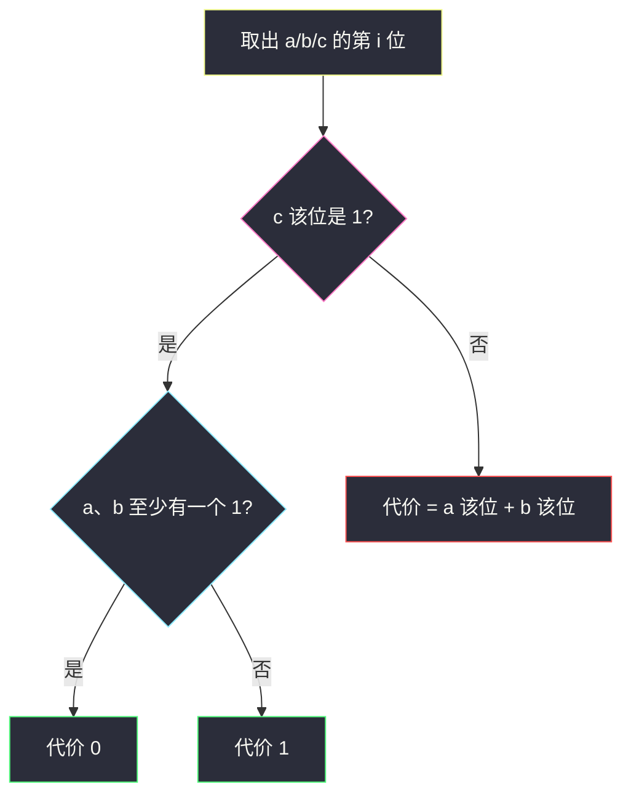
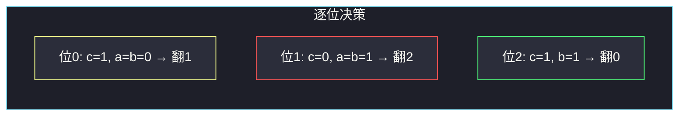

# 或运算的最小翻转次数（逐位独立 · OR 凑 1 / 清 0）

## 一、问题描述

给你三个正整数 `a`、`b`、`c`。一次操作可以把 `a` 或 `b` 的**某一位**从 0 翻成 1，或从 1 翻成 0。求使 `a OR b == c` 的最少翻转次数。

> 🔗 LeetCode 1318：https://leetcode.cn/problems/minimum-flips-to-make-a-or-b-equal-to-c/
>
> 数据范围：`0 ≤ a, b, c ≤ 10^9`。最多 30 个二进制位。
>
> 📚 灵茶题单：**三、与或（AND/OR）的性质**（1383 分）。OR 按位独立：每位的目标只取决于 `c` 的同一位，和其他位无关。

**示例 1**

```
输入：a = 2, b = 6, c = 5
输出：3
解释：2 = 010，6 = 110，5 = 101。
     最低位：a、b 都是 0，c 要 1，翻 1 次；
     中间位：a、b 都是 1，c 要 0，翻 2 次；
     最高位：已经满足。合计 3。
```

**示例 2**

```
输入：a = 4, b = 2, c = 7
输出：1
解释：4 = 100，2 = 010，7 = 111。只缺最低位的 1，翻一次即可。
```

**示例 3**

```
输入：a = 1, b = 2, c = 3
输出：0
解释：1 OR 2 已经等于 3，不用翻。
```

**直观理解**

`OR` 的每一位只看这一位：结果位是 1，当且仅当 `a`、`b` 这一位**至少有一个 1**；结果位是 0，当且仅当**两个都是 0**。翻转一次只改一个数的一位，所以每位可以单独算代价，再加起来。

---

## 二、暴力解法

每位只有 4 种 `(a 位, b 位)` 组合。枚举 30 位，对每位枚举 4 种目标状态，取「满足 OR 等于 `c` 该位」的最小汉明距离。

```python
class Solution:
    def minFlips(self, a: int, b: int, c: int) -> int:
        ans = 0
        for i in range(30):
            ba = (a >> i) & 1
            bb = (b >> i) & 1
            bc = (c >> i) & 1
            best = 3
            for na in (0, 1):
                for nb in (0, 1):
                    if (na | nb) != bc:
                        continue
                    best = min(best, (na != ba) + (nb != bb))
            ans += best
        return ans
```

30 × 4 已经很快，但「枚举 4 种」还没把规则说透：其实每种 `c` 位只对应一种最优动作。

### 🔴 瓶颈在哪里

真正的瓶颈不是时间，是**没看出决策是确定的**。`c` 该位为 1 时，只要已经有一个 1 就不用动；两个都是 0 时翻任意一个即可（代价 1），不必两个都翻。`c` 该位为 0 时没有选择：有几个 1 就必须翻几次。

---

## 三、优化探索（核心章节）

> 📚 本题在灵茶题单中属于 **三、与或（AND/OR）的性质**。口诀：**OR 只增不减（0 变 1 才改变结果），且按位独立。** 每位的最少翻转可以直接读出来，不必搜索。

### 3.1 为什么可以逐位算

`a OR b` 的第 `i` 位只由 `a`、`b` 的第 `i` 位决定，翻转第 `i` 位也不会影响第 `j` 位。总次数等于 30 位代价之和。数 ≤ `10^9`，扫到第 29 位（从 0 计）就覆盖了。

### 3.2 `c` 该位是 1：至少凑一个 1

| a | b | a OR b | 最少翻转 |
|---|---|--------|----------|
| 0 | 0 | 0 | **1**（翻 a 或翻 b，二选一） |
| 0 | 1 | 1 | 0 |
| 1 | 0 | 1 | 0 |
| 1 | 1 | 1 | 0 |

已经有 1 就不动。两个 0 时翻一次足够，翻两次是浪费。

### 3.3 `c` 该位是 0：必须两个都是 0

| a | b | a OR b | 最少翻转 |
|---|---|--------|----------|
| 0 | 0 | 0 | 0 |
| 0 | 1 | 1 | **1** |
| 1 | 0 | 1 | **1** |
| 1 | 1 | 1 | **2** |

代价就是这一位上 `a`、`b` 里 1 的个数。不能只翻一个：剩下那个 1 仍会把 OR 顶成 1。



### 3.4 和「汉明距离」的差别

如果是「把 `x` 变成 `y`」，代价是 `x XOR y` 的 1 的个数。本题改的是两个源操作数，目标约束是 OR 而不是相等，所以：

- 目标 1：源里全 0 才要动，且只动一次；
- 目标 0：源里每个 1 都要动。

不能写成 `popcount((a | b) XOR c)`——那只统计「结果位错了多少」，`c` 为 0 而 `a`、`b` 都是 1 时结果只错 1 位，实际要翻 **2** 次。

### 3.5 一句话核心

> **逐位看 `c`：该位 1 则「两个都是 0 才翻 1 次」；该位 0 则「有几个 1 翻几次」。**

---

## 四、代码实现

### Python（主解：扫 30 位）

```python
class Solution:
    def minFlips(self, a: int, b: int, c: int) -> int:
        ans = 0
        for i in range(30):
            ba = (a >> i) & 1
            bb = (b >> i) & 1
            bc = (c >> i) & 1
            if bc == 1:
                if ba == 0 and bb == 0:
                    ans += 1
            else:
                ans += ba + bb
        return ans
```

**变量含义**

| 写法 | 含义 |
|------|------|
| `ba` / `bb` / `bc` | `a`、`b`、`c` 的第 `i` 位 |
| `bc == 1` | 需要至少一颗 1 |
| `ba + bb` | `c` 要 0 时，这一位上要清掉的 1 的个数 |

也可以写成位运算版，一次处理所有「`c` 为 0 的位」和「`c` 为 1 但 `a|b` 为 0 的位」：

```python
class Solution:
    def minFlips(self, a: int, b: int, c: int) -> int:
        # c 为 0 的位：a、b 上每个 1 各算一次
        zeros = (a | b) & ~c           # c 为 0 且 a|b 为 1：至少翻一次
        need_two = a & b & ~c          # 两个都是 1，还要再多翻一次
        ones = ~(a | b) & c            # c 为 1 且 a|b 为 0：翻一次
        return zeros.bit_count() + need_two.bit_count() + ones.bit_count()
```

`zeros` 里已经计入「至少翻一次」；若该位 `a`、`b` 都是 1，还要再计入 `need_two`。三个掩码要**分别** `bit_count` 再相加：不能先把整数加起来再数 1，加法进位会把次数算错。面试默写逐位版更稳。`~c` 在 Python 里是无限前导 1，但随后与 `a|b` 或 `c` 相与，高位会被截掉，不必再手动 `& ((1<<30)-1)`。

---

## 五、具体例子演示

**示例 1**：`a = 2, b = 6, c = 5`，写成 3 位即可。

```
位权   2  1  0
a      0  1  0
b      1  1  0
c      1  0  1
```



逐步跟踪：

| i | a 位 | b 位 | c 位 | 规则 | 代价 | 累计 |
|---|------|------|------|------|------|------|
| 0 | 0 | 0 | 1 | 两个 0，要凑 1 | 1 | 1 |
| 1 | 1 | 1 | 0 | 两个 1 都得清掉 | 2 | 3 |
| 2 | 0 | 1 | 1 | 已有 1 | 0 | 3 |
| 3..29 | 0 | 0 | 0 | 已满足 | 0 | 3 |

一种最优翻转：把 `a` 的第 0 位 0→1（`a` 变成 3），再把 `a`、`b` 的第 1 位都 1→0（`a` 变成 1，`b` 变成 4）。此时 `1 OR 4 = 5`。答案 3，与官方一致。

**示例 2**：`a = 4, b = 2, c = 7`。

| i | a | b | c | 代价 |
|---|---|---|---|------|
| 0 | 0 | 0 | 1 | 1 |
| 1 | 0 | 1 | 1 | 0 |
| 2 | 1 | 0 | 1 | 0 |

合计 1。把 `a` 或 `b` 的最低位翻成 1 即可：`5 OR 2 = 7` 或 `4 OR 3 = 7`。

**示例 3**：`a = 1, b = 2, c = 3`，三位分别是 `(1,0,1)`、`(0,1,1)`、`(0,0,0)`，代价全 0。

若把 `c` 改成 0，三位变成「清 0」：`a` 的最低位、`b` 的次低位各翻一次，答案 2——这就是「有几个 1 翻几次」。

**边界**：`a = b = c = 0` → 0；`a = b = 10^9`、`c = 0` → 要把约 30 位里所有 1 都清掉，每个 1 计两次（`a` 一次、`b` 一次）。

常见错法对拍：若用 `popcount((a | b) XOR c)` 处理示例 1，`(2|6) XOR 5 = 6 XOR 5 = 3`，只有两个 1，会得到 **2**，漏掉「两个 1 对一个 0」的第二次翻转。对拍以官方三例为准：3、1、0。

---

## 六、复杂度分析

| 方法 | 时间 | 空间 | 说明 |
|------|------|------|------|
| 每位枚举 4 态 | `O(1)`（30×4） | `O(1)` | 正确但啰嗦 |
| 逐位直接决策（主解） | `O(1)`（30 次） | `O(1)` | 每位 O(1) 判断 |
| 位掩码 + `bit_count` | `O(1)` | `O(1)` | 常数更小，不好讲 |

位数按数值上界 30 计；写成 `while a or b or c` 右移也可以，最坏仍是 30 次。

---

## 七、对比总结

| 维度 | 本题 | 把 x 变成 y（汉明距离） | 按位与范围（201） |
|------|------|-------------------------|-------------------|
| 操作对象 | `a` 或 `b` 的某一位 | 一个数的位 | 不操作，只观察 AND |
| 目标 | `a OR b == c` | `x == y` | 连续整数的 AND |
| 关键性质 | OR 按位独立 | XOR 的 1 就是代价 | AND 只减不增 |
| 坑 | `c` 为 0 时两个 1 要翻两次 | 无 | 找最高公共前缀 |

**易错点**

1. **`c` 为 0 时只翻一次**：`a`、`b` 都是 1，翻一个不够。
2. **`c` 为 1 时两个都翻**：两个 0 翻一个就行，多翻一次不是最优。
3. **用 `(a|b) XOR c` 的 popcount 当答案**：低估「双 1 对 0」的代价。
4. **去改 `c`**：题目只允许改 `a` 或 `b`。
5. **只扫到 16 位 / 20 位**：`10^9` 需要 30 位（`2^30 > 10^9 > 2^29`）。

---

## 八、举一反三

| 题目 | 关系 |
|------|------|
| [2220. 转换数字的最少位翻转次数](https://leetcode.cn/problems/minimum-bit-flips-to-convert-number/) | 真汉明距离：`popcount(start XOR goal)` |
| [201. 数字范围按位与](https://leetcode.cn/problems/bitwise-and-of-numbers-range/) | 同一节：AND 只减不增，连续段公共前缀 |
| [477. 汉明距离总和](https://leetcode.cn/problems/total-hamming-distance/) | 同样逐位独立，每位单独统计 0/1 个数 |
| [2997. 使数组异或和等于 K 的最少操作次数](https://leetcode.cn/problems/minimum-number-of-operations-to-make-array-xor-equal-to-k/) | 逐位：差几位就翻几次 |
| [2419. 按位与最大的最长子数组](https://leetcode.cn/problems/longest-subarray-with-maximum-bitwise-and/) | 同节下一题：AND 只减不增 |

**思想迁移**

- 位运算题先问：**这一位和其他位有没有耦合？** 没有就逐位贪心。
- 口诀：**「`c` 要 1 缺 1 才翻一次；`c` 要 0 有几个 1 翻几次。」**
