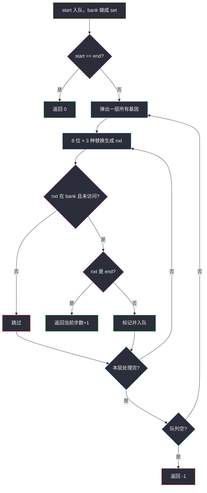
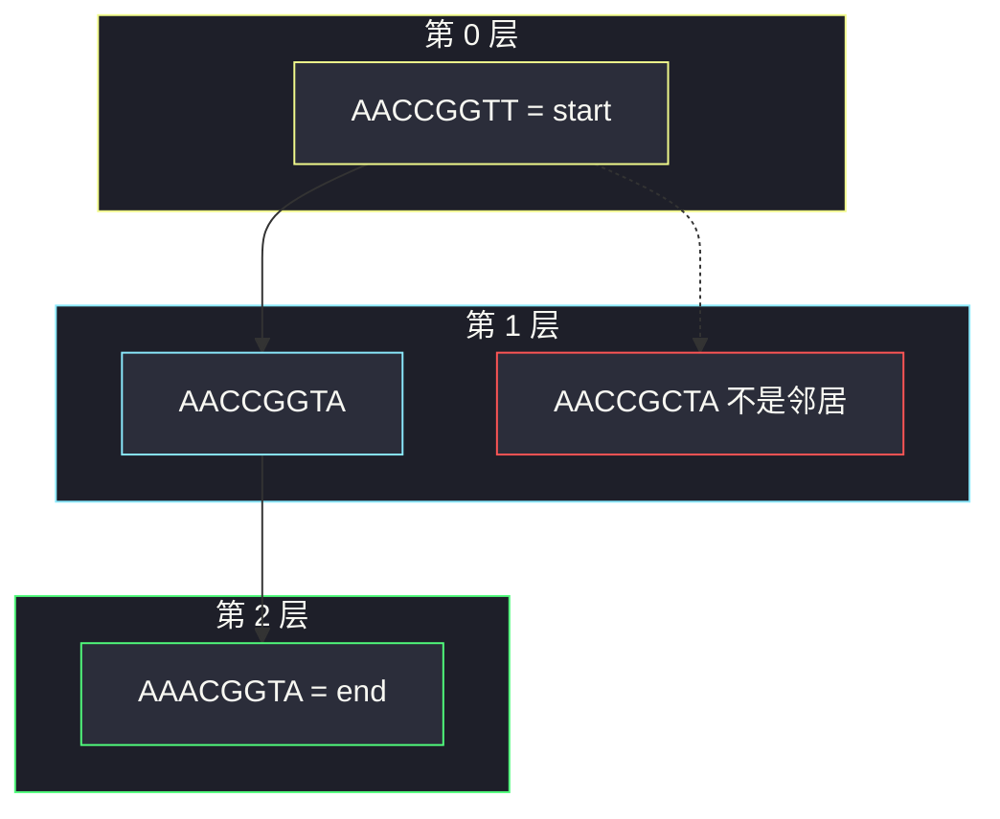

# 最小基因变化（8 位基因当点 · BFS 最短路）

## 一、问题描述

基因是长度为 8 的字符串，每位只可能是 `A/C/G/T`。一次变化只能改 **一位**，且变化后的串必须出现在基因库 `bank` 里。从 `start` 变到 `end`，求最少变化次数；无法到达返回 `-1`。

> 🔗 LeetCode 433：https://leetcode.cn/problems/minimum-genetic-mutation/
>
> 数据范围：串长固定 8，`bank.length ≤ 10`，字符仅 `ACGT`。`start` 默认合法，**不一定在 bank 里**。
>
> 📚 灵茶题单：**图论 · §1.3 图论建模 + BFS 最短路**。

**示例 1**

```
输入：start = "AACCGGTT", end = "AACCGGTA", bank = ["AACCGGTA"]
输出：1
只改最后一位 T → A，结果在 bank 里。
```

**示例 2**

```
输入：start = "AACCGGTT", end = "AAACGGTA"
     bank = ["AACCGGTA","AACCGCTA","AAACGGTA"]
输出：2
一条最短链：AACCGGTT → AACCGGTA → AAACGGTA
```

**示例 3**

```
输入：start = "AAAAACCC", end = "AACCCCCC"
     bank = ["AAAACCCC","AAACCCCC","AACCCCCC"]
输出：3
每次把一个 A 改成 C，必须逐步经过 bank。
```

**直观理解**

合法状态 = `{start} ∪ bank`。两个串如果 Hamming 距离为 1 就连一条边，边权全是 1。最少变化次数 = 无权图最短路 = **BFS 层数**。`end` 不在 bank 里（且不等于 `start`）则永远走不到。

这和 [打开转盘锁](./open-the-lock.md) 同构：密码/基因当点，改一位当边；差别只是「合法邻居」来自 bank，而不是「非死锁」。

---

## 二、暴力解法

DFS 从 `start` 枚举每一位的 3 种替换，落到 bank 里就递归，用 `seen` 防环，记录到达 `end` 的最小步数。第一次碰到 `end` 不一定最短，必须搜完全图。`bank` 虽小（≤ 10），写法却比 BFS 麻烦，还容易漏剪枝。

```python
# 伪代码：dfs(cur, step)；8 位 × 3 种替换；nxt in bank 才走
# step >= ans 剪枝；见到 end 更新 ans。不按层扩展，必须回溯。
```

### 复杂度

- **时间**：状态 ≤ 11，出度 ≤ 24，最坏仍要走完所有排列，比 BFS 差一个「不保证先最短」。
- **空间**：递归栈 + `seen`。

### 🔴 瓶颈在哪里

边权全是 1，**先到的一定步数更少**。不该 DFS 回溯改答案，该 BFS 第一次碰到 `end` 就返回。

---

## 三、优化探索（核心章节）

> 📚 本题在灵茶题单中属于 **§1.3 图论建模 + BFS**。8 位基因当顶点，改一位且结果在 bank 为边；从 start 做 BFS。start 可以不在 bank。

### 3.1 两种建图

**隐式（推荐，对齐转盘锁）**：弹出串 `u` 时，枚举 8 个位置 × 3 种新字母，得到 `nxt`。只有 `nxt in bank` 且没访问过才入队。不必预先两两比 Hamming。

**显式**：把 `start` 和 bank 里每个串当点，Hamming 距离为 1 就连边，再 BFS。`bank ≤ 10`，`O(|V|² · 8)` 也能过，但默写更长。

特殊判定：

- `start == end` → 返回 0（一次都不用变，也不要求 start 在 bank）。
- `end` 不在 bank 且不等于 start → 返回 `-1`。
- start 本身在不在 bank **无所谓**：题目保证 start 合法，可以从它出发。

### 3.2 BFS 层数 = 变化次数

队列存字符串，按层 `for _ in range(len(q))`，扩完一层 `step += 1`。入队即标记 `seen`，避免同一基因进队两次。`bank` 转成 `set`，判断邻居 `O(1)`。



### 3.3 规模

状态 ≤ `1 + |bank| ≤ 11`，每位 3 种替换，总共常数级。单词接龙那题 bank 上千，同一套代码也能过。

### 3.4 一句话核心

> **基因串当点、改一位且落入 bank 当边权 1；start 可不在库里；BFS 第一次碰到 end 的层数就是答案。**

---

## 四、代码实现

### Python（主解：隐式图 BFS）

```python
from collections import deque

class Solution:
    def minMutation(self, startGene: str, endGene: str, bank: list[str]) -> int:
        if startGene == endGene:
            return 0
        bank_set = set(bank)
        if endGene not in bank_set:
            return -1

        letters = "ACGT"
        q = deque([startGene])
        seen = {startGene}
        step = 0
        while q:
            for _ in range(len(q)):
                u = q.popleft()
                for i in range(len(u)):
                    for c in letters:
                        if c == u[i]:
                            continue
                        nxt = u[:i] + c + u[i + 1:]
                        if nxt not in bank_set or nxt in seen:
                            continue
                        if nxt == endGene:
                            return step + 1
                        seen.add(nxt)
                        q.append(nxt)
            step += 1
        return -1
```

**变量含义**

| 变量 | 含义 |
|------|------|
| `bank_set` | 合法中间/终点基因 |
| `seen` | 已入队基因（含 start） |
| `step` | 已变化次数 = BFS 层号 |

入队即加入 `seen`。邻居必须在 bank：start 自己不必进 bank。

当前 LeetCode 参数名是 `startGene` / `endGene`，和题面里的 `start` / `end` 是一回事。

---

## 五、具体例子演示

### 示例 1（一层结束）

`start = AACCGGTT`，`end = AACCGGTA`，`bank = {AACCGGTA}`。

| 层 step | 弹出 | 合法新邻居 | 命中? |
|---------|------|------------|-------|
| 0 | AACCGGTT | **AACCGGTA** | 是 end，返回 `0+1=1` |

8×3=24 次替换里，只有改最后一位 `T→A` 落在 bank。

### 示例 2（两层）

`bank = {AACCGGTA, AACCGCTA, AAACGGTA}`，`end = AAACGGTA`。

**第 0 层**：弹出 `AACCGGTT`。

和 start 差一位的 bank 串：

- `AACCGGTA`：只改末位 T→A → 入队
- `AACCGCTA`：差两位（第 6 位 G→C，末位 T→A）→ 不是邻居
- `AAACGGTA`：差两位 → 不是邻居

**第 1 层**（上一层扩完后 `step` 已变成 1）：弹出 `AACCGGTA`。

它到 `AAACGGTA` 只差第 3 位 C→A，且 `AAACGGTA in bank` → 返回 `1+1=2`。

代码是「生成本层邻居时用当前 `step+1`；本层全部弹完才 `step += 1`」。第 0 层生成的是 1 步邻居；第 1 层生成的是 2 步邻居。`AACCGCTA` 相对 start 差两位，第 0 层进不了队，BFS 已在步数 2 结束，不会再走更长的路。



虚线表示「在 bank 里但差了两位，本层进不了队」。

### start 不在 bank

`start = AAAAAAAA`，`end = AAAAAAAC`，`bank = ["AAAAAAAA","AAAAAAAC"]` 时，start 碰巧在库里，不影响。

若 `bank = ["AAAAAAAC"]` 只有终点：start 仍可出发，一层改末位 A→C 即到，返回 1。**不要**因为 start 不在 bank 就返回 -1。

---

## 六、复杂度分析

| 方法 | 时间 | 空间 | 说明 |
|------|------|------|------|
| DFS 回溯 | 最坏搜完排列 | `O(\|bank\|)` | 第一次碰到未必最短 |
| 隐式 BFS（主解） | `O(\|bank\| · 8 · 4)` | `O(\|bank\|)` | 每串最多入队一次 |
| 显式建图 + BFS | `O(\|bank\|² · 8)` | `O(\|bank\|²)` | 两两比 Hamming |

`bank ≤ 10`，三种都能过；默写选隐式 BFS，和转盘锁同一套肌肉。

---

## 七、对比总结

| 维度 | DFS | 隐式 BFS |
|------|-----|----------|
| 第一次碰到 end | 未必最短 | 一定最短（边权 1） |
| start 不在 bank | 同样从 start 出发 | 同样；邻居仍要在 bank |
| 默写 | 还要回溯改 ans | 队列 + 层数 |

**易错点**

1. **要求 start 必须在 bank**：题目明确 start 合法且可不在库里。
2. **`start == end` 返回了 -1**：应返回 0；建议最先判断。
3. **end 不在 bank 却还在搜**：除 start==end 外，end 必须是合法终点，可提前 `-1`。
4. **出队再标记**：同一基因被多个前驱重复入队。
5. **改一位时忘了「换成另外 3 个字母」**：写成 `±1` 那是数字转盘，基因是四选三。
6. **bank 用 list 判断邻居**：改成 `set`，否则每次 `in` 都是线性扫。

---

## 八、举一反三

| 题目 | 关系 |
|------|------|
| [752. 打开转盘锁](https://leetcode.cn/problems/open-the-lock/) | 同构：四位数字当点、拨一位当边；死锁预先 vis。见 [open-the-lock.md](./open-the-lock.md) |
| [127. 单词接龙](https://leetcode.cn/problems/word-ladder/) | 单词当点、改一个字母当边，bank 更大，仍是 BFS |
| [433 本身的双向 BFS](https://leetcode.cn/problems/minimum-genetic-mutation/) | 从 start 与 end 对向扩，本题规模没必要 |
| [841. 钥匙和房间](https://leetcode.cn/problems/keys-and-rooms/) | 也是建模后遍历；问的是能否走完而不是步数。见 [keys-and-rooms.md](./keys-and-rooms.md) |
| [1091. 二进制矩阵中的最短路径](https://leetcode.cn/problems/shortest-path-in-binary-matrix/) | 网格隐式图 + BFS |

**思想迁移**

- 状态少、转移是「改一位」时，把状态当点、合法转移当边，最短步数直接 BFS。
- 口诀：**「基因是节点，改一位走一步；必须落在 bank，BFS 层数即答案。」**
