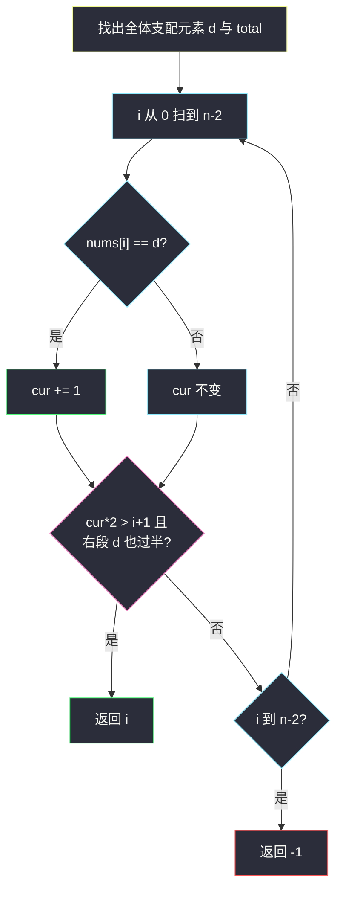
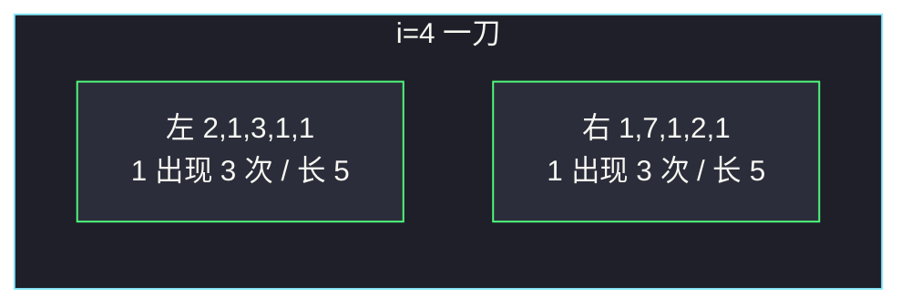

# 合法分割的最小下标（前后缀 · 支配元素计数）

## 一、问题描述

数组的**支配元素**定义为出现次数 `× 2 > 数组长度`（严格多于一半）。题目保证 `nums` **恰好有一个**支配元素。

在下标 `i` 处切开（`0 ≤ i < n-1`）：左段 `nums[0..i]`，右段 `nums[i+1..n-1]`，两段都非空。若两段的支配元素**相同**，称这次分割合法。求最小的合法 `i`；没有则返回 `-1`。

> 🔗 LeetCode 2780：https://leetcode.cn/problems/minimum-index-of-a-valid-split/
>
> 数据范围：`1 ≤ n ≤ 10^5`，`1 ≤ nums[i] ≤ 10^9`。
>
> 📚 灵茶题单：**专题：前后缀分解**。枚举刀口 `i`，左边用前缀计数，右边用「总数 − 前缀」。两边的支配元素只能是全体的那个支配元素。

**示例 1**

```
输入：nums = [1,2,2,2]
输出：2
解释：i=2 时左 [1,2,2] 支配 2，右 [2] 支配 2。
```

**示例 2**

```
输入：nums = [2,1,3,1,1,1,7,1,2,1]
输出：4
解释：i=4 时左 [2,1,3,1,1] 与右 [1,7,1,2,1] 都由 1 支配。
```

**示例 3**

```
输入：nums = [3,3,3,3,7,2,2]
输出：-1
解释：3 是全体支配元素，但切不开让两边同时被 3 支配。
```

**直观理解**

合法分割要求左右「多数票」是同一个人。全体已经有唯一的多数派 `d`，如果某边另立山头，那边的多数就不可能还是 `d`，两边更不可能相同。所以只检查：`d` 是否同时在左右都过半。

---

## 二、暴力解法

先找出全体支配元素 `d`。再对每个 `i` 分别数左右两段里 `d` 的出现次数。

```python
class Solution:
    def minimumIndex(self, nums: list[int]) -> int:
        n = len(nums)
        d = max(nums, key=nums.count)  # 仅示意，真 count 会更慢
        total = nums.count(d)
        for i in range(n - 1):
            left = nums[: i + 1].count(d)
            right = total - left
            if left * 2 > i + 1 and right * 2 > n - i - 1:
                return i
        return -1
```

官方三例都能过。每个 `i` 再扫一段是 `O(n²)`，`n=10^5` 超时。`nums.count` 写在循环里同样平方。

### 🔴 瓶颈在哪里

`d` 在左段的计数是前缀，右段是后缀。扫一遍累加 `cur` 即可，不必每次重数。

---

## 三、优化探索（核心章节）

> 📚 本题在灵茶题单中属于 **专题：前后缀分解**。模板：全体信息先统计（`d` 的总次数 `total`），枚举分割点时左边用滚过来的 `cur`，右边用 `total - cur`。

### 3.1 两边的支配元素只能是全体的 d

反证：若合法分割后两边支配元素都是 `x`，则 `x` 在左段过半、在右段过半，拼起来在全体也过半，所以 `x` 就是全体那个唯一的支配元素 `d`。因此不必猜「两边会不会同时换成另一个数」。

### 3.2 过半判定

左段长 `i+1`，`d` 出现 `cur` 次，需要 `cur * 2 > i + 1`。  
右段长 `n-i-1`，出现 `total - cur` 次，需要 `(total - cur) * 2 > n - i - 1`。

等号不行：长度 4 出现 2 次，`4 > 4` 不成立，不算支配。例 1 的 `i=1`：左 `[1,2]` 里 2 只出现一次。

### 3.3 一遍扫描

先 `O(n)` 找出 `d` 和 `total`（哈希计数，或 Boyer-Moore 再数一遍）。然后 `i` 从 `0` 到 `n-2`：遇到 `d` 就 `cur += 1`，检查上面两个不等式，第一个成立的就是最小下标。



### 3.4 一句话核心

> **全体支配元素 d 必须也是两边的支配元素；前缀计数 cur 满足左右同时过半的最小 i 就是答案。**

---

## 四、代码实现

### Python（主解）

```python
class Solution:
    def minimumIndex(self, nums: list[int]) -> int:
        n = len(nums)
        # d: 全体唯一支配元素；total: 它在整个数组中的次数
        freq = {}
        for x in nums:
            freq[x] = freq.get(x, 0) + 1
        d = max(freq, key=freq.get)
        total = freq[d]

        cur = 0  # d 在 nums[0..i] 中的次数
        for i in range(n - 1):
            if nums[i] == d:
                cur += 1
            if cur * 2 > i + 1 and (total - cur) * 2 > n - i - 1:
                return i
        return -1
```

`n=1` 时循环不进入，返回 `-1`（切不开两段非空），正确。

**变量含义**

| 写法 | 含义 |
|------|------|
| `d` / `total` | 全体支配元素及其出现次数 |
| `cur` | 左段 `[0..i]` 里 `d` 的个数 |
| `cur * 2 > i+1` | 左段过半 |
| `(total-cur)*2 > n-i-1` | 右段过半 |

### Java（最优解）

```java
class Solution {
    public int minimumIndex(List<Integer> nums) {
        int n = nums.size();
        Map<Integer, Integer> freq = new HashMap<>();
        for (int x : nums) {
            freq.merge(x, 1, Integer::sum);
        }
        int d = 0, total = 0;
        for (var e : freq.entrySet()) {
            if (e.getValue() > total) {
                d = e.getKey();
                total = e.getValue();
            }
        }
        int cur = 0;
        for (int i = 0; i < n - 1; i++) {
            if (nums.get(i) == d) {
                cur++;
            }
            if (cur * 2 > i + 1 && (total - cur) * 2 > n - i - 1) {
                return i;
            }
        }
        return -1;
    }
}
```

签名按官方 `List<Integer>`。也可用 Boyer-Moore 先找候选人再数 `total`，额外空间 `O(1)`。

---

## 五、具体例子演示

### 5.1 官方示例 1：逐步前缀计数

`nums = [1,2,2,2]`，`d=2`，`total=3`，`n=4`。

| i | nums[i] | cur | 左长 | 左过半 | 右次数 | 右长 | 右过半 | 合法 |
|---|---------|-----|------|--------|--------|------|--------|------|
| 0 | 1 | 0 | 1 | 0×2>1? 否 | 3 | 3 | 是 | 否 |
| 1 | 2 | 1 | 2 | 2>2? 否 | 2 | 2 | 4>2 是 | 否 |
| 2 | 2 | 2 | 3 | 4>3 是 | 1 | 1 | 2>1 是 | **是** |

返回 `2`。对拍官方。`i=1` 左段 `[1,2]` 里 2 未过半，正好卡在等号上。

### 5.2 官方示例 2：最小下标，后面还有合法刀

`nums = [2,1,3,1,1,1,7,1,2,1]`，`d=1`，`total=6`，`n=10`。

| i | cur | 左长 | 左过半 | 右次数 | 右长 | 右过半 |
|---|-----|------|--------|--------|------|--------|
| 0 | 0 | 1 | 否 | 6 | 9 | 是 |
| 1 | 1 | 2 | 否 | 5 | 8 | 是 |
| 2 | 1 | 3 | 否 | 5 | 7 | 是 |
| 3 | 2 | 4 | 4>4 否 | 4 | 6 | 是 |
| 4 | 3 | 5 | **6>5** | 3 | 5 | **6>5** |

`i=4` 第一次双边过半，返回 4。对拍官方。

后面 `i=6`（左 4/7、右 2/3）和 `i=8`（左 5/9、右 1/1）也合法，但题目要**最小**下标，扫到 4 就停。



### 5.3 官方示例 3：全体过半，两边凑不齐

`nums = [3,3,3,3,7,2,2]`，`d=3`，`total=4`，`n=7`。`4×2>7`，全体确实由 3 支配。

| i | cur | 左过半 | 右次数/右长 | 右过半 |
|---|-----|--------|-------------|--------|
| 0 | 1 | 2>1 是 | 3/6 | 6>6 否 |
| 1 | 2 | 4>2 是 | 2/5 | 4>5 否 |
| 2 | 3 | 6>3 是 | 1/4 | 2>4 否 |
| 3 | 4 | 8>4 是 | 0/3 | 否 |
| 4 | 4 | 8>5 是 | 0/2 | 否 |
| 5 | 4 | 8>6 是 | 0/1 | 否 |

3 全堆在左半，右段永远分不到足够的 3。返回 `-1`。对拍官方。

---

## 六、复杂度分析

| 方法 | 时间 | 空间 | 说明 |
|------|------|------|------|
| 每个刀口重数左右 | `O(n²)` | `O(1)` | 超时 |
| 哈希找 d + 前缀 cur（主解） | `O(n)` | `O(n)` 最坏哈希 | 值域 `10^9`，哈希即可 |
| Boyer-Moore + 两遍计数 | `O(n)` | `O(1)` | 多数票算法找 d |

---

## 七、对比总结

| 维度 | 169 多数元素 | 2270 分割方案数 | 本题 |
|------|--------------|-----------------|------|
| 问什么 | 全体的多数是谁 | 左右和的大小 | 两边多数是否同一个 |
| 刀口 | 无 | 枚举 `i` 比和 | 枚举 `i` 比次数过半 |
| 右侧信息 | — | `total - left` | `total - cur` |

**易错点**

1. **过半写成 `≥`**：定义是 `次数*2 > 长度`，一半刚好不算。
2. **假设两边可能是另一个数**：全体唯一支配元素已经锁定候选人。
3. **`i` 扫到 `n-1`**：右段会空，题目要求两段非空。
4. **返回任意合法下标**：要最小，从左往右第一次命中即返。
5. **每次 `list.count`**：藏了一个 `O(n)`，整体平方。

---

## 八、举一反三

| 题目 | 关系 |
|------|------|
| [169. 多数元素](https://leetcode.cn/problems/majority-element/) | 找全体支配元素；本题还要切开后两边都过半 |
| [2270. 分割数组的方案数](https://leetcode.cn/problems/number-of-ways-to-split-array/)（`number-of-ways-to-split-array.md`） | 同专题：枚举刀口，右段用总和减前缀 |
| [724. 寻找数组的中心下标](https://leetcode.cn/problems/find-pivot-index/)（`find-pivot-index.md`） | 前后缀和，中心元素不入左右 |
| [915. 分割数组](https://leetcode.cn/problems/partition-array-into-disjoint-intervals/) | 左 max ≤ 右 min 的最小刀口 |
| [1525. 字符串的好分割数目](https://leetcode.cn/problems/number-of-good-ways-to-split-a-string/)（`number-of-good-ways-to-split-a-string.md`） | 同批前后缀：左右种类数 |
| [2404. 出现最频繁的偶数元素](https://leetcode.cn/problems/most-frequent-even-element/) | 也是频次，但不切数组 |

**思想迁移**

- 全体多数派若能出现在合法分割里，它必须同时撑起左右两段的半数；前缀计数 + 总数减前缀就能线性判定。
- 口诀：**「先锁定全体 d；cur 过半且 total−cur 过半的最小 i。」**
