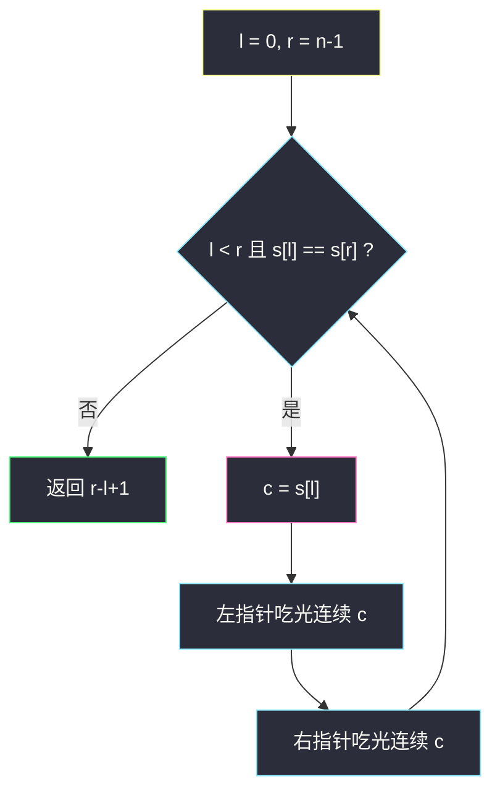
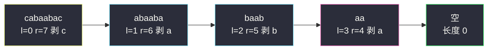

# 删除字符串两端相同字符后的最短长度（相向双指针 · 两端整段删除）

## 一、问题描述

给你只含 `'a'`、`'b'`、`'c'` 的字符串 `s`。一次操作（可做任意次）：

1. 选一个**非空**前缀，前缀内字符全相同；
2. 选一个**非空**后缀，后缀内字符全相同；
3. 前缀与后缀**不能有交集**；
4. 前缀、后缀必须是**同一种字符**；
5. 同时删掉这段前缀和后缀。

返回操作之后能得到的**最短长度**。

> 🔗 LeetCode 1750：https://leetcode.cn/problems/minimum-length-of-string-after-deleting-similar-ends/
>
> 数据范围：`1 <= s.length <= 10^5`，仅含 `a/b/c`。

**示例 1**

```
输入：s = "ca"
输出：2
解释：首尾不同，一次操作都做不了。
```

**示例 2**

```
输入：s = "cabaabac"
输出：0
解释：依次剥掉两端的 c、a、b、a，最后空串。
```

**示例 3**

```
输入：s = "aabccabba"
输出：3
解释：先删前缀 "aa" 与后缀 "a" 得 "bccabb"；
再删前缀 "b" 与后缀 "bb" 得 "cca"，首尾不同，停止。
```

**直观理解**

能删的时候，两端必须是同一种字符 `c`。删多少？前缀可以是「左端连续的任意长 `c`」，后缀同理，只要两边不重叠。贪心上**一次把两端所有 `c` 全部剥掉**和分多次剥，剩下的中间段完全一样——因为只要两端还是 `c`，你就还得继续剥 `c`，别的字符碰不到。于是算法就是相向双指针：两端字符相同，就把该字符在两端的整段一起吃掉。本题属于灵神题单 **§3.2 相向双指针**。

注意：前缀、后缀只要不重叠、字符相同即可，**长度不必相等**。整串同色且长度 ≥ 2 时，可以从中间切开一次删空（答案 0）；只剩 1 个字符时前缀后缀必然重叠，删不掉（答案 1）。

---

## 二、暴力解法

真的改字符串：每次看 `s[0]` 与 `s[-1]`，相同就把左右连续段切掉，直到不能。每次切片最坏 `O(n)`，最多切 `O(n)` 次。

```python
class Solution:
    def minimumLength(self, s: str) -> int:
        while len(s) >= 2 and s[0] == s[-1]:
            c = s[0]
            i, j, n = 0, len(s) - 1, len(s)
            while i < n and s[i] == c:
                i += 1
            while j >= i and s[j] == c:       # 不与前缀重叠
                j -= 1
            s = s[i:j + 1]
        return len(s)
```

整串同一字符且 `n ≥ 2` 时，前缀、后缀可以在中间切开（例如 `"aaa"` 取前缀 `"aa"` + 后缀 `"a"`），`i` 会越过 `j`，切片变空，长度 0——这符合题意：前缀后缀不重叠即可，不必各留一半。

### 复杂度

- **时间**：`O(n^2)`（反复拷贝）。`n = 10^5` 超时。
- **空间**：`O(n)` 切片。

### 🔴 瓶颈在哪里

每一轮真正「有意义」的工作只是移动左右端点。不必分配新串：用 `l, r` 表示当前剩余闭区间 `[l, r]`，原地把两端整段吃掉即可。

---

## 三、优化探索（核心章节）

> 📚 本题在灵茶题单中属于 **§3.2 相向双指针**：左右端同时向内。和「对撞取数」（两数之和 II、盛水）不同，这里每次向内移动的距离不是 1，而是**整段相同字符**。

### 3.1 观察特征

| 特征 | 说明 |
|------|------|
| 操作序列唯一（就剩余而言） | 两端同字符就必须剥这种字符，不能跳过 |
| 一次剥光 = 多次零敲 | 剩余子串相同 |
| 停止条件 | `l >= r`（空或单字符）或 `s[l] != s[r]` |
| 单字符删不掉 | 前缀后缀不能重叠，长度为 1 时无法操作 |

### 3.2 指针怎么走

```text
l, r = 0, n - 1
while l < r and s[l] == s[r]:
    c = s[l]
    while l <= r and s[l] == c: l += 1    # 吃光左端 c
    while l <= r and s[r] == c: r -= 1    # 吃光右端 c
return r - l + 1
```

外层 `l < r`：还剩至少两个字符，才可能拆成不重叠的前缀+后缀。
内层 `l <= r`：允许把整段同字符全部吃光（得到空串）。若改成 `l < r`，`"aaa"` 会错误地留下 1 个字符。



### 3.3 正确性

剩余串由「还没被剥到的中间段」决定。任何合法操作都必须从当前两端的字符 `c` 下手，且删完后新的两端若仍为 `c` 还得继续。因此最优（也是唯一）的剩余，就是反复剥整段直到两端不同或区间空/单点。`l > r` 时长度公式 `r-l+1 = 0` 仍然正确。

### 3.4 为何必须整段吃光

少删不会得到更短的剩余。设当前两端都是 `c`，若左边只删 1 个、右边只删 1 个，新的两端若仍是 `c`，下一刀还得删 `c`；若某一侧 `c` 已经删完，新端点变成别的字符，此时另一侧若还留着 `c`，两端不同，**操作被迫停止**，中间会多留一截 `c`——比整段剥掉更长。所以「两端能删的 `c` 一次剥光」既合法也最优。

### 3.5 一句话核心

> **两端字符相同就把这种字符在左右的整段一起吃掉；直到两端不同或只剩 0/1 个字符。**

---

## 四、代码实现

### Python（主解：相向双指针）

```python
class Solution:
    def minimumLength(self, s: str) -> int:
        l, r = 0, len(s) - 1
        while l < r and s[l] == s[r]:
            c = s[l]
            while l <= r and s[l] == c:
                l += 1
            while l <= r and s[r] == c:
                r -= 1
        return r - l + 1
```

**变量含义**

| 变量 | 含义 |
|------|------|
| `l` | 当前剩余区间左端（闭） |
| `r` | 当前剩余区间右端（闭） |
| `c` | 本轮要剥的字符 |

**循环不变式**：`s[l..r]`（若 `l ≤ r`）是「尚未删除」的中间段，且它就是从原串经若干次合法操作后得到的串；若 `l > r` 则为空。

### Java

```java
class Solution {
    public int minimumLength(String s) {
        int l = 0, r = s.length() - 1;
        while (l < r && s.charAt(l) == s.charAt(r)) {
            char c = s.charAt(l);
            while (l <= r && s.charAt(l) == c) l++;
            while (l <= r && s.charAt(r) == c) r--;
        }
        return r - l + 1;
    }
}
```

---

## 五、具体例子演示

**示例 2** `s = "cabaabac"`，下标 0..7。

| 轮 | l | r | 端字符 | 操作 | 剩余 `s[l..r]` |
|----|---|---|--------|------|----------------|
| 开始 | 0 | 7 | `c` / `c` | 左吃 `c`（l→1），右吃 `c`（r→6） | `abaaba` |
| 2 | 1 | 6 | `a` / `a` | 左吃 `a`（l→2），右吃 `a`（r→5） | `baab` |
| 3 | 2 | 5 | `b` / `b` | 左吃 `b`（l→3），右吃 `b`（r→4） | `aa` |
| 4 | 3 | 4 | `a` / `a` | 左吃光（l→5），右 `l<=r` 不成立（r=4） | 空 |
| 结束 | 5 | 4 | — | `l < r` 失败 | 长度 `4-5+1 = 0` |

**示例 3** `s = "aabccabba"`，下标 0..8。

| 轮 | l | r | `s[l]` / `s[r]` | 左吃 / 右吃 | 剩余 |
|----|---|---|-----------------|-------------|------|
| 1 | 0 | 8 | a / a | l: 0,1 → 2；r: 8 → 7 | `bccabb` |
| 2 | 2 | 7 | b / b | l: 2 → 3；r: 7,6 → 5 | `cca` |
| 停 | 3 | 5 | c / a | 不同 | 长度 3 |

**全同 `"aaa"`**：`l=0,r=2`，同为 a；左 `l` 一路加到 3，右因 `l<=r` 已假不动；`r-l+1 = 0`。对应一次操作：前缀 `"aa"` + 后缀 `"a"`（前缀、后缀长度不必相等）。

**单字符 `"a"`**：`l=r=0`，外层 `l < r` 不进，返回 1。前缀与后缀会重叠，题面禁止。

**示例 1 `"ca"` 逐步**

| 轮 | l | r | `s[l]` / `s[r]` | 决策 |
|----|---|---|-----------------|------|
| 开始 | 0 | 1 | c / a | 不同，外层不进 |
| 结束 | 0 | 1 | — | 长度 `1-0+1 = 2` |

**全同偶数 `"aaaa"`**：`l=0,r=3` 都是 a；左吃到 `l=4`，右因 `l<=r` 为假停在 3；长度 0。任意 `n≥2` 的纯色串都可以一次删空：把串从中间切开，左边当前缀、右边当后缀。

左右段长可以不对称，这正是示例 3 第一刀：左边吃 2 个 `a`、右边只吃 1 个 `a`，剩余仍最优。算法不去「少吃一点」，因为少吃留下的仍是端点 `a`，下一刀还得继续吃，总剩余不变。



---

## 六、复杂度分析

| 方法 | 时间 | 空间 | 说明 |
|------|------|------|------|
| 反复切片 | `O(n^2)` | `O(n)` | 每次拷贝剩余串 |
| 相向双指针（主解） | `O(n)` | `O(1)` | `l` 只增、`r` 只减，每字符最多访问一次 |

---

## 七、对比总结

| 维度 | 本题 | #125 验证回文串 | #11 盛最多水 |
|------|------|-----------------|--------------|
| 两端关系 | 相同才继续，并**整段**内移 | 相同则各走 1 格 | 高度矮的一端走 1 格 |
| 移动步长 | 一整段相同字符 | 1（跳过非字母数字） | 1 |
| 答案 | 剩余长度 | 是否全程匹配 | 面积最大值 |

**易错点**

1. **内层写成 `l < r`**：整段同字符且长度为奇数时会留下 1，但其实可以删成 0（前缀+后缀在中间切开）。
2. **外层只判断 `s[l]==s[r]` 忘了 `l < r`**：`l==r` 时单字符会被当成「两端相同」误删。
3. **先动一边再判断另一边越界**：右指针循环条件必须带 `l <= r`，否则 `l` 已越过 `r` 后还会读 `s[r]`。
4. **返回 `r-l` 漏了 `+1`**：空串时 `l=r+1`，`r-l+1=0` 刚好对；漏加 1 全错。
5. 不必回溯：剥的顺序和数量在「剩余」意义上是确定的，没有第二种更短的剥法。
6. **左右不必对称**：示例 3 第一刀左边两个 `a`、右边一个 `a`；代码是「能吃就吃」，不要写成两边各删 `min(左段, 右段)` 再停下（那样会把剩余 `a` 留在较短的一侧，可能直接卡死）。
7. 字符集只有 `a/b/c` 不影响算法，换成任意字母同样 `O(n)`。

**模板（两端按段收缩）**

```python
l, r = 0, n - 1
while l < r and s[l] == s[r]:
    c = s[l]
    while l <= r and s[l] == c:
        l += 1
    while l <= r and s[r] == c:
        r -= 1
```

---

## 八、举一反三

| 题目 | 关系 |
|------|------|
| [125. 验证回文串](https://leetcode.cn/problems/valid-palindrome/) | 相向双指针，两端各走一格比相等 |
| [680. 验证回文串 II](https://leetcode.cn/problems/valid-palindrome-ii/) | 相向遇到不同时允许删一侧一个 |
| [11. 盛最多水的容器](https://leetcode.cn/problems/container-with-most-water/) | §3.2 同族：两端向内，移动较矮的一边 |
| [42. 接雨水](https://leetcode.cn/problems/trapping-rain-water/) | 相向双指针 + 左右最大高度 |
| [1047. 删除字符串中的所有相邻重复项](https://leetcode.cn/problems/remove-all-adjacent-duplicates-in-string/) | 也是「相同就删」，但是栈、从中部消，不是两端 |
| [2696. 删除子串后的最短长度](https://leetcode.cn/problems/minimum-string-length-after-removing-substrings/) | 反复删 `"AB"`/`"CD"`，用栈；题名相近、模型不同 |
| [2216. 美化数组的最少删除数](https://leetcode.cn/problems/minimum-deletions-to-make-array-beautiful/) | 从左扫删，不是相向 |

**思想迁移**

- 操作只能动「当前两端」时，答案路径往往是确定的，直接模拟双指针，不要搜索。
- 步长从「一格」升级到「一段」，仍然是相向：保证 `l` 单调增、`r` 单调减就不会回头。
- 判断「还能不能操作」只看当前两端字符是否相同，以及区间是否至少 2 个字符；中间长什么样不影响这一刀。
- 空串长度用 `r - l + 1` 在 `l = r + 1` 时自然变成 0，不必单独 `if l > r: return 0`。
- 口诀：**「两端同色才下手，同色整段一次剥；指针交叉就是空，单格留下删不掉。」**
