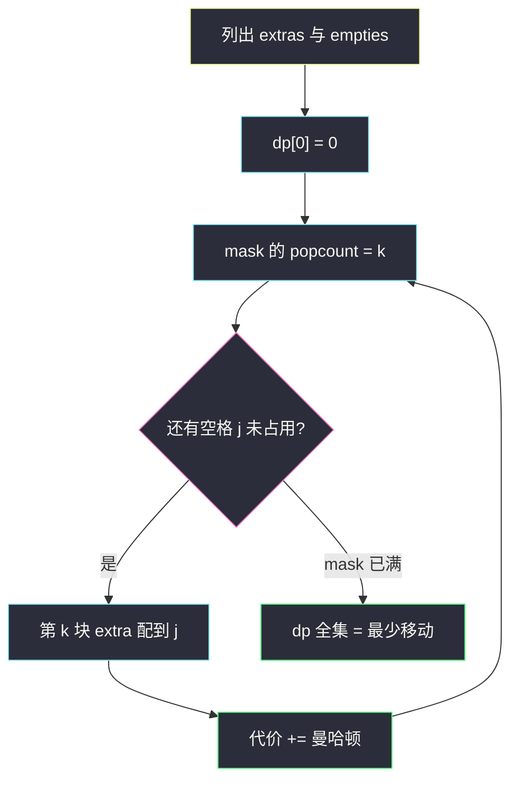
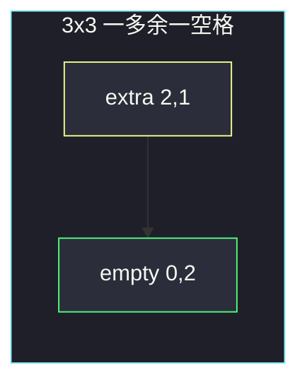

# 将石头分散到网格图的最少移动次数（排列型状压 · 曼哈顿匹配）

## 一、问题描述

`3×3` 网格，`grid[i][j]` 是该格石头数。一共恰好 9 块石头。一次操作：把**一块**石头移到四方向相邻格子，代价 1。目标是每格恰好 1 块。求最少移动次数。

> 🔗 LeetCode 2850：https://leetcode.cn/problems/minimum-moves-to-spread-stones-over-grid/
>
> 数据范围：网格固定 `3×3`，`0 ≤ grid[i][j] ≤ 9`，总和为 9。
>
> 📚 灵茶题单：**§9.1 排列型状压 DP ① 相邻无关**。多出来的石头列表 `extras` 和空格列表 `empties` 等长且 ≤ 9。把第 `k` 块多余石头匹配到一个还没占用的空格，代价是曼哈顿距离。空格的占用集合用 `mask`，与「上一块匹配的是谁」无关（相邻无关），标准排列型状压。

**示例 1**

```
输入：grid = [[1,1,0],[1,1,1],[1,2,1]]
输出：3
解释：唯一的多余石头在 (2,1)，唯一空格在 (0,2)，曼哈顿 2+1=3。
```

**示例 2**

```
输入：grid = [[1,3,0],[1,0,0],[1,0,3]]
输出：4
```

**直观理解**

石头可以叠、可以穿过已有 1 块的格子，互不堵路。每块「多余的石头」最终要走到某个空格，走的步数就是曼哈顿距离。不同多余石头不能抢同一个空格。于是变成：两组等长坐标的最小权和匹配。

---

## 二、暴力解法

列出每个空格，以及每个多余石头的坐标（一格有 3 块就出现 2 次）。枚举 `empties` 的全排列，与 `extras` 按下标配对，累加曼哈顿，取最小。

```python
from itertools import permutations

class Solution:
    def minimumMoves(self, grid: list[list[int]]) -> int:
        extras, empties = [], []
        for i in range(3):
            for j in range(3):
                if grid[i][j] == 0:
                    empties.append((i, j))
                elif grid[i][j] > 1:
                    extras.extend([(i, j)] * (grid[i][j] - 1))
        ans = 10**9
        for perm in permutations(range(len(empties))):
            cost = 0
            for k, t in enumerate(perm):
                x1, y1 = extras[k]
                x2, y2 = empties[t]
                cost += abs(x1 - x2) + abs(y1 - y2)
            ans = min(ans, cost)
        return ans
```

官方两例都能过。`m ≤ 9`，`9! = 362880`，勉强可以。本节要练的是同样搜索树用状压 DP 去重。

### 🔴 瓶颈在哪里

全排列里，「已经占用了哪些空格、下一步轮到第 `k` 块多余石头」只取决于占用集合，与占用顺序无关。`2^m · m` 远小于 `m!`。

---

## 三、优化探索（核心章节）

> 📚 本题在灵茶题单中属于 **§9.1 排列型状压 DP ① 相邻无关**。模板：`dp[mask]` = 已经给前 `k=bit_count(mask)` 个「物品」分配完、占用集合为 `mask` 的最小代价。第 `k` 个物品枚举一个 `mask` 里还没出现的位置 `j`。**不需要**知道上一次选的是谁。

### 3.1 为什么曼哈顿就等于最少格子步数

四方向走，从 `(x1,y1)` 到 `(x2,y2)` 最短路就是 `|x1-x2|+|y1-y2|`。多块石头同时走时，路径可以交叉、可以暂时叠在一格，不会互相加价。所以全局最优 = 最小权完备匹配，不必 BFS 模拟每一步。

已经有 1 块的格子既不是 extra 也不是 empty，石头不必动。

### 3.2 状态

`extras[k]` = 第 `k` 块要搬走的多余石头坐标（同一格多块就重复记录）。  
`empties[j]` = 第 `j` 个空格。  
`m = |extras| = |empties|`。

`dp[mask]` = 已经把 `extras[0..k-1]`（`k = popcount(mask)`）匹配到 `mask` 里那些空格的最小曼哈顿和。

转移：对每个 `mask`，`k = popcount(mask)`，若 `k < m`，枚举未占用的空格 `j`：

```
dp[mask | (1<<j)] = min( dp[mask | (1<<j)],
                         dp[mask] + manhattan(extras[k], empties[j]) )
```

初值 `dp[0] = 0`，其余正无穷。答案 `dp[(1<<m)-1]`。`m=0`（已经全是 1）时答案 0。



### 3.3 「相邻无关」是什么意思

有的排列 DP 还要在状态里记下「上一个选的数字 / 上一个位置」（相邻有关，比如不能选相邻的数）。本题第 `k` 块石头配到哪个空格，只看空格还在不在，和上一次配对是哪一格无关——所以 mask 里不必再塞 last。

### 3.4 一句话核心

> **多余石头对空格做最小权匹配；mask 记占用过的空格；代价加曼哈顿。**

---

## 四、代码实现

### Python（主解：状压 DP）

```python
class Solution:
    def minimumMoves(self, grid: list[list[int]]) -> int:
        extras, empties = [], []
        for i in range(3):
            for j in range(3):
                if grid[i][j] == 0:
                    empties.append((i, j))
                elif grid[i][j] > 1:
                    extras.extend([(i, j)] * (grid[i][j] - 1))
        m = len(empties)
        inf = 10**9
        dp = [inf] * (1 << m)
        dp[0] = 0
        for mask in range(1 << m):
            k = mask.bit_count()
            if k >= m:
                continue
            x1, y1 = extras[k]
            for j in range(m):
                if mask >> j & 1:
                    continue
                x2, y2 = empties[j]
                nmask = mask | (1 << j)
                dp[nmask] = min(dp[nmask], dp[mask] + abs(x1 - x2) + abs(y1 - y2))
        return dp[(1 << m) - 1]
```

**变量含义**

| 写法 | 含义 |
|------|------|
| `extras[k]` | 第 `k` 块多余石头（顺序任意但固定） |
| `mask` 第 `j` 位 | 空格 `j` 是否已被匹配 |
| `k = popcount(mask)` | 下一步轮到 `extras[k]` |
| `dp[mask]` | 这批匹配的最小曼哈顿和 |

### Java（最优解）

```java
import java.util.*;

class Solution {
    public int minimumMoves(int[][] grid) {
        List<int[]> extras = new ArrayList<>();
        List<int[]> empties = new ArrayList<>();
        for (int i = 0; i < 3; i++) {
            for (int j = 0; j < 3; j++) {
                if (grid[i][j] == 0) {
                    empties.add(new int[] {i, j});
                } else if (grid[i][j] > 1) {
                    for (int t = 0; t < grid[i][j] - 1; t++) {
                        extras.add(new int[] {i, j});
                    }
                }
            }
        }
        int m = empties.size();
        int inf = 1_000_000_000;
        int[] dp = new int[1 << m];
        Arrays.fill(dp, inf);
        dp[0] = 0;
        for (int mask = 0; mask < (1 << m); mask++) {
            int k = Integer.bitCount(mask);
            if (k >= m) {
                continue;
            }
            int x1 = extras.get(k)[0], y1 = extras.get(k)[1];
            for (int j = 0; j < m; j++) {
                if ((mask >> j & 1) != 0) {
                    continue;
                }
                int x2 = empties.get(j)[0], y2 = empties.get(j)[1];
                int nmask = mask | (1 << j);
                dp[nmask] = Math.min(dp[nmask],
                        dp[mask] + Math.abs(x1 - x2) + Math.abs(y1 - y2));
            }
        }
        return dp[(1 << m) - 1];
    }
}
```

---

## 五、具体例子演示

### 5.1 官方示例 1：只有一对 → 3

`[[1,1,0],[1,1,1],[1,2,1]]`

- empty：`(0,2)`
- extra：`(2,1)`（该格 2 块，多 1 块）

`m=1`。`dp[0]=0`，把 extra 配到唯一空格：`|2-0|+|1-2|=3`。`dp[1]=3`。对拍官方。



### 5.2 官方示例 2：四对匹配 → 4

`[[1,3,0],[1,0,0],[1,0,3]]`

- extras（重复坐标）：`(0,1), (0,1), (2,2), (2,2)`（两格各多 2 块）
- empties：`(0,2), (1,1), (1,2), (2,1)`

一组最优配对（代价全是 1）：

| extra | empty | 曼哈顿 |
|-------|-------|--------|
| (0,1) | (0,2) | 1 |
| (0,1) | (1,1) | 1 |
| (2,2) | (1,2) | 1 |
| (2,2) | (2,1) | 1 |

和为 4。状压会枚举全部 4! 种本质匹配（有重复坐标，实际更少），最小值 4。对拍官方。

逐步看一个 mask：`empties` 编号 0..(0,2), 1..(1,1), 2..(1,2), 3..(2,1)。

1. `mask=0000`，k=0，extra=(0,1)。配 j=0 得 mask=0001，代价 1。
2. k=1，extra=(0,1)。配 j=1 得 mask=0011，代价 1+1=2。
3. k=2，extra=(2,2)。配 j=2 得 mask=0111，代价 2+1=3。
4. k=3，extra=(2,2)。配 j=3 得 mask=1111，代价 3+1=4。

其它顺序不会更优：空格都在 extras 的曼哈顿 1 邻域里，4 已经是下限。

---

## 六、复杂度分析

| 方法 | 时间 | 空间 | 说明 |
|------|------|------|------|
| 全排列 | `O(m·m!)` | `O(m)` | `m ≤ 9` 可过 |
| 排列型状压（主解） | `O(m² · 2^m)` | `O(2^m)` | 每个 mask 枚举一个空格 |
| 网格 BFS | 与状态数有关 | 较大 | 也能做，不必 |

`m ≤ 9`，`9² · 2^9 ≈ 2·10^4`，非常轻。

---

## 七、对比总结

| 维度 | TSP 状压 | 本题 |
|------|----------|------|
| 状态 | mask + 当前点 | **只有 mask** |
| 相邻 | 边权依赖上一个城市 | 配对互相独立 |
| 代价 | 图上的边 | 曼哈顿 |

**易错点**

1. **一格 3 块只记一次 extra**：应记 `v-1` 次。
2. **用欧氏距离或只许不穿越**：题目允许经过其它格子，曼哈顿即可。
3. **把已有 1 的格子当 empty**：empty 只收 0。
4. **`dp` 按 extra 的集合压**：多余石头是有序用掉的（用 popcount 当下标），压空格集合更干净。
5. **全 1 网格**：`m=0`，`(1<<0)-1=0`，`dp[0]=0`，不要特判漏掉。

---

## 八、举一反三

| 题目 | 关系 |
|------|------|
| [1947. 最大兼容性评分和](https://leetcode.cn/problems/maximum-compatibility-score-sum/) | 同节：学生与导师的排列匹配 |
| [1879. 两个数组最小的异或值之和](https://leetcode.cn/problems/minimum-xor-sum-of-two-arrays/) | 排列型状压，配对 XOR |
| [2172. 数组的最大与和](https://leetcode.cn/problems/maximum-and-sum-of-array/) | 数与槽位匹配，状压槽 |
| [1066. 校园自行车分配 II](https://leetcode.cn/problems/campus-bikes-ii/) | 人也是曼哈顿最小匹配 |
| [1681. 最小不兼容性](https://leetcode.cn/problems/minimum-incompatibility/) | 子集划分 + 状压 |

**思想迁移**

- 两边人数相等、代价只看这一对 → 排列型、相邻无关。
- 口诀：**「多余对空格；mask 记空位；曼哈顿求和取 min。」**
