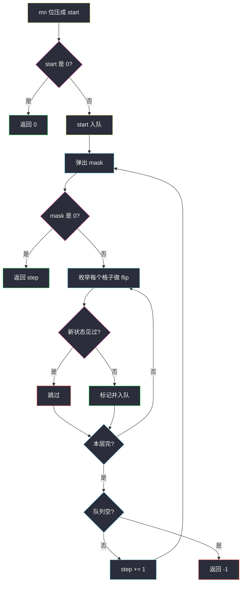
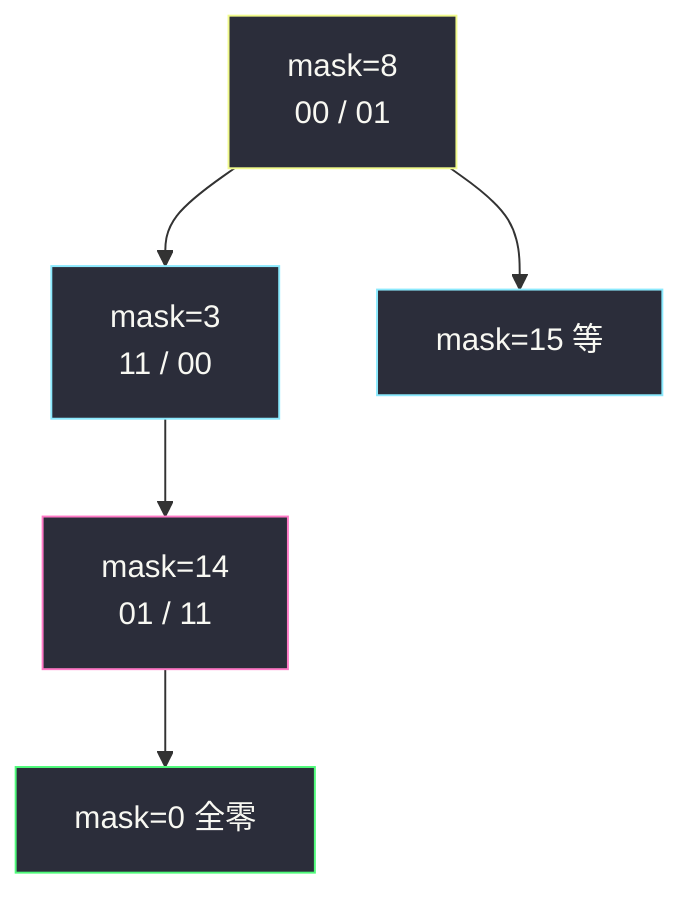

# 转化为全零矩阵的最少反转次数（位掩码当点 · BFS 最短路）

## 一、问题描述

`m × n` 的 0/1 矩阵。选一个格子翻转：该格 **以及上下左右四邻**（若存在）的 0/1 同时取反。求使矩阵变成 **全 0** 的最少翻转次数；做不到返回 `-1`。

> 🔗 LeetCode 1284：https://leetcode.cn/problems/minimum-number-of-flips-to-convert-binary-matrix-to-zero-matrix/
>
> 数据范围：`1 ≤ m, n ≤ 3`，因此格子数 `mn ≤ 9`，状态最多 `2^9 = 512`。
>
> 📚 灵茶题单：**图论 · §1.3 图论建模 + BFS 最短路**（1811 分）。整个矩阵压成一个整数；翻转一格 = 走到相邻状态，边权 1。

**示例 1**

```
输入：mat = [[0,0],[0,1]]
输出：3

一种最少方案：依次翻转 (0,1)、(1,0)、(1,1)
  [[0,0],[0,1]]
→ [[1,1],[0,0]]
→ [[0,1],[1,1]]
→ [[0,0],[0,0]]
```

**示例 2**

```
输入：mat = [[0]]
输出：0
已经是全 0，一次都不用翻。
```

**示例 3**

```
输入：mat = [[1,0,0],[1,0,0]]
输出：-1
2×3 这组 1 在翻转线性空间里到不了全 0。
```

**直观理解**

矩阵很小，把 `mn` 个格子的 0/1 看成二进制位，得到 `0 .. 2^{mn}-1` 里的一个整数。一次翻转对若干位做 XOR，相当于在这 512 个点的图上走一步。最少翻转次数 = 从起点到 `0` 的无权最短路 = **BFS**。

同一格翻两次等于没翻，顺序无关（XOR 可换、可结合）。所以最优解里每格最多翻一次，答案 ≤ `mn`。BFS 不会采用「翻两次」的更长路，因为中间会经过已经访问过的状态。

---

## 二、暴力解法

每个格子「翻 / 不翻」共 `2^{mn}` 种方案。对每种方案把对应格子各翻一次（顺序随意），看结果是不是全 0，记录 1 的个数最小的那种。这是枚举翻转集合，不是搜索路径。

```python
class Solution:
    def minFlips(self, mat: list[list[int]]) -> int:
        m, n = len(mat), len(mat[0])
        cells = m * n
        best = 10**9
        dirs = ((0, 0), (0, 1), (0, -1), (1, 0), (-1, 0))

        def apply(mask: int) -> bool:
            g = [row[:] for row in mat]
            for k in range(cells):
                if (mask >> k) & 1:
                    i, j = divmod(k, n)
                    for di, dj in dirs:
                        x, y = i + di, j + dj
                        if 0 <= x < m and 0 <= y < n:
                            g[x][y] ^= 1
            return all(g[i][j] == 0 for i in range(m) for j in range(n))

        for mask in range(1 << cells):
            if apply(mask):
                best = min(best, mask.bit_count())
        return -1 if best == 10**9 else best
```

`2^9 = 512` 完全能过。缺点是必须跑完所有子集，不能「找到一种就按层停止」；也更难讲清楚和最短路的关系。主解用状态 BFS，和题单 §1.3 一致，还能提前结束。

### 复杂度

- **时间**：`O(2^{mn} · mn)`。
- **空间**：`O(mn)` 拷贝矩阵。

### 🔴 瓶颈在哪里

枚举子集是对的（最优解每格最多一次）。但既然图画出来只有 512 个点，从当前矩阵出发 BFS，第一次变成全 0 就是最少步，还自带「做不到则 -1」。

---

## 三、优化探索（核心章节）

> 📚 本题在灵茶题单中属于 **§1.3 图论建模 + BFS**。节点 = 矩阵的位掩码；边 = 选一个格子翻转（自己和四邻 XOR 1）；求到 0 的最短路。

### 3.1 编码

行优先：格子 `(i, j)` 对应比特 `i * n + j`。矩阵 `mat[i][j] == 1` 则该位置 1。起点 `start` 为所有 1 拼起来的整数。`start == 0` 直接返回 0。

翻转 `(i, j)`：对 `(i, j)` 及四邻里在界内的格子，把对应比特 XOR 1。用一个函数 `flip(mask, i, j)`。

### 3.2 图与 BFS

- 点：`0 .. 2^{mn}-1`，实际只会走到从 `start` 能到达的那些。
- 每个点出度 `mn`（每个格子都能选一次翻转，即使翻完仍可能回到旧状态）。
- 边权 1。队列存掩码，`seen` 防止重复。第一次弹出（或生成）`0` 的层数就是答案。
- 队列空仍没见到 0：翻转生成的是线性空间里的一个仿射子空间，起点所在连通块不含 0，返回 -1。



### 3.3 正确性

翻转是模 2 意义下的加法：记格子 `k` 的翻转向量为 `v_k`（自己和邻居那些位是 1）。执行序列 `k1, k2, ...` 等价于起点 XOR `v_{k1} XOR v_{k2} XOR ...`。重复的 `k` 成对抵消，所以最短序列对应一组线性组合里 **1 的个数最少** 且等于起点（要把起点打成 0，即组合等于起点）。

BFS 在状态图上走：每条边 XOR 一个 `v_k`。因为重复 XOR 同一向量会走回头路并被 `seen` 挡住，搜到的第一条到 0 的路长度等于最少次数。

`m, n ≤ 3` 不必上高斯消元。灯光问题经典的「枚举第一行、后面行由上一行决定」也能做，代码更长，不是本节重点。

### 3.4 和转盘锁的对照

[打开转盘锁](./open-the-lock.md) 是 4 位十进制、每位 ±1；本题是 `mn` 位二进制、一次翻一组位。都是 **把局面当点、一次操作当边、BFS 最短路**。基因 / 单词接龙则是「操作结果还得落在合法集合里」；本题每个翻转都合法，只是可能到不了 0。

### 3.5 一句话核心

> **矩阵压成 bitmask；翻转一格 XOR 自己和四邻；在 ≤512 个状态上 BFS，到 0 的层数就是最少次数。**

---

## 四、代码实现

### Python（主解：掩码 BFS）

```python
from collections import deque

class Solution:
    def minFlips(self, mat: list[list[int]]) -> int:
        m, n = len(mat), len(mat[0])
        start = 0
        for i in range(m):
            for j in range(n):
                if mat[i][j]:
                    start |= 1 << (i * n + j)
        if start == 0:
            return 0

        dirs = ((0, 0), (0, 1), (0, -1), (1, 0), (-1, 0))

        def flip(mask: int, i: int, j: int) -> int:
            for di, dj in dirs:
                x, y = i + di, j + dj
                if 0 <= x < m and 0 <= y < n:
                    mask ^= 1 << (x * n + y)
            return mask

        q = deque([start])
        seen = {start}
        step = 0
        while q:
            for _ in range(len(q)):
                cur = q.popleft()
                if cur == 0:
                    return step
                for i in range(m):
                    for j in range(n):
                        nxt = flip(cur, i, j)
                        if nxt not in seen:
                            seen.add(nxt)
                            q.append(nxt)
            step += 1
        return -1
```

**变量含义**

| 变量 | 含义 |
|------|------|
| `start` / `cur` | 当前矩阵的位掩码，1 表示该格是 1 |
| `flip` | XOR 中心和四邻 |
| `seen` | 出现过的矩阵形态 |
| `step` | 已翻转次数 |

判断 `cur == 0` 放在出队处：起点全 0 时 step 仍是 0。若改成生成邻居时发现 0 则 `return step + 1`，起点全 0 必须先特判（主解已经特判了，两种都行）。

### Java

```java
class Solution {
    public int minFlips(int[][] mat) {
        int m = mat.length, n = mat[0].length;
        int start = 0;
        for (int i = 0; i < m; i++) {
            for (int j = 0; j < n; j++) {
                if (mat[i][j] == 1) start |= 1 << (i * n + j);
            }
        }
        if (start == 0) return 0;

        int[][] dirs = {{0, 0}, {0, 1}, {0, -1}, {1, 0}, {-1, 0}};
        ArrayDeque<Integer> q = new ArrayDeque<>();
        boolean[] seen = new boolean[1 << (m * n)];
        q.add(start);
        seen[start] = true;
        int step = 0;
        while (!q.isEmpty()) {
            int sz = q.size();
            for (int t = 0; t < sz; t++) {
                int cur = q.poll();
                if (cur == 0) return step;
                for (int i = 0; i < m; i++) {
                    for (int j = 0; j < n; j++) {
                        int nxt = cur;
                        for (int[] d : dirs) {
                            int x = i + d[0], y = j + d[1];
                            if (x >= 0 && x < m && y >= 0 && y < n) {
                                nxt ^= 1 << (x * n + y);
                            }
                        }
                        if (!seen[nxt]) {
                            seen[nxt] = true;
                            q.add(nxt);
                        }
                    }
                }
            }
            step++;
        }
        return -1;
    }
}
```

状态数 ≤ 512，`boolean[1 << mn]` 比 HashSet 更直。

---

## 五、具体例子演示

示例 1：`[[0,0],[0,1]]`，`m = 2`，`n = 2`。

比特：`(0,0)=bit0`，`(0,1)=bit1`，`(1,0)=bit2`，`(1,1)=bit3`。起点只有右下角是 1，`start = 0b1000 = 8`。

四个翻转各自 XOR 的掩码（中心+邻居）：

| 翻转格子 | 影响的格 | XOR 掩码 |
|----------|----------|----------|
| (0,0) | 三个：自己、右、下 | `0b0111` |
| (0,1) | 自己、左、下 | `0b1011` |
| (1,0) | 自己、上、右 | `0b1101` |
| (1,1) | 自己、上、左 | `0b1110` |

**step = 0，队列：`[8]` 即 `[[0,0],[0,1]]`**

弹出 8，不是 0。四个邻居：

- 翻 (0,0)：`8 XOR 0111 = 0b1111` → `[[1,1],[1,1]]`
- 翻 (0,1)：`8 XOR 1011 = 0b0011` → `[[1,1],[0,0]]`
- 翻 (1,0)：`8 XOR 1101 = 0b0101` → `[[1,0],[1,0]]`
- 翻 (1,1)：`8 XOR 1110 = 0b0110` → `[[0,1],[1,0]]`

四个都入队。`step = 1`。

**step = 1**

本层四个状态都不是 0。继续翻，进入 step 2 的一批新掩码（含 `0b1110`、`0b0001` 等）。

**step = 2**

仍没有 0。其中一条线已经走到 `[[0,1],[1,1]]`，掩码 `0b1110 = 14`。

**step = 3，队列里出现 `0`**

从 14 再翻 (1,1)：`14 XOR 1110 = 0`。弹出 0 时 `step = 3`，返回 3。

还原这一条最短路（对拍得到的其中一种，顺序可换）：

| 步 | 掩码 | 矩阵 | 本步翻转 |
|----|------|------|----------|
| 0 | `1000` | `[[0,0],[0,1]]` | — |
| 1 | `0011` | `[[1,1],[0,0]]` | (0,1) |
| 2 | `1110` | `[[0,1],[1,1]]` | (1,0) |
| 3 | `0000` | `[[0,0],[0,0]]` | (1,1) |



为什么不是 1 步？单独翻任何一个格子，起点 `1000` XOR 上表四个掩码都得不到 `0000`（四个结果分别是 15、3、5、6）。2 步：两个向量之和等于 `1000` 的组合在 2×2 上不存在，所以最短是 3。BFS 用层数替你排除了 1 和 2，不必手解方程组。

示例 2：`start = 0`，直接返回 0，队列不用跑。

示例 3：`[[1,0,0],[1,0,0]]` 起点比特 bit0 与 bit3（`n=3` 时第二行第一列是 bit3）。从该点 BFS 扩完所有能到的掩码（最多 64 个 2×3 状态）都没有 0，返回 -1。

---

## 六、复杂度分析

`S = 2^{mn} ≤ 512`，`C = mn ≤ 9`。

| 方法 | 时间 | 空间 | 说明 |
|------|------|------|------|
| 枚举翻转子集 | `O(S · C)` | `O(C)` | 必须跑满 512 |
| 掩码 BFS（主解） | `O(S · C)` | `O(S)` | 每状态出度 `C`；常提前停 |
| 高斯消元 GF(2) | `O(C³)` | `O(C²)` | `C≤9` 没必要 |

时间同阶，BFS 更贴「最短路」题单，也更好提前返回。

---

## 七、对比总结

| 维度 | 子集枚举 | 状态 BFS |
|------|----------|----------|
| 搜索对象 | 每格翻不翻 | 矩阵形态 |
| 到不了 0 | 扫完全部 mask | 队列空 |
| 和题单 | 二进制枚举 | §1.3 建模 |

**易错点**

1. **只翻转自己、忘了四邻**：题面是十字翻。
2. **比特下标写成 `i*m+j`**：行优先是 `i*n+j`（`n` 是列数）。
3. **起点全 0 返回 -1**：要返回 0。
4. **出队再标记**：同一形态被不同翻转序列重复入队，512 虽小也不该写。
5. **把答案理解成必须翻的格子集合唯一**：可以有多种长度为 3 的序列，BFS 只保证长度最小。
6. 越界邻居不要 XOR：`if 0<=x<m and 0<=y<n`。
7. 返回值与单词接龙不同：做不到是 **-1** 不是 0。

---

## 八、举一反三

| 题目 | 关系 |
|------|------|
| [752. 打开转盘锁](https://leetcode.cn/problems/open-the-lock/) | 局面当点 + BFS。题解：[open-the-lock.md](./open-the-lock.md) |
| [433. 最小基因变化](https://leetcode.cn/problems/minimum-genetic-mutation/) | 字符串状态 BFS。题解：[minimum-genetic-mutation.md](./minimum-genetic-mutation.md) |
| [773. 滑动谜题](https://leetcode.cn/problems/sliding-puzzle/) | 棋盘压状态，最少移动 |
| [847. 访问所有节点的最短路径](https://leetcode.cn/problems/shortest-path-visiting-all-nodes/) | `(点, 访问掩码)` 当状态 |
| [127. 单词接龙](https://leetcode.cn/problems/word-ladder/) | 同样无权最短。题解：[word-ladder.md](./word-ladder.md) |
| [672. 灯泡开关 Ⅱ](https://leetcode.cn/problems/bulb-switcher-ii/) | 翻转可换且有限，状态可压 |

**思想迁移**

- `m, n` 极小、操作可逆 → 把整个棋盘压进一个 int，BFS。
- 口诀：**「格子当比特，十字翻是 XOR；512 个点上走 BFS，见到全 0 的层数就是答案。」**
