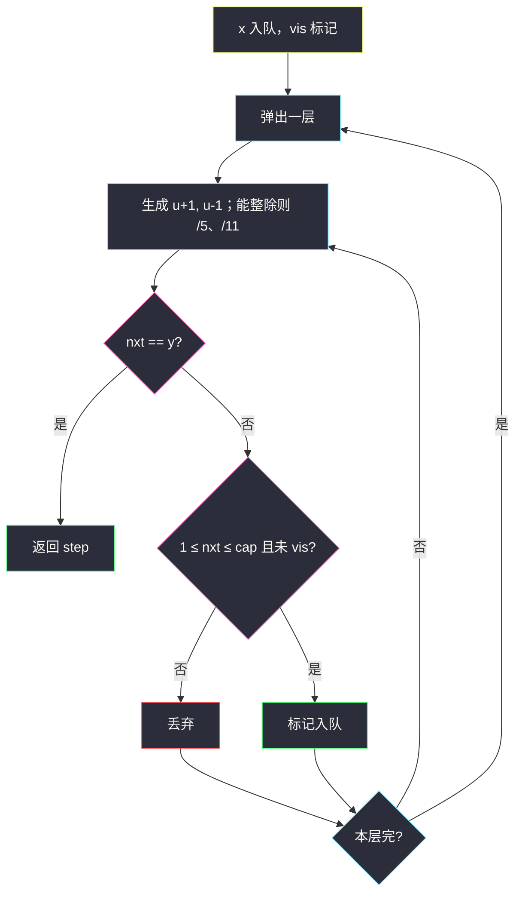
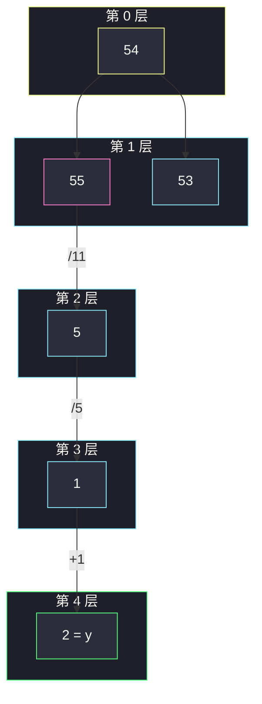

# 使 X 和 Y 相等的最少操作次数（数字当点 · BFS）

## 一、问题描述

正整数 `x、y`。一次操作四选一：

1. `x` 能被 11 整除则 `x = x / 11`
2. `x` 能被 5 整除则 `x = x / 5`
3. `x -= 1`
4. `x += 1`

最少几次让 `x == y`。

> 🔗 LeetCode 2998：https://leetcode.cn/problems/minimum-number-of-operations-to-make-x-and-y-equal/
>
> 数据范围：`1 ≤ x, y ≤ 10^4`。
>
> 📚 灵茶题单：**图论 · §1.3 图论建模 + BFS**（1795 分）。

**示例 1**

```
输入：x = 26, y = 1
输出：3
26 - 1 = 25，/5 = 5，/5 = 1。
```

**示例 2**

```
输入：x = 54, y = 2
输出：4
54 + 1 = 55，/11 = 5，/5 = 1，+1 = 2。
先加到 11 的倍数再除，比一路 -1 短很多。
```

**示例 3**

```
输入：x = 25, y = 30
输出：5
x < y，只能靠 +1 涨上去，答案就是 5。
```

**直观理解**

每个正整数是图上一个点，四种操作是边权 1 的边。最少操作 = **无权最短路 = BFS 层数**。和转盘锁同一建模：状态当点，转移当边。

---

## 二、暴力解法

DFS 搜所有操作序列，用 `seen` 防环。先走出一条很长的 `-1` 链会把答案定差，还得回溯。`+1` 没有自然上界时会往无穷大走。

```python
# 伪代码：dfs(cur, step)；四种转移；step >= ans 剪枝
# 不按层，第一次碰到 y 不必最短
```

### 复杂度

- **时间**：指数。
- **空间**：递归栈 + `seen`。

### 🔴 瓶颈在哪里

边权全是 1，BFS 第一次碰到 `y` 就是最少步。该 BFS，并给 `+1` 加一个上界，避免队列涨到无穷。

---

## 三、优化探索（核心章节）

> 📚 本题在灵茶题单中属于 **§1.3 图论建模 + BFS**。数字当节点；除 5 / 除 11 / ±1 当边。主解 BFS。

### 3.1 `x ≤ y` 时

增大 `x` 的唯一办法是 `+1`（除法只会变小）。所以 `x ≤ y` 时答案就是 `y - x`。示例 3 即此。

### 3.2 `x > y`：可能先加再除

示例 2：54 不是 5 或 11 的倍数，`-1` 到 2 要 52 步；`+1` 到 55 后连除，4 步。提示还给出 `x=10, y=1`：`10+1=11`，`/11=1`，2 步。

### 3.3 搜索上界

纯 `-1` 从 `x` 到 `y` 只需 `x-y` 步，因此最优解里 `+1` 的次数不会超过 `x-y`，否则不如一路减。一个证明友好的上界是 `U = x + (x-y) = 2x-y`。

更紧的实务上界：**`max(x, y) + 11`**。要凑 11 的倍数最多再加 10。对拍随机 `x,y ∈ [1,200]` 以及官方三例，与上界 400 的 BFS 结果一致。实现里取 `cap = max(x, y) + 11`，`v` 落到 `[1, cap]` 才入队。

不要搜 `≤ 0`：`y ≥ 1`，走到 0 再 `+1` 回来只会更亏。



### 3.4 可选优化：先凑倍数

记忆化搜索「离 5/11 倍数差几步再除」能少扩展一些点，不是题单要求。默写仍用朴素 BFS。

### 3.5 一句话核心

> **整数当点、四操当边；BFS 最短路；+1 不要超过 `max(x,y)+11`。**

---

## 四、代码实现

### Python（主解：BFS）

```python
from collections import deque

class Solution:
    def minimumOperationsToMakeEqual(self, x: int, y: int) -> int:
        if x <= y:
            return y - x
        cap = max(x, y) + 11
        vis = set([x])
        q = deque([x])
        step = 0
        while q:
            for _ in range(len(q)):
                u = q.popleft()
                if u == y:
                    return step
                cands = [u + 1, u - 1]
                if u % 11 == 0:
                    cands.append(u // 11)
                if u % 5 == 0:
                    cands.append(u // 5)
                for v in cands:
                    if 1 <= v <= cap and v not in vis:
                        vis.add(v)
                        q.append(v)
            step += 1
        return -1
```

**变量含义**

| 变量 | 含义 |
|------|------|
| `cap` | 入队上界，挡住无意义的 `+1` |
| `vis` | 已入队整数 |
| `step` | BFS 层号 = 已操作次数 |

入队即标记。`x ≤ y` 提前返回只是加速；不写这行、靠同一套 BFS 也能过（`cap` 至少要盖住 `y`）。

对拍：`(26,1)→3`，`(54,2)→4`，`(25,30)→5`，`(10,1)→2`。

### Java（可选）

```java
class Solution {
    public int minimumOperationsToMakeEqual(int x, int y) {
        if (x <= y) return y - x;
        int cap = Math.max(x, y) + 11;
        boolean[] vis = new boolean[cap + 1];
        ArrayDeque<Integer> q = new ArrayDeque<>();
        q.add(x);
        vis[x] = true;
        int step = 0;
        while (!q.isEmpty()) {
            int sz = q.size();
            for (int i = 0; i < sz; i++) {
                int u = q.poll();
                if (u == y) return step;
                int[] cands = {u + 1, u - 1};
                for (int v : cands) offer(v, cap, vis, q);
                if (u % 11 == 0) offer(u / 11, cap, vis, q);
                if (u % 5 == 0) offer(u / 5, cap, vis, q);
            }
            step++;
        }
        return -1;
    }
    void offer(int v, int cap, boolean[] vis, ArrayDeque<Integer> q) {
        if (v >= 1 && v <= cap && !vis[v]) {
            vis[v] = true;
            q.add(v);
        }
    }
}
```

---

## 五、具体例子演示

### 示例 1：`26 → 1`

`cap = 37`。除法优先出现在 BFS 里并不靠手排优先级，层数保证最短。

| 层 step | 弹出（部分） | 新状态 | 命中? |
|---------|--------------|--------|-------|
| 0 | 26 | 27, **25** | 否 |
| 1 | 25 | 26(vis), 24, **5**（/5） | 否 |
| 2 | 5 | 6, 4, **1**（/5） | 下一层命中 |
| 3 | 1 | — | **返回 3** |

路径 `26→25→5→1`。

### 示例 2：`54 → 2`

| 层 | 关键新点 | 说明 |
|----|----------|------|
| 0 | 54 | 不能除 |
| 1 | **55**, 53 | +1 碰到 11 的倍数 |
| 2 | **5** | 55/11 |
| 3 | **1** | 5/5 |
| 4 | **2** | 1+1，返回 4 |

若禁止 `+1` 超过 54，55 进不去，会退化成劣解。



### 示例 3

`25 ≤ 30`，直接 `30-25=5`，不必 BFS。

---

## 六、复杂度分析

| 方法 | 时间 | 空间 | 说明 |
|------|------|------|------|
| DFS 回溯 | 指数 | 与 vis 同阶 | 不保证最短 |
| BFS（主解） | `O(U)` | `O(U)` | `U ≈ max(x,y)+11`，出度 ≤ 4 |

`x,y ≤ 1e4`，`U` 约 1e4，稳过。

---

## 七、对比总结

| 维度 | 一路减到 y | BFS |
|------|------------|-----|
| `x ≤ y` | 就是答案 | 也能算对 |
| `x > y` | 上界 / 候选 | 能抓住「加到倍数再除」 |

**易错点**

1. **`+1` 不设上界**：队列沿自然数无限涨。
2. **上界过紧**（例如 `cap = x`）：54 加不到 55。`+11` 够用。
3. **出队再 vis**：同一数字被多个前驱重复入队。
4. **允许 0**：`1-1=0` 再 `/5` 原地打转，应丢掉 `≤ 0`。
5. **先除后判范围**：`u//11` 可能变 0，仍要过 `v >= 1`。
6. 整数除法写成 `/` 在 Python3 会变 float，用 `//`。

---

## 八、举一反三

| 题目 | 关系 |
|------|------|
| [752. 打开转盘锁](https://leetcode.cn/problems/open-the-lock/) | 同目录 `open-the-lock.md`，四位密码当点 |
| [2059. 转化数字的最小运算数](https://leetcode.cn/problems/minimum-operations-to-convert-number/) | 同批，`+ / - / XOR`，中间结果锁在 0..1000 |
| [433. 最小基因变化](https://leetcode.cn/problems/minimum-genetic-mutation/) | 字符串状态 BFS |
| [397. 整数替换](https://leetcode.cn/problems/integer-replacement/) | 也是整数 ±1 与除 2，可用 BFS / 贪心 |
| [279. 完全平方数](https://leetcode.cn/problems/perfect-squares/) | 数字当点，减平方数当边 |

染色类约束见 [判断二分图](is-graph-bipartite.md)。

**思想迁移**

- 值域不大、转移局部 → 隐式图 BFS。
- 口诀：**「数字是节点，四操是边；先加再除别忘上界，层数即答案。」**
