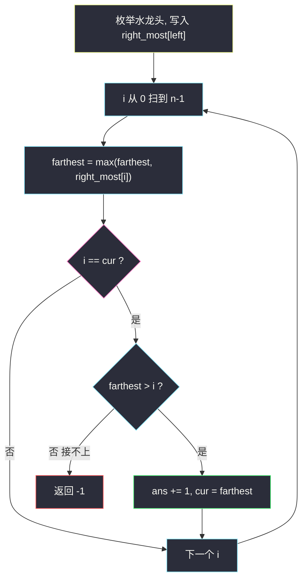
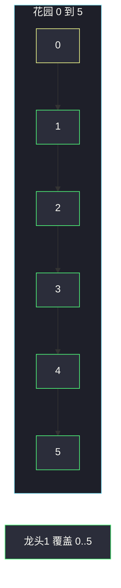

# 灌溉花园的最少水龙头数目（区间覆盖 · 等价跳跃游戏 II）

## 一、问题描述

花园是数轴上的闭区间 `[0, n]`。位置 `0, 1, …, n` 各有一个水龙头；打开位置 `i` 的水龙头，可以浇到 `[i - ranges[i], i + ranges[i]]`。求打开**最少**多少个水龙头，才能浇遍整段 `[0, n]`。做不到返回 `-1`。

> 🔗 LeetCode 1326：https://leetcode.cn/problems/minimum-number-of-taps-to-open-to-water-a-garden/
>
> 数据范围：`1 ≤ n ≤ 10^4`，`ranges.length = n + 1`，`0 ≤ ranges[i] ≤ 100`。
>
> 📚 灵茶题单：**§2.4 区间覆盖**（1885 分）。先把每个水龙头收成「从某个左端能浇到的最右」，数组下标天然有序，之后和 [45. 跳跃游戏 II](https://leetcode.cn/problems/jump-game-ii/) 同一套 `cur / farthest` 分层。

**示例 1**

```
输入：n = 5, ranges = [3,4,1,1,0,0]
输出：1
解释：位置 1 的水龙头覆盖 [-3, 5]，截到花园就是 [0, 5]，一个就够。
```

**示例 2**

```
输入：n = 3, ranges = [0,0,0,0]
输出：-1
解释：每个龙头只浇到自己脚下的一个点，点与点之间的线段浇不到。
```

**直观理解**

每个水龙头是一条区间。问题是：从一批区间里选最少几条，使它们的并集盖住 `[0, n]`。这就是区间覆盖。和视频拼接（1024）、跳跃游戏 II（45）同构：当前已经浇到 `cur`，下一只龙头必须从已经浇到的区域内出发，在这些候选里挑**右端最远**的那只，跳过去。跳不动就有缝，返回 `-1`。

---

## 二、暴力解法

区间最多 `n + 1` 条，`n = 10^4`，子集枚举 `2^{10001}` 不可能。

可以 DP：`dp[x]` = 浇遍 `[0, x]` 的最少龙头数。枚举最后一只覆盖到 `x` 的水龙头，它的覆盖是 `[L, R]`（`L ≤ x ≤ R`），前面必须已经浇到 `L`：

```python
class Solution:
    def minTaps(self, n: int, ranges: list[int]) -> int:
        inf = n + 2
        dp = [0] + [inf] * n
        intervals = []
        for i, r in enumerate(ranges):
            L, R = max(0, i - r), min(n, i + r)
            intervals.append((L, R))
        intervals.sort()  # 按左端，保证用 dp[L] 时 L 左侧已处理完……仍不够
        # 更稳妥：对每个右端 x，枚举所有盖住 x 的区间
        for x in range(1, n + 1):
            for L, R in intervals:
                if L < x <= R and dp[L] < inf:
                    dp[x] = min(dp[x], dp[L] + 1)
        return dp[n] if dp[n] < inf else -1
```

每个位置枚举全部区间，`O(n²)`。`n = 10^4` 卡得慌；`ranges[i] ≤ 100` 时可以只枚举附近的龙头压到 `O(n · 100)`，能过，但没有把「最优结构」用上：同一段已覆盖区域内，真正有用的只有**右端最远**的那一只。

### 🔴 瓶颈在哪里

覆盖问题的最优决策不需要记住「浇到每个整数点的最少龙头」，只需要记住：

- 当前已经确定浇到的位置 `cur`（上一只龙头的右端）；
- 在 `cur` 以内能出发的所有龙头里，最远还能浇到哪 `farthest`。

`farthest` 一旦不再前进，中间有缝；每把 `cur` 更新成 `farthest` 就等于新开一只龙头。这正是跳跃游戏 II 的分层 BFS，从 `O(n²)` DP 塌成一次线性扫描。

---

## 三、优化探索（核心章节）

> 📚 本题在灵茶题单中属于 **§2.4 区间覆盖**。模板两步：① 预处理成「从位置 `i` 出发能到达的最右」；② 再跑跳跃游戏 II。本节把「为什么这两步合法、为什么等于最少龙头」讲透。

### 3.1 水龙头 → 区间，再压成 `right_most`

位置 `i`、半径 `r = ranges[i]` 的覆盖是 `[i - r, i + r]`。花园只有 `[0, n]`，左端小于 0 的部分无意义，截成：

`left = max(i - r, 0)`，`right = i + r`（右端超过 `n` 也没关系，能浇过 `n` 当然盖得住 `n`）。

打开这只龙头的含义是：如果你**已经浇到 `left`**（含 `left` 这个点），就可以把覆盖推进到 `right`。

多个龙头截断后可能有相同的 `left`。同一起点开两只，不如只开右端更远的那只——最优解里同一 `left` 最多用一只。所以：

```
right_most[left] = max(right_most[left], right)
```

`right_most[i]` 的语义变成：**左端恰好是 i 的那些龙头里，最远右端**。没有龙头从 `i` 出发时保持 0。

这和跳跃游戏里 `nums[i]` = 「站在 i 最远跳到哪」一一对应。区别只是：跳跃游戏的 `nums[i]` 题目直接给；本题要先从半径算出来，并且「从 i 出发」指的是区间左端落在 i，不是水龙头本身插在 i（插在 i 的龙头，左端可能被截到更左边）。

### 3.2 为什么「左端截到 0」不会漏最优

一只本来覆盖 `[-3, 5]` 的龙头，截成 `[0, 5]`。花园从 0 开始，`[-3, 0)` 本来就不用浇。把它记在 `right_most[0]` 上：一开始 `cur = 0`，扫描位置 0 时就会把它收进 `farthest`。若死记左端 `-3`，排序后还得单独处理负坐标，纯属自找麻烦。

一只覆盖 `[2, 6]` 的龙头记在 `right_most[2]`。只有当前覆盖已经到达 2，才有资格开它——这正好是「下一个区间必须从已覆盖区域出发」。不会在还没浇到 2 时就提前用它（也用不了，中间有缝）。

### 3.3 跳跃游戏 II：`cur` 与 `farthest`

要浇的是连续线段 `[0, n]`，不是 `n + 1` 个孤立点。已经浇到 `cur` 的意思是 `[0, cur]` 整段有水。下一步能用的龙头，是所有 `left ≤ cur` 的，也就是扫描下标 `0 .. cur` 时见过的 `right_most`。

维护：

- `cur`：当前这「一层」确定浇到的位置（已开龙头的覆盖右端）；
- `farthest`：在到达 `cur` 之前（含）见过的所有龙头能推到的最远右端；
- `ans`：已经开了几只。

从左往右扫 `i = 0, 1, …, n-1`：

1. `farthest = max(farthest, right_most[i])`：位置 `i` 若已在当前覆盖内，这只候选可以纳入「下一跳」。
2. 当 `i == cur`：当前层走完了，必须新开一只，把覆盖推到 `farthest`。若 `farthest ≤ i`，一只都接不上，返回 `-1`。否则 `cur = farthest`，`ans += 1`。
3. 若某次更新后 `cur ≥ n`，整园已覆盖；循环扫完 `n-1` 时，因为每次 `i == cur` 都会尝试往右推，只要能浇到 `n` 就会在某次把 `cur` 推过或推到 `n`。

循环上界是 `n` 而不是 `n+1`：需要覆盖到点 `n`，最后一次有意义的「出发位置」是 `n-1`。若 `cur` 已经 ≥ `n`，后面的 `i` 都小于 `cur`，不会再加次数。若 `cur` 停在 `n-1`，扫到 `i = n-1` 时还会再跳一次，试图用 `right_most[n-1]` 等把右端推到 ≥ `n`；推不过就 `-1`。这正好对应「浇到 `n-1` 还不够，花园右端点是 `n`」。



### 3.4 正确性：为什么最少、为什么等于跳跃游戏

**与跳跃游戏同构。** 把花园上的整数点看成格子。`right_most[i]` 表示「站在 i，一步最远到达 `right_most[i]`」。浇遍 `[0, n]` = 从格子 0 跳到格子 n。最少龙头 = 最少跳数。45 题保证能到终点；本题可能有缝，所以多一个 `farthest ≤ i` 则失败。

**贪心不劣于最优。** 设最优用了 `t` 只龙头，按右端排序后第 k 只浇到 `R_k`（`R_0` 视为 0）。归纳：贪心第 k 跳结束时 `cur ≥ R_k`。

- k = 1：能用 1 只浇到某点，这只的左端必须 ≤ 0，即记在 `right_most[0]` 里。贪心第一次跳取的就是所有左端为 0 的最大右端，≥ 任何单只能达到的位置。
- 假设前 k 跳贪心的 `cur ≥ R_k`。最优第 k+1 只的左端 ≤ `R_k ≤ cur`，扫描时已经被收进 `farthest`，所以下一跳 `cur' ≥` 这只的右端 `R_{k+1}`。

因此贪心用 ≤ `t` 跳就能到 n（或发现最优也到不了）。贪心本身是可行方案，故等于最少。

交换观点：当前覆盖 `[0, cur]` 内，若选一只右端不是最远的，覆盖更短，后面需要的龙头只多不少。把这只换成同层里右端更远的，不会让后续更难接——这就是 §2.4 的标准交换。

### 3.5 和「先排序再扫区间」是同一件事

另一常见写法：把 `n+1` 条区间按左端排序，指针 `i` 单调前进，每轮在 `start ≤ pre` 的区间里取最大 `end`。因为左端已经被我们当作数组下标，`right_most` 相当于「桶排序后每个左端只留最大右端」，省掉显式 `sort`。`n ≤ 10^4` 两种都过；灵神模板用桶，和 45 题代码更贴。

### 3.6 一句话核心

> **每个龙头写成从截断左端出发能浇到的最右；然后当跳跃游戏 II 扫 `[0, n]`：追上 `cur` 就开一只跳到 `farthest`，`farthest` 不动则 `-1`。**

---

## 四、代码实现

### Python（主解：right_most + 跳跃 II）

```python
class Solution:
    def minTaps(self, n: int, ranges: list[int]) -> int:
        right_most = [0] * (n + 1)
        for i, r in enumerate(ranges):
            left = max(i - r, 0)
            right_most[left] = max(right_most[left], i + r)

        ans = 0
        cur = farthest = 0
        for i in range(n):
            farthest = max(farthest, right_most[i])
            if i == cur:
                if farthest <= i:
                    return -1
                cur = farthest
                ans += 1
        return ans
```

### Java（最优解，同构）

```java
class Solution {
    public int minTaps(int n, int[] ranges) {
        int[] rightMost = new int[n + 1];
        for (int i = 0; i <= n; i++) {
            int r = ranges[i];
            int left = Math.max(i - r, 0);
            rightMost[left] = Math.max(rightMost[left], i + r);
        }
        int ans = 0, cur = 0, farthest = 0;
        for (int i = 0; i < n; i++) {
            farthest = Math.max(farthest, rightMost[i]);
            if (i == cur) {
                if (farthest <= i) {
                    return -1;
                }
                cur = farthest;
                ans++;
            }
        }
        return ans;
    }
}
```

**变量含义**

| 写法 | 含义 |
|------|------|
| `right_most[left]` | 左端为 `left` 的龙头能浇到的最远右端 |
| `cur` | 当前已确定浇到的位置（本层右端） |
| `farthest` | 下一层能浇到的最远位置 |
| `i == cur` | 本层走完，必须新开一只 |
| `farthest <= i` | 新开也推不过 `i`，出现缝隙 |

`right_most` 长度 `n+1`，下标 `n` 只在预处理时可能被写入（水龙头就在点 `n` 且半径 0），扫描不到它——若整园还没盖住，单靠「左端为 n」的龙头也救不了 `[0, n)` 的缝。这是对的。

想提前结束可以在 `ans += 1` 之后加 `if cur >= n: return ans`。例 1 第一次跳 `cur = 5` 就会返回，后面的 `i=1..4` 不必再走。对拍结果不变。不写提前返回时，循环结束 `cur` 一定已经 ≥ `n`（否则中途 `farthest <= i` 已经 `-1` 了），直接 `return ans` 即可。

---

## 五、具体例子演示

### 官方例 1：端到端跟踪 farthest

`n = 5`，`ranges = [3, 4, 1, 1, 0, 0]`。先建区间再压缩。

| 水龙头 i | r | 原始覆盖 | 截到 ≥ 0 | left | 写入 right_most[left] |
|----------|---|----------|----------|------|------------------------|
| 0 | 3 | [-3, 3] | [0, 3] | 0 | 3 |
| 1 | 4 | [-3, 5] | [0, 5] | 0 | max(3, **5**)=5 |
| 2 | 1 | [1, 3] | [1, 3] | 1 | 3 |
| 3 | 1 | [2, 4] | [2, 4] | 2 | 4 |
| 4 | 0 | [4, 4] | [4, 4] | 4 | 4 |
| 5 | 0 | [5, 5] | [5, 5] | 5 | 5 |

`right_most = [5, 3, 4, 0, 4, 5]`。位置 1 那只龙头独自覆盖到 5，全部记在下标 0 上。

跳跃扫描 `i = 0 .. 4`，初始 `cur = farthest = 0`，`ans = 0`：

| i | right_most[i] | farthest | i == cur ? | 动作 | ans | cur |
|---|---------------|----------|------------|------|-----|-----|
| 0 | 5 | 5 | **是**（cur=0） | farthest=5 > 0，开 1 只，cur=5 | 1 | 5 |
| 1 | 3 | 5 | 否 | | 1 | 5 |
| 2 | 4 | 5 | 否 | | 1 | 5 |
| 3 | 0 | 5 | 否 | | 1 | 5 |
| 4 | 4 | 5 | 否（4 ≠ 5） | 循环结束，cur=5 ≥ n | 1 | 5 |

第一次跳就把 `cur` 推到 5，等于打开了「左端在 0、右端 5」的那只——也就是位置 1 的水龙头。答案 **1**，与官方一致。

过程示意：



### 官方例 2：缝在第一步

`n = 3`，`ranges = [0, 0, 0, 0]`。每只只覆盖 `[i, i]`。

`right_most = [0, 1, 2, 3]`。

| i | right_most[i] | farthest | i == cur ? | 动作 |
|---|---------------|----------|------------|------|
| 0 | 0 | 0 | 是 | farthest=0 ≤ i=0，**返回 -1** |

点 0 浇得到，但从 0 再往右一步到不了。线段 `(0, 1]` 没人浇。答案 **-1**。

### 需要多只的跟踪（帮助看清分层）

`n = 5`，`ranges = [1, 1, 1, 1, 1, 1]`。每只覆盖 `[i-1, i+1]`，截断后：

| i | left | right | right_most 更新 |
|---|------|-------|-----------------|
| 0 | 0 | 1 | [0]=1 |
| 1 | 0 | 2 | [0]=2 |
| 2 | 1 | 3 | [1]=3 |
| 3 | 2 | 4 | [2]=4 |
| 4 | 3 | 5 | [3]=5 |
| 5 | 4 | 6 | [4]=6 |

`right_most = [2, 3, 4, 5, 6, 0]`（最后一位用不到）。

| i | farthest | i==cur | 动作 | ans | cur |
|---|----------|--------|------|-----|-----|
| 0 | 2 | 是 | 跳到 2 | 1 | 2 |
| 1 | max(2,3)=3 | 否 | | 1 | 2 |
| 2 | max(3,4)=4 | **是** | 跳到 4 | 2 | 4 |
| 3 | max(4,5)=5 | 否 | | 2 | 4 |
| 4 | max(5,6)=6 | **是** | 跳到 6 | 3 | 6 |

三跳覆盖到 6 ≥ 5，答案 3。每一层结束时 `farthest` 刚好多推进约 2，和「半径 1 的龙头每次多浇一段」一致。

若把位置 3 的半径改成 0：`right_most[2]` 仍是 4（龙头 3 变成 `[3,3]` 记在下标 3），第二跳仍到 4，第三跳仍能用 `right_most[4]=6`。中间不断。若再把龙头 5 半径也改成 0 且龙头 4 半径 0，第二跳后 `farthest` 卡在 4，`i=4` 时 `farthest ≤ 4`，返回 -1——点 5 成了孤岛。

**边界**

- `n = 1`，`ranges = [1, 0]`：龙头 0 覆盖到 1，`right_most[0]=1`，一次跳成功。
- `n = 1`，`ranges = [0, 0]`：`right_most[0]=0`，第一步 `farthest ≤ 0`，-1。
- 某只半径很大：`left` 截成 0，`right_most[0]` 直接 ≥ n，答案 1。
- 多只左端相同：只保留最大右端，不会重复计数（跳跃时一个位置只贡献一次 max）。

### 和跳跃游戏 II 的数组怎么对上

例 1 的 `right_most = [5, 3, 4, 0, 4, 5]` 相当于 45 题输入 `nums` 的前 `n` 个（下标 0..4 的跳跃能力是 5,3,4,0,4）。从 0 出发一步跳到 5，已经到达终点，最少 1 跳——和龙头答案相同。

视频拼接写法对照：把 6 条截断区间按左端排序后，`pre = 0` 时能接上的是左端 ≤ 0 的，只有 `[0,5]`（以及被压掉的 `[0,3]`），一轮 `reach = 5 ≥ n`，同样 1 段。两种代码数的是同一层。

若花园中间有缝，比如例 2 的 `nums` 等价物是 `[0, 1, 2]`：站在 0 最远到 0，45 题若允许失败也会在第一步判到不了；本题显式返回 -1。

---

## 六、复杂度分析

| 方法 | 时间 | 空间 | 说明 |
|------|------|------|------|
| 子集枚举 | `O(2^n · n)` | `O(n)` | 不可用 |
| 每个位置枚举全部区间 DP | `O(n²)` | `O(n)` | `n = 10^4` 偏紧 |
| 利用半径 ≤ 100 的局部 DP | `O(n · 100)` | `O(n)` | 能过，非常数最优 |
| 区间排序 + 扫 | `O(n log n)` | `O(n)` | §2.4 显式排序版 |
| right_most + 跳跃 II（主解） | `O(n)` | `O(n)` | 桶化左端，一遍扫描 |

`right_most` 长度 `n+1`，空间 `O(n)`。

---

## 七、对比总结

| 维度 | 本题 | 45 跳跃游戏 II | 1024 视频拼接 |
|------|------|----------------|---------------|
| 跳跃能力来源 | 龙头半径 → `right_most[left]` | 题目直接给 `nums[i]` | 片段 `[s,e]`，按 s 排序 |
| 下标含义 | 花园上的点 | 数组下标 | 时间轴 |
| 失败 | `farthest` 不前进 | 题目保证能到 | `reach == pre` 有缝 |
| 答案 | 最少龙头 | 最少跳数 | 最少片段 |

**易错点**

1. **忘了截断左端**：`i - r` 可能是负数，作为数组下标会崩。必须 `max(0, i-r)`。
2. **同一 left 取 max 写成覆盖相加**：区间并不是长度相加，两只同起点只留更远的右端。
3. **扫描写成 `for i in range(n+1)`**：多扫一个点容易在 `i == cur == n` 时再跳一次，答案 +1 或误判 -1。上界是 `n`（`i = 0..n-1`）。
4. **`farthest < i` 才失败**：`farthest == i` 同样没往右走，花园还要盖过 `i`。用 `<=`。
5. **把水龙头位置当成跳跃起点**：半径 4 插在位置 1 的龙头，左端是 0 不是 1。必须按**覆盖左端**记账，否则第一步收不到它，例 1 会错成要开很多只。
6. **`cur` 更新后立刻 `return ans` 当 `cur >= n`**：可以提前返回，正确；不提前、让循环自然结束也对，因为之后 `i < n ≤ cur` 不会再加。两种都行，不要只在循环外 `return ans` 却忘了中途 `-1`。

---

## 八、举一反三

| 题目 | 关系 |
|------|------|
| [45. 跳跃游戏 II](https://leetcode.cn/problems/jump-game-ii/)（`base/jump-game-ii.md`） | 同款 `cur / farthest` 分层，本题是它的区间版 |
| [55. 跳跃游戏](https://leetcode.cn/problems/jump-game/)（`base/jump-game.md`） | 只问能不能到：维护 farthest，不必计数 |
| [1024. 视频拼接](https://leetcode.cn/problems/video-stitching/)（`lingcha-1/video-stitching.md`） | §2.4 模板题：片段 = 水龙头，显式按左端排序 |
| [452. 用最少数量的箭引爆气球](https://leetcode.cn/problems/minimum-number-of-arrows-to-burst-balloons/) | 区间贪心镜像：按右端选点，不是覆盖 |
| [763. 划分字母区间](https://leetcode.cn/problems/partition-labels/)（`partition-labels.md`） | 同样用 `end` 外推，追上就结算一段 |

**思想迁移**

- 「最少区间覆盖一段连续范围」先压成每个起点的最远右端，再当跳跃游戏做。能跳多远比开了哪一只更重要。
- 口诀：**「左端截到 ≥ 0，同起点只留最远右；追上 cur 就开一只跳到 farthest，跳不动就是 -1。」**
