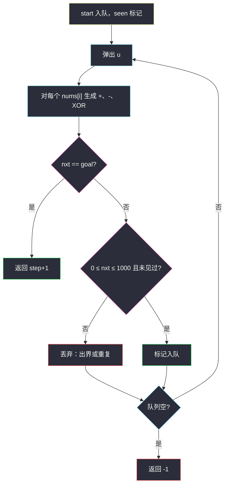
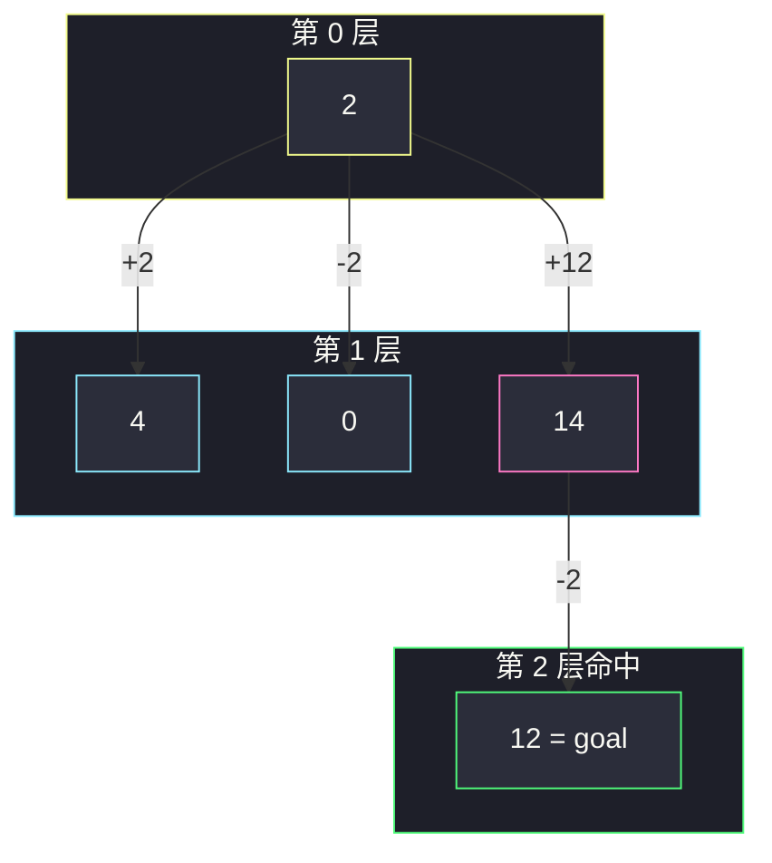

# 转化数字的最小运算数（0..1000 当点 · BFS）

## 一、问题描述

整数 `x` 初始为 `start`。若当前 `x` 落在闭区间 `[0, 1000]`，可选 `nums` 里任意一个数（可重复用），把 `x` 变成下面三者之一：

- `x + nums[i]`
- `x - nums[i]`
- `x XOR nums[i]`

目标变成 `goal`，求最少次数；做不到返回 `-1`。

**区间外的结果**：这一步仍然合法，但**不能再继续操作**。因此只有当这一步恰好等于 `goal` 时，出界才有意义。

> 🔗 LeetCode 2059：https://leetcode.cn/problems/minimum-operations-to-convert-number/
>
> 数据范围：`nums.length ≤ 1000`，`0 ≤ start ≤ 1000`，`start != goal`，`nums[i]` 互不相同；`nums[i]` 与 `goal` 可达 `±1e9`。
>
> 📚 灵茶题单：**图论 · §1.3 图论建模 + BFS**（1850 分）。

**示例 1**

```
输入：nums = [2,4,12], start = 2, goal = 12
输出：2
2 + 12 = 14，14 - 2 = 12。
14 仍在 [0,1000]，可以再操作。
```

**示例 2**

```
输入：nums = [3,5,7], start = 0, goal = -4
输出：2
0 + 3 = 3，3 - 7 = -4。
-4 越界，但它就是 goal，计 2 步。
```

**示例 3**

```
输入：nums = [2,8,16], start = 0, goal = 1
输出：-1
从 0 用偶数加减或 XOR，到不了奇数 1。
```

**直观理解**

能继续扩展的状态只有 `0..1000` 这 1001 个点。每个点出度 `3 × |nums|`。`goal` 可能在区间外，当作「一步跳到终点」的特殊边，不入队。最短次数 = BFS。

---

## 二、暴力解法

DFS 对每个 `nums[i]` 试三种运算，出界且不是 `goal` 就死路。状态 1001 个，出度可达 3000，DFS 会在 DAG/环上反复绕，还不能保证先找到最短。

```python
# 伪代码：dfs(x, step)；nxt==goal 更新 ans；在 [0,1000] 且未超 ans 才递归
```

### 复杂度

- **时间**：远大于 `O(1001 · |nums|)`，指数。
- **空间**：递归栈。

### 🔴 瓶颈在哪里

边权 1，BFS 第一次碰到 `goal` 即最少步。出界节点没有出边，不必当普通状态入队。

---

## 三、优化探索（核心章节）

> 📚 本题在灵茶题单中属于 **§1.3 图论建模 + BFS**。与 [打开转盘锁](open-the-lock.md) 同一套路：合法整数当点，运算当边，`vis` 防重复。

### 3.1 状态空间

队列里只放 `[0, 1000]`。生成邻居时**先**判断 `nxt == goal`（即使 `nxt` 是 `-4` 或 `10^9+5`），再决定是否入队。

约束已保证 `start != goal`，起点不必特判 0；写上 `if start == goal: return 0` 更稳。

### 3.2 为什么 XOR 也要搜

加减改变大小，XOR 在 0..1000 里跳到另一比特模式，可能是通往 `goal` 的捷径。三种运算都是边，一视同仁。

### 3.3 规模

1001 个点，每点 `3m` 条边，`m ≤ 1000`，`O(1001 · 3m)` 约 3e6，稳过。



### 3.4 一句话核心

> **只把 0..1000 入队；三种运算当边；nxt 等于 goal 立刻返回，出界非终点直接丢。**

---

## 四、代码实现

### Python（主解：BFS）

```python
from collections import deque

class Solution:
    def minimumOperations(self, nums: list[int], start: int, goal: int) -> int:
        if start == goal:
            return 0
        vis = [False] * 1001
        q = deque([start])
        vis[start] = True
        step = 0
        while q:
            for _ in range(len(q)):
                u = q.popleft()
                for x in nums:
                    for nxt in (u + x, u - x, u ^ x):
                        if nxt == goal:
                            return step + 1
                        if 0 <= nxt <= 1000 and not vis[nxt]:
                            vis[nxt] = True
                            q.append(nxt)
            step += 1
        return -1
```

**变量含义**

| 变量 | 含义 |
|------|------|
| `vis` | `[0,1000]` 是否已入队 |
| `q` | 仍可扩展的合法状态 |
| `step` | 已用运算次数；生成邻居时答案是 `step+1` |

必须 **先比 `goal` 再看区间**：示例 2 的 `-4` 若先被 `nxt < 0` 滤掉就错了。

### Java（可选）

```java
class Solution {
    public int minimumOperations(int[] nums, int start, int goal) {
        if (start == goal) return 0;
        boolean[] vis = new boolean[1001];
        ArrayDeque<Integer> q = new ArrayDeque<>();
        q.add(start);
        vis[start] = true;
        int step = 0;
        while (!q.isEmpty()) {
            int sz = q.size();
            for (int i = 0; i < sz; i++) {
                int u = q.poll();
                for (int x : nums) {
                    int[] nxs = {u + x, u - x, u ^ x};
                    for (int nxt : nxs) {
                        if (nxt == goal) return step + 1;
                        if (nxt >= 0 && nxt <= 1000 && !vis[nxt]) {
                            vis[nxt] = true;
                            q.add(nxt);
                        }
                    }
                }
            }
            step++;
        }
        return -1;
    }
}
```

---

## 五、具体例子演示

### 示例 1：`2 → 12`，`nums=[2,4,12]`

第 0 层弹出 `2`，`step` 仍为 0，生成邻居时若命中则返回 `1`。本层没有 12。

| 从 2 生成（部分） | 值 | 处理 |
|-------------------|----|------|
| 2+2 | 4 | 入队 |
| 2-2 | 0 | 入队 |
| 2^2 | 0 | vis 已有 |
| 2+12 | **14** | 入队（在区间内） |
| 2-12 | -10 | 非 goal，丢弃 |
| 2^12 | 14 | vis 已有 |

第 1 层弹出 `14` 等。`14 - 2 = 12 == goal`，返回 `0+1` 再加一层 = **2**。



### 示例 2：出界即终点

`nums = [3,5,7]`，`start=0`，`goal=-4`。

| 层 | 弹出 | 生成 | 处理 |
|----|------|------|------|
| 0 | 0 | 3, -3, 0^3=3, … | 3 入队；-3 非 goal，丢 |
| 1 | 3 | 3-7=**-4** | 等于 goal，返回 2 |

不会把 `-4` 放进队列，也就不会从越界点再 XOR/加减。

### 示例 3：扩完失败

`nums` 全是偶数，`start=0`。加减保持偶数，XOR 偶数也还是偶数，永远到不了 `1`，队列耗尽返回 `-1`。

---

## 六、复杂度分析

| 方法 | 时间 | 空间 | 说明 |
|------|------|------|------|
| DFS | 最坏指数 | `O(1001)` | 不保证最短 |
| BFS（主解） | `O(1001 · 3m)` | `O(1001)` | 每合法状态最多入队一次 |

`m = nums.length`。`goal` 不占 vis 槽位。

---

## 七、对比总结

| 维度 | 转盘锁 752 | 本题 2059 | 使 x、y 相等 2998 |
|------|------------|-----------|-------------------|
| 状态 | 4 位串 1e4 | 整数 0..1000 | 约 `max(x,y)+11` |
| 出界 | 死锁禁止 | 非 goal 丢弃，是 goal 可停 | 超出 cap 丢弃 |
| 运算 | 拨位 ±1 | `+ - XOR` | `/5 /11 ±1` |

**易错点**

1. **先判区间再比 goal**：`goal` 为负数时被滤掉，示例 2 会返回 -1。
2. **出界节点继续扩**：题目禁止；即使扩，值域 `±1e9` 也炸。
3. **出队再 vis**：同一数被大量前驱灌进队列。
4. **`start == goal` 没写**：约束里没有相等，但提交习惯仍建议返回 0。
5. **XOR 写成 `**` 或逻辑异或**：Python 是 `^`。
6. `vis` 开成 `1000` 漏掉终点 1000。

---

## 八、举一反三

| 题目 | 关系 |
|------|------|
| [752. 打开转盘锁](https://leetcode.cn/problems/open-the-lock/) | 同目录 `open-the-lock.md`，隐式图 BFS |
| [2998. 使 X 和 Y 相等的最少操作次数](https://leetcode.cn/problems/minimum-number-of-operations-to-make-x-and-y-equal/) | 同批，整数四则式转移 |
| [433. 最小基因变化](https://leetcode.cn/problems/minimum-genetic-mutation/) | 合法状态集合 + BFS |
| [127. 单词接龙](https://leetcode.cn/problems/word-ladder/) | 单词当点 |
| [279. 完全平方数](https://leetcode.cn/problems/perfect-squares/) | 数字减平方数 |

二分图约束见 [判断二分图](is-graph-bipartite.md)。

**思想迁移**

- 中间状态被题目锁在一个小区间时，区间就是图的点集。
- 口诀：**「0 到 1000 才入队；三种运算当边；等于 goal 立刻停，出界非终点扔掉。」**
