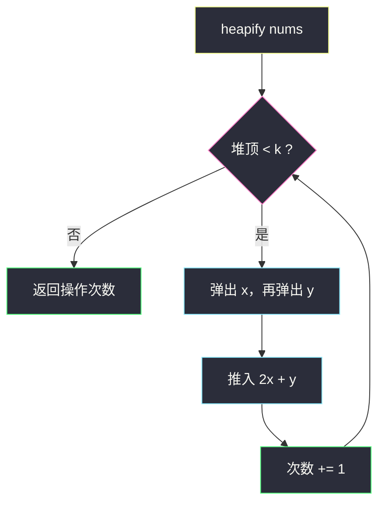
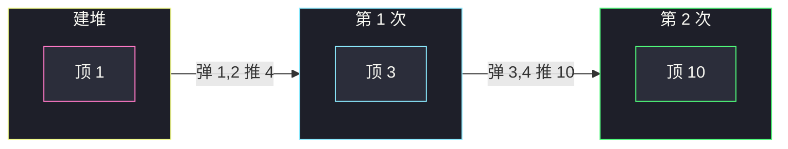

# 超过阈值的最少操作数 II（小根堆合并）

## 一、问题描述

给你下标从 0 开始的整数数组 `nums` 和整数 `k`。一次操作：

1. 选出当前数组里**最小的两个**数 `x`、`y`（`x ≤ y`）；
2. 删掉它们；
3. 插入 `min(x, y) * 2 + max(x, y)`，即 `2x + y`。

数组至少有两个元素才能操作。返回使**所有元素都 ≥ k** 的最少操作次数。题目保证答案存在。

> 🔗 LeetCode 3066：https://leetcode.cn/problems/minimum-operations-to-exceed-threshold-value-ii/
>
> 数据范围：`2 <= nums.length <= 2·10^5`，`1 <= nums[i], k <= 10^9`。

**示例 1**

```
输入：nums = [2,11,10,1,3], k = 10
输出：2
解释：
  取 1 和 2，插入 1*2+2=4  → [4,11,10,3]
  取 3 和 4，插入 3*2+4=10 → [10,11,10]
  全部 ≥ 10。
```

**示例 2**

```
输入：nums = [1,1,2,4,9], k = 20
输出：4
解释：依次合并得到 [2,3,4,9] → [4,7,9] → [9,15] → [33]。
```

**直观理解**

小于 `k` 的数必须被「吃进」某次合并里才能变大。合并公式 `2·小 + 大` 一定严格大于原来的较大值（正整数），所以值只增不减。要使操作次数最少，应优先处理最小的那两个——让最小的尽快跨过 `k`，这正是小根堆的反复取最小。

---

## 二、暴力解法

每次排序，取前两个合并。

```python
class Solution:
    def minOperations(self, nums: List[int], k: int) -> int:
        ans = 0
        while min(nums) < k:
            nums.sort()
            x, y = nums[0], nums[1]
            nums = nums[2:] + [2 * x + y]
            ans += 1
        return ans
```

### 复杂度

- **时间**：最坏约 `n` 次操作（每次长度减 1），每次排序 `O(n log n)`，共 `O(n² log n)`。`n` 达 `2·10^5` 超时。
- **空间**：`O(n)`。

### 🔴 瓶颈在哪里

排序里真正用到的只有最小的两个。用小根堆，`heapify` 一次 `O(n)`，之后每次弹两个、推一个只要 `O(log n)`。总时间 `O(n log n)`。

---

## 三、优化探索（核心章节）

> 📚 本题在灵茶题单中属于 **堆 · §5.1 基础**：heapify 后反复取最值。与「哈夫曼合并 / 合并石子代价」同一套路——总是合并当前最小的两坨。

### 3.1 为什么永远合并两个最小

小于 `k` 的数迟早要参与合并。若某次留下更小的、去合并两个较大的，堆里仍有更小的 `< k`，总次数不会变少，还可能让大数被浪费在已经够大的分支上。标准贪心：while 堆顶 `< k`，取出最小 `x` 和次小 `y`，推入 `2x+y`。

题目保证有解，且 `n ≥ 2`，循环中堆的大小始终 ≥ 2，直到堆顶 ≥ `k`。

### 3.2 循环条件

```
while 堆顶 < k:
    弹出 x、y（x ≤ y）
    推入 2*x + y
    次数 += 1
```

- 一开始全体已 ≥ `k`：一次都不进循环，返回 0。
- 堆顶 ≥ `k` 意味着**所有**元素 ≥ `k`（小根堆）。



### 3.3 溢出

`x、y` 最大约 `10^9`，`2x+y` 可达 `3·10^9`，已经超过 32 位有符号整数上限（约 `2.1·10^9`）。后续若一个很小、一个已经很大，还可能继续涨，但仍在 64 位范围内。**Java 堆里必须用 `long`**；乘法写成 `2L * x + y`，避免 `2*x` 在 `int` 里先溢出。Python `int` 无上限。

### 3.4 和 2530 的对比

| 2530 最大分数 | 本题 |
|---------------|------|
| 大根堆，每次改**一个**最大 | 小根堆，每次吃**两个**最小 |
| 恰好 k 次 | 次数是答案，直到堆顶 ≥ k |
| 推回 `⌈x/3⌉`（变小） | 推回 `2x+y`（变大） |

同属 §5.1「堆上模拟操作」。

### 3.5 一句话核心

> **小根堆 heapify；只要堆顶小于 k，就弹出两个最小 x≤y，推入 2x+y，直到全体过线。**

---

## 四、代码实现

### Python（主解）

```python
class Solution:
    def minOperations(self, nums: List[int], k: int) -> int:
        heapq.heapify(nums)
        ans = 0
        while nums[0] < k:
            x = heapq.heappop(nums)
            y = heapq.heappop(nums)
            heapq.heappush(nums, x * 2 + y)
            ans += 1
        return ans
```

原地 `heapify(nums)` 可以，LeetCode 不要求保留原数组。想不改输入就先 `h = nums[:]` 再 `heapify(h)`。

**变量含义**

| 变量 | 含义 |
|------|------|
| `nums` / `h` | 小根堆，堆顶 = 当前全局最小 |
| `x, y` | 本轮最小、次小（弹出顺序保证 `x ≤ y`） |
| `ans` | 已做操作次数 |

不必写成 `min(x,y)*2+max(x,y)`：从堆里连弹两次已经有序。

### Java（必须用 long）

```java
class Solution {
    public int minOperations(int[] nums, int k) {
        PriorityQueue<Long> pq = new PriorityQueue<>();
        for (int v : nums) pq.offer((long) v);
        int ans = 0;
        while (pq.peek() < k) {
            long x = pq.poll();
            long y = pq.poll();
            pq.offer(x * 2 + y);
            ans++;
        }
        return ans;
    }
}
```

`PriorityQueue<Integer>` + `2 * x + y` 会在中间结果溢出后变成负数，堆被污染，答案错。这是本题 Java 最常见的坑。

---

## 五、具体例子演示

堆内容按**逻辑升序**写出（堆顶 = 最左）。Python `heapify` 后内部数组不一定有序，但堆顶一定是最小值。

### 5.1 `nums = [2, 11, 10, 1, 3]`，`k = 10`

`heapify` 后逻辑序 `[1, 2, 3, 10, 11]`（内部可能是 `[1, 2, 10, 11, 3]`，堆顶仍是 1）。

| 步 | 堆顶 | 弹出 x,y | 推入 `2x+y` | 堆（逻辑） | 次数 |
|----|------|-----------|-------------|------------|------|
| 建堆 | 1 | — | — | `[1, 2, 3, 10, 11]` | 0 |
| 1 | 1 < 10 | 1, 2 | 4 | `[3, 4, 10, 11]` | 1 |
| 2 | 3 < 10 | 3, 4 | 10 | `[10, 10, 11]` | 2 |
| 停 | 10 ≥ 10 | — | — | `[10, 10, 11]` | **2** |

与题面逐步数组一致。



### 5.2 `nums = [1, 1, 2, 4, 9]`，`k = 20`

| 步 | 弹出 x,y | 推入 | 堆（逻辑） | 次数 |
|----|-----------|------|------------|------|
| 0 | — | — | `[1, 1, 2, 4, 9]` | 0 |
| 1 | 1, 1 | 3 | `[2, 3, 4, 9]` | 1 |
| 2 | 2, 3 | 7 | `[4, 7, 9]` | 2 |
| 3 | 4, 7 | 15 | `[9, 15]` | 3 |
| 4 | 9, 15 | 33 | `[33]` | **4** |

堆顶 33 ≥ 20，停止。注意第 3 步堆是 `[9, 15]`，9 仍 `< 20`，必须再合一次，不能看到已经有一个 15 就停——**全体**都要 ≥ k。

### 5.3 已全部达标

`nums = [10, 11, 12]`，`k = 10`：堆顶 10 ≥ 10，返回 **0**。

---

## 六、复杂度分析

| 方法 | 时间 | 空间 | 说明 |
|------|------|------|------|
| 每次排序 | `O(n² log n)` | `O(n)` | 超时 |
| 小根堆（主解） | `O(n log n)` | `O(n)` | heapify `O(n)` + 最多 n-1 次堆操作 |

每次操作堆大小减 1，最多做 `n-1` 次就会只剩一个数；题目保证此时该数 ≥ k。故堆操作次数 `O(n)`，总时间 `O(n log n)`。

---

## 七、对比总结

| 维度 | 每次 sort | 小根堆 |
|------|----------|--------|
| 取两个最小 | `O(n log n)` | `O(log n)` |
| 插入新值 | 再排序 | `O(log n)` |
| 判断结束 | `min(nums) ≥ k` | `heap[0] ≥ k` |

**易错点**

1. **Java 用 `int` 堆**：`2*x+y` 溢出变负，死循环或错答。用 `Long`。
2. **停在「存在一个 ≥ k」**：必须堆顶 ≥ k，即最小值过线。
3. **合并公式写成 `x+y` 或 `x+2y`**：题面是小的那个乘 2。堆弹出顺序已是 `x ≤ y`，即 `2x+y`。
4. **`n` 次 `heappush` 建堆**：应 `heapify`。
5. **循环里不判断长度**：题目保证有解且初始 `n ≥ 2`；自己改题时若可能只剩一个仍 `< k`，要额外处理。

**模板（§5.1 小根堆反复合并）**

```python
heapq.heapify(h)
while h[0] < k:
    x = heapq.heappop(h)
    y = heapq.heappop(h)
    heapq.heappush(h, 2 * x + y)
```

大根堆反复改一个最大值见 `maximal-score-after-applying-k-operations.md`。

---

## 八、举一反三

| 题目 | 关系 |
|------|------|
| [2530. 执行 K 次操作后的最大分数](https://leetcode.cn/problems/maximal-score-after-applying-k-operations/) | 同目录 `maximal-score-after-applying-k-operations.md`：§5.1 对称的大根堆 |
| [3065. 超过阈值的最少操作数 I](https://leetcode.cn/problems/minimum-operations-to-exceed-threshold-value-i/) | 简单版：统计有多少个 `< k`，不用堆 |
| [1046. 最后一块石头的重量](https://leetcode.cn/problems/last-stone-weight/) | 每次取两个最大相撞，大根堆 |
| [1167. 连接木棍的最低费用](https://leetcode.cn/problems/minimum-cost-to-connect-sticks/) | 哈夫曼：每次合两个最短棍 |
| [1962. 移除石子使总数最小](https://leetcode.cn/problems/remove-stones-to-minimize-the-total/) | 每次改堆顶一个数 |
| [2336. 无限集中的最小数字](https://leetcode.cn/problems/smallest-number-in-infinite-set/) | 同目录 `smallest-number-in-infinite-set.md`：小根堆取最小 |

**思想迁移**

- 「每次拿最小的两个按公式合成一个」→ 小根堆，和哈夫曼编码同一贪心。
- 口诀：**「堆顶没过 k 就弹两个最小，2 倍小的加上大的再推回去。」**
