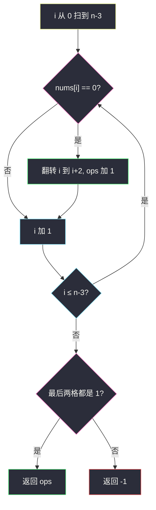
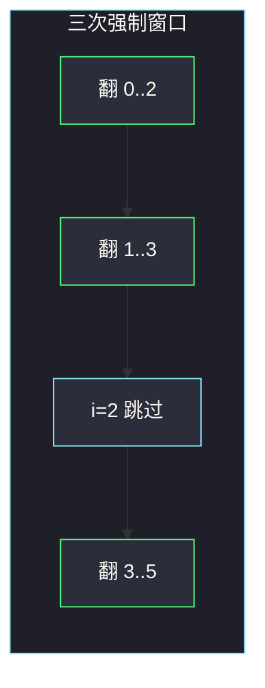

# 使二进制数组全部等于 1 的最少操作次数 I（从最左开始贪心）

## 一、问题描述

给你二进制数组 `nums`（只含 0 和 1）。一次操作：选任意连续 **3** 个下标，把它们全部翻转（0↔1）。返回把数组全部变成 1 的**最少操作次数**；若不可能，返回 `-1`。

> 🔗 LeetCode 3191：https://leetcode.cn/problems/minimum-operations-to-make-binary-array-elements-equal-to-one-i/
>
> 数据范围：`3 ≤ nums.length ≤ 10^5`，`nums[i] ∈ {0, 1}`。
>
> 📚 灵茶题单：**§1.4 从最左/最右开始贪心**（1312 分）。本题是该节「翻转窗口从左往右定决策」的新题。

**示例 1**

```
输入：nums = [0,1,1,1,0,0]
输出：3
解释：
- 翻转 [0,1,2] → [1,0,0,1,0,0]
- 翻转 [1,2,3] → [1,1,1,0,0,0]
- 翻转 [3,4,5] → [1,1,1,1,1,1]
```

**示例 2**

```
输入：nums = [0,1,1,1]
输出：-1
解释：无论怎么翻，无法让最后一位变成 1 的同时保持前面全是 1。
```

**直观理解**

最左边那个 0 只能被「以它为左端」的那一次翻转救回来——更右边的窗口碰不到它。所以看到最左的 0，**必须立刻翻** `[i, i+1, i+2]`。同一起点翻两次等于没翻，因此每个起点至多一次，决策被唯一确定。

---

## 二、暴力解法

每个合法起点 `0..n-3` 可以选择翻或不翻，共 `2^{n-2}` 种。对每种方案模拟翻转，看最终是否全 1，取操作数最少的。

```python
class Solution:
    def minOperations(self, nums: list[int]) -> int:
        n = len(nums)
        m = n - 2
        best = 10**18
        for mask in range(1 << m):
            a = nums[:]
            ops = 0
            for i in range(m):
                if mask >> i & 1:
                    ops += 1
                    for d in range(3):
                        a[i + d] ^= 1
            if all(x == 1 for x in a):
                best = min(best, ops)
        return best if best < 10**18 else -1
```

`n ≤ 10^5` 时指数搜索直接爆炸。而且大量 mask 是浪费的：一旦某个前缀位是 0 却选择「这里不翻」，这个 0 再也救不回来。

### 🔴 瓶颈在哪里

翻转对同一位置可交换、可结合，且 `x ⊕ x = 0`，每个起点 0/1 次即可。真正限制来自**最左未修复位**：它对应唯一合法窗口。不必枚举，从左扫到右，遇 0 就翻。最后看尾巴两格是否为 1。

---

## 三、优化探索（核心章节）

> 📚 本题在灵茶题单中属于 **§1.4 从最左/最右开始贪心**。同节经典是「K 位翻转」（995）：窗口长度变成 3 之后，甚至不必差分数组，原地改后面两位即可。

### 3.1 最左 0 的窗口是唯一的

下标从 0 开始。能覆盖位置 `i` 的窗口，左端只能是 `i-2, i-1, i`（还得 ≥ 0）。当我们已经处理完 `0..i-1`，并且保证它们已经是 1 时：

- 左端为 `i-2`、`i-1` 的窗口已经决策过了，不能再改（再改会把左边已经修好的 1 翻坏）。
- 若此时 `nums[i] == 0`，唯一还能动它的窗口就是左端 = `i`。
- 若 `nums[i] == 1`，再翻左端 = `i` 会把它变成 0，左边没有窗口能救，所以这里**不能翻**。

因此每个 `i` 的决策被当前值唯一确定。这就是「从最左开始贪心」。

### 3.2 扫到 `n-3` 为止，最后检查两格

左端最大只能是 `n-3`（窗口要完整）。循环 `i = 0 .. n-3`：

- `nums[i] == 0`：操作 +1，翻转 `i, i+1, i+2`。
- `nums[i] == 1`：跳过。

循环结束后，`0..n-3` 都已是 1（每个被翻完后变成 1，且后面的窗口碰不到更左边）。还可能错的只有 `nums[n-2]` 和 `nums[n-1]`。若它们都是 1，成功；否则无解。

位置 `i` 本身翻成 1 之后再也不会读到，可以只 XOR 后面两位：`nums[i+1] ^= 1; nums[i+2] ^= 1`。



从右往左也成立：最右的 0 只能被「右端对齐它」的窗口救。实现改成 `i` 从 `n-1` 降到 `2`，遇 0 就翻 `[i-2, i-1, i]`，最后检查 `nums[0]`、`nums[1]`。和从左扫对称，选一边写熟即可，不要混用。

### 3.3 最少、且不会更优

每个起点至多翻一次（翻两次抵消）。贪心给出的 0/1 序列是**唯一**能让前缀全变为 1 的序列。若这个序列仍修不好尾巴，任何其他序列都会在更早的位置留下 0，更不可能。所以：能完成则次数最少，不能则无解。

与 995 的差别：995 的 K 很大，用差分数组或队列记录「当前位置被前面窗口覆盖了奇数次还是偶数次」；本题 K = 3，直接改 `i+1, i+2` 即可，`O(1)` 额外空间。

### 3.4 一句话核心

> **从左到右，遇到 0 就必须以它为左端翻 3 格；同一起点只翻一次。扫完后看最后两位是不是 1。**

---

## 四、代码实现

### Python（主解：原地翻转）

```python
class Solution:
    def minOperations(self, nums: list[int]) -> int:
        n = len(nums)
        ops = 0
        for i in range(n - 2):
            if nums[i] == 0:
                nums[i + 1] ^= 1
                nums[i + 2] ^= 1
                ops += 1
        if nums[-2] == 1 and nums[-1] == 1:
            return ops
        return -1
```

**变量含义**

| 写法 | 含义 |
|------|------|
| `i` | 当前必须定夺的最左位置，也是窗口左端 |
| `nums[i] == 0` | 这里必须翻；为 1 则这里绝不能翻 |
| `nums[i+1] ^= 1` | 窗口另外两格被翻；`nums[i]` 可以不写，因为后面不再读 |
| `ops` | 已经执行的操作次数 |
| 最后两格 | 没有任何窗口能单独修它们，只能验收 |

若不能改原数组，先 `nums = nums[:]` 复制一份。循环写成 `range(n-2)` 与「扫到 `n-3`」是同一回事（右开区间）。

### Java（最优解可选）

```java
class Solution {
    public int minOperations(int[] nums) {
        int n = nums.length, ops = 0;
        for (int i = 0; i < n - 2; i++) {
            if (nums[i] == 0) {
                nums[i + 1] ^= 1;
                nums[i + 2] ^= 1;
                ops++;
            }
        }
        return nums[n - 2] == 1 && nums[n - 1] == 1 ? ops : -1;
    }
}
```

不要对最后两格再尝试窗口：左端 `n-2` 越界。无解就返回 -1，不要继续翻。

---

## 五、具体例子演示

**示例 1**：`nums = [0,1,1,1,0,0]`，`n = 6`，`i` 走 `0,1,2,3`。

| 步 | i | 翻前数组 | nums[i] | 动作 | 翻后数组 | ops |
|----|---|----------|---------|------|----------|-----|
| 1 | 0 | [0,1,1,1,0,0] | 0 | 翻 [0,1,2] | [1,0,0,1,0,0] | 1 |
| 2 | 1 | [1,0,0,1,0,0] | 0 | 翻 [1,2,3] | [1,1,1,0,0,0] | 2 |
| 3 | 2 | [1,1,1,0,0,0] | 1 | 不翻 | [1,1,1,0,0,0] | 2 |
| 4 | 3 | [1,1,1,0,0,0] | 0 | 翻 [3,4,5] | [1,1,1,1,1,1] | 3 |

验收 `nums[4]`、`nums[5]` 都是 1，返回 3。与官方三步操作完全一致。

窗口怎么走：



**示例 2**：`nums = [0,1,1,1]`，`n = 4`，`i` 走 `0,1`。

| 步 | i | 翻前 | nums[i] | 动作 | 翻后 | ops |
|----|---|------|---------|------|------|-----|
| 1 | 0 | [0,1,1,1] | 0 | 翻 [0,1,2] | [1,0,0,1] | 1 |
| 2 | 1 | [1,0,0,1] | 0 | 翻 [1,2,3] | [1,1,1,0] | 2 |

验收：`nums[2]=1`，`nums[3]=0`。最后一位是 0 且没有窗口能只翻它，返回 `-1`。

若第一步「舍不得翻」，位置 0 会永远是 0，更无解。贪心已经尝试了唯一可能修好前缀的方案。

逐步跟踪时以**翻前**的 `nums[i]` 为准：这一步决定翻不翻；XOR 只影响右边尚未决策的格子。不要用翻后的 `nums[i]` 再判断一次，否则会漏计或重计。

**再对拍一个全 1**：`[1,1,1]`。`i` 只走 0，`nums[0]=1` 不翻，尾巴两格是 1，答案 0。

**再对拍 `[1,0,0,0,0]`**：

| 步 | i | 翻前 | 动作 | 翻后 | ops |
|----|---|------|------|------|-----|
| 1 | 0 | [1,0,0,0,0] | 不翻 | 同左 | 0 |
| 2 | 1 | [1,0,0,0,0] | 翻 [1,2,3] | [1,1,1,1,0] | 1 |
| 3 | 2 | [1,1,1,1,0] | 不翻 | 同左 | 1 |

验收 `nums[3]=1`、`nums[4]=0`，返回 -1。前缀已经全 1，尾巴的 0 没有任何长度为 3 的窗口能单独翻掉。

**边界**：`n = 3` 时最多翻一次（整个数组）；三个 0 翻一次变三个 1，答案 1；`[0,0,1]` 翻一次变 `[1,1,0]`，尾巴失败，答案 -1。

官方例 1 输出 3、例 2 输出 -1，与上表逐步翻转一致。任务书给的三步操作序列就是这条从左强制路径，没有发现推导错误。

---

## 六、复杂度分析

| 方法 | 时间 | 空间 | 说明 |
|------|------|------|------|
| 枚举每个起点翻或不翻 | `O(2^{n} · n)` | `O(n)` | mask 模拟 |
| 从左强制翻转（主解） | `O(n)` | `O(1)` | 每个下标决策一次，原地 XOR |
| 995 式差分数组 | `O(n)` | `O(n)` | K=3 时不必上差分 |

原地修改输入是 `O(1)` 额外空间；若复制数组则 `O(n)`。

---

## 七、对比总结

| 维度 | 本题 3191（K=3 变全 1） | 3192（II，翻后缀） | 995（K 位翻转成全 1） |
|------|------------------------|--------------------|----------------------|
| 操作 | 连续 3 格翻转 | 从 i 翻到末尾 | 连续 K 格翻转 |
| 决策点 | 最左的 0 必须翻起点 i | 最左的 0 必须翻后缀 i | 同样从左，用差分维护覆盖奇偶 |
| 无解检测 | 最后 2 格 | 通常总能翻成全 1（看题面） | 最后 K-1 格 |
| 空间 | `O(1)` 原地 | `O(1)` | 队列 / 差分 `O(n)` 或滚动 |

**易错点**

1. **从右往左翻却没改证明**：从右也行，但窗口右端对齐最右 0，代码对称；混用左右会漏。
2. **同一位置翻两次**：贪心每个 `i` 只看一次当前值，不会翻第二次；自己写队列时要取模 2。
3. **循环写成 `range(n)` 再翻 `i+2`**：最后两格会下标越界。只扫到 `n-3`。
4. **忘记验收尾巴**：前缀全 1 不等于有解，示例 2 就是反例。
5. **把 0 想成必须翻奇数次、却去枚举**：最左约束已经把奇偶定死。

---

## 八、举一反三

| 题目 | 关系 |
|------|------|
| [3192. 使二进制数组全部等于 1 的最少操作次数 II](https://leetcode.cn/problems/minimum-operations-to-make-binary-array-elements-equal-to-one-ii/) | 同系列：操作改成翻转后缀，仍从左定决策 |
| [995. K 连续位的最小翻转次数](https://leetcode.cn/problems/minimum-number-of-k-consecutive-bit-flips/) | 本题的一般化，K 任意，差分 / 队列 |
| [1529. 灯泡开关 IV](https://leetcode.cn/problems/bulb-switcher-iv/) | 从左往右，目标状态变化就操作一次 |
| [848. 字母移位](https://leetcode.cn/problems/shifting-letters/) | 后缀累加修改，思想接近 3192 |
| [3228. 将 1 移动到末尾的最大操作次数](https://leetcode.cn/problems/maximum-number-of-operations-to-move-ones-to-the-end/) | 二进制数组上的另一种从左/右贪心 |

**思想迁移**

- 操作可交换且做两次等于没做时，从最左（或最右）看「这个位置还剩什么必须修」，决策常被唯一确定。
- 口诀：**「最左的 0 只能被左端对齐它的窗口救；翻完看尾巴。」**
