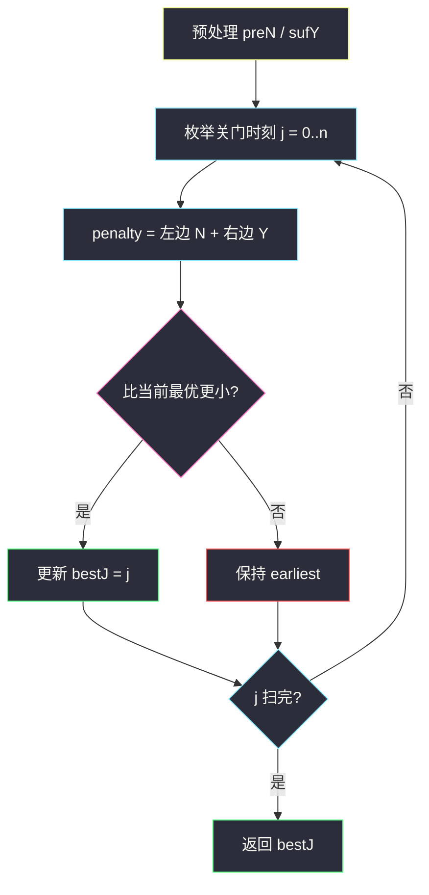
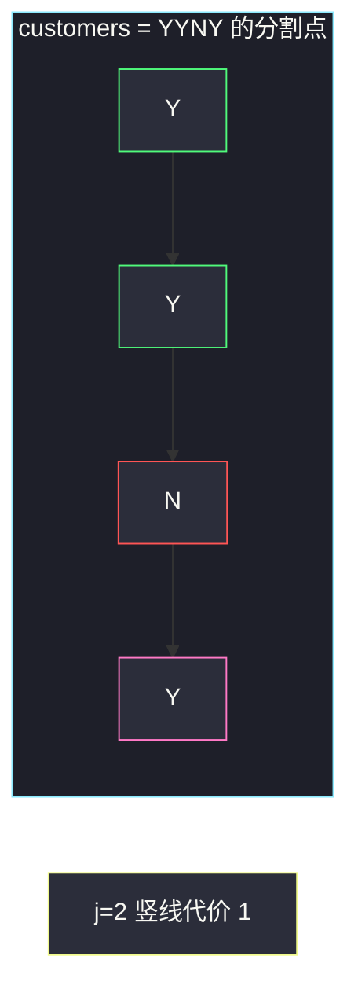

# 商店的最少代价（前后缀分解关门时刻）

## 一、问题描述

`customers` 是长度为 `n` 的 `'Y'`/`'N'` 串：第 `i` 小时有客来为 `'Y'`，否则 `'N'`。你选一个关门小时 `j`（`0 ≤ j ≤ n`）：

- 第 `0 .. j-1` 小时商店开着：每个 `'N'` 算 1 代价（空关，浪费成本）；
- 第 `j .. n-1` 小时商店关着：每个 `'Y'` 算 1 代价（客来却关了）。
- `j = 0` 表示一开始就关；`j = n` 表示一直开到结束。

求**代价最小**的 `j`；有多个时取**最早**的那个。

> 🔗 LeetCode 2483：https://leetcode.cn/problems/minimum-penalty-for-a-shop/
>
> 数据范围：`1 ≤ n ≤ 10^5`，只含 `Y`/`N`。
>
> 📚 灵茶题单：**专题：前后缀分解**。代价天然拆成「分割点左边的 N 数 + 右边的 Y 数」。预处理前缀 N、后缀 Y，枚举分割点 `j`。

**示例 1**

```
输入：customers = "YYNY"
输出：2
解释：j=2 时左边 "YY" 没有 N，右边 "NY" 只有 1 个 Y，代价 1，是最小代价里最早的 j。
```

**示例 2**

```
输入：customers = "NNNNN"
输出：0
解释：全是空关。一开始就关门，左边没有小时、右边没有 Y，代价 0。
```

**示例 3**

```
输入：customers = "YYYY"
输出：4
解释：一直开门，左边 0 个 N，右边 0 个 Y，代价 0。更早关门都会把若干 Y 关在门外。
```

**直观理解**

在时间轴上插一根「关门」竖线。竖线左边数 `N`，右边数 `Y`，相加就是代价。竖线可插在最左（全关）或最右（全开）。要最早的最优竖线。

---

## 二、暴力解法

对每个 `j` 扫描左段数 `N`、右段数 `Y`。

```python
class Solution:
    def bestClosingTime(self, customers: str) -> int:
        n = len(customers)
        best_j, best_pen = 0, n + 1
        for j in range(n + 1):
            pen = 0
            for i in range(j):
                if customers[i] == "N":
                    pen += 1
            for i in range(j, n):
                if customers[i] == "Y":
                    pen += 1
            if pen < best_pen:
                best_pen = pen
                best_j = j
        return best_j
```

`j` 有 `n+1` 个，每次扫 `n`，`O(n²)`。`n=10^5` 超时。示例三例都能对。

### 🔴 瓶颈在哪里

相邻的 `j` 和 `j+1` 只差一小时：左边多看一个字符，右边少看一个字符。不必每次从头数。前缀 `N`、后缀 `Y` 各预处理一遍，枚举就变成 `O(1)` 查询。

---

## 三、优化探索（核心章节）

> 📚 本题在灵茶题单中属于 **专题：前后缀分解**。标准动作：定义分割点 `j`，左边只依赖前缀信息，右边只依赖后缀信息，两次数组预处理后线性扫分割点。

### 3.1 代价公式

记 `preN[j]` = `customers[0..j-1]` 里 `'N'` 的个数（左开段的空关）。
记 `sufY[j]` = `customers[j..n-1]` 里 `'Y'` 的个数（右关段的拒客）。

`penalty(j) = preN[j] + sufY[j]`。求使它最小的最小 `j`。

```
preN[0] = 0
preN[j] = preN[j-1] + (1 if customers[j-1]=='N' else 0)

sufY[n] = 0
sufY[j] = sufY[j+1] + (1 if customers[j]=='Y' else 0)
```

### 3.2 枚举分割点

`j` 从 0 到 n，算 `preN[j] + sufY[j]`，用严格小于更新答案，保证「最早」。



### 3.3 可以滚成 O(1) 额外空间

`j=0` 的代价就是整串 `'Y'` 个数。竖线从 `j` 右移到 `j+1` 时，小时 `j` 从「关」变成「开」：

- 该小时是 `'Y'`：不再拒客，代价 `-1`；
- 该小时是 `'N'`：多一次空关，代价 `+1`。

一边走一边改 `pen`，仍然要严格小于才更新。前后缀数组更贴近专题模板，正文用数组版当主解。

### 3.4 一句话核心

> **关门时刻是分割点：代价 = 左段 N 数 + 右段 Y 数；预处理前后缀后扫一遍，平手取更早。**

---

## 四、代码实现

### Python（主解：前缀 N + 后缀 Y）

```python
class Solution:
    def bestClosingTime(self, customers: str) -> int:
        n = len(customers)
        suf_y = [0] * (n + 1)
        for i in range(n - 1, -1, -1):
            suf_y[i] = suf_y[i + 1] + (customers[i] == "Y")
        pre_n = 0
        best_j, best_pen = 0, suf_y[0]
        for j in range(1, n + 1):
            if customers[j - 1] == "N":
                pre_n += 1
            pen = pre_n + suf_y[j]
            if pen < best_pen:
                best_pen = pen
                best_j = j
        return best_j
```

`j=0` 不必进循环：左边为空，`pre_n=0`，代价就是 `suf_y[0]`。循环从 `j=1` 起，每次先把 `customers[j-1]` 纳入左段。

**变量含义**

| 写法 | 含义 |
|------|------|
| `suf_y[j]` | `customers[j..]` 的 `'Y'` 个数 |
| `pre_n` | 扫到 `j` 时左段 `'N'` 个数 |
| `pen < best_pen` | 严格小于，平手保留更早的 `j` |
| `j == n` | 一直开，`suf_y[n]=0` |

---

## 五、具体例子演示

前后缀分解**先画分割点**。以官方示例 `"YYNY"` 为准，`n=4`。

先算后缀 Y（从右往左）：

| j | 右段 s[j..] | sufY[j] |
|---|----------------|---------|
| 4 | （空） | 0 |
| 3 | Y | 1 |
| 2 | NY | 1 |
| 1 | YNY | 2 |
| 0 | YYNY | 3 |

再扫 `j`，同时累加前缀 N：

| 分割 j | 左开 s[0..j) | 右关 s[j..] | preN | sufY | 代价 |
|--------|--------------|-------------|------|------|------|
| 0 | （空） | YYNY | 0 | 3 | 3 |
| 1 | Y | YNY | 0 | 2 | 2 |
| 2 | YY | NY | 0 | 1 | **1** |
| 3 | YYN | Y | 1 | 1 | 2 |
| 4 | YYNY | （空） | 1 | 0 | 1 |

最小代价是 1，出现在 `j=2` 和 `j=4`。取最早，返回 **2**。对拍官方。



绿是竖线左边已开、且来过客（不产生空关）；红是左边的 `N`（空关，但 `j=2` 时它还在右边，不算空关）；粉是右边唯一的拒客 `Y`，贡献代价 1。

**示例 2** `"NNNNN"`：`sufY` 全 0。`j=0` 代价 0；`j` 右移每遇到一个 `N` 代价 +1。最优一开始就关，返回 0。

**示例 3** `"YYYY"`：`j=0` 代价 4，每右移一格遇到 `Y` 代价 -1，到 `j=4` 代价 0。返回 4。

---

## 六、复杂度分析

| 方法 | 时间 | 空间 | 说明 |
|------|------|------|------|
| 每个 j 双扫描 | `O(n²)` | `O(1)` | 超时 |
| 前缀 N + 后缀 Y（主解） | `O(n)` | `O(n)` | 后缀数组 `n+1` 格 |
| 滚动代价 | `O(n)` | `O(1)` | 等价，少一个数组 |

---

## 七、对比总结

| 维度 | 暴力每次数一遍 | 前后缀 | 滚动代价 |
|------|----------------|--------|----------|
| 分割点查询 | `O(n)` | `O(1)` | `O(1)` |
| 与专题模板 | 无 | 直接对应 | 观察相邻 j 的差分 |
| 平手 | 必须 `<` | 必须 `<` | 必须 `<` |

**易错点**

1. **平手用 `≤`**：会把更晚的 `j` 盖掉。`"YYNY"` 的 `j=4` 也会代价 1，必须留 2。
2. **漏掉 `j=0` 或 `j=n`**：全 N 最优在 0，全 Y 最优在 n。
3. **左边数 Y、右边数 N**：空关是开着却没客（左 N），拒客是关着却有客（右 Y）。
4. **`customers[j]` 算进左段**：`j` 是关门开始的小时，第 `j` 小时已经关了，应进右段。
5. **返回最小代价而不是 `j`**：题目要小时下标。

---

## 八、举一反三

| 题目 | 关系 |
|------|------|
| [1525. 字符串的好分割数目](https://leetcode.cn/problems/number-of-good-ways-to-split-a-string/)（`number-of-good-ways-to-split-a-string.md`） | 同批前后缀：左右种类数相等 |
| [1930. 长度为 3 的不同回文子序列](https://leetcode.cn/problems/unique-length-3-palindromic-subsequences/)（`unique-length-3-palindromic-subsequences.md`） | 同批：每个字母的 first/last 当两端 |
| [1422. 分割字符串的最大得分](https://leetcode.cn/problems/maximum-score-after-splitting-a-string/) | 左 0 数 + 右 1 数，和本题左右计数同构 |
| [724. 寻找数组的中心下标](https://leetcode.cn/problems/find-pivot-index/) | 左和 = 右和，前缀和特化 |
| [2270. 分割数组的方案数](https://leetcode.cn/problems/number-of-ways-to-split-array/) | 枚举分割点比较左右和 |
| [926. 将字符串翻转到单调递增](https://leetcode.cn/problems/flip-string-to-monotone-increasing/) | 分割点左要全 0、右要全 1，计数翻转 |

**思想迁移**

- 答案依赖某个下标把序列切成两段、两段代价可独立算，就预处理前缀/后缀再扫切点。
- 口诀：**「关门是竖线；左数 N，右数 Y；平手取最早。」**
