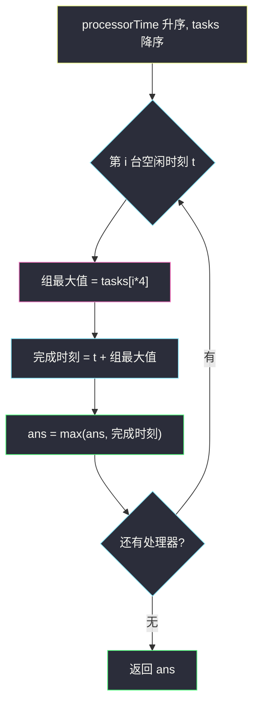
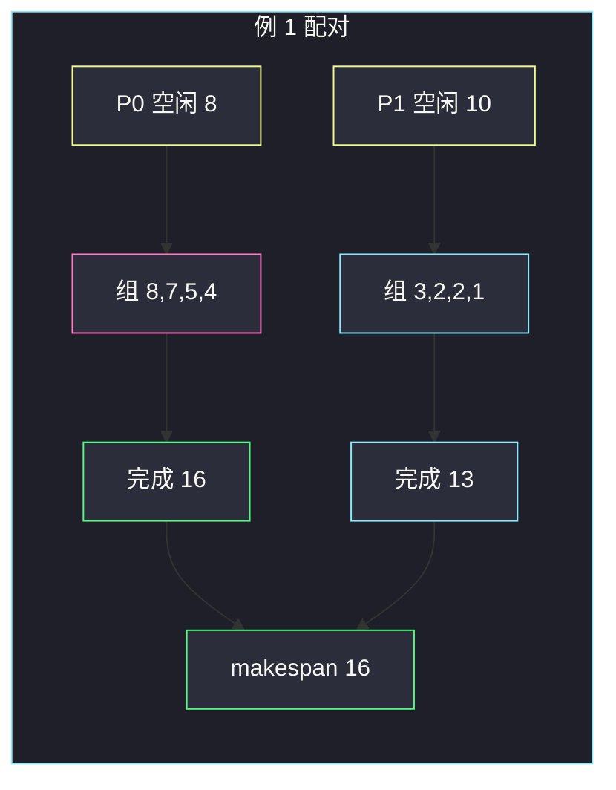

# 最小处理时间（交换论证 · 大任务配早空闲）

## 一、问题描述

有 `n` 个处理器，每个 **4 核**。`processorTime[i]` 是处理器 `i` 第一次空闲的时刻。另有 `4n` 个任务，`tasks[j]` 是第 `j` 个任务的耗时。

规则：

- 每个核恰好跑一个任务，任务之间互不抢核。
- 同一个处理器上的 4 个任务**同时开工**（该处理器空闲之后），所以这个处理器的完成时刻 = `processorTime[i] + max(分到的 4 个任务耗时)`。
- 目标：给每个处理器恰好 4 个任务，**最小化「所有处理器完成时刻的最大值」**（makespan）。

> 🔗 LeetCode 2895：https://leetcode.cn/problems/minimum-processing-time/
>
> 数据范围：`1 ≤ n ≤ 25000`，`tasks.length = 4n`，时间均为正整数。
>
> 📚 灵茶题单：**§1.7 交换论证法**（1352 分）。

**示例 1**

```
输入：processorTime = [8,10], tasks = [2,2,3,1,8,7,4,5]
输出：16
解释：最早空闲的处理器（时刻 8）拿 4 个最大任务 8,7,5,4，完成时刻 8+8=16；
另一台（时刻 10）拿 3,2,2,1，完成时刻 10+3=13。makespan = 16。
```

**示例 2**

```
输入：processorTime = [10,20], tasks = [2,3,1,2,5,8,4,3]
输出：23
解释：时刻 10 的处理器拿 8,5,4,3，完成 10+8=18；
时刻 20 的处理器拿 3,2,2,1，完成 20+3=23。makespan = 23。
```

**直观理解**

一台处理器的完成时刻只取决于「空闲时刻 + 它那组里**最大**的那个任务」。全局答案是这些完成时刻的 max。大任务拖得越晚，max 越大——所以大任务应该塞给**更早空闲**的机器。

---

## 二、暴力解法

把 `4n` 个任务分成 `n` 组，每组 4 个，再与 `n` 台处理器做全排列匹配，枚举所有分配。组数是多项式系数级别，`n = 25000` 完全不可行。

即便只枚举「每组的最大值」怎么选，组合数仍然爆炸。

```python
# 仅示意：n=2 时尚可手写枚举，n 稍大即超时
class Solution:
    def minProcessingTime(self, processorTime, tasks):
        # 真正的子集枚举此处省略：C(4n, 4) * C(4n-4, 4) * ... 不可接受
        raise NotImplementedError
```

### 🔴 瓶颈在哪里

完成时刻只看每组的 **max**，不看组内另外三个较小值。一旦意识到「最大的那批任务必须有人扛」，搜索空间可以压成一次排序 + 线性配对，不必枚举分组。

---

## 三、优化探索（核心章节）

> 📚 本题在灵茶题单中属于 **§1.7 交换论证法**。局部决策：更早空闲的处理器拿走当前剩余任务里最大的 4 个。再用交换证明：任何「大任务配给更晚空闲机器」的方案，都可以改成不更差的配对。

### 3.1 完成时刻只看组内 max

处理器 `i` 分到任务 `a,b,c,d` 后，四核并行，完成时刻是 `processorTime[i] + max(a,b,c,d)`。组里较小的三个任务被「罩」在 max 下面，**不影响**这台机器的完成时刻。

因此：

1. 全局最大的那个任务，无论分给谁，都会成为该组的组最大值——它必须有人扛。
2. 把它分给空闲最早的处理器，对 max 的贡献最小。
3. 顺手把次大、再次大……也塞给同一台：它们不再成为别台的组最大值，后期机器的组 max 更小。

于是得到配对：`processorTime` **升序**，`tasks` **降序**，第 `i` 台机器拿走 `tasks[i*4 .. i*4+3]`，组最大值就是 `tasks[i*4]`。

### 3.2 交换论证：大任务不该配晚空闲

把处理器按空闲时刻排成 `p0 ≤ p1 ≤ … ≤ p_{n-1}`。设某方案里第 `i` 组的组最大值为 `Mi`。

若存在 `i < j`（所以 `pi ≤ pj`）但 `Mi < Mj`（更晚空闲的机器反而扛了更大任务），把两组的组最大值对调（等价于把那个大任务换到更早的机器上）：

- 对调前：`max(pi+Mi, pj+Mj) = pj+Mj`（因为 `pi+Mi ≤ pj+Mi < pj+Mj`）。
- 对调后：`max(pi+Mj, pj+Mi)`。其中 `pi+Mj ≤ pj+Mj`，且 `pj+Mi < pj+Mj`。

所以对调后这两台的局部 max **不会变大**，全局 makespan 也不会变差。反复交换，直到组最大值序列也变成非增：`M0 ≥ M1 ≥ …`。

组最大值序列非增、且要让后期的 `M` 尽量小：最优就是把全局最大的 4 个任务捆给最早的机器，次大的 4 个捆给第二早的，以此类推。



反例（配对方向反了）：最早的机器拿小任务，最晚的拿大任务 → 官方例 1 会变成 `10+8=18`，比 16 更差。

### 3.3 一句话核心

> **空闲时刻升序、任务降序；第 i 台只看 `tasks[i*4]`（每 4 个一组的组最大值），取 `t + 组最大值` 的 max。**

---

## 四、代码实现

### Python（主解：排序 + 按下标取组最大值）

```python
from typing import List

class Solution:
    def minProcessingTime(self, processorTime: List[int], tasks: List[int]) -> int:
        processorTime.sort()
        tasks.sort(reverse=True)
        ans = 0
        for i, t in enumerate(processorTime):
            ans = max(ans, t + tasks[i * 4])
        return ans
```

**变量含义**

| 写法 | 含义 |
|------|------|
| `processorTime.sort()` | 空闲早的排前面 |
| `tasks.sort(reverse=True)` | 耗时长的排前面 |
| `tasks[i * 4]` | 分给第 `i` 台的那 4 个任务里的最大值 |
| `t + tasks[i * 4]` | 第 `i` 台的完成时刻 |
| `ans` | 目前见到的最大完成时刻 |

不必真的把 4 个任务写进数组：组内另外三个更小，加不上完成时刻。

等价写法：任务升序，从尾巴每次跳 4 格取当前最大：

```python
processorTime.sort()
tasks.sort()
ans = 0
j = len(tasks) - 1
for t in processorTime:
    ans = max(ans, t + tasks[j])
    j -= 4
return ans
```

两种配对方向与官方样例一致（见第五章）。

### Java（可选）

```java
import java.util.Collections;
import java.util.List;

class Solution {
    public int minProcessingTime(List<Integer> processorTime, List<Integer> tasks) {
        Collections.sort(processorTime);
        tasks.sort(Collections.reverseOrder());
        int ans = 0;
        for (int i = 0; i < processorTime.size(); i++) {
            ans = Math.max(ans, processorTime.get(i) + tasks.get(i * 4));
        }
        return ans;
    }
}
```

---

## 五、具体例子演示

**示例 1**：`processorTime = [8,10]`，`tasks = [2,2,3,1,8,7,4,5]`。

先排序：

- 空闲升序：`[8, 10]`
- 任务降序：`[8, 7, 5, 4, 3, 2, 2, 1]`

| 处理器 i | 空闲 t | 分到的 4 个任务 | 组最大值 tasks[i*4] | 完成时刻 |
|----------|--------|-----------------|---------------------|----------|
| 0 | 8 | 8, 7, 5, 4 | 8 | 8+8=**16** |
| 1 | 10 | 3, 2, 2, 1 | 3 | 10+3=13 |

`ans = max(16, 13) = 16`，与官方输出一致。



若故意反配（大任务给更晚空闲的）：

| 处理器 | 空闲 | 组 max | 完成 |
|--------|------|--------|------|
| P0 | 8 | 3 | 11 |
| P1 | 10 | 8 | **18** |

makespan 变成 18，更差。交换论证说的就是：把 8 和 3 换回来，max 从 18 降到 16。

**示例 2**：`processorTime = [10,20]`，`tasks = [2,3,1,2,5,8,4,3]`。

- 空闲升序：`[10, 20]`
- 任务降序：`[8, 5, 4, 3, 3, 2, 2, 1]`

| i | t | tasks[i*4] | 完成 |
|---|---|------------|------|
| 0 | 10 | 8 | 18 |
| 1 | 20 | 3 | **23** |

`ans = 23`。官方说明里第一台拿下标 `1,4,5,6`（值 3,5,8,4，max=8），第二台拿剩下的（max=3），与「最早空闲 + 当前最大 4 个」是同一类最优分配，数值对拍一致。

---

## 六、复杂度分析

| 方法 | 时间 | 空间 | 说明 |
|------|------|------|------|
| 枚举分组 | 超指数 | `O(n)` | `n ≤ 25000` 不可用 |
| 排序 + 组最大值（主解） | `O(n log n)` | `O(1)` 或排序额外空间 | 瓶颈在两次排序；配对本身 `O(n)` |

`tasks` 长度是 `4n`，排序仍是 `O(n log n)`。

---

## 七、对比总结

| 维度 | 错误配对 | 本题最优 |
|------|----------|----------|
| 大任务 | 随便分 / 分给晚空闲 | 捆给最早空闲 |
| 组内其余 3 个 | 误以为要加总 | 被 max 罩住，可忽略 |
| 实现 | 真的维护 4 个核的结束时间 | 只读 `tasks[i*4]` |

**易错点**

1. **任务升序却仍用 `tasks[i*4]`**：组最大值在尾部，应对拍成 18 而不是 16。要么降序 + `i*4`，要么升序 + 从尾巴跳 4。
2. **把 4 个任务耗时加起来**：题意是四核并行，不是串行。
3. **交错取 `tasks[0], tasks[2], …`**：组必须是连续 4 个最大，不是隔一个取一个。
4. **只排序一边**：两边都要排，空闲顺序乱了交换论证就不成立。

---

## 八、举一反三

| 题目 | 关系 |
|------|------|
| [881. 救生艇](https://leetcode.cn/problems/boats-to-save-people/) | 最重的人优先配对：同样是排序 + 两端贪心 |
| [870. 优势洗牌](https://leetcode.cn/problems/advantage-shuffle/) | 田忌赛马：用刚好比对面大的牌，交换论证同类 |
| [2410. 运动员和训练师的最大匹配数](https://leetcode.cn/problems/maximum-matching-of-players-with-trainers/) | 双数组排序后贪心匹配 |
| [2071. 你可以完成的最大任务数目](https://leetcode.cn/problems/maximum-number-of-tasks-you-can-assign/) | 任务/工人配对 + 二分可行性 |
| [826. 安排工作以达到最大收益](https://leetcode.cn/problems/most-profit-assigning-work/) | 工作难度与工人能力排序后扫描 |

**思想迁移**

- 最小化最大值、且「完成时刻 = 起点 + 组内 max」：把负担最重的组交给起点最早的人。
- 口诀：**「早空闲扛大活；每 4 个一组，只加组最大值。」**
