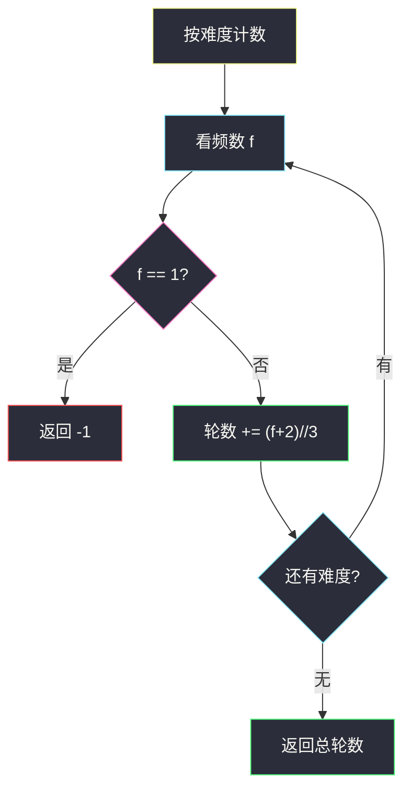
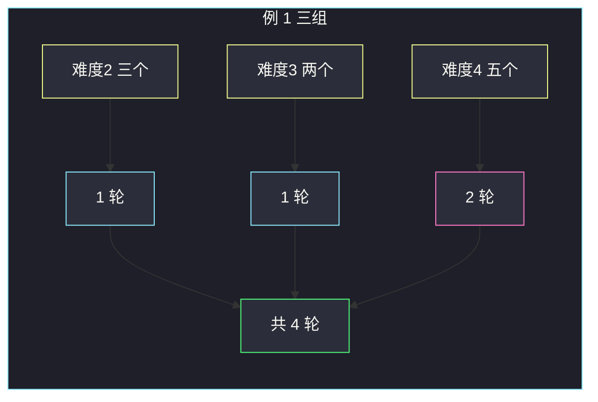

# 完成所有任务需要的最少轮数（计数贪心 · ⌈freq/3⌉）

## 一、问题描述

`tasks[i]` 表示第 `i` 个任务的难度。每一轮必须完成 **2 个或 3 个相同难度** 的任务（不能 1 个，不能跨难度）。求完成全部任务的最少轮数；若某个难度凑不出来，返回 `-1`。

> 🔗 LeetCode 2244：https://leetcode.cn/problems/minimum-rounds-to-complete-all-tasks/
>
> 数据范围：`1 ≤ tasks.length ≤ 10^5`，难度值为整数。
>
> 📚 灵茶题单：**§4.1 基础**（1372 分）。

**示例 1**

```
输入：tasks = [2,2,3,3,2,4,4,4,4,4]
输出：4
解释：
- 难度 2 出现 3 次 → 一轮做 3 个；
- 难度 3 出现 2 次 → 一轮做 2 个；
- 难度 4 出现 5 次 → 一轮 3 个 + 一轮 2 个。
共 4 轮。
```

**示例 2**

```
输入：tasks = [2,3,3]
输出：-1
解释：难度 2 只出现 1 次，一轮至少要 2 个相同难度，无法完成。
```

**直观理解**

不同难度互不影响，按难度分组后，问题变成：整数 `freq` 能否写成若干个 2 与 3 的和，并让加数个数最少。`freq == 1` 不行；`freq ≥ 2` 时一定可以，最少个数是 `⌈freq/3⌉`。

---

## 二、暴力解法

对每个难度的频数 `f`，枚举用了几个 3：`t = 0 .. f//3`，若 `f - 3t` 是 2 的倍数，用 `t + (f-3t)/2` 轮，取最小。`f` 最大 `10^5`，单个难度 `O(f)` 最坏会到平方级，不稳。

```python
from collections import Counter

class Solution:
    def minimumRounds(self, tasks):
        ans = 0
        for f in Counter(tasks).values():
            if f == 1:
                return -1
            best = f  # 全用 2 的上界
            for t in range(f // 3 + 1):
                rest = f - 3 * t
                if rest % 2 == 0:
                    best = min(best, t + rest // 2)
            ans += best
        return ans
```

能过小数据，但没有用上「2 和 3 能凑出一切 ≥ 2 的整数」。

### 🔴 瓶颈在哪里

最小化轮数 = 尽量多做 3 个。余数只有 0、1、2 三种，其中余 1 时不能留一个 3 在外面（会剩 1 个任务），要把一个 3 拆开改成两个 2（`3+1 → 2+2`）。这些都有闭式，不必枚举 `t`。

---

## 三、优化探索（核心章节）

> 📚 本题在灵茶题单中属于 **§4.1 基础**。先计数，再对每个频数做一次 `O(1)` 判断。不要写成「只能整除 3」——余 1、余 2 都能用 2 补上。

### 3.1 哪些频数合法

一轮贡献 2 或 3。能凑出的正整数：

- 2，3
- 2+2=4，2+3=5，3+3=6
- 4+3=7，5+3=8，6+3=9
- …

归纳：所有 `≥ 2` 的整数都能写成 2 和 3 的和；**唯独 1 不行**。所以某个难度出现 1 次就全局 `-1`。

### 3.2 最少轮数 = ⌈freq / 3⌉

3 比 2 更「划算」（同样任务数轮数更少），优先用 3。按 `freq % 3` 分类：

| `freq % 3` | 做法 | 轮数 |
|------------|------|------|
| 0 | 全用 3 | `freq/3` |
| 2 | `freq/3` 个 3，再一个 2 | `freq/3 + 1` |
| 1 | 不能留余 1。把最后一个 3 换成两个 2：`(freq-4)/3` 个 3 + 两个 2（需 `freq ≥ 4`） | `freq/3 + 1` |

`freq = 1` 已单独判失败。`freq = 4 = 3·1+1`：`1` 个 3 会剩 1，改成 `2+2`，轮数 `2 = 4/3+1`。

三种合法情况都等于 `⌈freq/3⌉`，整数写法 `(freq + 2) // 3`。

不要理解成「必须能被 3 整除」：4 不能整除 3，但两轮 2 就行。



### 3.3 一句话核心

> **按难度计数；出现 1 次就失败；否则最少轮数是 `(freq+2)//3`，因为 2 和 3 能凑出一切 ≥ 2 的整数。**

---

## 四、代码实现

### Python（主解：Counter + 上取整除 3）

```python
from collections import Counter
from typing import List

class Solution:
    def minimumRounds(self, tasks: List[int]) -> int:
        ans = 0
        for f in Counter(tasks).values():
            if f == 1:
                return -1
            ans += (f + 2) // 3
        return ans
```

**变量含义**

| 写法 | 含义 |
|------|------|
| `Counter(tasks)` | 每种难度出现几次 |
| `f == 1` | 这个难度永远凑不齐一轮 |
| `(f + 2) // 3` | `⌈f/3⌉`，最少轮数 |
| `ans` | 所有难度的轮数之和 |

等价写法（有人更习惯看余数）：

```python
if f % 3 == 0:
    ans += f // 3
else:
    ans += f // 3 + 1
```

与 `(f+2)//3` 对 `f ≥ 2` 完全相同。不要写 `if f % 3 != 0: return -1`。

### Java（可选）

```java
import java.util.HashMap;
import java.util.Map;

class Solution {
    public int minimumRounds(int[] tasks) {
        Map<Integer, Integer> cnt = new HashMap<>();
        for (int x : tasks) {
            cnt.merge(x, 1, Integer::sum);
        }
        int ans = 0;
        for (int f : cnt.values()) {
            if (f == 1) {
                return -1;
            }
            ans += (f + 2) / 3;
        }
        return ans;
    }
}
```

---

## 五、具体例子演示

**示例 1**：`tasks = [2,2,3,3,2,4,4,4,4,4]`。

先计数：

| 难度 | 频数 f | f==1? | 拆法 | 轮数 `(f+2)//3` |
|------|--------|-------|------|-----------------|
| 2 | 3 | 否 | 一轮 3 | (3+2)//3 = **1** |
| 3 | 2 | 否 | 一轮 2 | (2+2)//3 = **1** |
| 4 | 5 | 否 | 3+2 | (5+2)//3 = **2** |

合计 `1+1+2=4`。

难度 4 逐步想余数：`5 % 3 = 2`，两个 3 会多 1 个不够，一个 3 剩 2，再开一轮 2，正好。



官方方案与上表一致：第 1 轮三个 2，第 2 轮两个 3，第 3 轮三个 4，第 4 轮两个 4。

**示例 2**：`tasks = [2,3,3]`。

| 难度 | f | 结果 |
|------|---|------|
| 2 | 1 | **失败** |
| 3 | 2 | （来不及算） |

一碰到 `f==1` 即可返回 `-1`。两个难度 3 本来可以一轮做完，但救不了那个单独的 2。

再核对几组公式（避免「只能用 3」的误解）：

| f | 错误：只接受 f%3==0 | 正确拆法 | `(f+2)//3` |
|---|---------------------|----------|------------|
| 2 | 判失败 | 2 | 1 |
| 3 | 1 轮 | 3 | 1 |
| 4 | 判失败 | 2+2 | 2 |
| 5 | 判失败 | 3+2 | 2 |
| 6 | 2 轮 | 3+3 | 2 |
| 7 | 判失败 | 3+2+2 | 3 |

---

## 六、复杂度分析

| 方法 | 时间 | 空间 | 说明 |
|------|------|------|------|
| 每组枚举用几个 3 | `O(n + Σ f)` 最坏较大 | `O(n)` | 无必要 |
| 计数 + `⌈f/3⌉`（主解） | `O(n)` | `O(n)` | 哈希表存不同难度 |

不同难度种类最多 `n` 个。

---

## 七、对比总结

| 维度 | 错误理解 | 正确 |
|------|----------|------|
| 合法频数 | 必须整除 2 或整除 3 | 一切 `≥ 2` |
| 余 1 | 认为不可能 | `4=2+2`，`7=3+2+2` |
| 目标 | 尽量用 2 | 尽量用 3，余数用 2 补 |

**易错点**

1. **`f % 3 != 0` 就返回 -1**：把 4、5、7 全部判死，官方例 1 的五个 4 会错。
2. **`f == 1` 用 `(f+2)//3 = 1` 蒙混**：公式对 `f ≥ 2` 才成立，1 必须单独判。
3. **跨难度凑 2 或 3**：题目要求同一轮相同难度。
4. **轮数写成 `f//3` 丢掉余数**：`f=5` 会得到 1，少算一轮。

---

## 八、举一反三

| 题目 | 关系 |
|------|------|
| [2870. 使数组为空的最少操作次数](https://leetcode.cn/problems/minimum-number-of-operations-to-make-array-empty/) | **同一公式**：每次删 2 或 3 个相同值，答案同样是 `⌈freq/3⌉` 或 -1 |
| [2244. 完成所有任务需要的最少轮数](https://leetcode.cn/problems/minimum-rounds-to-complete-all-tasks/) | 本题 |
| [1716. 计算力扣银行的钱](https://leetcode.cn/problems/calculate-money-in-leetcode-bank/) | 也是按组（每周）闭式求和，不必模拟每一天也能写 |
| [1518. 换水问题](https://leetcode.cn/problems/water-bottles/) | 模拟短循环 vs 找规律 |
| [1338. 数组大小减半](https://leetcode.cn/problems/reduce-array-size-to-the-half/) | 同样先计数，再贪心拿频数最大的种类 |

**思想迁移**

- 「每次取 2 或 3 个相同元素、最小化次数」几乎总是：计频数，1 则失败，否则 `⌈f/3⌉`。
- 口诀：**「出现一次就 -1；否则轮数等于频数除以 3 向上取整。」**
