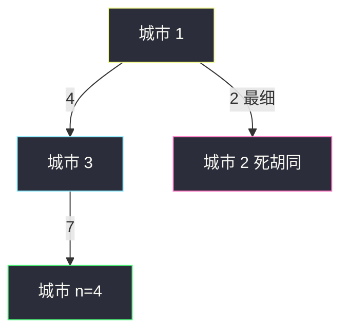
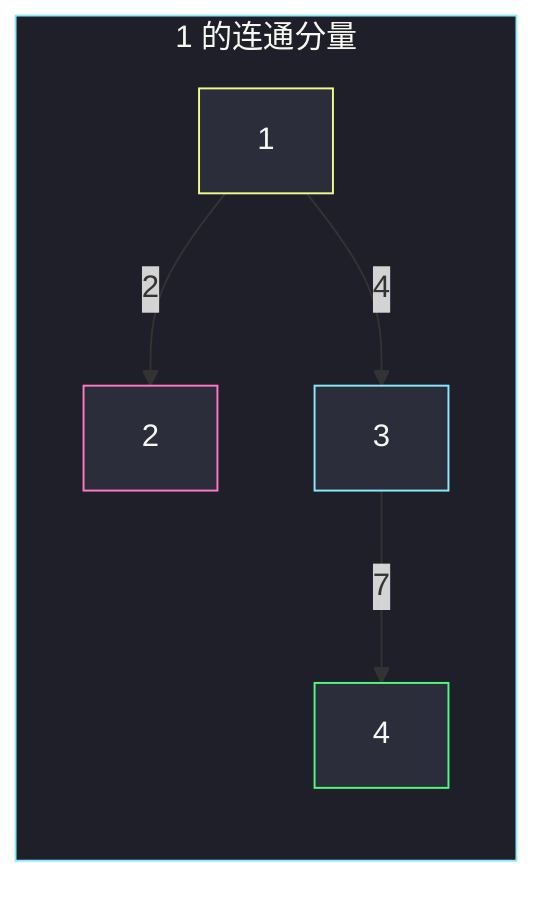

# 两个城市间路径的最小分数（连通分量最小边）

## 一、问题描述

`n` 个城市编号 `1 .. n`，无向带权边 `roads[i] = [a, b, d]`。一条路径的**分数** = 这条路上的**最小边权**。保证 1 与 `n` 连通。路径可以反复走同一条边、反复经过 1 和 `n`。求 1 到 `n` 所有路径分数里的**最小值**。

> 🔗 LeetCode 2492：https://leetcode.cn/problems/minimum-score-of-a-path-between-two-cities/
>
> 数据范围：`2 ≤ n ≤ 1e5`，边数 ≤ `1e5`，边权正整数，无重边。
>
> 📚 灵茶题单：**§1.1 DFS**（连通分量）。BFS / 并查集同样正确。

官方要的是「所有路径分数的最小值」，不是最大值。因为允许绕路、允许重复走边，这个最小值等于 **1 所在连通分量里的最小边权**（`n` 一定在同一分量里）。

**示例 1**

```
输入：n = 4, roads = [[1,2,9],[2,3,6],[2,4,5],[1,4,7]]
输出：5
```

`1 → 2 → 4` 的分数是 `min(9, 5) = 5`。分量里还有边权 6、7、9，没有比 5 更小的。

**示例 2**

```
输入：n = 4, roads = [[1,2,2],[1,3,4],[3,4,7]]
输出：2
```

直接 `1 → 3 → 4` 分数是 4；绕去城市 2 再回来：`1 → 2 → 1 → 3 → 4`，分数 `min(2, 2, 4, 7) = 2`。最细的那条边在「死胡同」里，但题目允许绕路把它算进路径。

**直观理解**

分数越小越「细」。你可以从 1 出发逛遍整个连通块，踩过最细的那条边，再走到 `n`。所以答案不是某条「看起来像最短路」的路上的瓶颈，而是整个分量的全局最细边。

---

## 二、暴力解法

枚举 1 到 `n` 的所有简单路径，取每条的最小边，再对所有路径取 min。`n=1e5` 路径指数级，不可用。更关键的是：题目**允许非简单路径**，简单路径枚举本身就会漏掉示例 2 那种「去死胡同踩细边再回来」。

```python
# 仅示意：简单路径 DFS，n 稍大即超时，且漏掉重复走边
from math import inf
from typing import List

class Solution:
    def minScore(self, n: int, roads: List[List[int]]) -> int:
        g = [[] for _ in range(n + 1)]
        for a, b, w in roads:
            g[a].append((b, w))
            g[b].append((a, w))
        ans = inf

        def dfs(x: int, bottleneck: int, vis: set) -> None:
            nonlocal ans
            if x == n:
                ans = min(ans, bottleneck)
            for y, w in g[x]:
                if y not in vis:
                    vis.add(y)
                    dfs(y, min(bottleneck, w), vis)
                    vis.remove(y)

        dfs(1, inf, {1})
        return ans
```

示例 2 会得到 4 而不是 2——简单路径进不了城市 2 再回到 1。暴力方向错了，不是「优化同一搜索」，而是换问题模型。

### 🔴 瓶颈在哪里

允许重复走边 ⇒ 连通分量里的**任意一条边**都能出现在某条 1↝n 路径上 ⇒ 答案 = 该分量边权最小值。一遍 DFS/BFS/并查集。

---

## 三、优化探索（核心章节）

> 📚 本题在灵茶题单中属于 **§1.1 DFS**。先标出与 1 连通的点，再在这些点之间的边上取 min。

### 3.1 为什么是分量最小边

设 `C` 是 1 的连通分量（含 `n`）。

- 任意 1↝n 路径只走 `C` 里的边，路径分数 ≥ `C` 的最小边权。
- 反过来：设最小边是 `u—v` 权 `w`。从 1 走到 `u`，走过这条边，再从 `v` 走到 `n`（必要时沿原路退回）。这条（可重复走边的）路径分数恰好是 `w`。

所以答案就是 `C` 里的最小 `w`。

不要做成「1 到 n 的最短路」或「最大瓶颈路」：

- 最短路看的是边权和，示例 1 最短路可能是 `1-4` 权 7，答案却是 5。
- 最大瓶颈路（所有路径分数的**最大**值）示例 2 会得到 4，官方答案是 2。



粉节点 2 不在任何简单 1↝4 路径上，但它连着全图最细边，答案吃进这条 2。

### 3.2 遍历时必须看「回边」

只把生成树边上的权取 min 会漏：三角形 `1—2 (10), 1—3 (10), 2—3 (1)`，BFS 生成树可能只有两条 10，最细的 1 是回边。

做法：从 1 出发 BFS/DFS，**每扫到一条邻接边就 `ans = min(ans, w)`**，不管对端是否访问过。等价：先标记分量内所有点，再扫一遍 `roads`，两端（或一端）在分量里则更新 min。

`n=1e5` 用迭代 BFS，避免递归爆栈。

### 3.3 一句话核心

> **1 与 n 在同一连通块；答案是块里最细的那条边，死胡同里的细边也算。**

---

## 四、代码实现

### Python（主解：BFS 扫分量内全部边）

```python
from collections import deque
from math import inf
from typing import List

class Solution:
    def minScore(self, n: int, roads: List[List[int]]) -> int:
        g = [[] for _ in range(n + 1)]
        for a, b, w in roads:
            g[a].append((b, w))
            g[b].append((a, w))
        vis = [False] * (n + 1)
        vis[1] = True
        q = deque([1])
        ans = inf
        while q:
            x = q.popleft()
            for y, w in g[x]:
                ans = min(ans, w)
                if not vis[y]:
                    vis[y] = True
                    q.append(y)
        return ans
```

无向图双向加边。`ans` 在看邻居时就更新，不包在 `if not vis[y]` 里面。保证 1 与 n 连通，不必再检查 `vis[n]`。

并查集版同样一遍：先按边把端点合并，再扫边，只对 `find(a) == find(1)` 的边取 min。时间近线性。DFS 递归在最坏链状 `1e5` 会爆，站点默写优先 BFS。

```python
class Solution:
    def minScore(self, n: int, roads: List[List[int]]) -> int:
        p = list(range(n + 1))

        def find(x: int) -> int:
            while p[x] != x:
                p[x] = p[p[x]]
                x = p[x]
            return x

        for a, b, _ in roads:
            pa, pb = find(a), find(b)
            if pa != pb:
                p[pa] = pb
        root = find(1)
        ans = inf
        for a, b, w in roads:
            if find(a) == root:
                ans = min(ans, w)
        return ans
```

无向连通：一端在 1 的分量里，另一端一定也在，不必再判 `find(b)`。不要按边权排序——那是最小生成树，本题不需要。

---

## 五、具体例子演示

示例 2：`n=4`，边 `1—2 (2)`，`1—3 (4)`，`3—4 (7)`。

从 1 BFS。`vis[1]=True`，`ans=inf`。

| 弹出 | 邻边 | 更新 ans | 新访问 | 队列 |
|------|------|----------|--------|------|
| 1 | 1—2 权 2 | 2 | 2 | `[2]` |
|  | 1—3 权 4 | `min(2,4)=2` | 3 | `[2,3]` |
| 2 | 2—1 权 2 | 仍 2 | 1 已访问 | `[3]` |
| 3 | 3—1 权 4 | 仍 2 | 已访问 | 空 |
|  | 3—4 权 7 | 仍 2 | 4 | `[4]` |
| 4 | 4—3 权 7 | 仍 2 | 已访问 | 空 |

分量边权 `{2,4,7}`，最小 2。逐步跟踪时，**第一次扫到 1—2 就把答案钉在 2**，后面更粗的边改不了它。



示例 1：分量四条边 9、6、5、7，BFS 扫全边后 `ans=5`。若只跑 `1-4` 的最短路会得到 7，错。

**回边更细**

边：`1-2 (10)`，`1-3 (10)`，`2-3 (1)`，`3-4 (8)`。队列弹出 1 时 ans 变成 10；弹出 2 时看到 `2-3` 权 1，ans 改成 1。若写成「只在首次访问时更新」，会丢掉 1。

**两块图、细边在另一块**

边：`1-2 (5)`，`2-n=3 (9)`，另外 `4-5 (1)`。从 1 只能看到 5 和 9，答案 5。权 1 的边与 1 不连通，不能走过去再走回来。若并查集忘了用 `find(1)` 过滤、对全部边取 min，会错成 1。

题目保证 1 与 n 连通，不会出现「分量里没有边」。`n=2` 且仅一条边时，答案就是那条边权。重边已排除；同一对城市只有一条路。

**和「最大瓶颈」对拍**

同一张示例 2 的图：所有 1↝4 路径的分数是 `{4, 2}`（直走 1-3-4 得 4，绕 2 得 2）。本题取 min → 2；若问「分数尽量大」则取 4。两种题面差一个字，算法完全不同：一个逛整块取最细，一个在 1-n 之间找最粗的瓶颈。

---

## 六、复杂度分析

| 方法 | 时间 | 空间 | 说明 |
|------|------|------|------|
| 简单路径枚举 | 指数 | `O(n+m)` | 错且慢 |
| BFS / DFS（主解） | `O(n+m)` | `O(n+m)` | 迭代 BFS 更稳 |
| 并查集 | 近 `O(n+m)` | `O(n)` | 先合并再扫边取 min |

---

## 七、对比总结

| 维度 | 最短路 | 最大瓶颈 | 本题 |
|------|--------|----------|------|
| 目标 | 权和最小 | 路径最小边尽量大 | 路径最小边尽量小 |
| 绕路踩细边 | 通常更差 | 绝不会 | **必须考虑** |
| 算法 | Dijkstra | 最大生成树 / 改松弛 | 分量 min 边 |

**易错点**

1. **只走 1 到 n 的一条路**：漏死胡同细边（示例 2）。
2. **生成树边才取 min**：漏回边。
3. **建成有向图**：道路双向。
4. **下标 0**：城市从 1 开始，邻接表开 `n+1`。
5. **和 1631 最小体力搞混**：那题是最大瓶颈最小化，模型相反。

---

## 八、举一反三

| 题目 | 关系 |
|------|------|
| [1971. 寻找图中是否存在路径](https://leetcode.cn/problems/find-if-path-exists-in-graph/) | 只问连通，本题还要分量内 min 边 |
| [1319. 连通网络的操作次数](https://leetcode.cn/problems/number-of-operations-to-make-network-connected/) | 并查集 / 连通分量计数 |
| [1631. 最小体力消耗路径](https://leetcode.cn/problems/path-with-minimum-effort/) | **最大瓶颈路**，对照着记 |
| [778. 水位上升的泳池中游泳](https://leetcode.cn/problems/swim-in-rising-water/) | 最小化路径上的最大高度 |

**思想迁移**

- 路径可重复走边 ⇒ 连通块内任意边都能被某条 s-t 路径吃到。
- 问「所有路径瓶颈的 min」→ 分量最细边；问「所有路径瓶颈的 max」→ 最大瓶颈路。
- 口诀：**「从 1 漫游整块；每条边都 min 一下；死胡同的细边也是答案。」**
