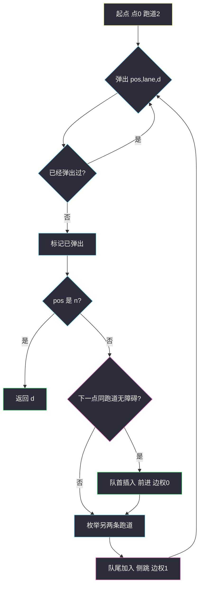

# 最少侧跳次数（0-1 BFS · 前进免费换道收费）

## 一、问题描述

三条跑道，编号 `1/2/3`。路上有 `n + 1` 个点（下标 `0 … n`）。数组 `obstacles[i]` 表示点 `i` 上哪条跑道有障碍（`0` 表示没有）。任一位置最多一条跑道有障碍。

青蛙从点 `0`、跑道 `2` 出发，要到点 `n` 的任意跑道。

- **前进**：同一跑道从 `i` 到 `i + 1`，要求 `i + 1` 上该跑道无障碍。
- **侧跳**：停在同一点，换到另一条无障碍跑道（可以不相邻）。

点 `0` 和点 `n` 保证无障碍。求最少侧跳次数。

> 🔗 LeetCode 1824：https://leetcode.cn/problems/minimum-sideway-jumps/
>
> 数据范围：`1 ≤ n ≤ 5 * 10^5`，`obstacles.length == n + 1`。
>
> 📚 灵茶题单：**三、网格图 0-1 BFS**。

**示例 1**

```
输入：obstacles = [0,1,2,3,0]
输出：2
点 1 堵跑道 1，点 2 堵跑道 2，点 3 堵跑道 3。
一条最优：2 → 前进到点 1 → 侧跳到 3 → 前进到点 2 → 侧跳到 1 → 前进到点 n。
```

**示例 2**

```
输入：obstacles = [0,1,1,3,3,0]
输出：0
跑道 2 全程无障碍，一直前进。
```

**示例 3**

```
输入：obstacles = [0,2,1,0,3,0]
输出：2
点 1 堵住出发跑道 2，必须先侧跳。
```

**直观理解**

把 `(点, 跑道)` 看成格子。同一跑道往前走不花钱（边权 0）；原地换跑道花 1 次。边权只有 0 和 1，最短路用 **0-1 BFS**（双端队列），不要当普通 BFS 把前进也当成 1 步。

---

## 二、暴力解法

每个位置 3 条跑道，状态只有 `3(n+1)` 个。暴力可以 DFS：能前进就前进，或者枚举侧跳。不记忆化会在「跳来跳去」上指数爆炸。`n` 到 `5 * 10^5`，连 `O(n log n)` 的堆 Dijkstra 都偏奢侈，必须线性。

```python
# 仅示意：无记忆化，n 稍大即超时
def dfs(pos, lane, jumps):
    if pos == n:
        return jumps
    ans = inf
    if obstacles[pos + 1] != lane:
        ans = min(ans, dfs(pos + 1, lane, jumps))
    for nl in (1, 2, 3):
        if nl != lane and obstacles[pos] != nl:
            ans = min(ans, dfs(pos, nl, jumps + 1))
    return ans
```

### 🔴 瓶颈在哪里

边权不是全 1：前进是 0，侧跳是 1。普通队列 BFS 按「弹出次数」分层，会把「跳一次再走很远」和「连跳两次」搅乱。0-1 BFS：边权 0 插入**队首**，边权 1 放**队尾**，第一次**弹出**某状态时，侧跳次数就是最少。

---

## 三、优化探索（核心章节）

> 📚 本题在灵茶题单中属于 **三、网格图 0-1 BFS**。状态 `(pos, lane)`；前进 `appendleft`，侧跳 `append`。

### 3.1 图怎么建

- 节点：`(pos, lane)`，`pos ∈ [0, n]`，`lane ∈ {1,2,3}`。
- 边：`pos < n` 且 `obstacles[pos+1] != lane` → `(pos+1, lane)`，权 0。
- 边：`nl != lane` 且 `obstacles[pos] != nl` → `(pos, nl)`，权 1。

起点 `(0, 2)` 距离 0。第一次弹出 `pos == n` 的状态即为答案。

### 3.2 为什么不能「入队就算访问」

这是 0-1 BFS 最常见的坑。队里同时有「距离 d 的前进」和「距离 d 的侧跳」。若 A 先通过一次**侧跳**（权 1）把 `(p, ℓ)` 以 `d+1` 入队并标记，B 随后用**前进**（权 0）用 `d` 到达同一格，标记已经挡住了更好的路。

对拍示例 3 `[0,2,1,0,3,0]`：入队即标记会算出 `3`，正确答案是 `2`。

正确做法：**弹出时才标记**。0-1 BFS 保证先弹出的距离更小（或相等），第一次弹出即最优。也可以维护 `dist`，仅当新距离更小时才入队。



### 3.3 一句话核心

> **同跑道前进边权 0 插队首，原地换道边权 1 入队尾；弹出时才标记，第一次到达终点的侧跳次数就是答案。**

---

## 四、代码实现

### Python（主解：0-1 BFS）

```python
from collections import deque
from typing import List

class Solution:
    def minSideJumps(self, obstacles: List[int]) -> int:
        n = len(obstacles) - 1
        seen = [[False] * 4 for _ in range(n + 1)]
        q = deque()
        q.append((0, 2, 0))  # pos, lane, 侧跳次数
        while q:
            pos, lane, d = q.popleft()
            if seen[pos][lane]:
                continue
            seen[pos][lane] = True
            if pos == n:
                return d
            # 前进，边权 0 → 队首
            if obstacles[pos + 1] != lane:
                q.appendleft((pos + 1, lane, d))
            # 侧跳，边权 1 → 队尾
            for nl in (1, 2, 3):
                if nl != lane and obstacles[pos] != nl:
                    q.append((pos, nl, d + 1))
        return -1
```

`n` 最大 `5 * 10^5`，每个状态弹出一次、扩展常数条边，必须是 `O(n)`。弹出时才 `seen`，不要入队就标。到达点 `n` 之后不要再读 `obstacles[pos+1]`——先判断 `pos == n` 再前进。

也可以 DP：`f[0], f[1], f[2]` 表示到达当前点三条跑道的最少侧跳，先继承前进，再在当前点用 `min(f)+1` 做一次侧跳松弛。主解按题单写 0-1 BFS。滚动数组版：

```python
# 可选：O(n) / O(1) DP，与 0-1 BFS 对拍一致
inf = 10 ** 9
f = [1, 0, 1]  # 点 0：跑道 2 代价 0，另两条先侧跳 1
for i in range(1, n + 1):
    nf = [inf, inf, inf]
    for lane in range(3):
        if obstacles[i] != lane + 1:
            nf[lane] = f[lane]
    x = min(nf)
    for lane in range(3):
        if obstacles[i] != lane + 1:
            nf[lane] = min(nf[lane], x + 1)
    f = nf
# return min(f)
```

**变量含义**

| 写法 | 含义 |
|------|------|
| `(pos, lane, d)` | 点、跑道（1–3）、已侧跳次数 |
| `appendleft` | 前进，代价不变 |
| `append` | 侧跳，代价 +1 |
| 弹出后 `seen` | 第一次弹出 = 最少侧跳 |

### Java（可选）

```java
class Solution {
    public int minSideJumps(int[] obstacles) {
        int n = obstacles.length - 1;
        boolean[][] seen = new boolean[n + 1][4];
        ArrayDeque<int[]> q = new ArrayDeque<>();
        q.addLast(new int[]{0, 2, 0});
        while (!q.isEmpty()) {
            int[] cur = q.pollFirst();
            int pos = cur[0], lane = cur[1], d = cur[2];
            if (seen[pos][lane]) continue;
            seen[pos][lane] = true;
            if (pos == n) return d;
            if (obstacles[pos + 1] != lane) {
                q.addFirst(new int[]{pos + 1, lane, d});
            }
            for (int nl = 1; nl <= 3; nl++) {
                if (nl != lane && obstacles[pos] != nl) {
                    q.addLast(new int[]{pos, nl, d + 1});
                }
            }
        }
        return -1;
    }
}
```

---

## 五、具体例子演示

示例 1：`obstacles = [0,1,2,3,0]`。看 deque **两端**怎么变。`L` = 跑道。

**起点** 弹出 `(0, L2, 0)` 并标记。点 1 跑道 2 无障碍 → 前进插队首；侧跳到 L1、L3 入队尾。

```
deque 左（小代价） → 右
[(1,L2,0), (0,L1,1), (0,L3,1)]
```

**弹出 `(1, L2, 0)`**。点 2 堵住跑道 2，不能前进。点 1 的跑道 1 有障碍，只能侧跳到 L3，代价 1，入队尾。

```
[(0,L1,1), (0,L3,1), (1,L3,1)]
```

`(0,L1,1)`、`(0,L3,1)` 是从起点侧跳来的「回头状态」，第一次弹出后会再尝试前进，但点 1 跑道 1 有障碍，L1 这条线走不远。关键是 `(1,L3,1)`：已经用 **1 次**侧跳站在点 1 跑道 3。

**弹出 `(1, L3, 1)`**。点 2 跑道 3 无障碍（障碍在跑道 2）→ 前进插队首 `(2, L3, 1)`。

点 2 堵住跑道 2，继续前进到点 3 时跑道 3 有障碍，于是在点 2 侧跳到 L1（代价 2），再一路前进到点 4。第一次弹出 `pos == 4` 时 `d = 2`。


示例 3 的坑：点 1 堵住 L2。从 `(0,L2)` 只能先侧跳。若在点 1、L1 上再侧跳到 L3，代价变成 2 才到达 `(1,L3)`；而从 `(0,L3)` **前进**到 `(1,L3)` 只需代价 1。入队就标记会留下代价 2 的那条，把代价 1 挡掉。

---

## 六、复杂度分析

| 方法 | 时间 | 空间 | 说明 |
|------|------|------|------|
| 无记忆 DFS | 指数 | `O(n)` 栈 | TLE |
| Dijkstra 堆 | `O(n log n)` | `O(n)` | 能过但没必要 |
| 0-1 BFS（主解） | `O(n)` | `O(n)` | 每状态弹出一次 |
| DP 滚动 3 格 | `O(n)` | `O(1)` | 等价最优，题单外 |

---

## 七、对比总结

| 维度 | 普通 BFS | 0-1 BFS |
|------|----------|---------|
| 队列 | 只在队尾入 | 0 插队首，1 入队尾 |
| 分层 | 按边数 | 按真实代价（侧跳次数） |
| 标记 | 入队即可（边权全 1） | **弹出时**才标记 |

**易错点**

1. **前进也当成 1 步**：答案变成「最少操作次数」而不是最少侧跳。
2. **入队即 `seen`**：示例 3 会得到 3 而不是 2。对拍以官方示例为准。
3. **侧跳只能跳到相邻跑道**：题面允许 1 ↔ 3 直接跳。
4. **跳进障碍**：`obstacles[pos] == nl` 的跑道不能落。
5. **终点还往前走**：`pos == n` 要先返回。

---

## 八、举一反三

| 题目 | 关系 |
|------|------|
| [3286. 穿越网格图的安全路径](https://leetcode.cn/problems/find-a-safe-walk-through-a-grid/) | 格子 0/1 扣血，同款 0-1 BFS；见 `find-a-safe-walk-through-a-grid.md` |
| [1368. 使网格图至少有一条有效路径的最小代价](https://leetcode.cn/problems/minimum-cost-to-make-at-least-one-valid-path-in-a-grid/) | 顺着箭头权 0，改方向权 1 |
| [2290. 到达角落需要移除障碍物的最小数目](https://leetcode.cn/problems/minimum-obstacle-removal-to-reach-corner/) | 空格权 0，障碍权 1 |
| [542. 01 矩阵](https://leetcode.cn/problems/01-matrix/) | 边权全 1，退化为普通多源 BFS；见 `01-matrix.md` |
| [417. 太平洋大西洋水流问题](https://leetcode.cn/problems/pacific-atlantic-water-flow/) | 网格搜索另一端；见 `pacific-atlantic-water-flow.md` |

**思想迁移**

- 图上边权只有 0 和 1 → deque：0 进队首、1 进队尾，不要上堆。
- 口诀：**「前进插队首，侧跳入队尾；弹出才标记，终点第一次就是最少跳。」**
